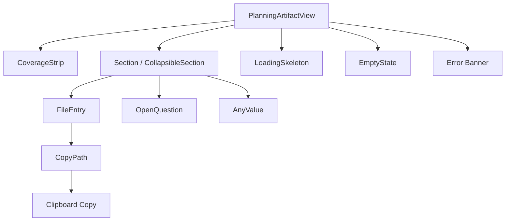
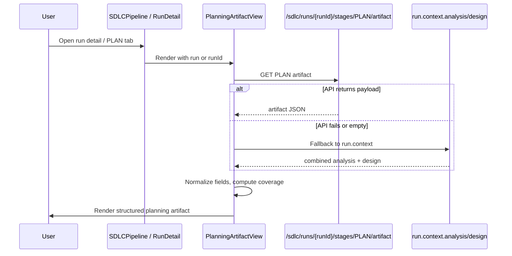
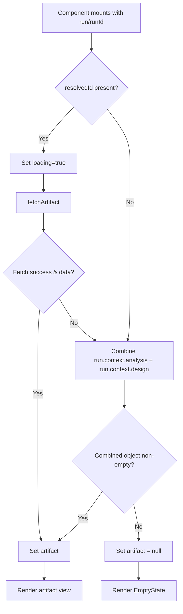
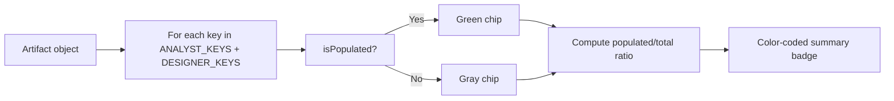

# SDLC Planning Artifact View

## Brief Introduction

The **SDLC Planning Artifact View** is a React component module in the `ai-ui` frontend that renders the **PLAN** stage artifact produced by the three-phase SDLC CLI engine (`PLAN` / `IMPLEMENT` / `REVIEW`). It presents the planning output—files to change, new files, sub-tasks, open questions, design details, and reasoning—in a structured, collapsible UI. The component is designed to be embedded inside the larger [SDLCPipeline](sdlc_pipeline.md) run-detail view and consumes data from the backend SDLC artifact endpoint or a fallback `run.context` object.

---

## Core Responsibilities

1. **Fetch and display the PLAN stage artifact** for a given SDLC run.
2. **Normalize heterogeneous artifact data** (strings, arrays, objects, nulls) into a consistent readable form.
3. **Surface coverage** of expected planning keys from both the analyst and designer roles.
4. **Render actionable planning information**: files to modify/create, sub-tasks, open questions, design details, and reasoning (decisions, rejected alternatives, assumptions).
5. **Provide graceful fallbacks** when the artifact endpoint is unavailable or empty, using `run.context.analysis` and `run.context.design`.

---

## Module Location

```text
ai-ui/src/components/sdlc/PlanningArtifactView.jsx
```

---

## Architecture

### Component Hierarchy



### Data Flow



---

## Component Reference

### `PlanningArtifactView`

Main exported component. Accepts either a full `run` object or a standalone `runId`.

| Prop | Type | Description |
|------|------|-------------|
| `run` | `object` (optional) | SDLC run object containing `id` and optional `context`. |
| `runId` | `string` (optional) | Direct run identifier; used if `run.id` is absent. |

**Behavior:**
- Resolves the run ID from `runId ?? run?.id`.
- If no ID is available, immediately falls back to `run.context.analysis` + `run.context.design`.
- If an ID is available, calls `fetchArtifact(runId)`.
- On empty or failed fetch, falls back to `run.context`.
- Renders `LoadingSkeleton`, error banner, `EmptyState`, or the full artifact view.

### `fetchArtifact(runId)`

Async helper that performs:

```javascript
apiFetch(`${API}/sdlc/runs/${runId}/stages/PLAN/artifact`)
```

Returns `data?.payload ?? data` or `null` on failure.

### `CoverageStrip`

Renders a coverage summary for a fixed set of analyst and designer keys.

**Analyst keys:**
- `files_to_change`
- `sub_tasks`
- `implementation_spec`

**Designer keys:**
- `solution_approach`
- `implementation_plan`
- `code_structure`
- `testing_strategy`
- `rollback_strategy`

Displays a total score badge and per-key `CoverageChip` indicators.

### `Section` / `CollapsibleSection`

Reusable collapsible panel with a header button, icon, title, and expand/collapse chevron. `CollapsibleSection` defaults to closed.

### `FileEntry`

Renders a single file entry from `files_to_change` or `new_files_needed`. Supports:
- String paths
- Objects with `path`, `file`, `change_desc`, `description`, `change_description`
- Optional grounding evidence under `evidence`, `grounding`, or `evidence_path`

### `OpenQuestion`

Renders an open question with optional options, recommended option highlight, and rationale.

### `AnyValue`

Generic value renderer that handles strings, arrays, and objects.

### `CopyPath`

Displays a file path with a hover-activated copy-to-clipboard button.

### `LoadingSkeleton` / `EmptyState`

Placeholder UIs for loading and missing-artifact states.

---

## Artifact Schema

The component expects a PLAN artifact object with the following fields. All list fields are normalized to empty arrays when missing.

| Field | Type | Rendered In |
|-------|------|-------------|
| `files_to_change` | `string[]` or `object[]` | Files section (MODIFY badge) |
| `new_files_needed` | `string[]` or `object[]` | Files section (CREATE badge) |
| `sub_tasks` | `string[]` or `object[]` | Sub-tasks section |
| `open_questions` | `string[]` or `object[]` | Open Questions section |
| `solution_approach` | `string` / `object` | Design Detail section |
| `implementation_plan` | `string` / `object` | Design Detail section |
| `code_structure` | `string` / `object` | Design Detail section |
| `testing_strategy` | `string` / `object` | Design Detail section |
| `rollback_strategy` | `string` / `object` | Design Detail section |
| `implementation_spec` | `string` / `object` | Design Detail + Coverage |
| `decisions` | `string[]` or `object[]` | Reasoning section |
| `rejected_alternatives` | `string[]` or `object[]` | Reasoning section |
| `assumptions` | `string[]` or `object[]` | Reasoning section |

---

## Dependencies

### Internal Modules

| Module | Purpose | Reference |
|--------|---------|-----------|
| `ai-ui/src/config.js` | Provides `API_BASE` and `apiFetch` for authenticated backend calls. | [config](../ai_ui_frontend_config.md) |
| `ai-ui/src/components/sdlc/SDLCPipeline.jsx` | Parent component that hosts `PlanningArtifactView` inside run details. | [sdlc_pipeline](sdlc_pipeline.md) |

### External Libraries

- **React** — Hooks (`useState`, `useEffect`) and JSX rendering.
- **lucide-react** — Iconography (`CheckCircle2`, `XCircle`, `ChevronDown`, `ChevronRight`, `FileText`, `FilePlus`, `HelpCircle`, `Lightbulb`, `AlertTriangle`, `Copy`, `Check`).

---

## Interaction with the SDLC System

```mermaid
graph LR
    subgraph Frontend
        PAV[PlanningArtifactView]
        SDLCPipeline[SDLCPipeline]
    end

    subgraph Backend
        SDLCRunEndpoint[/sdlc/runs/{runId}/stages/PLAN/artifact]
        SDLCWorker[SDLC Worker / CLI Engine]
    end

    SDLCPipeline -->|renders| PAV
    PAV -->|GET| SDLCRunEndpoint
    SDLCRunEndpoint -->|produced by| SDLCWorker
```

The PLAN artifact is generated by the backend SDLC pipeline workers (see [sdlc_pipeline_workers](../workers/sdlc_pipeline_workers.md) and [shared_core_sdlc_pipeline](shared_core_sdlc_pipeline.md)). The frontend retrieves it via the SDLC router (see [sdlc_router](../api/sdlc_router.md)).

---

## Process Flows

### Render Lifecycle



### Coverage Evaluation



---

## Design Decisions

1. **Unified PLAN stage**: The component explicitly does not compose split `ANALYZING`/`DESIGNING` stages. The backend now exposes a single `PLAN` stage artifact.
2. **Defensive normalization**: All list and object fields are coerced safely so the UI never crashes on partial or malformed artifacts.
3. **Confidence as audit metadata**: Assumption confidence scores are rendered in muted gray tags and are not presented as trust headlines.
4. **Copy-to-clipboard UX**: File paths expose a copy button only on hover to reduce visual clutter.
5. **Progressive disclosure**: Design details and reasoning are collapsed by default, keeping the initial view focused on files, tasks, and open questions.

---

## Related Documentation

- [sdlc_pipeline](sdlc_pipeline.md) — Parent SDLC pipeline UI.
- [sdlc_governance_review](sdlc_governance_review.md) — Governance review panel for SDLC runs.
- [sdlc_gate_signal](sdlc_gate_signal.md) — Gate signal indicators used alongside run artifacts.
- [sdlc_pipeline_stepper](sdlc_pipeline_stepper.md) — Stage stepper component.
- [sdlc_status_model](sdlc_status_model.md) — Status label/badge utilities.
- [sdlc_router](../api/sdlc_router.md) — Backend router serving the artifact endpoint.
- [sdlc_pipeline_workers](../workers/sdlc_pipeline_workers.md) — Workers that generate PLAN artifacts.
- [shared_core_sdlc_pipeline](shared_core_sdlc_pipeline.md) — Core SDLC pipeline agent logic.
