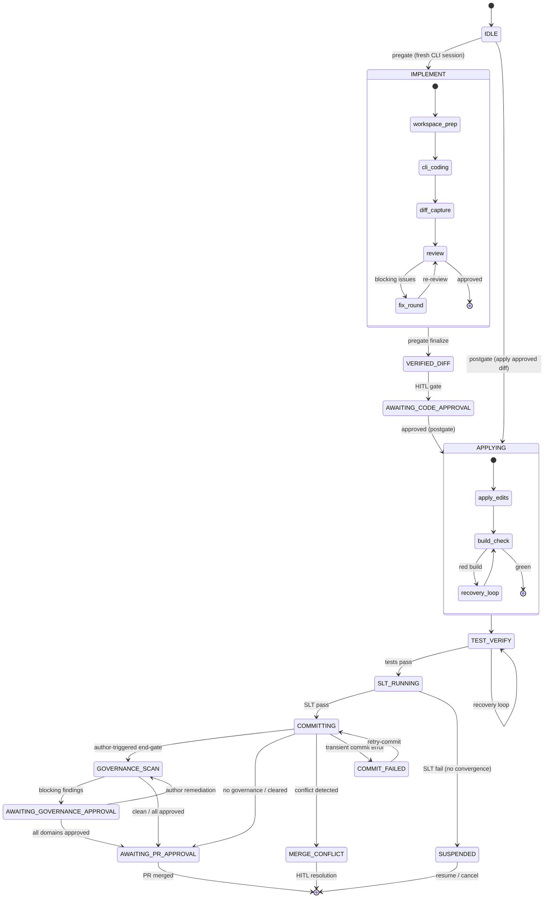
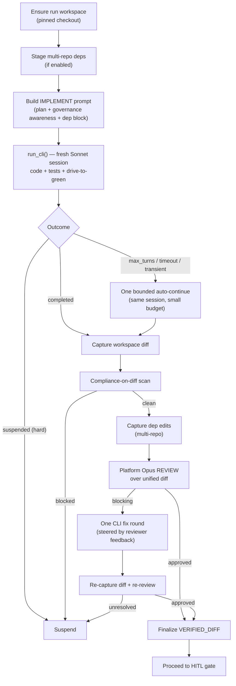
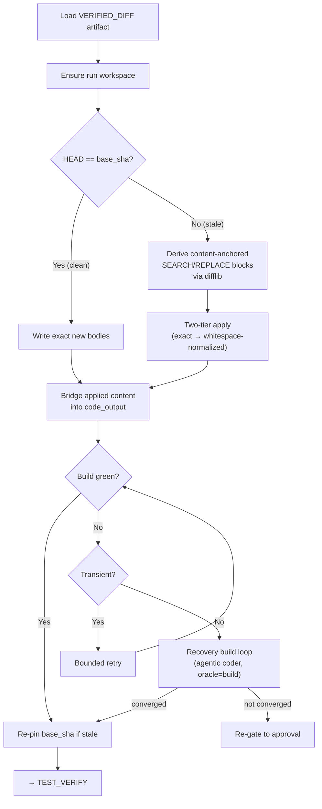
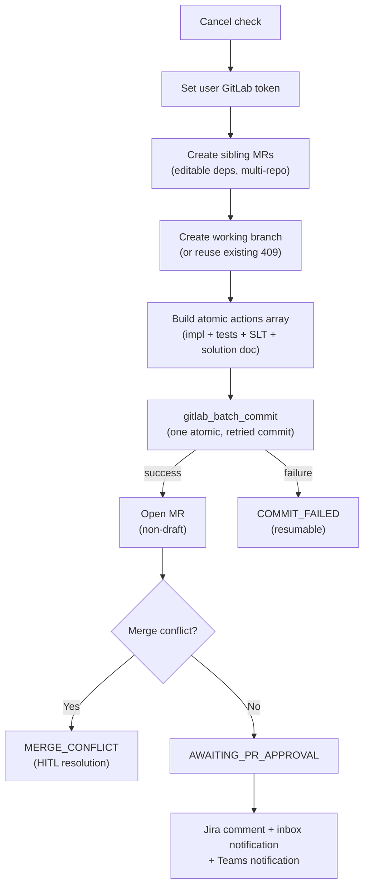
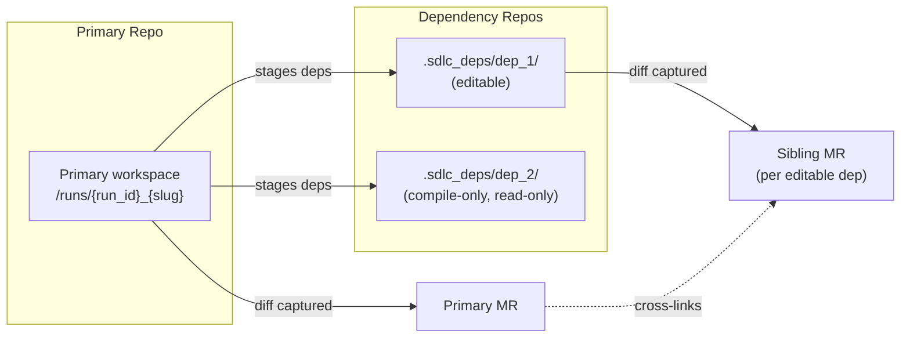
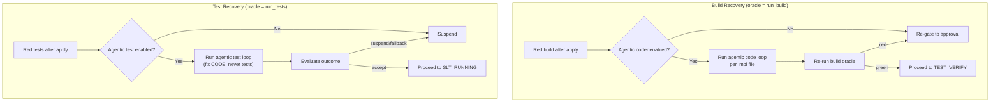
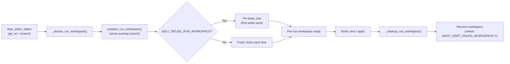
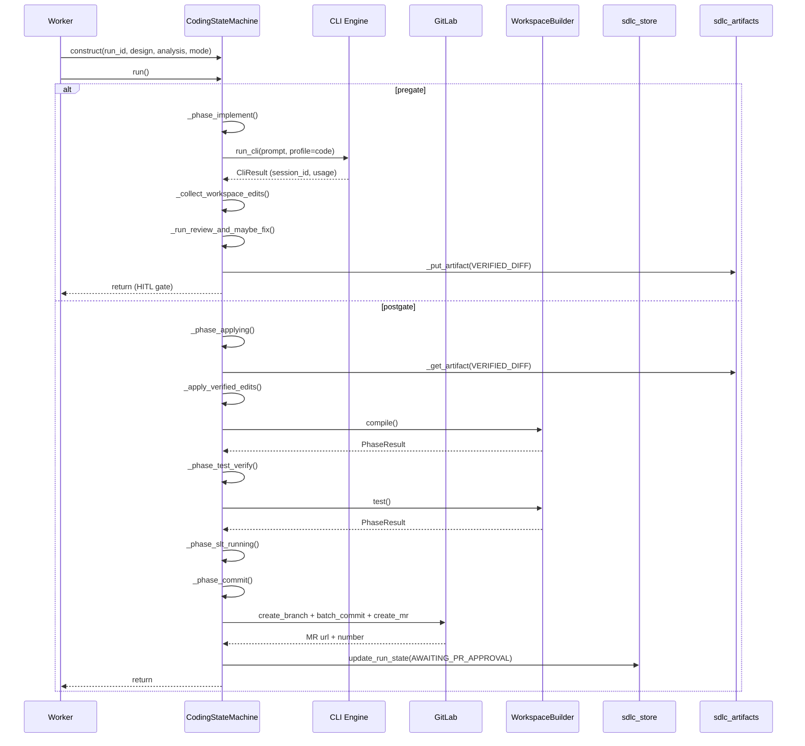

# SDLC State Machine

## Introduction

The `sdlc_state_machine` module implements the **persistent state machine** that drives the AI Coding Agent through the full software-delivery lifecycle — from code generation, through review, testing, governance, and commit/MR creation. It is the central orchestration engine within the broader [SDLC Pipeline](sdlc_pipeline.md) subsystem and lives in `agents/sdlc_state_machine.py`.

The state machine replicates a CRED-style coding-agent flow:

```
IDLE → CODING → REVIEWING → REVIEW_GATE → TESTING → SLT_RUNNING → COMPLETION_REVIEW → COMMITTING → AWAITING_PR_APPROVAL
```

It supports two execution modes separated by a Human-in-the-Loop (HITL) approval gate:

| Mode | Description |
|------|-------------|
| **pregate** | Runs IMPLEMENT (code + tests) and REVIEW, stores a `VERIFIED_DIFF` artifact, then **stops** before committing. The pipeline caller transitions to the HITL approval gate. |
| **postgate** | Deterministically **applies** the approved `VERIFIED_DIFF`, re-verifies tests, runs SLTs, commits, and opens a merge request. |

The module is designed around **suspend-not-fail** semantics: transient errors, compliance blocks, and unresolved review issues suspend the run at a resumable stage rather than marking it `FAILED`, so generated code is never lost and human operators can intervene.

---

## Architecture Overview

```mermaid
graph TB
    subgraph "SDLC Pipeline Subsystem"
        SM["CodingStateMachine<br/>(this module)"]
        SPL["sdlc_pipeline.py<br/>(pipeline orchestration)"]
        CLI["sdlc_cli_engine.py<br/>(CLI subprocess)"]
        AL["sdlc_agent_loop.py<br/>(bounded tool-use loop)"]
        PE["sdlc_patch_engine.py<br/>(search/replace patching)"]
        GOV["sdlc_governance/<br/>(governance engine)"]
    end

    subgraph "Storage Layer"
        SS["store/sdlc_store.py<br/>(run state + events)"]
        SA["store/sdlc_artifacts.py<br/>(stage artifacts)"]
        SGF["store/sdlc_governance_findings.py"]
        SGA["store/sdlc_governance_approvers.py"]
    end

    subgraph "Build & Sandbox"
        WB["sandbox/workspace_builder.py<br/>(Docker compile/test)"]
        BMR["core/build_manifest_resolver.py"]
    end

    subgraph "External Integrations"
        GL["tools/gitlab_tools.py"]
        JT["tools/jira_tools.py"]
        MR["models/model_router.py"]
    end

    SPL -->|"constructs + run()"| SM
    SM -->|"run_cli()"| CLI
    SM -->|"recovery loops"| AL
    SM -->|"patch apply"| PE
    SM -->|"governance scan"| GOV
    SM -->|"state/events"| SS
    SM -->|"artifacts"| SA
    SM -->|"findings/approvals"| SGF
    SM -->|"findings/approvals"| SGA
    SM -->|"compile/test"| WB
    SM -->|"manifest resolve"| BMR
    SM -->|"branch/commit/MR"| GL
    SM -->|"Jira comments"| JT
    SM -->|"LLM calls"| MR
```



### Module-Level Components

| Component | Type | Purpose |
|-----------|------|---------|
| `CodingStateMachine` | Class | The persistent state machine. Holds all run-scoped mutable context (code output, fix history, confidence scores, workspace paths, governance state) and implements every lifecycle phase. |
| `_run_sdlc_agent` | Function | Thin delegate to `sdlc_pipeline._run_sdlc_agent` — runs a named SDLC agent via `AgentRunner` with Claude tool-use. |
| `_parse_json` | Function | Robust JSON extractor that handles plain JSON, fenced JSON, and raw `{...}` block scanning. Falls back to `{"raw": text}`. |
| `_llm` | Function (module-level) | LLM shortcut that routes to the caller's tier hint via `model_router`, with cross-provider fallback to GPT-5.4. Tracks tokens and cost for HOD budget deduction. |
| `_s` | Function | Coerces any LLM output item (str, dict, list, None) to a plain string. |
| `_sanitize_for_api` | Function | Strips control/breaking characters before sending text to GitLab/Jira/Confluence. |
| `_extract_code_files_from_markdown` | Function | Extracts file-path + code pairs from LLM Markdown output using four regex strategies (heading+fence, bold+fence, bare-path+fence, comment-path+fence). |
| `_is_test_path` | Function | Convention-based test/SLT file detector across Python, Java/Kotlin, Go, JS/TS, and more. Replaces naive substring matching to avoid false positives. |

---

## State Machine Lifecycle



### Key State Transitions

| From | To | Trigger |
|------|----|---------|
| `IMPLEMENT` | `VERIFIED_DIFF` (pregate) | Review approved + diff captured |
| `IMPLEMENT` | `SUSPENDED` | CLI suspended, no workspace changes, or compliance block |
| `AWAITING_CODE_APPROVAL` | `APPLYING` | Human approves the `VERIFIED_DIFF` |
| `APPLYING` | `TEST_VERIFY` | Edits applied + build green |
| `APPLYING` | `SUSPENDED` (re-gate) | Apply miss or build failure after recovery |
| `TEST_VERIFY` | `SLT_RUNNING` | Unit tests pass |
| `SLT_RUNNING` | `COMMITTING` | SLTs pass (or `skip_tests`) |
| `COMMITTING` | `AWAITING_PR_APPROVAL` | MR created successfully |
| `COMMITTING` | `MERGE_CONFLICT` | Merge conflict detected |
| `COMMITTING` | `COMMIT_FAILED` | Transient commit/MR error (resumable) |
| `GOVERNANCE_SCAN` | `AWAITING_GOVERNANCE_APPROVAL` | Blocking governance findings |

---

## Core Phases

### 1. IMPLEMENT (Pre-gate Coding)

The `_phase_implement()` method is the merged pre-gate phase that combines code generation, test authoring, and platform review into a single flow.



**Key design decisions:**

- **Fresh CLI session**: The approved PLAN JSON is the handoff — no `--resume` on the first attempt (unless a manual resume signal is present).
- **Bounded auto-continue**: If the coder hits max-turns or a transient upstream error, the same session is resumed once with a small turn budget and a STOP-focused continue prompt.
- **Salvage on cap/timeout**: A capped or timed-out run that already wrote a complete diff is captured and proceeds to REVIEW rather than being discarded.
- **Compliance-on-diff**: The added/changed delta is scanned by `compliance_engine` before the diff enters the `VERIFIED_DIFF`. Only the ADDED delta is scanned (new files = whole body; modified = added lines) to avoid re-flagging legacy content.
- **One review + one fix round**: A single platform Opus review over the diff, at most one CLI fix round, then one re-review. Unresolved issues suspend the run.

### 2. APPLYING (Post-gate Deterministic Apply)

The `_phase_applying()` method deterministically re-applies the approved `VERIFIED_DIFF` to a fresh workspace checkout.



**Staleness handling**: When the base branch has moved since the `VERIFIED_DIFF` was captured, the applier reads the current branch content from GitLab, derives content-anchored search/replace blocks, and applies them two-tier. A clean miss (no/ambiguous match) is recoverable — recorded and surfaced for re-gate — never a wrong silent edit.

### 3. TEST_VERIFY & SLT_RUNNING

- **TEST_VERIFY** (`_phase_test_verify`): Re-runs the same unit tests on the freshly-applied tree. Green → SLT_RUNNING. Red → bounded recovery loop (agentic test-fix agent, oracle=tests, fixes CODE never tests). Non-convergence suspends.
- **SLT_RUNNING** (`_phase_slt_running`): Executes Service Level Tests. Pass → COMMITTING. Fail → bounded recovery, then suspend if not converged.

### 4. COMMITTING

The `_phase_commit()` method is the final autonomous stage: branch creation, atomic commit, and MR opening.



**Key guarantees:**

- **Atomic commit**: All files (impl + tests + SLT + solution doc) land in one `gitlab_batch_commit` call — a transient Gitaly error mid-loop cannot leave the run half-committed.
- **Suspend-not-fail**: A commit failure transitions to `COMMIT_FAILED` (resumable via `retry-commit`) rather than `FAILED`. The generated code is durable in the CODING artifact.
- **Empty-diff guard**: Never opens an MR with no changes — marks the run `COMPLETE` instead.
- **Multi-repo sibling MRs**: Editable dependency repos get their own MRs via `_create_sibling_mrs()`, with cross-links embedded in the primary MR body.

### 5. Governance End-Gate

Governance runs as an **author-triggered end-gate** after COMMITTING + a normal (non-draft) MR. The `_run_governance_endgate()` method:

1. Resolves the end-gate diff base (merge-base against the MR base branch).
2. Collects workspace edits and runs compliance-on-diff.
3. Calls `run_governance_scan_snapshot()` — the unified scan primitive shared by all governance triggers.
4. Dual-writes findings (legacy table + immutable scan snapshot).
5. Either clears the gate (un-draft MR → `AWAITING_PR_APPROVAL`) or seeds per-domain approvals and suspends to `AWAITING_GOVERNANCE_APPROVAL`.

> See [sdlc_governance](sdlc_governance.md) for details on the governance engine, skill bundles, and finding lifecycle.

---

## Multi-Repo Support

The state machine supports multi-repo SDLC runs where a Jira ticket's implementation spans a primary repository plus editable/compile-only dependency repositories.



**Key methods:**

| Method | Purpose |
|--------|---------|
| `_setup_multi_repo_workspace()` | Stages dependency-repo checkouts inside the primary workspace. No-op for single-repo runs. |
| `_collect_dep_edits()` | Captures each editable dep's workspace changes via `git diff` against its own pinned `ref_sha`, runs compliance-on-diff, and publishes `code_output_by_repo` to run context. |
| `_create_sibling_mrs()` | Opens one MR per editable dep repo using per-repo coder output. Atomic batch commit (writes + deletes together). |
| `_build_review_diff()` | Appends editable-dep diff sections to the primary review diff so Opus reviews dep changes that will reach a second customer repo. |
| `_build_dep_approval_sections()` | Renders the `dep_edits_by_repo` section of the `VERIFIED_DIFF` artifact for the human approver. |

---

## Recovery Loops

The state machine includes bounded agentic recovery loops that fire **only** in post-gate recovery contexts (red oracle after applying the approved diff). These are operator-gated via environment flags and scoped to `_recovery_context = True`.



The agentic loops use `AgentLoop` from [sdlc_agent_loop](sdlc_agent_loop.md) with tool contexts that provide `read_file`, `write_file`, `run_build`, `run_tests`, `grep`, and `propose_edit` tools against the local run workspace. A test-weakening guard detects if test files were modified during auto-fix and surfaces a warning.

---

## Workspace Lifecycle

Each SDLC run gets an isolated per-run workspace — a fresh clone of the working branch — so leftover modifications from prior runs cannot pollute the build.



**Workspace pinning**: When `SDLC_REUSE_RUN_WORKSPACE` is enabled, the first materialization captures the exact SHA cloned and persists it as `sdlc_runs.base_sha`. Every later stage re-checks-out that same SHA, ensuring byte-identical code across HITL-gate resumes.

**Per-user credentials**: The `_set_user_gitlab_token()` method resolves the triggering user's GitLab PAT from `user_tokens` and installs it into `gitlab_tools` thread-local, so all GitLab API calls use the user's own credentials.

---

## Artifact & Event System

The state machine persists stage outputs and lifecycle events for UI rendering, replay, and audit:

| Mechanism | Storage | Purpose |
|-----------|---------|---------|
| `_put_artifact(stage, payload)` | `sdlc_artifacts` table + in-memory cache | Durable stage output (e.g., `VERIFIED_DIFF`, `CODING`, `SLT`, `GOVERNANCE_REPORT`) |
| `_get_artifact(stage)` | In-memory cache → DB fallback | Retrieve latest stage payload |
| `_add_event(stage, actor, output, data)` | `sdlc_run_events` table | Lifecycle event log |
| `_set_state(to_state)` | `sdlc_runs.state` + event | State transition with cancellation check |
| `_suspend(stage, reason)` | `sdlc_runs.state = SUSPENDED` + context patch | Suspend with stage normalization for resumability |
| `_record_replay_entry(phase, prompt, output)` | Redis list `sdlc:replay:{run_id}` (7-day TTL) | LLM prompt/output replay log for post-mortem |

### VERIFIED_DIFF Artifact

The `VERIFIED_DIFF` is the central artifact that bridges the pre-gate and post-gate phases:

```json
{
  "edits": [
    {"path": "...", "kind": "code|slt", "is_new": false, "is_test": false,
     "new_body": "...", "base_body": "...", "deleted": false}
  ],
  "base_sha": "abc123...",
  "compile": {"passed": true, "skipped": false, "summary": "..."},
  "tests": {"passed": true, "skipped": false, "deferred": false, "summary": "..."},
  "files": ["src/..."],
  "slt_files": ["tests/..."],
  "dep_edits_by_repo": {
    "group/dep-repo": {"repo": "...", "workspace_path": ".sdlc_deps/...", "appliable": false, "edits": [...]}
  }
}
```

---

## Dependency Map

```mermaid
graph TD
    SM["sdlc_state_machine.py"]

    SM -->|"delegates agent run"| SPL["sdlc_pipeline.py<br/>_run_sdlc_agent, _run_review_phase,<br/>run_governance_scan_snapshot"]
    SM -->|"spawns CLI"| CLI["sdlc_cli_engine.py<br/>run_cli, CliEngineConfig"]
    SM -->|"recovery loops"| AL["sdlc_agent_loop.py<br/>AgentLoop, MessagesClient"]
    SM -->|"patch apply/validate"| PE["sdlc_patch_engine.py<br/>patch_engine, restore_missing_imports"]
    SM -->|"governance"| GOV["sdlc_governance/<br/>engine, config"]
    SM -->|"prompt builders"| SIP["sdlc_implement_prompt.py<br/>build_implement_prompt, build_fix_round_prompt"]
    SM -->|"loop tools"| SLT["sdlc_loop_tools.py<br/>grep_workspace, make_code_tool_context"]
    SM -->|"budget"| SCB["sdlc_cli_budget.py<br/>record_cli_usage, remaining_budget"]
    SM -->|"state/events"| SS["store/sdlc_store.py<br/>get_run, update_run_state, add_run_event"]
    SM -->|"artifacts"| SAR["store/sdlc_artifacts.py"]
    SM -->|"governance findings"| SGF["store/sdlc_governance_findings.py"]
    SM -->|"governance approvals"| SGA["store/sdlc_governance_approvers.py"]
    SM -->|"compile/test"| WB["sandbox/workspace_builder.py<br/>WorkspaceBuilder"]
    SM -->|"build manifest"| BMR["core/build_manifest_resolver.py<br/>BuildManifestResolver"]
    SM -->|"multi-repo workspace"| MRW["agents/multi_repo_workspace.py"]
    SM -->|"GitLab API"| GL["tools/gitlab_tools.py"]
    SM -->|"Jira API"| JT["tools/jira_tools.py"]
    SM -->|"LLM routing"| MR["models/model_router.py<br/>model_router"]
    SM -->|"credentials"| PC["core/platform_credentials.py"]
    SM -->|"compliance"| CE["agents/compliance_engine.py"]
    SM -->|"logger"| LOG["core/logger.py<br/>logger, bind_context"]
    SM -->|"model registry"| CMR["core/model_registry.py<br/>tier_cost_per_1m, cli_model_for"]
    SM -->|"workspace prep"| WSW["workers/workspace_sync_worker.py<br/>prepare_run_workspace"]
    SM -->|"manifest writer"| MW["agents/manifest_writer.py"]
    SM -->|"inbox"| IS["store/inbox_store.py"]
    SM -->|"config"| CFG["core/config.py"]
```



### External Module References

| Module | Relationship |
|--------|-------------|
| [sdlc_pipeline](sdlc_pipeline.md) | Parent pipeline; delegates review phase, governance scan, and agent runs. The state machine is constructed and `run()` by the pipeline worker. |
| [sdlc_cli_engine](sdlc_cli_engine.md) | Spawns the `ainxt` CLI subprocess for IMPLEMENT and fix-round phases. |
| [sdlc_agent_loop](sdlc_agent_loop.md) | Bounded Anthropic tool-use loop for post-gate recovery (build/test). |
| [sdlc_patch_engine](sdlc_patch_engine.md) | Search/replace patch application and per-file syntax validation. |
| [sdlc_governance](sdlc_governance.md) | Governance skill bundle resolution, scanning, and report rendering. |
| [sdlc_loop_tools](sdlc_loop_tools.md) | Tool context builders and workspace grep for agentic loops. |
| sdlc_implement_prompt | Pure prompt assembly functions shared with offline probes. |
| sdlc_cli_budget | Per-run CLI turn budget resolution and usage tracking. |
| workspace_sync_worker | Per-run workspace materialization, cleanup, and multi-repo dep staging. |
| store/sdlc_store | Run state persistence, event logging, and context patching. |

---

## Configuration

The state machine reads configuration from environment variables at call time (no import-time caching):

| Variable | Default | Purpose |
|----------|---------|---------|
| `SDLC_MAX_BUILD_ATTEMPTS` | `2` | Max auto-fix-and-retry cycles before suspending on compile failure. |
| `SDLC_REUSE_RUN_WORKSPACE` | `false` | Pin run to one base commit for byte-identical code across resumes. |
| `SDLC_IMPLEMENT_DRIVE_TESTS_GREEN` | `false` | Whether IMPLEMENT drives the full test suite green pre-gate (Option 1) or defers to post-gate TEST_VERIFY (Option 2, default). |
| `SDLC_IMPLEMENT_INLINE_FILES` | `false` | Inline current file contents into the IMPLEMENT prompt for warm-start. |
| `SDLC_SIMPLE_SKIP_REVIEW` | `false` | Skip Opus diff-review for `simple` complexity runs. |
| `SDLC_AGENTIC_CODER` | `false` | Enable agentic coder recovery loop (post-gate, red build). |
| `SDLC_AGENTIC_TEST` | `false` | Enable agentic test-fix recovery loop (post-gate, red tests). |
| `SDLC_GOVERNANCE_ALWAYS` | `false` | Force governance gate for all runs regardless of opt-in. |
| `SDLC_GOVERNANCE_AWARENESS` | — | Enable PART 1 governance awareness in IMPLEMENT prompts. |
| `SDLC_SCOPED_REREVIEW` | — | After a fix pass, re-review only the files the fixer targeted. |
| `AINXT_KEEP_FAILED_WORKSPACE` | — | Keep per-run workspace on terminal failure for inspection. |
| `AINXT_KEEP_FAILED_BRANCH` | — | Keep working branch on `FAILED` state for inspection. |
| `SDLC_MAX_BUILD_ATTEMPTS` | `2` | Auto-fix-and-retry cycles before suspending. |
| `M2_DEP_CACHE_ROOT` | `/opt/ainxt/dep_cache` | Root for content-addressed Maven dependency cache. |

---

## Resume & Cancellation

### Resume Paths

The state machine is designed so every suspended run is resumable through the API. The `_SUSPEND_STAGE_MAP` normalizes internal phase names to their nearest valid resume target:

| Internal Phase | Resume Target | Reason |
|----------------|---------------|--------|
| `APPLYING` | `COMMITTING` | No `VERIFIED_DIFF` to apply → resume at codegen gate |
| `GOVERNANCE_REVIEW` | `GOVERNANCE_SCAN` | Legacy mid-tail name; tail is `GOVERNANCE_SCAN` |

### Cancellation

The `_set_state()` method checks for out-of-band cancellation (`state == CANCELLED`) before every transition. If detected, it raises `SDLCCancelled` to halt the state machine cleanly, preserving the `CANCELLED` state. The COMMITTING phase also checks for cancellation before creating branches/commits/MRs.

### `resume_commit()`

Resumes a run suspended at `COMMIT_FAILED` by replaying only the COMMITTING phase. Rehydrates `code_output` and `slt_output` from durable CODING/SLT artifacts, then delegates to `_phase_commit()` which is naturally idempotent (branch reuse, create↔update flip, existing-MR detection).

---

## AI Addressing Comments

The `_phase_address_comments()` method handles the `AI_ADDRESSING_COMMENTS` state, which is triggered when a human reviewer leaves comments on the open PR:

1. Fetches all MR diff notes from GitLab plus structured per-file comments from run context.
2. Merges both sources into a per-file map with line numbers.
3. Builds a file-scoped instruction prompt and calls the LLM to generate fixes.
4. Extracts code files from the Markdown response via `_extract_code_files_from_markdown()`.
5. Commits each fix to the same working branch via `gitlab_create_or_update_file`.
6. Posts a summary comment on the MR and transitions to `AWAITING_RE_REVIEW`.

---

## Data Flow Summary



---

## Key Design Principles

1. **Suspend-not-fail**: Transient errors, compliance blocks, and unresolved reviews suspend the run at a resumable stage. Generated code is durable in artifacts. `FAILED` is reserved for genuine unrecoverable errors.

2. **Decide-before-the-gate**: The pre-gate path produces a real, compiled, test-green `VERIFIED_DIFF` that a human approves — never a JSON plan. The post-gate path deterministically applies the approved diff.

3. **Compliance everywhere**: Every diff (primary + dep) is scanned by `compliance_engine` before entering the `VERIFIED_DIFF` or reaching a customer MR. The added delta only is scanned to avoid false positives on legacy content.

4. **Per-user attribution**: All GitLab/Jira API calls use the triggering user's own credentials, resolved from `user_tokens` with env-var fallback.

5. **Idempotent commit**: Branch creation reuses existing branches (409), `gitlab_batch_commit` flips create↔update, and `gitlab_create_mr` detects existing MRs — making `resume_commit()` safe to call repeatedly.

6. **Recovery scoping**: Agentic recovery loops fire only in post-gate recovery contexts (red oracle), never on the pre-gate happy path. The deterministic patch engine is the sole code path for normal forward runs.

7. **Multi-repo isolation**: Dep edits are never merged into the primary `VERIFIED_DIFF` `edits` list (which drives the primary repo's apply + commit). They live in a separate `dep_edits_by_repo` section and are pushed as sibling MRs.
