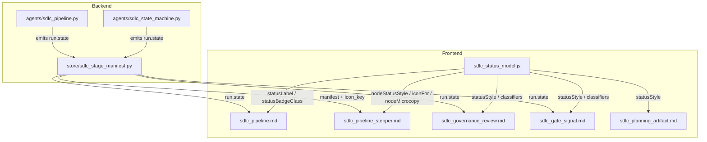
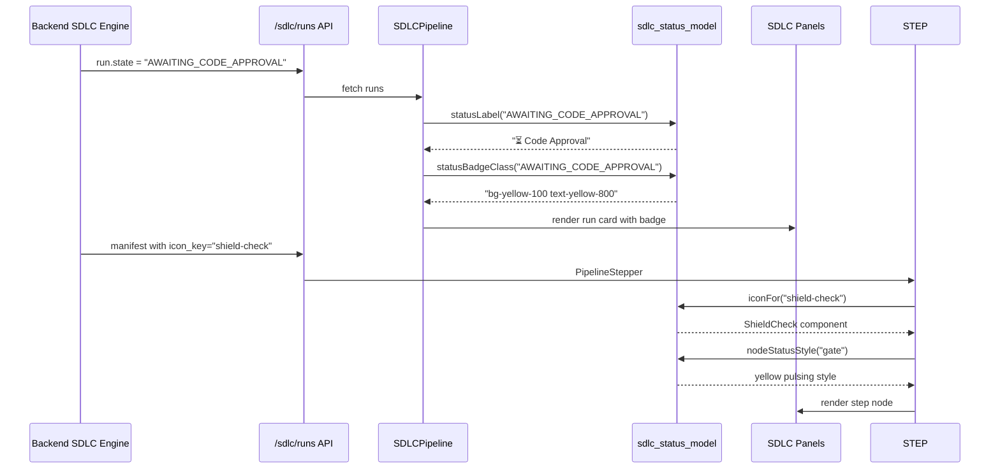

# SDLC Status Model

## Brief Introduction

The `sdlc_status_model` module is the single source of truth for Software Development Lifecycle (SDLC) run-state presentation in the AI UI frontend. It centralises the mapping between backend run states, manifest icon keys, and the visual badges, labels, icons, and microcopy shown across all SDLC panels.

Before this module existed, the state style map was duplicated inside [`SDLCPipeline.jsx`](sdlc_pipeline.md). `statusModel.js` was extracted so that [`PipelineStepper`](sdlc_pipeline_stepper.md), [`GovernanceReviewPanel`](sdlc_governance_review.md), [`GateSignalRow`](sdlc_gate_signal.md), and every other SDLC view consume exactly the same state definitions.

---

## Purpose and Core Functionality

### 1. State-to-Style Mapping

The `STATUS_STYLE` object maps every known backend run state to a Tailwind CSS colour class and a human-readable label. This guarantees visual consistency for:

- Run list cards and detail headers
- Filter pills and stats bars
- Gate/approval banners
- Stepper nodes

Key state categories covered:

| Category | Example States |
|----------|----------------|
| Lifecycle phases | `CREATED`, `PLANNING`, `CODING`, `TESTING`, `COMMITTING` |
| Three-phase CLI engine | `IMPLEMENT`, `REVIEW`, `VERIFIED_DIFF` |
| Human-in-the-loop gates | `AWAITING_CODE_APPROVAL`, `AWAITING_PR_APPROVAL`, `AWAITING_GOVERNANCE_APPROVAL` |
| Failure / retry | `COMMIT_FAILED`, `REVISION_REQUESTED`, `MERGE_CONFLICT` |
| Terminal | `COMPLETE`, `MERGED`, `FAILED`, `CANCELLED`, `EXPIRED` |
| Governance | `GOVERNANCE_SCAN`, `GOVERNANCE_REVIEW`, `GOVERNANCE_FIX` |

Legacy aliases (e.g. `AWAITING_DESIGN_APPROVAL` → `AWAITING_CODE_APPROVAL`) share the same visual treatment so historical runs render identically to new runs.

### 2. State Classifiers

The module exports small classifier sets and helpers:

- `TERMINAL_STATES` — runs that have finished and will not progress further.
- `GATE_STATES` — runs paused for human approval or input.
- `ATTENTION_STATES` — runs that should surface a raised-hand affordance.
- `isTerminal(state)`, `isGateState(state)`, `needsAttention(state)`

These classifiers are used by list views to decide whether to show approval buttons, retry actions, or alert icons.

### 3. Manifest Icon Resolution

The backend pipeline manifest carries string `icon_key` values. `iconFor(key)` maps those strings to imported `lucide-react` components, with `Circle` as the fallback. This keeps the manifest data-driven while the UI owns the icon library dependency.

### 4. Stepper Node Styling

`NODE_STATUS_STYLE` and `nodeStatusStyle(status)` provide per-node live styling for [`PipelineStepper`](sdlc_pipeline_stepper.md):

- `done` — green dot
- `active` — pulsing blue dot with ring
- `gate` — pulsing yellow dot with ring
- `failed` — red dot with ring
- `pending` / `skipped` — grey

### 5. Microcopy Helpers

`nodeMicrocopy(node, options)` returns context-aware helper text for active stepper nodes. For planning/analysis/design/diagnosing nodes it can render convergence metadata such as `round 2/5 · 3 gaps left`, falling back to the node description or label.

---

## Architecture and Component Relationships

### Dependency Direction

- **Backend** owns the canonical state machine and manifest definitions.
- **`sdlc_status_model`** owns the presentation layer mapping only.
- **SDLC UI panels** import helpers from `sdlc_status_model` and never maintain their own state style maps.

---

## Data Flow

---

## Core API

### `statusStyle(state)`

Returns `{ color, label }` for a raw state string. Unknown states fall back to a grey badge with the raw state as the label so the UI never crashes on a new backend state.

### `statusLabel(state)`

Returns the human-readable label for a state, or the raw state, or `"—"`.

### `statusBadgeClass(state)`

Returns the Tailwind colour class for a state badge.

### `isTerminal(state) / isGateState(state) / needsAttention(state)`

Boolean classifiers used to drive UI affordances.

### `iconFor(iconKey)`

Resolves a manifest `icon_key` string to a `lucide-react` icon component.

### `nodeStatusStyle(nodeStatus)`

Returns `{ dot, text, ring }` style objects for a stepper node status.

### `nodeMicrocopy(node, { convergence })`

Returns contextual helper text for an active node, including convergence round/gap information for planning nodes.

---

## How It Fits into the Overall System

`sdlc_status_model` sits at the boundary between the backend SDLC state machine and the frontend user interface:

- It is a **pure presentation utility** with no side effects, no API calls, and no local state.
- It decouples the backend from UI styling decisions. Backend engineers can add new states without changing React components; frontend engineers can update colours in one place.
- It supports **legacy state aliases** so renamed states (e.g. `AWAITING_DESIGN_APPROVAL` → `AWAITING_CODE_APPROVAL`) render consistently across historical and new runs.
- It enables the **pipeline stepper** to be fully data-driven: the backend manifest defines node order and icons, while `statusModel.js` defines how those nodes look.

The module is part of the `ai_ui_frontend` SDLC feature cluster, alongside [`sdlc_pipeline`](sdlc_pipeline.md), [`sdlc_pipeline_stepper`](sdlc_pipeline_stepper.md), [`sdlc_governance_review`](sdlc_governance_review.md), [`sdlc_gate_signal`](sdlc_gate_signal.md), and [`sdlc_planning_artifact`](sdlc_planning_artifact.md).

---

## Related Modules

- [`sdlc_pipeline`](sdlc_pipeline.md) — main SDLC run list and detail view; the original home of `STATUS_STYLE` before it was moved here.
- [`sdlc_pipeline_stepper`](sdlc_pipeline_stepper.md) — visual stepper for pipeline stages; consumes `nodeStatusStyle`, `iconFor`, and `nodeMicrocopy`.
- [`sdlc_governance_review`](sdlc_governance_review.md) — governance approval panel; uses state classifiers to decide which sub-panel to render.
- [`sdlc_gate_signal`](sdlc_gate_signal.md) — gate signal badges shown when a run needs human attention.
- [`sdlc_planning_artifact`](sdlc_planning_artifact.md) — planning/design artifact view; uses status helpers for header badges.

On the backend, state values are produced by the SDLC engine (`agents/sdlc_pipeline.py`, `agents/sdlc_state_machine.py`) and the manifest resolver in `store/sdlc_stage_manifest.py`.
