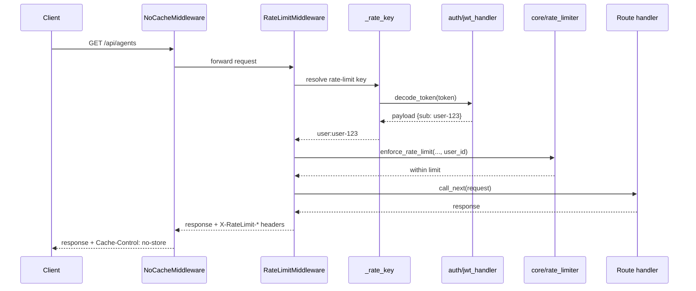
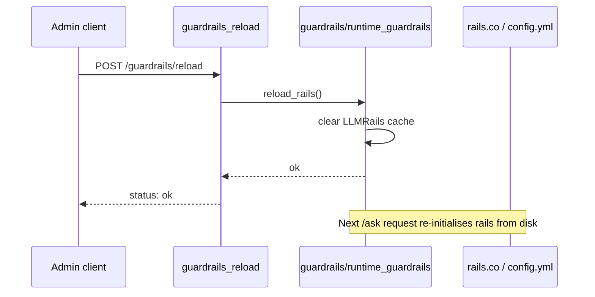

# Security and Governance Module

## Brief Introduction

The `security_and_governance` module is a cross-cutting layer inside the [gateway](../models/gateway.md) that protects the AiNxt platform at the HTTP boundary. It combines traditional web-security controls (cache hygiene, rate-limiting identity resolution) with AI-specific governance (NeMo Guardrails policy hot-reload) and request-schema validation for chat submissions.

This module is intentionally small and focused: it does not implement the full guardrails engine, the rate-limit counter, or the authentication stack. Instead, it wires those capabilities into the FastAPI request lifecycle and exposes the administrative hooks that operators use to keep safety policies up to date.

---

## Core Responsibilities

| Concern | Component | What it does |
|---------|-----------|--------------|
| Response cache control | `NoCacheMiddleware` | Prevents browsers from caching API responses while preserving long-lived caching for Vite hashed static assets. |
| Rate-limit key resolution | `_rate_key` | Decides whether a request is counted per-user (valid JWT) or per-IP (anonymous or invalid token). |
| AI safety policy reload | `guardrails_reload` | Clears the NeMo Guardrails cache so updated `rails.co` / `config.yml` files take effect without a restart. |
| Chat request validation | `SubmitRequest` | Pydantic schema for `/ask` submissions, including RAG mode, attachments, and optional model override. |

---

## Architecture

```mermaid
flowchart TB
    subgraph Gateway["Gateway (FastAPI)"]
        direction TB
        RM[RateLimitMiddleware]
        NCM[NoCacheMiddleware]
        GR[guardrails_reload admin hook]
        SR[SubmitRequest schema]
    end

    subgraph SecurityStack["Shared Security Stack"]
        RL[core/rate_limiter]
        JWT[auth/jwt_handler]
        GV[guardrails/runtime_guardrails]
        SV[core/security_validation]
    end

    Client -->|HTTP request| NCM
    NCM --> RM
    RM -->|calls _rate_key| JWT
    RM -->|enforces limit| RL
    Client -->|POST /guardrails/reload| GR
    GR -->|reload_rails()| GV
    Client -->|POST /ask| SR
    SR -->|validated payload| SV

    style Gateway fill:#e1f5fe
    style SecurityStack fill:#fff3e0
```

### Component Placement

- `NoCacheMiddleware` is registered on the FastAPI app after telemetry instrumentation and before route handlers.
- `_rate_key` is a private helper consumed by `RateLimitMiddleware` to choose the correct Redis key namespace.
- `guardrails_reload` is exposed as an admin endpoint (or internal helper) and delegates to `guardrails.runtime_guardrails.reload_rails()`.
- `SubmitRequest` is the request body model used by the chat/ask endpoints.

---

## Component Details

### `NoCacheMiddleware`

A Starlette `BaseHTTPMiddleware` subclass that inspects every outgoing response and sets cache-control headers based on the request path.

- `/assets/*` — Vite content-hashed bundles are marked `public, max-age=31536000, immutable`. Because the filename changes on every build, stale bundles cannot be served after a deployment.
- Everything else — API responses and `index.html` receive `no-store, must-revalidate`, `Pragma: no-cache`, and `Expires: 0`.

This closes a common browser-caching vulnerability where repeated GET calls to the same API URL (e.g., `/agents`, `/skills`, `/sdlc/runs`) return stale data and mislead users about the current platform state.

### `_rate_key`

Determines the scope of rate limiting for an incoming request.

```mermaid
flowchart LR
    A[Incoming request] --> B{Authorization: Bearer?}
    B -->|Yes| C[decode_token]
    C --> D{Valid & non-expired?}
    D -->|Yes| E[key = user:{sub}]
    D -->|No| F[key = ip:{remote_address}]
    B -->|No| F
```

Security rationale:

- Valid JWTs are rate-limited per user, so a single authenticated actor cannot exhaust the global pool.
- Expired or tampered tokens fall back to the IP key, preventing an attacker from bypassing per-IP limits by replaying old tokens.
- The helper relies on [auth/jwt_handler.py::decode_token](../security/auth.md), which verifies the HS256 signature, required claims, revocation blacklist, and active session state.

### `guardrails_reload`

Reloads the NeMo Guardrails policy from disk. This is intended to be called by administrators after editing:

- `guardrails/rails.co` — CoLang safety flows
- `guardrails/config.yml` — judge model and general configuration

The function calls `reload_rails()` from [guardrails/runtime_guardrails.py](../reference/shared_integrations.md), which clears the in-memory LLMRails cache. The next `/ask` request re-initialises the rails from the updated files.

> **Note:** This module only exposes the reload hook. The actual blocking logic (keyword-only or LLM-backed) lives in [guardrails/runtime_guardrails.py::check_input](../reference/shared_integrations.md).

### `SubmitRequest`

Pydantic model for chat/ask submissions. Fields include:

| Field | Type | Purpose |
|-------|------|---------|
| `question` | `str` | User prompt text. |
| `session_id` | `Optional[str]` | Optional server-side session continuity. |
| `chat_id` | `Optional[str]` | Existing chat thread identifier. |
| `repo_filter` | `Optional[str]` | Restrict RAG retrieval to a specific repository. |
| `model` | `Optional[str]` | Override the default model for this request. |
| `project_id` | `Optional[str]` | Scope the request to a project workspace. |
| `attachment_ids` | `List[str]` | Uploaded file IDs for multimodal/context queries. |
| `rag_mode` | `Optional[str]` | Context isolation: `"off"`, `"auto"`, or `"on"`. |

This schema is the first validation gate for the chat pipeline and is referenced by the [chat_and_messaging](../models/gateway.md) gateway endpoints.

---

## Data Flow: Authenticated Request



## Data Flow: Guardrails Reload



---

## Process Flow: Rate-Limit Decision

```mermaid
flowchart TD
    A[Request enters RateLimitMiddleware] --> B{Path exempt?}
    B -->|Yes| C[Pass through]
    B -->|No| D[_rate_key]
    D --> E{Bearer token present?}
    E -->|No| F[ip:{remote_address}]
    E -->|Yes| G[decode_token]
    G --> H{Valid & sub present?}
    H -->|Yes| I[user:{sub}]
    H -->|No| F
    I --> J[enforce_rate_limit user scope]
    F --> K[enforce_rate_limit IP scope]
    J --> L{Limit exceeded?}
    K --> L
    L -->|Yes| M[HTTP 429 + headers]
    L -->|No| N[Call route handler]
    N --> O{4xx response?}
    O -->|Yes| P[record_4xx_event]
    O -->|No| Q[Inject X-RateLimit headers]
```

---

## Dependencies

| This module uses | For | See also |
|------------------|-----|----------|
| `auth/jwt_handler.py::decode_token` | Validating JWTs to extract a user-scoped rate-limit key. | [auth.md](../security/auth.md) |
| `core/rate_limiter.py::enforce_rate_limit` | Enforcing sliding-window limits backed by Redis. | [shared_core.md](../reference/shared_core.md) |
| `middleware/rate_limit_middleware.py::RateLimitMiddleware` | The middleware that orchestrates `_rate_key` and limit enforcement. | [gateway.md](../models/gateway.md) |
| `guardrails/runtime_guardrails.py::reload_rails` | Clearing the NeMo Guardrails cache. | [shared_integrations.md](../reference/shared_integrations.md) |
| `core/security_validation.py` | Additional request validation used downstream. | [shared_core.md](../reference/shared_core.md) |

---

## Security Considerations

1. **Fail-closed authentication for rate limiting.** `_rate_key` treats any decoding failure as an anonymous request, so attackers cannot use invalid tokens to escape IP-based limits.
2. **No wildcard CORS.** The gateway reads `CORS_ALLOWED_ORIGINS` from the environment and never uses `*` when credentials are enabled. See the [gateway](../models/gateway.md) documentation for CORS setup.
3. **Cache separation.** Static assets and API responses use opposite cache policies, eliminating stale-data risks without breaking frontend build caching.
4. **Hot policy updates.** `guardrails_reload` lets operators patch safety policies without a full redeploy, reducing the window between a policy change and enforcement.
5. **Schema validation.** `SubmitRequest` provides an explicit contract for chat input, including RAG-mode isolation and attachment handling.

---

## Operational Notes

- Call `guardrails_reload` after any change to `guardrails/rails.co` or `guardrails/config.yml`.
- Monitor `X-RateLimit-*` response headers and the `rate_limit_exceeded_total` Prometheus counter to detect abuse.
- If Redis is unavailable, the rate limiter falls back to an in-process counter unless configured otherwise. See [core/rate_limiter.py](../reference/shared_core.md) for `block_on_redis_failure` behavior.

---

## Related Modules

- [gateway.md](../models/gateway.md) — Parent gateway module that registers the middleware and admin hooks.
- [shared_core.md](../reference/shared_core.md) — Contains `core/rate_limiter`, `core/security_validation`, and other shared security primitives.
- [shared_integrations.md](../reference/shared_integrations.md) — Contains the `guardrails/runtime_guardrails` engine.
- [auth.md](../security/auth.md) — Authentication and JWT handling.
