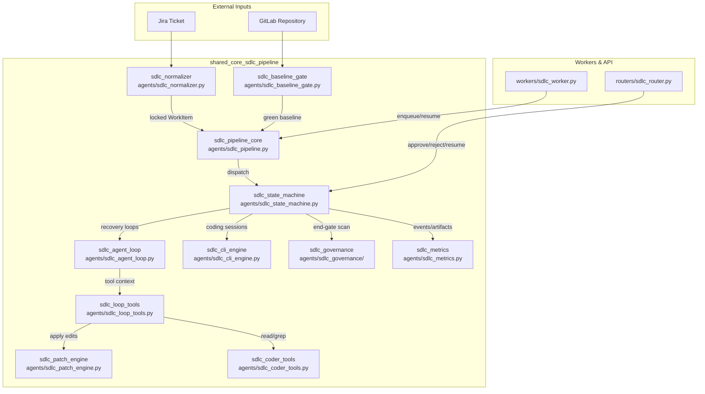
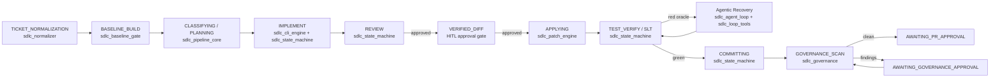

# shared_core_sdlc_pipeline

## Purpose

`shared_core_sdlc_pipeline` is the AI-driven Software Development Lifecycle (SDLC) engine. It automates the full software-delivery workflow—from a raw Jira ticket or feature request through planning, code generation, review, testing, governance, and merge-request creation. The module is built around a persistent state machine with human-in-the-loop (HITL) gates, bounded agentic recovery loops, and deterministic patch application, ensuring generated code is reviewed, tested, and auditable before it reaches a customer repository.

The pipeline is organized into focused submodules:

| Submodule | Responsibility |
|-----------|---------------|
| `sdlc_pipeline_core` | Foundational orchestration utilities (`_env_flag`, `_parse_json`) and top-level stage dispatch. |
| `sdlc_state_machine` | Persistent `CodingStateMachine` that drives IMPLEMENT → REVIEW → APPLYING → TEST_VERIFY → SLT → COMMITTING. |
| `sdlc_agent_loop` | Bounded Anthropic tool-use loop primitive (WS-1) used for agentic recovery and exploration. |
| `sdlc_cli_engine` | Subprocess adapter for the external `ainxt` CLI binary used by planning and coding phases. |
| `sdlc_loop_tools` | Tool-wiring layer connecting the agentic loop to the patch engine, build/test oracles, and workspace. |
| `sdlc_patch_engine` | Surgical SEARCH/REPLACE patch applier with two-tier matching and sandbox validation. |
| `sdlc_coder_tools` | Read-only code-navigation tools (`read_file`, `search_symbols`, `find_callers`, `find_dependencies`). |
| `sdlc_governance` | Compliance and security review engine run as an end-gate after commit. |
| `sdlc_baseline_gate` | Preflight build gate (WS-2) that verifies HEAD compiles before any AI edits. |
| `sdlc_normalizer` | Converts raw Jira tickets into locked, structured `WorkItem` contracts. |
| `sdlc_metrics` | Read-only analytics over SDLC artifacts and run events. |

## Architecture

## Pipeline Flow

## Core Component References

- **[sdlc_pipeline_core](sdlc_pipeline_core.md)** — foundational utilities `_env_flag` and `_parse_json` used across all stages.
- **[sdlc_state_machine](sdlc_state_machine.md)** — persistent state machine driving the full coding lifecycle with suspend-not-fail semantics.
- **[sdlc_agent_loop](sdlc_agent_loop.md)** — bounded Anthropic tool-use loop for recovery-on-red and agentic exploration.
- **[sdlc_cli_engine](sdlc_cli_engine.md)** — subprocess adapter for the `ainxt` CLI binary with profile-based permission modes.
- **[sdlc_loop_tools](sdlc_loop_tools.md)** — tool-context factories, workspace grep, and the Three Guards for agentic edits.
- **[sdlc_patch_engine](sdlc_patch_engine.md)** — surgical SEARCH/REPLACE patch engine with two-tier matching and sandbox validation.
- **[sdlc_coder_tools](sdlc_coder_tools.md)** — read-only code navigation tools for the agentic loop.
- **[sdlc_governance](sdlc_governance.md)** — governance review engine for compliance and security scanning.
- **[sdlc_baseline_gate](sdlc_baseline_gate.md)** — preflight build gate that verifies HEAD compiles before AI edits.
- **[sdlc_normalizer](sdlc_normalizer.md)** — ticket normalization that converts Jira issues into structured `WorkItem` contracts.
- **[sdlc_metrics](sdlc_metrics.md)** — run-level quality and convergence metrics derived from artifacts and events.