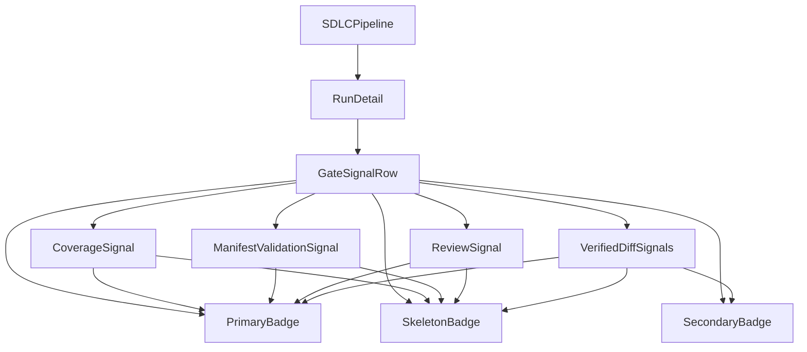
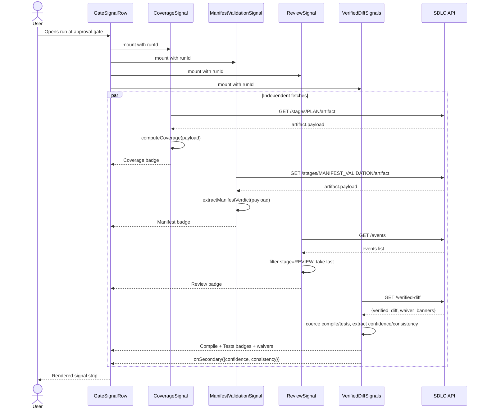
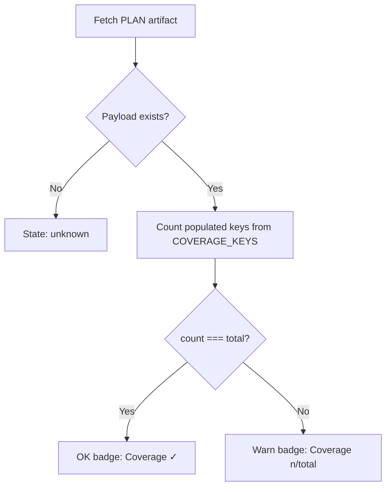
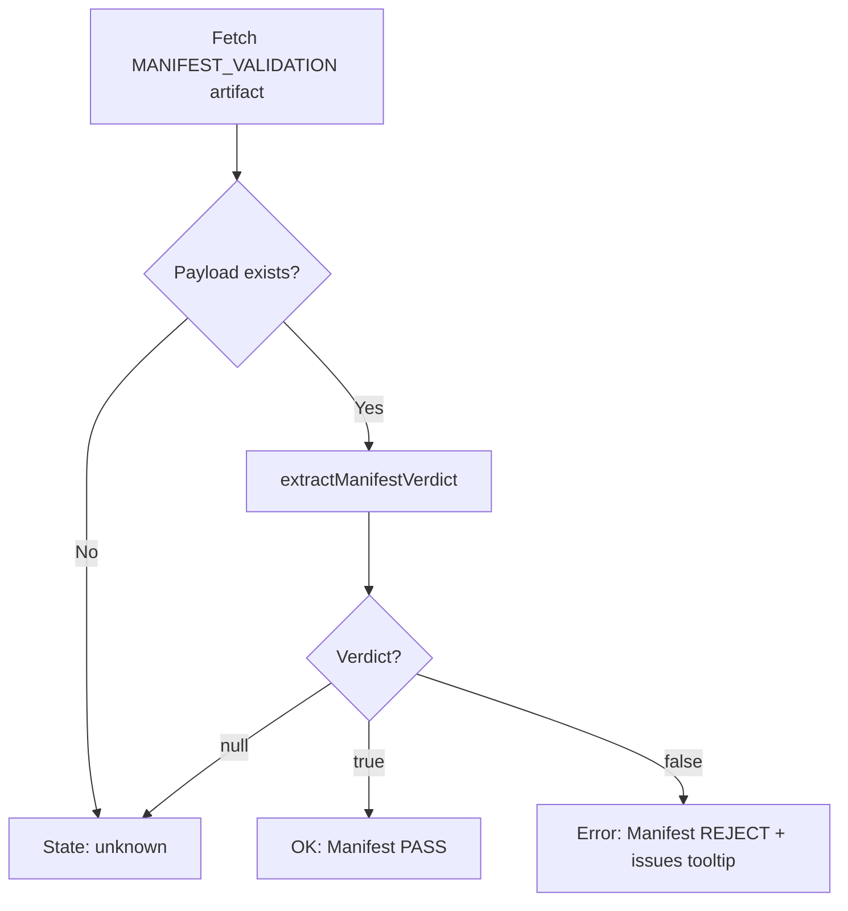
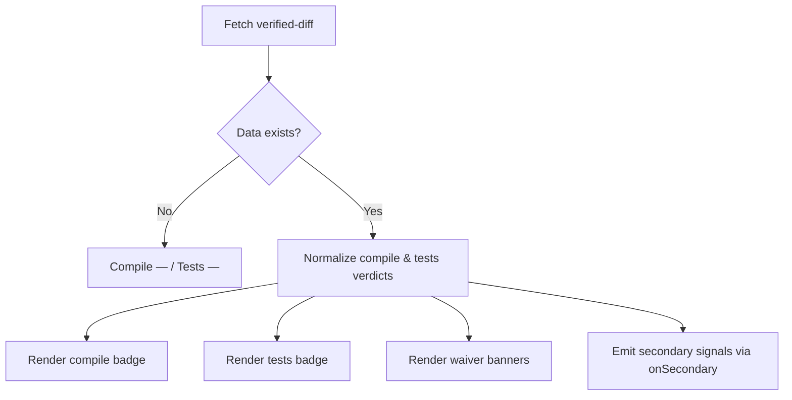

# SDLC Gate Signal Module

## Brief Introduction

The `sdlc_gate_signal` module renders a **trust-calibrated signal strip** in the AI-UI SDLC pipeline. It appears above the verified-diff card at human-in-the-loop (HITL) approval gates — specifically `AWAITING_CODE_APPROVAL` (legacy `AWAITING_DESIGN_APPROVAL`) and `AWAITING_SOLUTION_APPROVAL` — so that a human reviewer can quickly see whether the AI-generated change is safe to approve.

The module is implemented as a single React component file: `ai-ui/src/components/sdlc/GateSignalRow.jsx`.

---

## Purpose and Core Functionality

`GateSignalRow` aggregates independent evidence from multiple backend sources and surfaces it as a compact row of badges:

- **Primary signals** (prominent, colour-coded green/amber/red):
  - **Coverage** — whether the PLAN artifact contains all required planning keys (`files_to_change`, `sub_tasks`, `implementation_spec`, `solution_approach`, `implementation_plan`, `code_structure`, `testing_strategy`, `rollback_strategy`).
  - **Manifest Validation** — cross-provider manifest validation verdict from the `MANIFEST_VALIDATION` stage artifact.
  - **Review** — the most recent Opus diff-only review verdict emitted as a run event with `stage="REVIEW"`.
  - **Compiled** — compile status from the verified diff.
  - **Tests** — test status from the verified diff.
- **Secondary signals** (muted gray, advisory only):
  - **Consistency** — model self-reported consistency score.
  - **Confidence** — model confidence score (documented as ≤15% weight).

Each signal is fetched and rendered independently. If a fetch fails or data is missing, the badge degrades gracefully to an "unknown" state (`—`) rather than crashing the row.

---

## Architecture

### Component Hierarchy



### Public API

| Export | Type | Description |
|--------|------|-------------|
| `GateSignalRow` | React component | Main signal strip. Props: `run`, `runId`, `runType`. |
| `CoverageSignal` | React component | Fetches `/stages/PLAN/artifact` and renders coverage badge. |
| `ManifestValidationSignal` | React component | Fetches `/stages/MANIFEST_VALIDATION/artifact` and renders manifest verdict. |
| `ReviewSignal` | React component | Fetches `/events`, filters `stage="REVIEW"`, renders review verdict. |
| `VerifiedDiffSignals` | React component | Fetches `/verified-diff`, renders compile/test badges and waiver banners. |
| `PrimaryBadge` | React component | Reusable green/amber/red badge with icon. |
| `SecondaryBadge` | React component | Reusable muted gray advisory badge. |
| `SkeletonBadge` | React component | Loading placeholder. |

---

## Dependencies

### Internal Dependencies

| Dependency | Module | Purpose |
|------------|--------|---------|
| `apiFetch`, `API_BASE` | [config](ai_ui_frontend_config.md) | HTTP client and backend base URL. |
| `SDLCPipeline` / `RunDetail` | [sdlc_pipeline](sdlc_pipeline.md) | Parent components that host the signal row at approval gates. |

### External Dependencies

- `react` — hooks (`useState`, `useEffect`).
- `lucide-react` — icons (`Hand`, `CheckCircle2`, `XCircle`, `AlertTriangle`, `Minus`).

### Backend Endpoints Consumed

| Endpoint | Source | Signal |
|----------|--------|--------|
| `GET /sdlc/runs/{runId}/stages/PLAN/artifact` | [sdlc_router](sdlc_router.md) | Coverage |
| `GET /sdlc/runs/{runId}/stages/MANIFEST_VALIDATION/artifact` | [sdlc_router](sdlc_router.md) | Manifest Validation |
| `GET /sdlc/runs/{runId}/events` | [sdlc_router](sdlc_router.md) | Review |
| `GET /sdlc/runs/{runId}/verified-diff` | [sdlc_router](sdlc_router.md) | Compile, Tests, Waivers, Secondary signals |

---

## Data Flow



---

## Component Interactions

```mermaid
flowchart LR
    subgraph "GateSignalRow"
        A[Header: "Needs your review"]
        B[Primary Signal Badges]
        C[Secondary Signal Badges]
    end

    D[CoverageSignal] -->|PrimaryBadge| B
    E[ManifestValidationSignal] -->|PrimaryBadge| B
    F[ReviewSignal] -->|PrimaryBadge| B
    G[VerifiedDiffSignals] -->|PrimaryBadge| B
    G -->|callback: onSecondary| C

    H[PLAN artifact] --> D
    I[MANIFEST_VALIDATION artifact] --> E
    J[Run events: stage=REVIEW] --> F
    K[VERIFIED_DIFF artifact] --> G
```

### Signal Classification

| Signal | Class | Source | Failure Behaviour |
|--------|-------|--------|-------------------|
| Coverage | Primary | PLAN artifact | `Coverage —` unknown |
| Manifest Validation | Primary | MANIFEST_VALIDATION artifact | `Manifest —` unknown |
| Review | Primary | Run events (REVIEW) | `Review —` unknown |
| Compiled | Primary | Verified diff | `Compile —` unknown |
| Tests | Primary | Verified diff | `Tests —` unknown |
| Consistency | Secondary | Verified diff | Hidden if null |
| Confidence | Secondary | Verified diff | Hidden if null |

---

## Process Flows

### Coverage Evaluation



### Manifest Validation Evaluation



### Verified Diff Evaluation



---

## How It Fits into the Overall System

`GateSignalRow` is a **presentation-layer safety affordance** in the AI-UI SDLC experience. It does not make approval decisions; it summarises evidence so the human reviewer can make an informed decision before clicking **Approve**, **Reject**, **Request Changes**, or **Cancel** in the parent [SDLCPipeline](sdlc_pipeline.md) detail view.

The module sits downstream of:

- The [shared_core_sdlc_pipeline](shared_core_sdlc_pipeline.md) agents that produce PLAN, MANIFEST_VALIDATION, and VERIFIED_DIFF artifacts.
- The [sdlc_pipeline_workers](sdlc_pipeline_workers.md) that execute the pipeline stages asynchronously.
- The [sdlc_router](sdlc_router.md) that exposes the artifact and event endpoints.

It is a sibling to:

- [sdlc_governance_review](sdlc_governance_review.md) — handles governance approval panels.
- [sdlc_planning_artifact](sdlc_planning_artifact.md) — renders the full PLAN artifact details.
- [sdlc_pipeline_stepper](sdlc_pipeline_stepper.md) — visualises stage progression.
- [sdlc_status_model](sdlc_status_model.md) — provides status labels and badge classes.

---

## Design Principles

1. **Fail-soft independence** — each signal fetches and renders independently; a failure in one signal never breaks the row or the parent UI.
2. **Trust calibration** — primary signals are high-contrast and action-relevant; secondary signals are deliberately muted so they are not mistaken for gate criteria.
3. **Defensive parsing** — helper functions (`coerceBool`, `extractManifestVerdict`, `computeCoverage`) handle multiple payload shapes and string/boolean verdicts.
4. **No blocking on load** — skeleton placeholders are shown while data is fetched.

---

## References

- [sdlc_pipeline](sdlc_pipeline.md) — parent SDLC pipeline UI.
- [sdlc_governance_review](sdlc_governance_review.md) — governance approval UI.
- [sdlc_planning_artifact](sdlc_planning_artifact.md) — PLAN artifact rendering.
- [sdlc_pipeline_stepper](sdlc_pipeline_stepper.md) — pipeline stage stepper.
- [sdlc_status_model](sdlc_status_model.md) — status label helpers.
- [sdlc_router](sdlc_router.md) — backend router exposing the consumed endpoints.
- [shared_core_sdlc_pipeline](shared_core_sdlc_pipeline.md) — core SDLC pipeline agents.
- [sdlc_pipeline_workers](sdlc_pipeline_workers.md) — asynchronous SDLC pipeline workers.
- [ai_ui_frontend_config](ai_ui_frontend_config.md) — `apiFetch` and `API_BASE` configuration.
