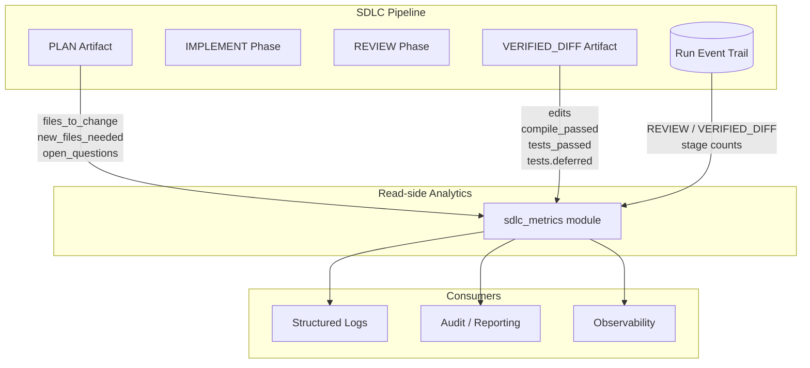
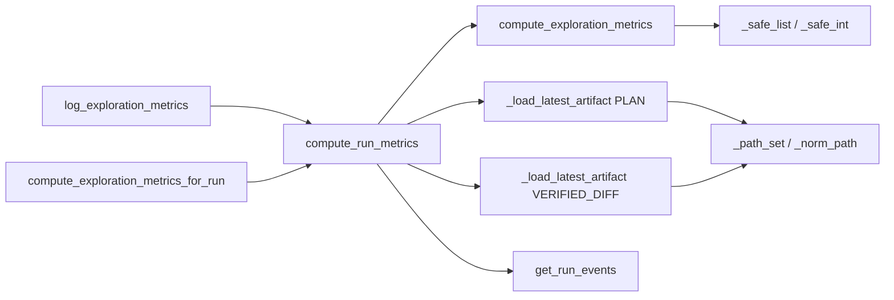
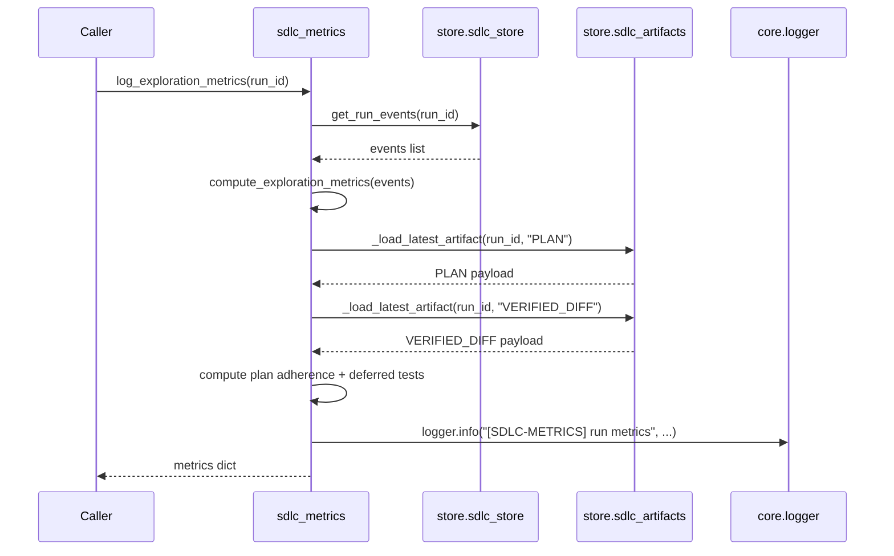

# SDLC Metrics Module

## Brief Introduction

The `sdlc_metrics` module (`agents/sdlc_metrics.py`) is a **read-only analytics utility** for the three-phase SDLC CLI engine. It computes per-run quality and convergence metrics by inspecting existing artifacts and the run-event audit trail already written by the SDLC store layer. It does **not** alter pipeline control flow, mutate state, or call into execution components.

The module was introduced as part of the 2026-07-01 hard cutover to the three-phase engine:

```text
PLAN (read-only planner) → IMPLEMENT (one session: code + tests + green) → REVIEW (bounded fix round)
```

Metrics are derived from:

- The `PLAN` artifact — predicted files and open questions.
- The `VERIFIED_DIFF` artifact — edited files, compile/test gate results, and deferred tests.
- The run-event trail — `REVIEW` rounds/verdict and per-stage event counts.

Historical fields that the CLI engine cannot populate honestly (e.g., files read by the navigator/verifier loop) were intentionally removed to eliminate "always null" noise.

---

## Core Responsibilities

1. **Compute run-level metrics** from artifacts + events (`compute_run_metrics`).
2. **Compute event-only metrics** for callers that already have a pre-fetched event list (`compute_exploration_metrics`).
3. **Emit a single structured log line** tagged `[SDLC-METRICS]` for observability (`log_exploration_metrics`).
4. **Provide backwards-compatible aliases** (`compute_exploration_metrics_for_run`) for legacy callers that previously passed a `stage` filter.

---

## Architecture

### High-level placement



### Component diagram



---

## Core Components

### `compute_run_metrics(run_id: str) -> dict`

Primary entry point. Loads the full event trail plus the `PLAN` and `VERIFIED_DIFF` artifacts for a given `run_id` and returns a metrics dictionary.

Key fields returned:

| Field | Source | Meaning |
|-------|--------|---------|
| `files_predicted` | `PLAN` artifact | Count of unique files predicted to change or be created |
| `files_modified` | `VERIFIED_DIFF` artifact / events | Count of edited files |
| `plan_hits` | `PLAN` ∩ `VERIFIED_DIFF` code files | Predicted files that actually changed |
| `off_plan_files` | `VERIFIED_DIFF` − `PLAN` | Scope-creep signal: files changed but not predicted |
| `open_questions` | `PLAN` artifact | Number of open questions recorded at planning time |
| `rounds_to_converge` | `REVIEW` events | Number of review passes (1 = clean approve, 2 = one fix round) |
| `review_approved` | Last `REVIEW` event | Final review verdict |
| `review_blocking_issues` | Last `REVIEW` event | Blocking issue count from final review |
| `compile_passed` | `VERIFIED_DIFF` event | Compile gate result |
| `tests_passed` | `VERIFIED_DIFF` event | Test gate result |
| `tests_deferred` | `VERIFIED_DIFF` artifact | Whether tests were authored pre-gate and executed post-gate |
| `event_count_by_stage` | Run events | `{stage_name: count}` breakdown |

On failure to fetch events, returns `{"error": ..., "run_id": ...}` so callers can log and degrade gracefully.

### `compute_exploration_metrics(events: list[dict], stage=None) -> dict`

Event-only subset. Useful when callers already have a pre-fetched event list and do not need artifact-derived fields. Artifact fields (`files_predicted`, `plan_hits`, `off_plan_files`, `open_questions`) are omitted/`None` here.

### `compute_exploration_metrics_for_run(run_id: str, stage=None) -> dict`

Backwards-compatible alias for `compute_run_metrics`. The `stage` parameter is accepted but ignored because the three-phase engine computes whole-run metrics.

### `log_exploration_metrics(run_id: str, stage=None) -> dict`

Computes metrics via `compute_run_metrics` and emits a single structured `INFO` log line tagged `[SDLC-METRICS]`. Returns the metrics dict for caller convenience.

### Helper utilities

| Helper | Purpose |
|--------|---------|
| `_safe_list` | Coerce a value to a list; returns `[]` on `None`/non-list |
| `_safe_int` | Parse an integer with a fallback default |
| `_norm_path` | Normalize a path-ish value (str or dict) for comparison |
| `_path_set` | Build a normalized set of paths from a list of entries |

---

## Data Flow



---

## Dependencies

| Dependency | Module | Role |
|------------|--------|------|
| `logger` | [core_logger](core_logger.md) | Structured logging for diagnostics and metric emission |
| `get_run_events` | [store.sdlc_store](sdlc_store.md) | Loads the run-event audit trail |
| `_load_latest_artifact` | [store.sdlc_artifacts](sdlc_artifacts.md) | Loads `PLAN` and `VERIFIED_DIFF` artifacts |

The module intentionally keeps its dependency surface minimal and read-only. It does not import execution agents, the state machine, or any mutating store functions.

---

## How It Fits into the System

`sdlc_metrics` sits on the **read-side** of the SDLC subsystem. It consumes outputs produced by:

- The planner that writes the `PLAN` artifact.
- The implementer that produces the `VERIFIED_DIFF` artifact.
- The store layer that records stage events.

Its outputs feed:

- **Observability dashboards** via structured `[SDLC-METRICS]` logs.
- **Audit and compliance reporting** through run-level quality signals.
- **Pipeline improvement loops** by exposing plan adherence (`plan_hits` / `off_plan_files`) and review convergence (`rounds_to_converge`).

For the active execution path of the SDLC pipeline, see [sdlc_pipeline](sdlc_pipeline.md), [sdlc_state_machine](sdlc_state_machine.md), and [sdlc_agent_loop](sdlc_agent_loop.md). For the store layer that supplies events and artifacts, see [sdlc_store](sdlc_store.md) and [sdlc_artifacts](sdlc_artifacts.md).

---

## Backwards Compatibility Notes

- The old `stage` filter is still accepted in `compute_exploration_metrics` and `compute_exploration_metrics_for_run` but is no longer meaningful under the three-phase engine.
- Metrics tied to the deleted `ANALYZING` / `DESIGNING` / `DIAGNOSING` / `CODING` stages and the old navigator/verifier loop are no longer emitted.
