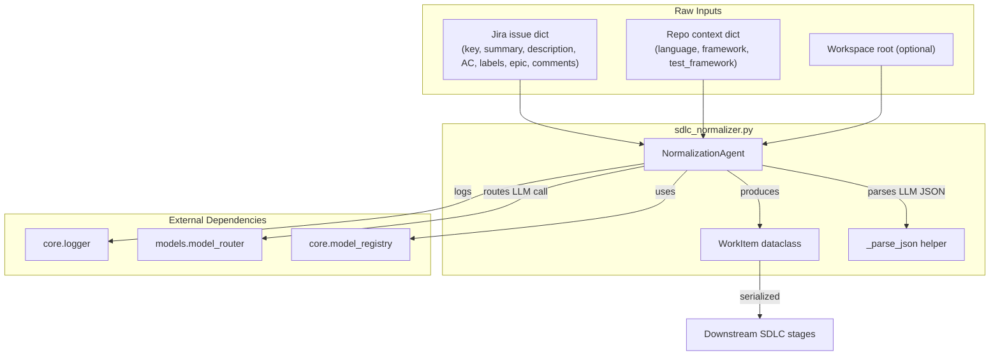
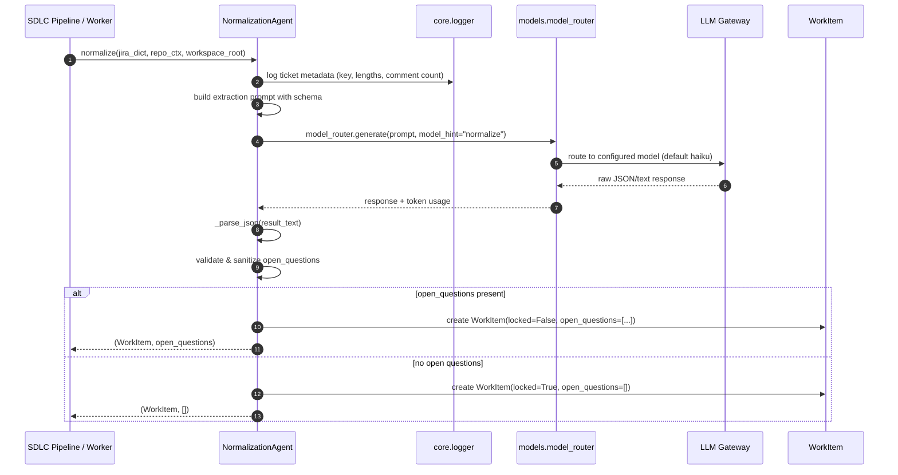
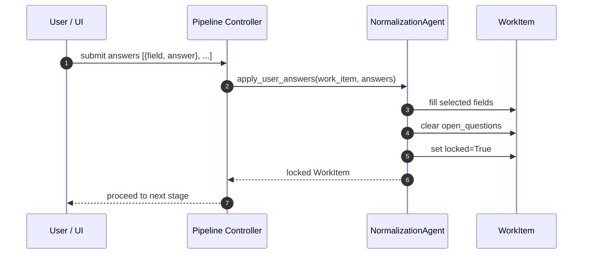
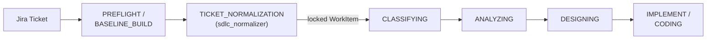

# SDLC Normalizer Module

## Brief Introduction

The `sdlc_normalizer` module (`agents/sdlc_normalizer.py`) implements the **TICKET_NORMALIZATION** stage of the AI-driven SDLC pipeline. Its single responsibility is to convert a raw Jira ticket into a locked, structured `WorkItem` that every downstream stage consumes instead of raw ticket text. By extracting and confirming requirements at the source, the normalizer prevents ambiguity from propagating through the pipeline's later stages (CLASSIFYING, ANALYZING, DESIGNING, DIAGNOSING, CODING, etc.).

The module is intentionally lightweight and cheap to run: it delegates the extraction to a fast LLM (default routing hint `haiku`) and surfaces any genuinely unanswerable questions as human-in-the-loop (HITL) clarifications. Once clarifications are received, the `WorkItem` is locked and the pipeline can proceed deterministically.

---

## Core Responsibilities

1. **Extract structured intent from unstructured Jira tickets**
   - Reads ticket summary, description, acceptance criteria, labels, epic context, and recent comments.
   - Uses repository context (language, framework, test framework) to ground inference.

2. **Distinguish "thin" vs. "thick" tickets**
   - Thick tickets: distil the signal into precise fields and ignore narrative noise.
   - Thin tickets: raise concrete, multiple-choice `open_questions` for the user.

3. **Produce a canonical `WorkItem`**
   - A serializable dataclass with problem statement, acceptance criteria, scope, out-of-scope, constraints, technical hints, and open questions.
   - `locked=True` means downstream stages may proceed without further user input.

4. **Merge HITL answers and lock the work item**
   - `apply_user_answers()` fills the fields selected by the user, clears open questions, and locks the item.

---

## Architecture

### Component Overview



### WorkItem Dataclass

`WorkItem` is the canonical contract between the normalizer and the rest of the pipeline. It is intentionally plain (a `dataclass`) so it can be serialized to/from dictionaries and stored in run context or artifacts.

| Field | Purpose |
|-------|---------|
| `problem_statement` | One precise paragraph describing the exact problem to solve. |
| `acceptance_criteria` | Specific, testable outcomes. |
| `scope` | Files, systems, or components explicitly in scope. |
| `out_of_scope` | Explicit exclusions — things a naive implementation might accidentally touch. |
| `constraints` | Invariants that must not change (backwards compatibility, API contracts, etc.). |
| `technical_hints` | Any technical direction already mentioned in the ticket. |
| `open_questions` | HITL clarification items when the ticket is ambiguous. |
| `locked` | `True` when the item is complete and confirmed. |
| `jira_key` | Source ticket identifier for traceability. |

The dataclass provides `to_dict()` and `from_dict()` for persistence and recovery.

### NormalizationAgent

`NormalizationAgent` is the only public class in the module. It exposes two primary methods:

- **`normalize(jira_dict, repo_ctx, workspace_root)`** — performs the extraction.
- **`apply_user_answers(work_item, answers)`** — merges HITL answers and locks the item.

The agent is stateless except for an optional `run_id` used for logging correlation.

---

## Data Flow

### Normalization Flow



### HITL Answer Flow



---

## Component Interaction

### Within the SDLC Pipeline

The normalizer sits immediately after PREFLIGHT/BASELINE_BUILD and before CLASSIFYING. It is the first stage that transforms the raw Jira ticket into a machine-readable contract.



For details on how downstream stages consume the `WorkItem`, see:

- [sdlc_state_machine.md](sdlc_state_machine.md) — persistent state machine that drives CODING, REVIEWING, TESTING, and COMMITTING.
- [sdlc_pipeline.md](sdlc_pipeline.md) — orchestration layer that wires stages together.

### Dependency on Model Routing

The normalizer does not call an LLM directly. It uses the shared [`models.model_router`](model_router.md) so that:

- Model selection respects environment configuration (`SDLC_MODEL_NORMALIZE`).
- Privacy floor, circuit breakers, and fallback chains are applied consistently.
- Token usage and cost metadata are tracked automatically.

The routing hint is resolved via [`core.model_registry.sdlc_stage_hint()`](core_model_registry.md) with stage `"normalize"`. The default hint is `haiku` for speed and cost efficiency.

### Logging and Observability

All normalization events are emitted through [`core.logger`](core_logger.md). Log lines include the `run_id` prefix `[NORM {run_id}]` and capture:

- Ticket key and field lengths.
- Number of extracted fields.
- Number and fields of open questions.
- Model used, prompt size, and token counts.

---

## Process Flows

### Thin Ticket Handling

When the ticket lacks sufficient detail for critical fields (especially `problem_statement` or `scope`), the agent raises `open_questions`. Each question must include:

- `field` — which `WorkItem` field the answer fills.
- `question` — a concise clarification request.
- `options` — 2–4 concrete, actionable candidate answers.
- `recommended` — the default option index.
- `rationale` — why the recommended option is sensible.

This design avoids generic yes/no questions and lets the user resolve ambiguity with a single click.

### Thick Ticket Handling

When the ticket is detailed, the agent extracts only what is stated or strongly implied. It deliberately:

- Does **not** invent acceptance criteria or scope.
- Lists `out_of_scope` items that are explicitly excluded or commonly mistaken as in scope.
- Records `constraints` and `technical_hints` without embellishment.

### Failure Modes

| Scenario | Behavior |
|----------|----------|
| LLM call fails | Returns a minimal `WorkItem` with `locked=False` and a single open question asking the user to clarify the problem. |
| LLM returns unparseable JSON | `_parse_json` tolerates markdown fences and returns `{}` on total failure, causing the agent to fall back to summary+description as the problem statement. |
| Open questions present | Returns an unlocked `WorkItem`; pipeline pauses for HITL. |
| No open questions | Returns a locked `WorkItem`; pipeline proceeds. |

---

## Configuration

| Environment Variable | Purpose |
|----------------------|---------|
| `SDLC_MODEL_NORMALIZE` | Override the model hint for the normalization stage. |
| `SDLC_STAGE_MODEL_DEFAULTS` (code default) | Fallback model map used by `core.model_registry`. |

For the full model routing configuration, see [core_model_registry.md](core_model_registry.md).

---

## Integration Points

| Component | Relationship |
|-----------|--------------|
| [`models.model_router`](model_router.md) | Routes the extraction prompt to the appropriate LLM gateway. |
| [`core.model_registry`](core_model_registry.md) | Resolves the `normalize` stage model hint. |
| [`core.logger`](core_logger.md) | Structured logging for normalization events. |
| [`sdlc_state_machine`](sdlc_state_machine.md) | Consumes the locked `WorkItem` to drive implementation. |
| [`sdlc_pipeline`](sdlc_pipeline.md) | Orchestrates when normalization runs relative to other stages. |
| [`sdlc_store`](sdlc_store.md) | Persists run state and artifacts (referenced by the broader pipeline). |

---

## Code Map

```
agents/sdlc_normalizer.py
├── WorkItem              # Canonical structured ticket representation
│   ├── to_dict()
│   └── from_dict()
├── NormalizationAgent    # Main extraction logic
│   ├── __init__(run_id)
│   ├── _model()          # Resolve model hint
│   ├── normalize()       # Extract WorkItem from Jira dict
│   └── apply_user_answers()  # Merge HITL answers and lock
└── _parse_json()         # Tolerant JSON extraction helper
```

---

## Best Practices and Design Notes

- **Cheap by default**: Normalization uses the `haiku` tier because the task is structured extraction, not deep reasoning.
- **Fail-open on LLM errors**: A failed LLM call still returns a usable `WorkItem` so the pipeline can pause gracefully for HITL rather than crashing.
- **No scope invention**: The prompt explicitly forbids inventing acceptance criteria or scope, reducing hallucinated work.
- **Concrete options**: Open questions must present actionable options, not generic placeholders.
- **Serializable contract**: `WorkItem` is a plain dataclass so it can be stored in run context, artifacts, or resumed across workers.

---

## Related Documentation

- [model_router.md](model_router.md)
- [core_model_registry.md](core_model_registry.md)
- [core_logger.md](core_logger.md)
- [sdlc_state_machine.md](sdlc_state_machine.md)
- [sdlc_pipeline.md](sdlc_pipeline.md)
- [sdlc_store.md](sdlc_store.md)
