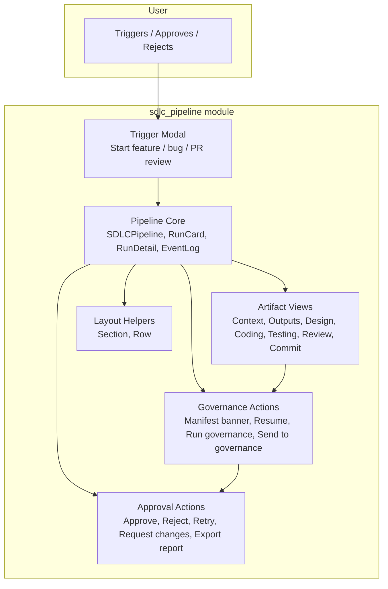
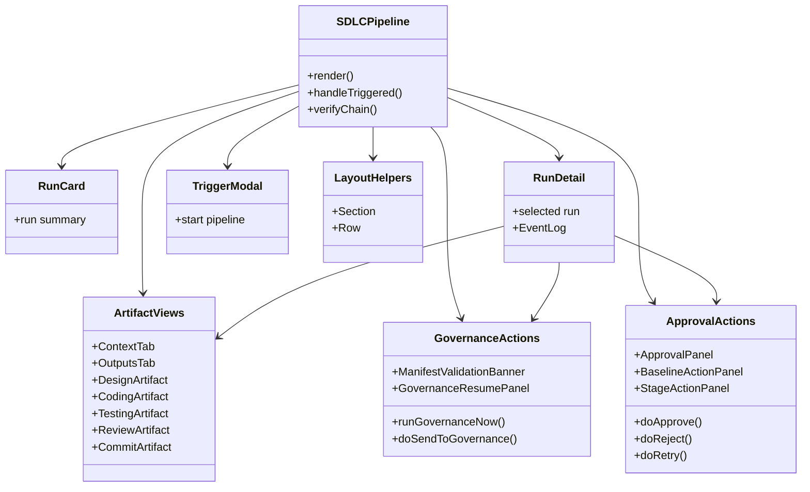
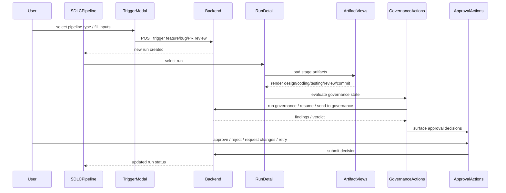

# sdlc_pipeline Module Overview

## Purpose

The `sdlc_pipeline` module is the frontend React implementation of the Software Development Lifecycle (SDLC) pipeline interface in the `ai-ui` application. It provides an interactive dashboard for orchestrating, monitoring, and governing AI-driven software development workflows — from feature/bug initiation through design, coding, testing, review, and merge.

The module renders pipeline runs as cards, exposes per-run artifact inspection, supports human-in-the-loop governance actions (approve, reject, request changes, retry), and integrates manifest validation, security findings, and cross-model review outputs into a unified user experience.

---

## Architecture

The module is organized around a single root component, `SDLCPipeline`, that composes several focused sub-systems:

### Component Hierarchy

### Data Flow

---

## Core Components Documentation

| Sub-module | Responsibility | Key Components |
|------------|----------------|----------------|
| [pipeline_core](sdlc_pipeline/pipeline_core.md) | Main orchestration, run listing, run selection, event log, and chain verification | `SDLCPipeline`, `RunCard`, `RunDetail`, `EventLog`, `verifyChain`, `handleTriggered` |
| [artifact_views](sdlc_pipeline/artifact_views.md) | Render stage-specific outputs and metadata for each pipeline phase | `ContextTab`, `OutputsTab`, `DesignArtifact`, `CodingArtifact`, `TestingArtifact`, `ReviewArtifact`, `CommitArtifact`, `AnalyzeArtifact`, `CrossModelReviewArtifact`, `DesignScopeView`, `ReviewVerdictView` |
| [governance_actions](sdlc_pipeline/governance_actions.md) | Trigger, resume, and monitor governance scans and findings | `ManifestValidationBanner`, `GovernanceResumePanel`, `resumeGovernance`, `runGovernanceNow`, `doSendToGovernance`, `handleApprovalDone` |
| [approval_actions](sdlc_pipeline/approval_actions.md) | Human-in-the-loop decisions and run control | `ApprovalPanel`, `BaselineActionPanel`, `StageActionPanel`, `doApprove`, `doReject`, `doCancel`, `doRetry`, `doRequestChanges`, `RetryCommitButton`, `handleSubmit`, `exportReport` |
| [trigger_modal](sdlc_pipeline/trigger_modal.md) | UI for initiating new pipeline runs | `TriggerModal` |
| [layout_helpers](sdlc_pipeline/layout_helpers.md) | Reusable presentational primitives for consistent metadata layout | `Section`, `Row` |

---

## Integration Notes

- The module communicates with backend SDLC APIs (e.g., `routers/sdlc_router.py`) to trigger runs, fetch artifacts, submit governance decisions, and resume/retry stages.
- It consumes status models and signal components from sibling `sdlc_*` modules such as [`sdlc_status_model`](sdlc_status_model.md), [`sdlc_gate_signal`](sdlc_gate_signal.md), [`sdlc_governance_review`](sdlc_governance_review.md), [`sdlc_planning_artifact`](sdlc_planning_artifact.md), and [`sdlc_pipeline_stepper`](sdlc_pipeline_stepper.md).
- Backend execution is handled by [`workers/sdlc_pipeline_workers`](../workers/sdlc_pipeline_workers.md), which processes feature, bug, PR review, governance, and resume jobs asynchronously.