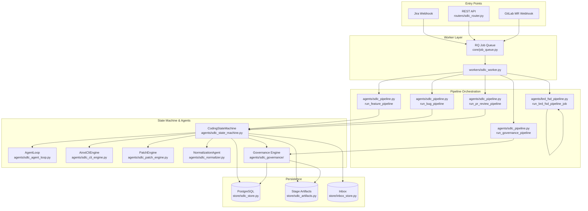
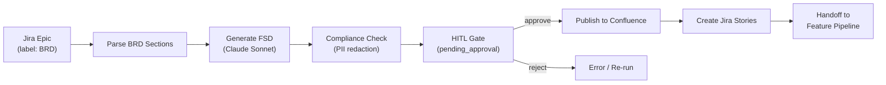
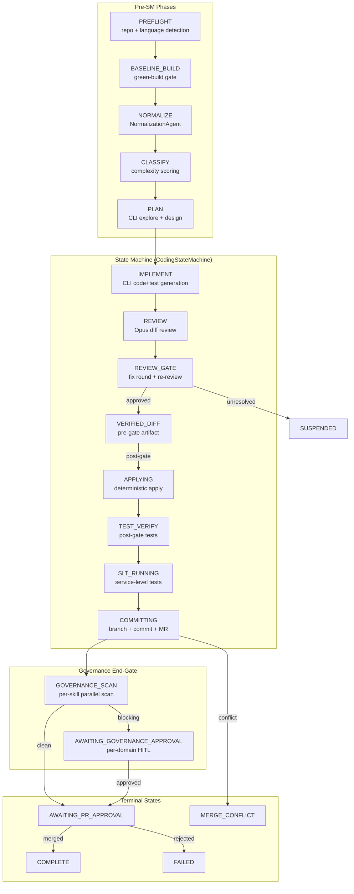
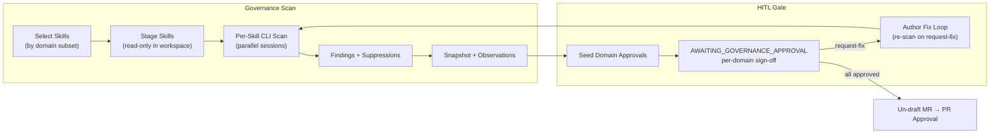
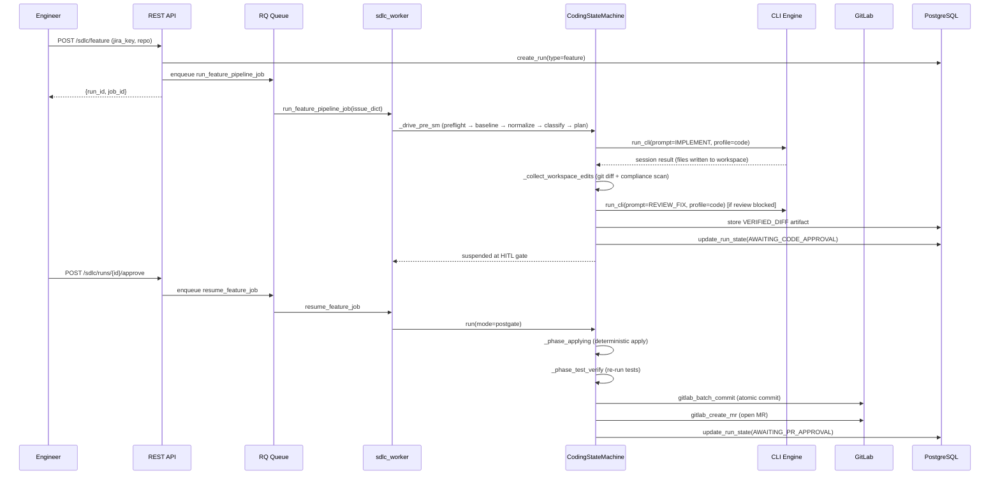
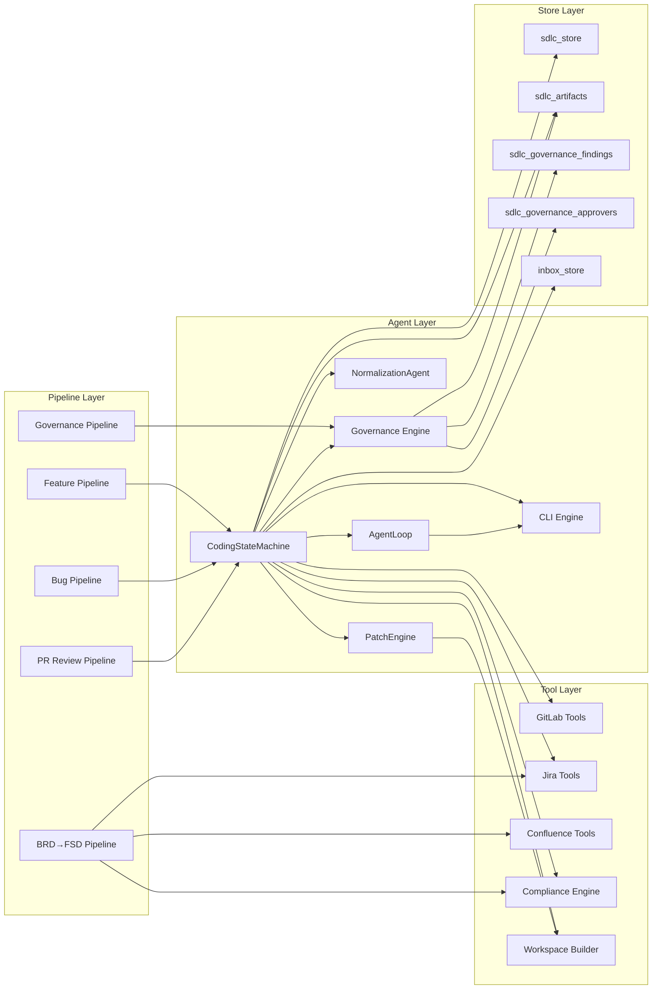
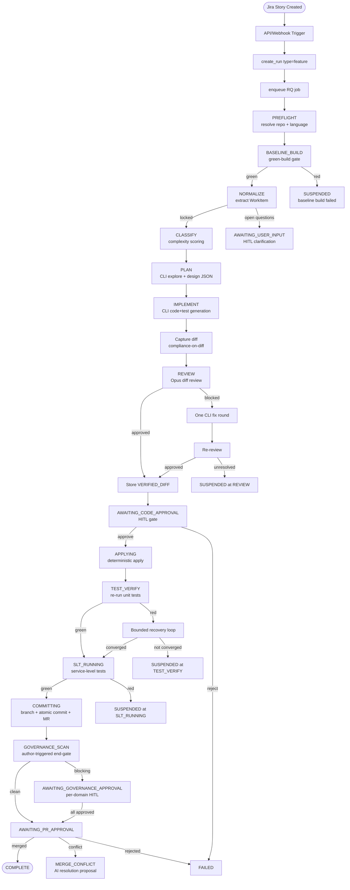

# SDLC Pipeline Agents

## Introduction

The **SDLC Pipeline Agents** module is the autonomous software-delivery engine of the AiNxt platform. It orchestrates the full AI-driven engineering lifecycle — from Jira ticket intake through code generation, review, governance scanning, and merge-request creation — using a multi-stage state machine backed by LLM-powered agents. The module encompasses the BRD→FSD document-generation pipeline, the feature/bug coding pipelines, the PR-review pipeline, and the governance-review pipeline, all coordinated through a unified worker queue and surfaced via a real-time UI.

---

## Architecture Overview



### Module Position in the System

The SDLC Pipeline Agents sit at the heart of the platform's autonomous engineering capability. It is triggered by:

- **Jira webhooks** (epics with "BRD" label, stories, bugs)
- **REST API calls** from the [sdlc_router](shared_api_routers.md) (manual triggers, approvals, resumes)
- **GitLab MR webhooks** (PR review pipeline)

It delegates to the [shared_core_sdlc_pipeline](shared_core_sdlc_pipeline.md) sub-modules for the state machine, CLI engine, governance engine, and patch engine, and persists all state through the [store_layer](store_layer.md).

---

## Core Components

### 1. BRD→FSD Pipeline (`agents/brd_fsd_pipeline.py`)

The BRD→FSD pipeline converts a Business Requirements Document (attached to a Jira Epic) into a Functional Specification Document, publishes it to Confluence, and creates Jira stories — all behind a Human-in-the-Loop (HITL) approval gate.



**Key function:** `run_brd_fsd_pipeline_job(payload)` — RQ worker entry point that instantiates `BRDFSDPipeline` and calls `run()`.

**HITL flow:**
1. `BRDFSDPipeline.run()` parses the BRD, generates the FSD via Claude, redacts soft-PII, and stores pending state in `_hitl_state` (keyed by `epic_key`).
2. An inbox notification is published for platform review.
3. `approve_brd_fsd(epic_key)` is called via `POST /sdlc/brd-fsd/{epic_key}/approve` — publishes the FSD to Confluence and creates Jira stories extracted from the FSD's user-story sections.

**Dependencies:**
- `gateway_claude.ClaudeGateway` — LLM generation
- `tools.confluence_tools` — Confluence page creation
- `tools.jira_tools` — Jira story creation
- `agents.compliance_engine` — PII redaction (non-blocking)
- `store.inbox_store` — HITL notifications

---

### 2. Feature / Bug Pipeline (`agents/sdlc_pipeline.py`)

The feature and bug pipelines are the primary autonomous coding flows. They share a common pre-state-machine phase sequence and then enter the `CodingStateMachine` for code generation, review, and commit.



**Entry points:**
- `run_feature_pipeline(issue, run_id)` — full feature pipeline
- `run_bug_pipeline(issue, run_id)` — bug-fix pipeline (re-gates at `AWAITING_SOLUTION_APPROVAL`)
- `run_pr_review_pipeline(pr, run_id)` — GitLab MR review pipeline
- `run_governance_pipeline(issue, run_id)` — standalone governance scan

**Worker entry points** (`workers/sdlc_worker.py`):
- `run_feature_pipeline_job(issue_dict)` → delegates to `run_feature_pipeline`
- `run_bug_pipeline_job(issue_dict)` → delegates to `run_bug_pipeline`
- `run_governance_pipeline_job(issue_dict)` → delegates to `run_governance_pipeline`
- `run_pr_review_pipeline_job` → delegates to `run_pr_review_pipeline`
- `resume_from_stage_job`, `resume_feature_job`, `resume_bug_job` — HITL resume handlers
- `run_governance_review_job`, `run_endgate_governance_job` — governance triggers
- `retry_commit_job`, `merge_pr_job` — post-commit operations
- `expire_stale_hitl_runs` — watchdog for abandoned HITL gates

---

### 3. CodingStateMachine (`agents/sdlc_state_machine.py`)

The `CodingStateMachine` is the persistent state machine that drives the autonomous coding lifecycle. It operates in two modes:

| Mode | Description |
|------|-------------|
| **pregate** | Generates code + tests, stores a `VERIFIED_DIFF` artifact, and STOPS at the HITL approval gate. No commit or MR. |
| **postgate** | Deterministically applies the approved `VERIFIED_DIFF`, re-verifies build/tests, and commits + opens an MR. |

**State transitions:**
```
IDLE → IMPLEMENT → REVIEW → REVIEW_GATE → [VERIFIED_DIFF] → APPLYING → TEST_VERIFY → SLT_RUNNING → COMMITTING → GOVERNANCE_SCAN → AWAITING_PR_APPROVAL
```

**Key capabilities:**
- **Per-run isolated workspace** — each run clones the working branch fresh, pinned to a base SHA for consistency across HITL resumes.
- **Multi-repo support** — editable dependency repos are staged inside `.sdlc_deps/`, with sibling MRs opened for dep changes.
- **Compliance-on-diff** — every captured diff is scanned by `compliance_engine` before reaching the approval gate.
- **Bounded agentic recovery** — operator-gated `AgentLoop` fires only in post-gate recovery contexts (red build/tests), never on the happy path.
- **Governance end-gate** — author-triggered governance scan runs after COMMITTING, re-drafting the MR for the gate duration.

---

### 4. AgentLoop (`agents/sdlc_agent_loop.py`)

The `AgentLoop` is a bounded Anthropic tool-use loop that powers the agentic recovery and exploration phases. It enforces:

- **Explicit max_rounds** with graceful suspend (no silent truncation)
- **Per-tool result-size budgeting** before context append
- **Tool-arg input validation** and abort-safe tool_result backfill
- **Oracle-driven convergence** — `run_build` / `run_tests` results determine loop exit
- **Model escalation ladder** — Sonnet workhorse → Opus escalation tier after K non-converging rounds

**Profiles:**
| Profile | Purpose | Oracle |
|---------|---------|--------|
| `explore` | Navigator: read files, grep, graph lookup, propose plan | Deterministic coverage+grounding verdict |
| `code` | Coder: propose_edit + run_build | Build green |
| `test` | Test-fixer: propose_edit + run_tests | Tests green |

---

### 5. CLI Engine (`agents/sdlc_cli_engine.py`)

The `AinxtCliEngine` wraps the external CLI binary (`run_cli`) that executes LLM-driven coding sessions. It supports:

- **Session resume** — `--resume` continues a prior session on an untouched workspace
- **Structured output** — `output_schema` enforces JSON response format
- **Budget tracking** — per-run HOD budget consumption is recorded via `sdlc_cli_budget`
- **Config from env** — `CliEngineConfig.from_env()` resolves fresh on every call

---

### 6. PatchEngine (`agents/sdlc_patch_engine.py`)

The `PatchEngine` handles surgical modifications to existing files using SEARCH/REPLACE blocks. Key features:

- **Two-tier matching** — exact substring match, then whitespace-normalized full-block match. Never silently edits the wrong region.
- **Oversized-file localization** — three-tier escalation: mechanical anchor extraction → Haiku line locator → wider windows.
- **Compile validation** — per-file syntax check in the sandbox image for supported languages (Python, JS, TS, Go, Ruby, PHP, Bash).
- **Import restoration** — `restore_missing_imports` guards against silently dropped imports during full-file regeneration.

---

### 7. Governance Engine (`agents/sdlc_governance/`)

The governance subsystem provides domain-specific security/compliance scanning:



- `engine.run_review()` — runs the governance review CLI session, fail-closed on any error
- `engine.resolve_awareness()` — PART 1 awareness (skill SKILL.md content inlined into IMPLEMENT prompts)
- `config.require_binaries()` — fail-closed when a skill references an absent binary
- `config.pin_version()` — pins governance tool versions for reproducibility

**Unified scan core:** `run_governance_scan_snapshot()` is the shared primitive used by the standalone pipeline, the end-gate, and the author remediation loop — ensuring every trigger spawns one parallel session per skill.

---

### 8. NormalizationAgent (`agents/sdlc_normalizer.py`)

Converts a raw Jira issue dict into a locked `WorkItem` with structured fields (problem_statement, acceptance_criteria, scope, constraints). Raises `open_questions` with concrete options for fields it cannot infer, enabling a HITL clarification gate before the pipeline proceeds.

---

### 9. Supporting Components

| Component | File | Purpose |
|-----------|------|---------|
| `baseline_failure_class` | `agents/sdlc_baseline_gate.py` | Classifies build failures as `diff` vs `baseline` for telemetry |
| `compute_exploration_metrics_for_run` | `agents/sdlc_metrics.py` | Whole-run exploration metrics (reads, greps, rounds, tokens) |
| `make_explore_tool_context` | `agents/sdlc_loop_tools.py` | Builds the `ToolContext` for the explore profile with read-cap enforcement |
| `execute_tool` | `agents/sdlc_coder_tools.py` | Dispatcher for coder tools (read_file, search_symbols, find_callers, find_dependencies) |
| `_env_flag` | `agents/sdlc_pipeline.py` | Boolean env-flag parser for feature gates |

---

## Data Flow



---

## Component Interaction



---

## API Surface

The SDLC pipeline is exposed through the [sdlc_router](shared_api_routers.md) with endpoints including:

| Endpoint | Method | Purpose |
|----------|--------|---------|
| `/sdlc/feature` | POST | Trigger feature pipeline |
| `/sdlc/bug` | POST | Trigger bug pipeline |
| `/sdlc/pr-review` | POST | Trigger PR review pipeline |
| `/sdlc/governance/scan` | POST | Trigger standalone governance scan |
| `/sdlc/brd-fsd` | POST | Trigger BRD→FSD pipeline |
| `/sdlc/brd-fsd/{epic_key}/approve` | POST | Approve BRD→FSD HITL gate |
| `/sdlc/runs/{id}/approve` | POST | Approve code/solution HITL gate |
| `/sdlc/runs/{id}/reject` | POST | Reject a run |
| `/sdlc/runs/{id}/resume` | POST | Resume from a suspended stage |
| `/sdlc/runs/{id}/cancel` | POST | Cancel a run |
| `/sdlc/runs/{id}/retry-commit` | POST | Retry commit after COMMIT_FAILED |
| `/sdlc/runs/{id}/governance/start` | POST | Trigger governance end-gate |
| `/sdlc/runs/{id}/stages` | GET | List run stages + artifacts |
| `/sdlc/runs/{id}/events` | GET | List run event log |
| `/sdlc/runs/{id}/governance-report` | GET | Get governance report |
| `/sdlc/stats` | GET | Pipeline statistics |
| `/sdlc/pipeline-manifest` | GET | Stage manifest for UI stepper |

---

## Frontend Integration

The [sdlc_pipeline](sdlc_pipeline.md) frontend component (`ai-ui/src/components/SDLCPipeline.jsx`) provides a real-time dashboard with:

- **Run list** with filtering by type (feature/bug/pr_review/governance) and state
- **Run detail panel** showing the `PipelineStepper` (stage progression), event log, and stage artifacts
- **Approval panels** for code/solution/governance/PR HITL gates
- **Trigger modal** for manually starting pipelines
- **Auto-polling** every 5 seconds for active runs

The `GovernanceReviewPanel` switches between an interactive approval panel (when `AWAITING_GOVERNANCE_APPROVAL`) and a read-only findings view.

---

## Dependencies

### Internal Module Dependencies

| Module | Relationship |
|--------|-------------|
| [shared_core_sdlc_pipeline](shared_core_sdlc_pipeline.md) | Contains the state machine, CLI engine, governance engine, patch engine, and pipeline orchestration |
| [store_layer](store_layer.md) | Persistence: `sdlc_store`, `sdlc_artifacts`, `sdlc_governance_findings`, `sdlc_governance_approvers`, `inbox_store` |
| [shared_api_routers](shared_api_routers.md) | REST API surface (`sdlc_router.py`) |
| [sdlc_pipeline_workers](sdlc_pipeline_workers.md) | RQ worker entry points |
| [core_infrastructure](core_infrastructure.md) | Logger, telemetry, config, circuit breaker, security validation |
| [agent_system](agent_system.md) | Parent module containing this sub-module |
| [sdlc_pipeline](sdlc_pipeline.md) | Frontend UI component |

### External Dependencies

| Dependency | Usage |
|------------|-------|
| Claude (Anthropic) | FSD generation, code review (Opus), governance scanning |
| Sonnet CLI | Code generation, test authoring, fix rounds |
| GitLab API | Branch creation, atomic commits, MR creation, diff retrieval |
| Jira API | Issue retrieval, story creation, comment posting |
| Confluence API | FSD page publishing |
| Docker / Sandbox | Build compilation, test execution, per-file syntax validation |
| PostgreSQL | Run state, artifacts, governance findings, event log |
| Redis | RQ job queue, replay log, HITL state (BRD→FSD) |

---

## Configuration

Key environment variables controlling pipeline behavior:

| Variable | Default | Purpose |
|----------|---------|---------|
| `SDLC_MAX_BUILD_ATTEMPTS` | `2` | Max auto-fix-and-retry cycles on compile failure |
| `SDLC_AGENTIC_CODER` | `false` | Enable agentic coder recovery loop (post-gate only) |
| `SDLC_AGENTIC_TEST` | `false` | Enable agentic test-fix recovery loop (post-gate only) |
| `SDLC_REUSE_RUN_WORKSPACE` | `false` | Pin run to one base commit for cross-resume consistency |
| `SDLC_IMPLEMENT_DRIVE_TESTS_GREEN` | `false` | Option 1: drive full test suite green pre-gate |
| `SDLC_IMPLEMENT_INLINE_FILES` | `false` | Inline existing file contents into IMPLEMENT prompt |
| `SDLC_SIMPLE_SKIP_REVIEW` | `false` | Skip Opus review for simple-complexity runs |
| `SDLC_GOVERNANCE_ALWAYS` | `false` | Force governance review on every run |
| `SDLC_GOVERNANCE_REQUIRE_BINARIES` | `true` | Fail-closed when a skill binary is absent |
| `SDLC_GOVERNANCE_SCAN_TURNS` | (config) | Max turns for governance scan CLI session |
| `SDLC_PATCH_FILE_CHARS` | `120000` | Character cap for patch-engine file view |
| `AINXT_KEEP_FAILED_WORKSPACE` | `0` | Preserve workspace on failure for inspection |
| `AINXT_KEEP_FAILED_BRANCH` | `0` | Preserve GitLab branch on failure |

---

## Process Flow: Feature Pipeline (End-to-End)



---

## Error Handling & Recovery

The pipeline follows a **suspend-not-fail** philosophy: generated code is durable in stage artifacts, so transient errors leave runs resumable rather than forcing full re-runs.

| Failure Mode | Recovery Strategy |
|-------------|-------------------|
| Baseline build red | SUSPENDED — operator can skip compilation or fix the repo |
| CLI max-turns / timeout | Bounded auto-continue (one resume), then salvage diff if non-empty |
| Review unresolved | One CLI fix round, then SUSPENDED with waivable VERIFIED_DIFF |
| Post-gate build red | Bounded agentic coder loop (operator-gated), then re-gate |
| Post-gate tests red | Bounded agentic test-fix loop, then SUSPENDED |
| Commit failed | COMMIT_FAILED state — retry-commit replays only COMMITTING |
| MR creation failed | AWAITING_PR_APPROVAL with no MR — manual creation or retry |
| Merge conflict | MERGE_CONFLICT state with AI resolution proposal |
| Governance scan error | SUSPENDED — fail-closed, never a silent pass |
| Empty diff at governance | SUSPENDED — unpushed changes or base/branch misresolution |
| Compliance violation | SUSPENDED at the phase that captured the diff |

---

## See Also

- [shared_core_sdlc_pipeline](shared_core_sdlc_pipeline.md) — Detailed documentation of the state machine, CLI engine, and governance sub-modules
- [sdlc_pipeline_workers](sdlc_pipeline_workers.md) — RQ worker job definitions
- [shared_api_routers](shared_api_routers.md) — REST API router documentation
- [store_layer](store_layer.md) — Persistence layer documentation
- [sdlc_pipeline](sdlc_pipeline.md) — Frontend UI component documentation
- [core_infrastructure](core_infrastructure.md) — Logging, telemetry, and configuration
- [agent_system](agent_system.md) — Parent agent framework documentation
