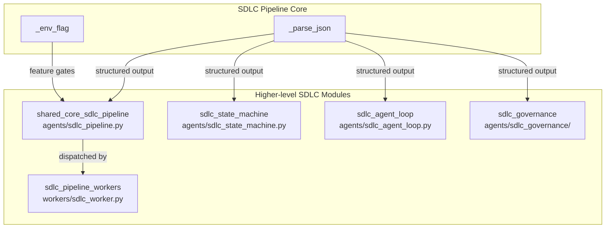
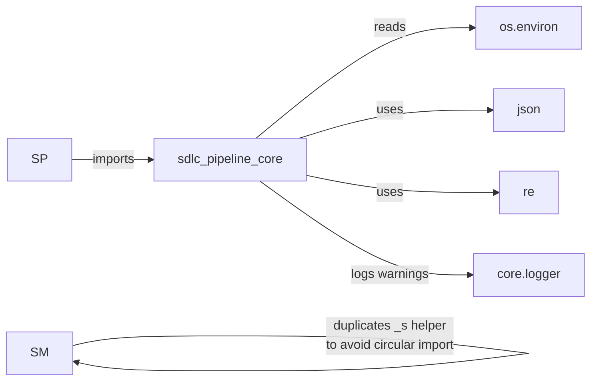
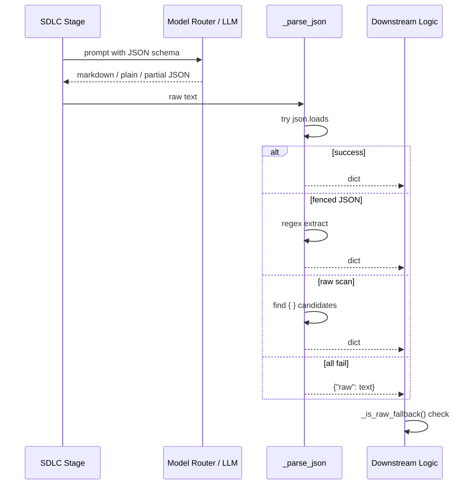

# SDLC Pipeline Core

## Brief Introduction

`sdlc_pipeline_core` is the foundational utility layer inside `agents/sdlc_pipeline.py`, the main implementation file for the AI-driven Software Development Lifecycle (SDLC) pipeline. While the full file orchestrates end-to-end feature, bug, and PR-review flows, this module isolates the two cross-cutting primitives that every stage depends on:

- **`_env_flag`** – runtime feature-gate parser for safe, redeploy-free toggles.
- **`_parse_json`** – robust JSON extractor that normalizes messy LLM output into structured dictionaries.

These utilities are intentionally small, stateless, and dependency-light so that classification, analysis, design, coding, review, and governance stages can all share a single, consistent contract for configuration and structured output parsing.

> For the orchestration layer that wires these primitives into full pipeline runs, see [shared_core_sdlc_pipeline.md](shared_core_sdlc_pipeline.md). For the worker layer that schedules SDLC jobs, see [sdlc_pipeline_workers.md](sdlc_pipeline_workers.md).

---

## Core Functionality

### 1. Runtime Feature Gating (`_env_flag`)

SDLC pipelines are long-running, multi-stage, and frequently tuned in production. `_env_flag` provides a single, auditable way to turn behaviors on or off without code changes.

```python
def _env_flag(name: str, default: bool) -> bool:
    """
    Parse a boolean env flag. Accepts 1/true/yes/on (case-insensitive) as True
    and 0/false/no/off as False; any other value (or unset) → *default*.
    """
```

**Accepted truthy values:** `1`, `true`, `yes`, `on`  
**Accepted falsy values:** `0`, `false`, `no`, `off`  
**Any other value or unset → `default`**

This forgiving parser is critical for SDLC because:

- Feature gates can be rolled back instantly by unsetting or changing an environment variable.
- Typos in ops configs do not silently flip a gate to the wrong state; the safe default is preserved.
- It is used by higher-level toggles such as `SDLC_GRAPH_CONTEXT` (dependency-slice injection) and can be reused by any new experimental stage.

### 2. LLM Output Normalization (`_parse_json`)

Most SDLC stages prompt an LLM to return structured JSON (classifications, design plans, file lists, review verdicts, etc.). Models do not always obey the format, especially on long prompts or fallback tiers. `_parse_json` turns that noise into a predictable dictionary.

```python
def _parse_json(text: str) -> dict:
    """
    Robust JSON extractor — handles plain JSON, markdown-fenced JSON, and raw {} scans.
    Falls back to {"raw": text} so callers can still access the LLM output.
    """
```

**Extraction strategy (in order):**

1. **Plain JSON parse** – try `json.loads(text)` directly.
2. **Markdown fence extraction** – match ` ```json {...} ``` ` or generic ` ``` {...} ``` ` blocks.
3. **Raw `{}` scan** – find all `{...}` substrings, try the largest three.
4. **Fallback** – return `{"raw": text}` and log a warning with the first 500 characters.

**Why this matters for SDLC:**

- Prevents a single malformed LLM response from crashing a 30-minute pipeline.
- Gives downstream stages a uniform `dict` interface; callers use `_is_raw_fallback()` to detect when no structured data was recovered.
- Preserves the original text in the fallback case so engineers can inspect or retry.

---

## Architecture & Component Relationships

`sdlc_pipeline_core` sits at the bottom of the SDLC agent stack. It has no business logic of its own; instead it supplies the configuration and parsing contracts used by the orchestration, state-machine, governance, and worker modules.



### Dependency Diagram



### Data Flow: Parsing an LLM Response



---

## How It Fits into the Overall System

The SDLC system is a multi-module pipeline that mirrors a human software-development workflow:

1. **Trigger / Router** – a Jira issue, bug report, or PR webhook creates a run.
2. **Pipeline Core (`agents/sdlc_pipeline.py`)** – runs classification, analysis, solution design, and HITL gates.
3. **Coding State Machine (`agents/sdlc_state_machine.py`)** – implements the coding/review/testing loop.
4. **Agent Loop (`agents/sdlc_agent_loop.py`)** – provides the autonomous agent runtime used by some stages.
5. **Governance (`agents/sdlc_governance/`)** – performs compliance and security reviews.
6. **Workers (`workers/sdlc_worker.py`)** – enqueue and resume pipeline jobs via `rq`.

`sdlc_pipeline_core` is the shared substrate:

- `_env_flag` lets operators tune the entire SDLC surface (graph injection, fallback event emission, prompt caps, etc.) from environment variables.
- `_parse_json` is the universal adapter between LLM text and structured stage outputs.

Because both primitives are pure functions with no side effects, they are safe to call from any thread or worker process and do not introduce circular dependencies between the larger modules.

---

## Environment Variables Controlled via `_env_flag`

The following gates are resolved through `_env_flag` inside `agents/sdlc_pipeline.py`:

| Variable | Default | Purpose |
|----------|---------|---------|
| `SDLC_GRAPH_CONTEXT` | `False` | Inject a structural dependency slice into analyst/designer prompts. |
| `SDLC_EMIT_FALLBACK_EVENTS` | `True` | Emit a run event when the model router falls back to a secondary tier. |
| `SDLC_DENYLIST_NONEDITABLE` | `True` | Enable the non-editable file deny-list for `files_to_change`. |

Additional numeric/string caps (e.g., `SDLC_LLM_PROMPT_HARD_CAP`, `SDLC_STRUCTURED_MAX_CHARS`) are read directly with `os.getenv` and documented in the parent module.

---

## Related Modules

- [shared_core_sdlc_pipeline.md](shared_core_sdlc_pipeline.md) – full orchestration file (`agents/sdlc_pipeline.py`) where these utilities are consumed.
- [sdlc_state_machine.md](sdlc_state_machine.md) – coding agent state machine.
- [sdlc_agent_loop.md](sdlc_agent_loop.md) – autonomous agent loop runtime.
- [sdlc_governance.md](sdlc_governance.md) – governance review engine.
- [sdlc_pipeline_workers.md](sdlc_pipeline_workers.md) – `rq` worker wrappers that schedule and resume pipelines.
- [core_logger.md](core_logger.md) – logging utilities used for warnings and run attribution.
- [models_model_router.md](models_model_router.md) – model routing and fallback decisions surfaced by `_emit_fallback_event_if_any`.
