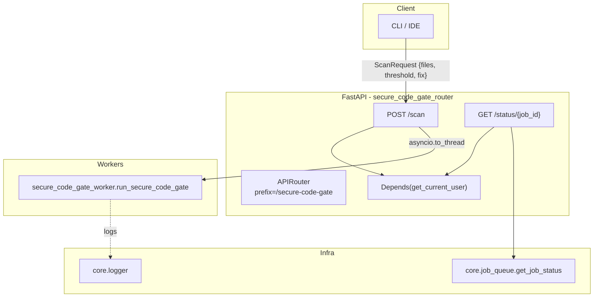
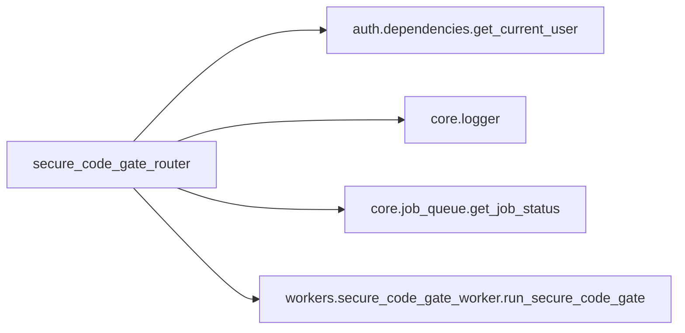
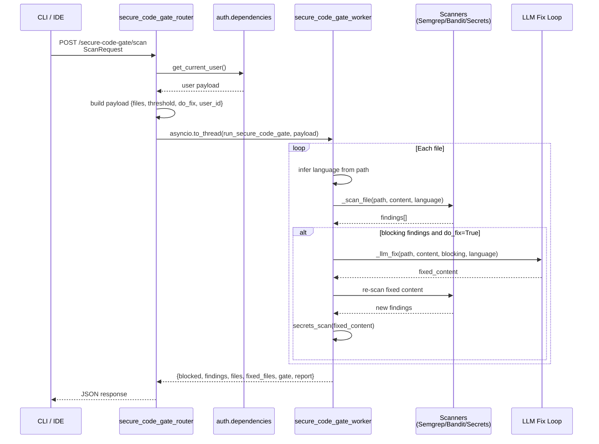
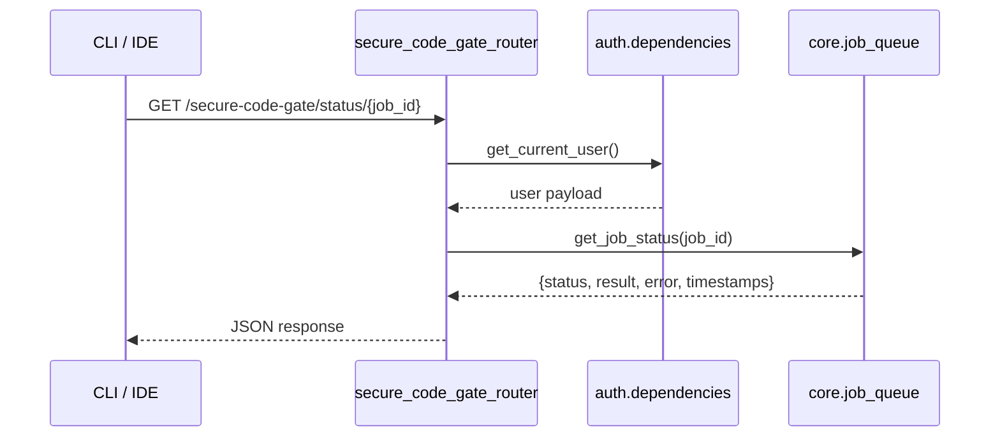
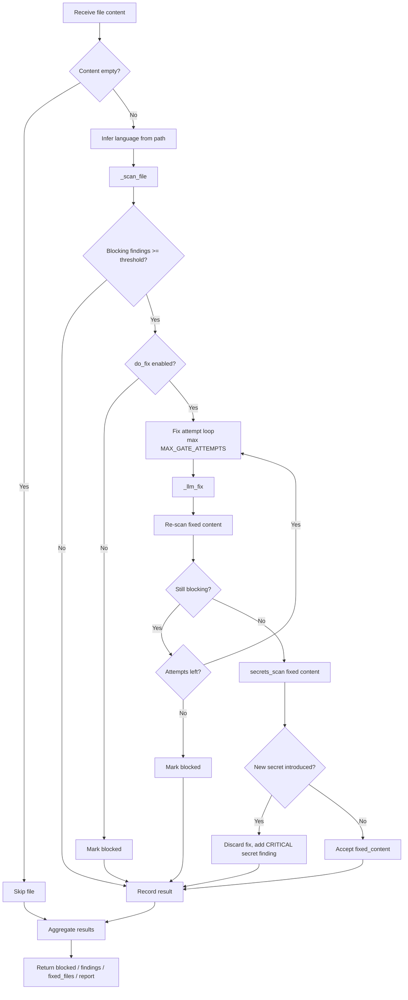
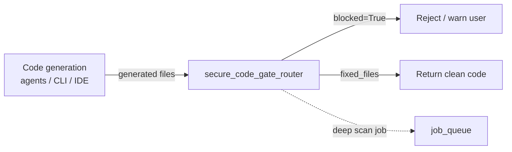

# `secure_code_gate_router`

## Brief Introduction

The `secure_code_gate_router` exposes the **generation-time SAST (Static Application Security Testing) gate** for the CLI and IDE integrations. It is mounted under `/ainxt/v1/api/secure-code-gate` and lets thin clients send source files that were just generated, receive a security scan, and—when requested—get an LLM-powered auto-fix for any blocking findings.

By keeping the scanners and the fix loop on the server, the CLI does not need local installations of Semgrep, Bandit, or secret detectors. The router is intentionally small: it validates the request, authenticates the caller, delegates all scanning/fixing work to the [secure_code_gate_worker](secure_code_gate_worker.md), and returns a structured gate result.

---

## Core Responsibilities

| Responsibility | Description |
| -------------- | ----------- |
| **Receive generated files** | Accept a list of files (`path`, `content`, optional `language`) from the CLI. |
| **Authenticate callers** | Every endpoint requires a valid JWT session, API key, or `auth_token` cookie via [auth.dependencies](auth_dependencies.md). |
| **Delegate scanning** | Hand the payload to `run_secure_code_gate` in the worker layer. |
| **Offload blocking work** | Because the fix loop may call an LLM, the scan runs in a thread pool via `asyncio.to_thread`. |
| **Poll async jobs** | Provide a status endpoint that queries the shared job queue for deep-tier / enqueued scans. |

---

## Module Architecture

### Why this shape?

- **Router stays thin**: request parsing, auth, and dispatch only. All security logic lives in the worker so it can be reused by other entry points (e.g., background jobs, the [compliance_scan_router](compliance_scan_router.md)).
- **Thread offload**: `run_secure_code_gate` is synchronous and may perform multiple LLM round-trips. Running it with `asyncio.to_thread` prevents blocking the event loop.
- **Shared job queue**: the `/status/{job_id}` endpoint reuses the platform-wide [job_queue](job_queue.md) so deep-tier scans can be polled consistently with other long-running tasks.

---

## Core Components

### `GateFile` (Pydantic model)

Represents a single file submitted for scanning.

| Field | Type | Description |
| ----- | ---- | ----------- |
| `path` | `str` | Relative or absolute file path (used for language inference and reporting). |
| `content` | `str` | Full source code of the file. |
| `language` | `Optional[str]` | Optional language hint (e.g., `python`, `javascript`). |

### `ScanRequest` (Pydantic model)

The request body accepted by `POST /scan`.

| Field | Type | Default | Description |
| ----- | ---- | ------- | ----------- |
| `files` | `list[GateFile]` | required | Files to scan. Empty files are skipped. |
| `threshold` | `Optional[float]` | `None` | CVSS-style block threshold. Falls back to the worker's environment default (typically `7.0`). |
| `fix` | `bool` | `True` | Whether to run the LLM auto-fix loop on blocking findings. |

### `scan(req: ScanRequest, current_user)`

The main scan endpoint.

1. Extracts `user_id` from the authenticated user payload.
2. Builds a plain dictionary for the worker.
3. Runs `run_secure_code_gate(payload)` off the event loop.
4. Returns the worker's result directly to the caller.

The returned payload contains:

| Field | Meaning |
| ----- | ------- |
| `blocked` | `True` if at least one file still has findings above the threshold after fixing. |
| `findings` | Aggregated list of all findings across files. |
| `files` | Per-file detail: path, findings, blocked flag, fixed content, number of fix attempts. |
| `fixed_files` | Subset of files where a clean fix was produced. |
| `gate` | Overall risk gate computed from findings. |
| `report` | Human-readable scan report. |
| `disabled` | Present when the gate is turned off via environment config. |

### `scan_status(job_id: str, current_user)`

Polls the status of an enqueued scan job. It calls [core.job_queue.get_job_status](job_queue.md) and returns RQ metadata such as `status`, `result`, `error`, and timestamps.

---

## Dependencies

| Dependency | Role in this module |
| ---------- | ------------------- |
| [auth.dependencies](auth_dependencies.md) | Validates JWT / API key / cookie and enriches the user context. |
| [core.logger](core_logger.md) | Structured logging for scan activity. |
| [core.job_queue](job_queue.md) | Provides `get_job_status` for the async status endpoint. |
| [workers.secure_code_gate_worker](secure_code_gate_worker.md) | Performs the actual SAST scan and optional LLM fix loop. |

---

## Data Flow

### Scan Request Flow

### Status Polling Flow

---

## Per-File Fix Process

The worker runs the following decision tree for every non-empty file when `do_fix=True`:

Key safety checks:

- **Attempt cap**: the loop stops after `MAX_GATE_ATTEMPTS` to avoid runaway LLM usage.
- **Secret regression test**: after a fix, the content is re-scanned for hardcoded secrets. If the fix introduced one, it is discarded and a `CRITICAL` finding is recorded.
- **Threshold override**: callers can supply a custom `threshold`; otherwise the worker's environment default is used.

---

## How It Fits into the System

The secure code gate sits at the boundary between **code generation** and **code acceptance**:

- **CLI integration**: the CLI calls `POST /scan` immediately after writing a file. If `blocked` is true, the CLI can surface the report and prevent the file from being committed or executed.
- **IDE integration**: IDE plugins can use the same endpoint to scan snippets before accepting an agent suggestion.
- **Related modules**:
  - [secure_code_gate_worker](secure_code_gate_worker.md) — the scanning/fixing engine.
  - [compliance_scan_router](compliance_scan_router.md) — broader compliance/image scanning endpoints.
  - [security_scan_worker](security_scan_worker.md) — general security scan worker used elsewhere in the platform.
  - [job_queue](job_queue.md) — shared RQ-based job status infrastructure.

---

## Security & Operational Notes

- **Authentication required**: both `/scan` and `/status/{job_id}` depend on `get_current_user`, so unauthenticated requests are rejected with HTTP 401.
- **No local tooling**: clients send only text; scanners run server-side, which keeps the CLI installer small and ensures consistent rule sets.
- **Configurable gating**: the gate can be disabled globally via `GATE_ENABLED` in the worker. When disabled, the endpoint returns `blocked=False` and `disabled=True`.
- **LLM offloading**: scan/fix work is executed in a thread pool so the async server remains responsive.
- **Audit trail**: every scan is logged with file count, finding count, blocked count, and fix count via [core.logger](core_logger.md).

---

## API Endpoints

| Method | Path | Description |
| ------ | ---- | ----------- |
| `POST` | `/ainxt/v1/api/secure-code-gate/scan` | Run a synchronous fast-tier scan with optional LLM auto-fix. |
| `GET`  | `/ainxt/v1/api/secure-code-gate/status/{job_id}` | Poll the status of an enqueued deep-tier scan job. |

---

## See Also

- [secure_code_gate_worker](secure_code_gate_worker.md)
- [auth.dependencies](auth_dependencies.md)
- [core.job_queue](job_queue.md)
- [core.logger](core_logger.md)
- [compliance_scan_router](compliance_scan_router.md)
- [security_scan_worker](security_scan_worker.md)
