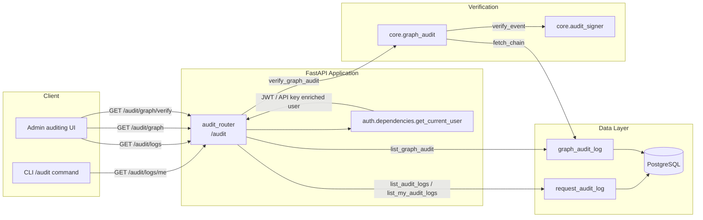
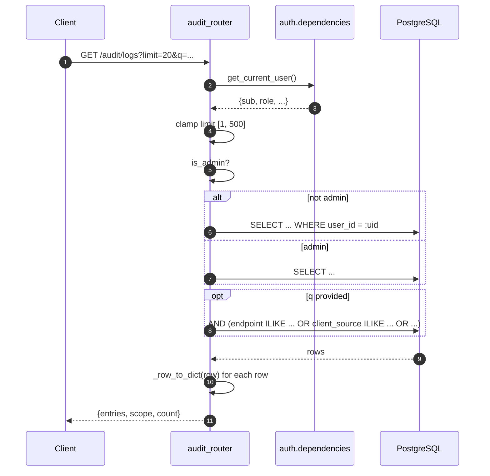
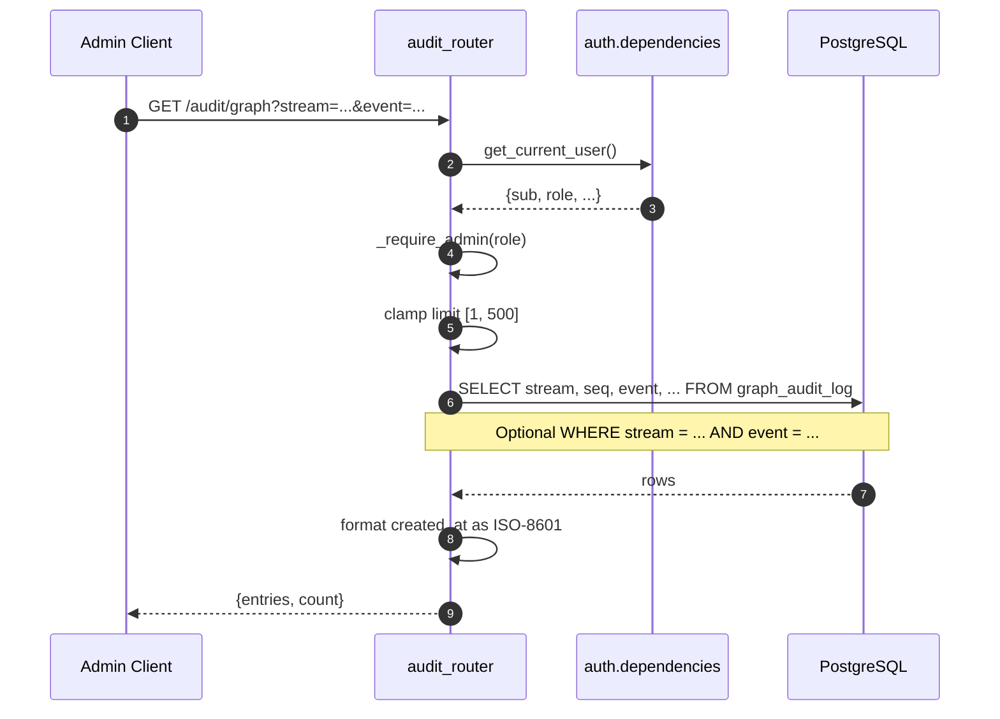
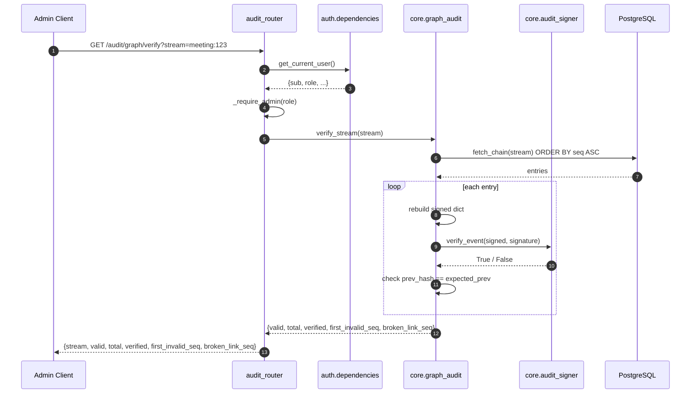

# audit_router

The `audit_router` module exposes a read-only FastAPI router mounted at `/audit`. It is the primary API surface for inspecting platform audit records: the standard `request_audit_log` (one row per user request) and the tamper-evident `graph_audit_log` used for Microsoft-boundary events.

The router is consumed by:

- The CLI `/audit` command and similar operator tooling.
- Admin auditing UIs that need cost, latency, compliance, and error summaries.
- Security workflows that verify the integrity of the Teams/Office boundary log.

## Core responsibilities

- **Self-service audit view**: Return a caller's own `request_audit_log` rows, with optional substring search.
- **Admin audit view**: Allow `role=admin` users to list any user's audit rows.
- **Graph audit listing**: Return tamper-evident boundary-log entries (hashes and counters only — no raw content).
- **Graph audit verification**: Re-verify HMAC signatures and the `prev_hash` chain for a given stream.
- **Privacy redaction**: Hide the `question_hash` column from all API responses; graph audit never stores raw transcripts.

## Architecture

## Dependencies

| Dependency | Role |
|------------|------|
| `auth.dependencies.get_current_user` | Resolves and validates the caller from JWT, API key, or cookie; enriches the payload with server-side profile data. See [auth_router](../auth/auth_router.md). |
| `db.database.get_db` / `DB_SCHEMA` | Provides a SQLAlchemy session and schema name for queries. See db_models. |
| `db.models.RequestAuditLog` | ORM model for the standard request audit table. See db_models. |
| `core.logger` | Structured logging. |
| `core.graph_audit` | Boundary-log writer and `verify_stream` helper. See core_graph_audit. |
| `core.audit_signer` | HMAC-SHA256 signing/verification primitives used by graph audit. |

## Endpoints

| Method | Path | Access | Description |
|--------|------|--------|-------------|
| `GET` | `/audit/logs` | User (own rows); Admin (all rows) | List recent request audit rows with optional substring filter. |
| `GET` | `/audit/logs/me` | User | Explicit self-scope variant of `/audit/logs`. |
| `GET` | `/audit/graph` | Admin only | List tamper-evident boundary-log entries. |
| `GET` | `/audit/graph/verify` | Admin only | Verify HMAC signatures and `prev_hash` chain for a stream. |

### Query parameters

- `limit` — clamped to `[1, 500]`; defaults to `20` for request logs and `50` for graph logs.
- `q` — optional substring search across endpoint, client source, model, error, and email (request logs only).
- `stream` / `event` — optional filters for graph audit entries.
- `stream` — required for graph verification.

## Data models

### `request_audit_log`

One immutable row per request (e.g., `/ask`, `/ide/chat`). The router maps each row to a public dictionary that omits `question_hash`.

| Field | Stored column | Public response key | Notes |
|-------|---------------|---------------------|-------|
| `created_at` | `created_at` | `ts` | ISO-8601 timestamp. |
| `request_id` | `request_id` | `request_id` | Gateway request correlation id. |
| `user_id` | `user_id` | `user_id` | JWT subject. |
| `email` | `email` | `user_email` | Enriched from profile. |
| `department` | `department` | `department` | Enriched from profile. |
| `client_source` | `client_source` | `client_source` | e.g., `platform`, `cli`, `ide-vscode`, `api`. |
| `endpoint` | `endpoint` | `endpoint` / `action` | The API path. |
| `model_used` | `model_used` | `model` | Model that served the request. |
| `tokens_in` | `tokens_in` | `tokens_in` | Input token count. |
| `tokens_out` | `tokens_out` | `tokens_out` | Output token count. |
| `cost_usd` | `cost_usd` | `cost_usd` | Estimated cost. |
| `latency_ms` | `latency_ms` | `latency_ms` | Request latency. |
| `cache_hit` | `cache_hit` | `cache_hit` | `redis`, `semantic`, or `none`. |
| `compliance_blocked` | `compliance_blocked` | `compliance_blocked` | True if blocked by guardrails. |
| `error` | `error` | `detail` | Error text, if any. |
| `question_hash` | `question_hash` | — | SHA-256 of the prompt; never returned. |

The `status` field is derived at read time:

- `blocked` if `compliance_blocked` is true.
- `error` if an error is present.
- `ok` otherwise.

### `graph_audit_log`

Tamper-evident chain for Microsoft-boundary events. The router returns the raw stored columns (hashes and counters only):

- `stream`, `seq`, `event`, `user_id`, `resource`
- `data_hash` — SHA-256 of the payload that crossed the boundary.
- `meta` — non-sensitive counters (token counts, byte sizes, model name).
- `prev_hash` — previous row's signature.
- `signature` — HMAC-SHA256 over the canonical row.
- `created_at`

Raw transcripts, summaries, and prompts are never stored. See core_graph_audit for how rows are written.

## Access control and scoping

1. `get_current_user` resolves the caller and returns a dict containing at least `sub`/`user_id`/`id` and `role`.
2. `list_audit_logs` checks `current_user["role"].lower() == "admin"`.
   - Admins: no `user_id` filter is applied.
   - Non-admins: rows are filtered to `RequestAuditLog.user_id == caller_user_id`.
3. `list_my_audit_logs` always filters to the caller's own `user_id`, even for admins.
4. `list_graph_audit` and `verify_graph_audit` call `_require_admin` and return HTTP 403 for non-admins.

## Process flows

### Listing request audit logs

### Listing graph audit logs

### Verifying a graph audit stream

## Security and privacy considerations

- **No prompt leakage**: `question_hash` is excluded from all responses. The hash proves a request occurred without exposing its content.
- **Boundary privacy**: `graph_audit_log` stores only SHA-256 `data_hash` values and small non-sensitive `meta` counters; raw transcripts, summaries, and prompts never enter the audit store.
- **Admin-only graph access**: Both listing and verification require `role=admin`.
- **Self-scope by default**: Non-admin users cannot view other users' audit rows.
- **Safe query construction**: Filters use SQLAlchemy ORM filters and parameterized raw SQL (`:stream`, `:event`, `:lim`) to avoid injection.
- **Rate/clamp limits**: `limit` is clamped to a sensible range to prevent unbounded result sets.

## Error handling

| Scenario | HTTP status | Detail |
|----------|-------------|--------|
| Missing/invalid token | 401 | Returned by `get_current_user`. |
| Non-admin accessing `/audit/graph` or `/audit/graph/verify` | 403 | "Admin role required". |
| Caller user id cannot be resolved for `/audit/logs/me` | 400 | "Could not resolve user_id from JWT". |
| Missing `stream` parameter for verification | 400 | "stream is required". |

## Integration with the broader system

- **Gateway**: The [gateway](../core/gateway.md) writes one `request_audit_log` row per `/ask`, `/ask_with_image`, `/ide/chat`, and similar request paths. The router only reads these rows.
- **Compliance / guardrails**: The `compliance_blocked` flag is set when guardrails block a request. See [compliance_router](compliance_router.md) for related batch-check and chain-verification endpoints.
- **Graph integrations**: Teams/Outlook/Graph ingest paths call `core.graph_audit.record()` to append boundary events. The router exposes those rows for verification.
- **Telemetry**: Cost, token, and latency data in `request_audit_log` also feeds platform metrics and spend reporting.

## References

- [auth_router](../auth/auth_router.md) — authentication, JWT/API-key resolution, and user enrichment.
- db_models — `RequestAuditLog` and `graph_audit_log` schema definitions.
- core_graph_audit — writing and verifying tamper-evident boundary logs.
- [gateway](../core/gateway.md) — the service that populates `request_audit_log`.
- [compliance_router](compliance_router.md) — compliance batch checks and run-audit chain verification.
