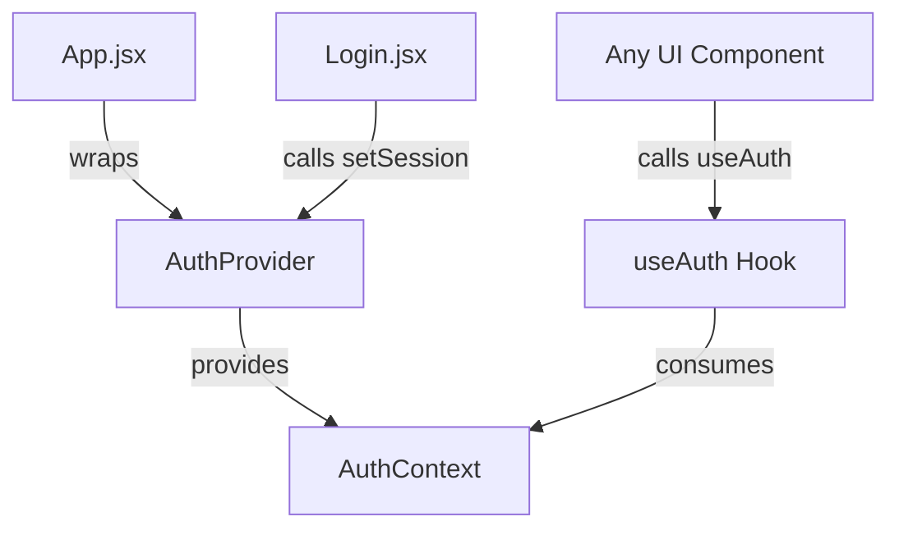
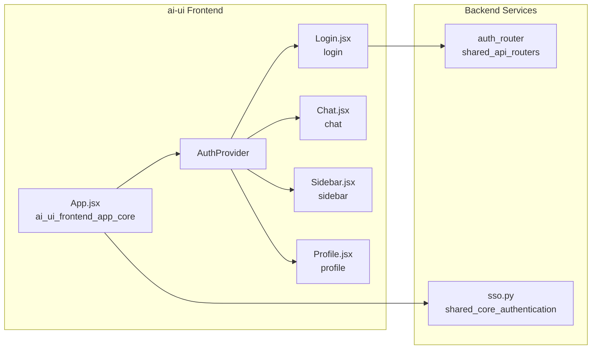
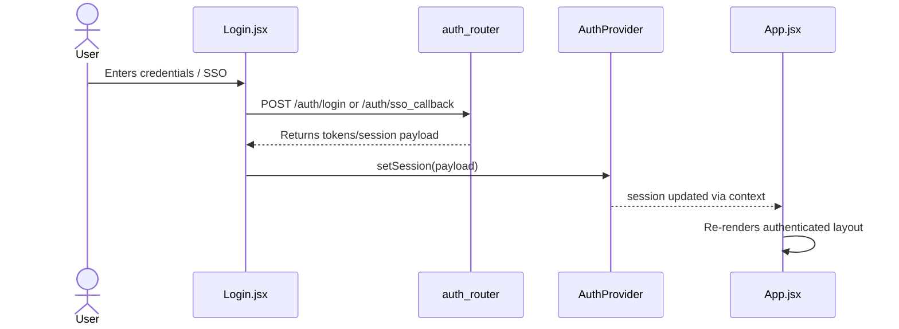
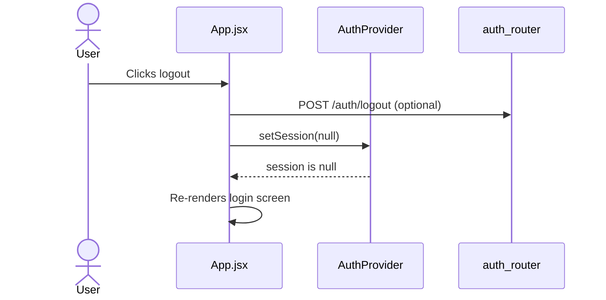
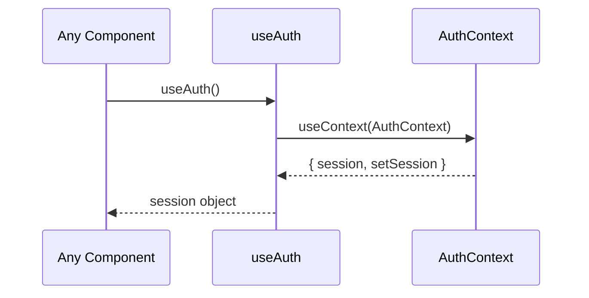
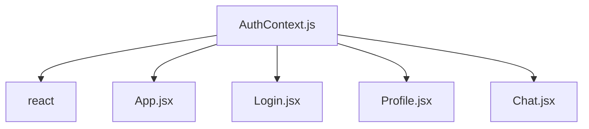
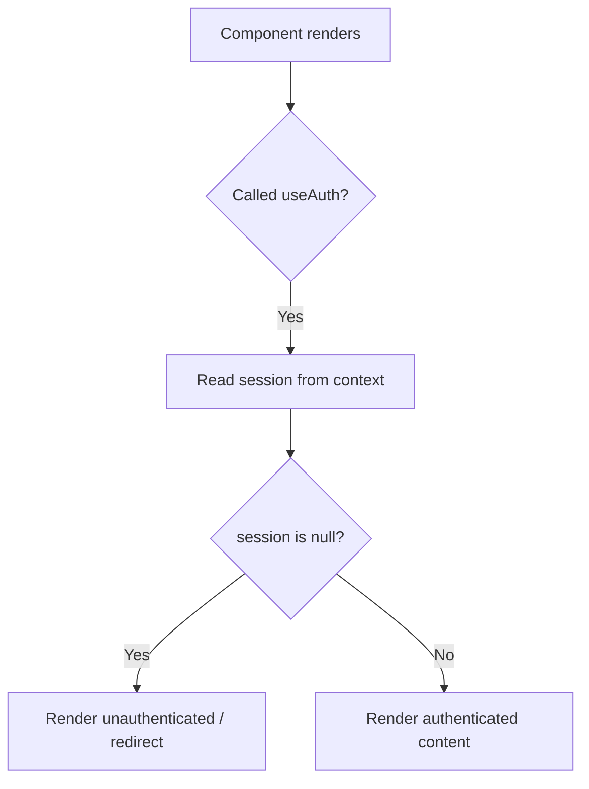
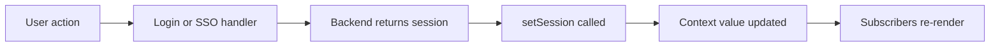

# Auth Module

## Brief Introduction

The `auth` module provides lightweight, React Context-based session state management for the `ai-ui` frontend. It exposes a minimal API consisting of an `AuthProvider` component and a `useAuth` hook, allowing descendant components to read and update the currently authenticated user session without prop drilling.

> **Important:** The session state managed by this module is intentionally **not persisted** to `localStorage`, `sessionStorage`, or cookies. It is an in-memory-only context. Any persistence, token refresh, or logout orchestration is handled by consumers such as [`App.jsx`](../ui/ai_ui_frontend_app_core.md) and the backend [`auth_router`](../api/shared_api_routers.md#auth_router).

---

## Core Responsibilities

| Responsibility | Description |
| -------------- | ----------- |
| **Session State Container** | Holds the current user/session object in React state. |
| **Context Distribution** | Makes session and setter available to the entire React tree via context. |
| **Hook API** | Provides `useAuth()` for easy consumption in functional components. |
| **Non-Persistence Boundary** | Explicitly avoids persisting credentials; consumers decide storage/refresh strategy. |

---

## Architecture

### Component Overview



### Module Placement



---

## Core Components

### `AuthProvider`

A React component that creates the authentication context and maintains the `session` state.

```javascript
export function AuthProvider({ children }) {
  const [session, setSession] = useState(null);

  return (
    <AuthContext.Provider value={{ session, setSession }}>
      {children}
    </AuthContext.Provider>
  );
}
```

| Prop | Type | Description |
| ---- | ---- | ----------- |
| `children` | `ReactNode` | The React subtree that will have access to the auth context. |

| Context Value | Type | Description |
| ------------- | ---- | ----------- |
| `session` | `any \| null` | The current user/session object. `null` indicates no active session. |
| `setSession` | `function` | Setter to update or clear the session. |

### `useAuth`

A convenience hook that returns the current auth context value.

```javascript
export function useAuth() {
  return useContext(AuthContext);
}
```

| Return Value | Description |
| ------------ | ----------- |
| `{ session, setSession }` | The current session state and its updater. |

---

## Data Flow

### Login Flow



### Logout Flow



### Session Read Flow



---

## Component Interactions

| Consumer | Interaction |
| -------- | ----------- |
| [`App.jsx`](../ui/ai_ui_frontend_app_core.md) | Wraps the application with `AuthProvider`; uses `session` to choose between login and main UI; calls `setSession(null)` on logout. |
| [`Login.jsx`](../reference/login.md) | Authenticates the user and calls `setSession()` on success. |
| [`Profile.jsx`](../reference/profile.md) | Reads `session` to display user details. |
| [`Chat.jsx`](../chat/chat.md), [`KbChat.jsx`](../knowledge/kb_chat.md) | May read `session` to scope requests or display user-specific data. |
| [`config.js`](../ai_ui_frontend_config.md) | `authFetch` and `apiFetch` may attach tokens derived from the session object. |

---

## Dependencies

### Internal Dependencies



### External Dependencies

| Package | Purpose |
| ------- | ------- |
| `react` | `createContext`, `useContext`, `useState` primitives. |

### Related Backend Modules

| Module | Relationship |
| ------ | ------------ |
| [`auth_router`](../api/shared_api_routers.md#auth_router) | Provides login, register, refresh, logout, SSO, and session management endpoints. |
| [`shared_core_authentication`](../reference/shared_core.md#authentication) | Contains RBAC, LDAP, and SSO logic used by the backend auth layer. |

---

## Process Flows

### How a Component Checks Authentication



### How Session is Established



---

## Design Notes

1. **Intentionally Minimal:** The module does not implement token storage, refresh timers, or route guards. These concerns are delegated to consumers to keep the auth context reusable and framework-agnostic.
2. **No Persistence:** The comment `// NOT persisted` in the source is a deliberate security choice. Persisting tokens is the responsibility of callers (e.g., storing a refresh token in an `httpOnly` cookie or secure storage).
3. **No Default Value:** `createContext(null)` means components calling `useAuth()` outside `AuthProvider` will receive `null`. In practice, the entire app is wrapped by `AuthProvider` in [`App.jsx`](../ui/ai_ui_frontend_app_core.md).

---

## Usage Example

```jsx
import { useAuth } from "./AuthContext";

function UserGreeting() {
  const { session } = useAuth();

  if (!session) {
    return <p>Please log in.</p>;
  }

  return <p>Welcome, {session.name}!</p>;
}
```

```jsx
import { useAuth } from "./AuthContext";

function LoginButton({ onLogin }) {
  const { setSession } = useAuth();

  const handleLogin = async (credentials) => {
    const session = await onLogin(credentials);
    setSession(session);
  };

  return <button onClick={handleLogin}>Log In</button>;
}
```

---

## References

- [`ai_ui_frontend_app_core.md`](../ui/ai_ui_frontend_app_core.md) — Application root that wraps `AuthProvider` and handles logout.
- [`login.md`](../reference/login.md) — Login screen that populates the auth session.
- [`profile.md`](../reference/profile.md) — User profile that reads the session.
- [`ai_ui_frontend_config.md`](../ai_ui_frontend_config.md) — API fetch helpers that may use session tokens.
- [`shared_api_routers.md#auth_router`](../api/shared_api_routers.md#auth_router) — Backend authentication endpoints.
- [`shared_core.md#authentication`](../reference/shared_core.md#authentication) — Backend RBAC, LDAP, and SSO implementation.
