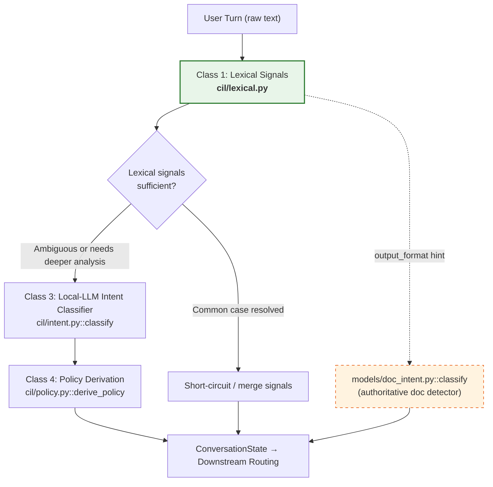
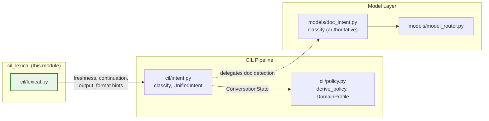
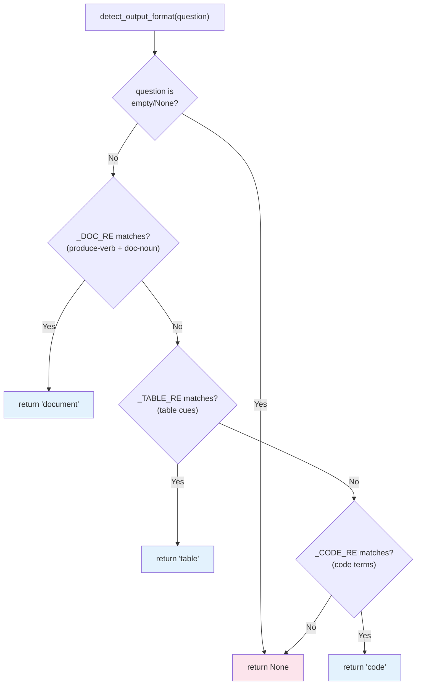
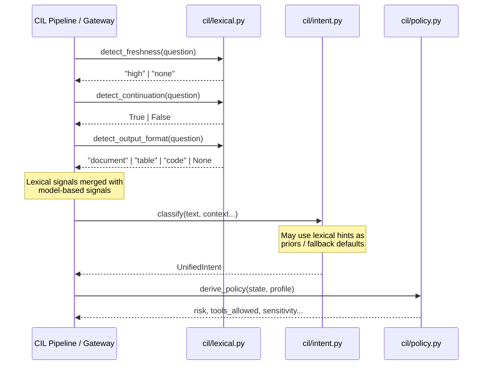
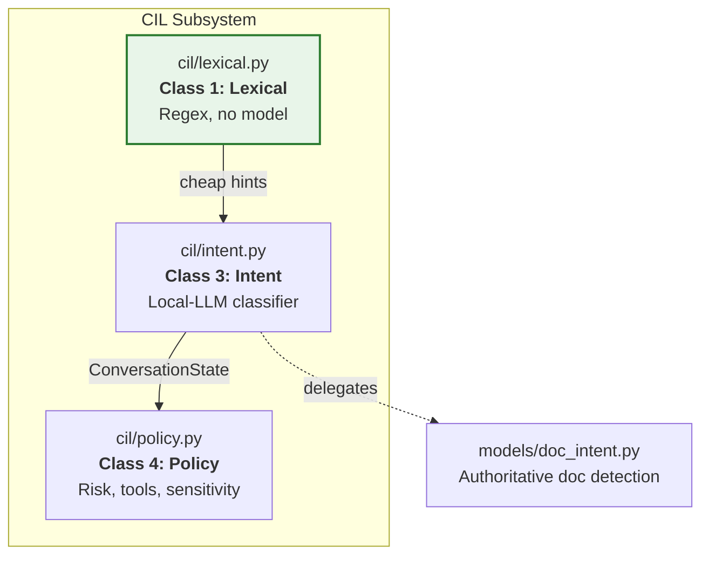
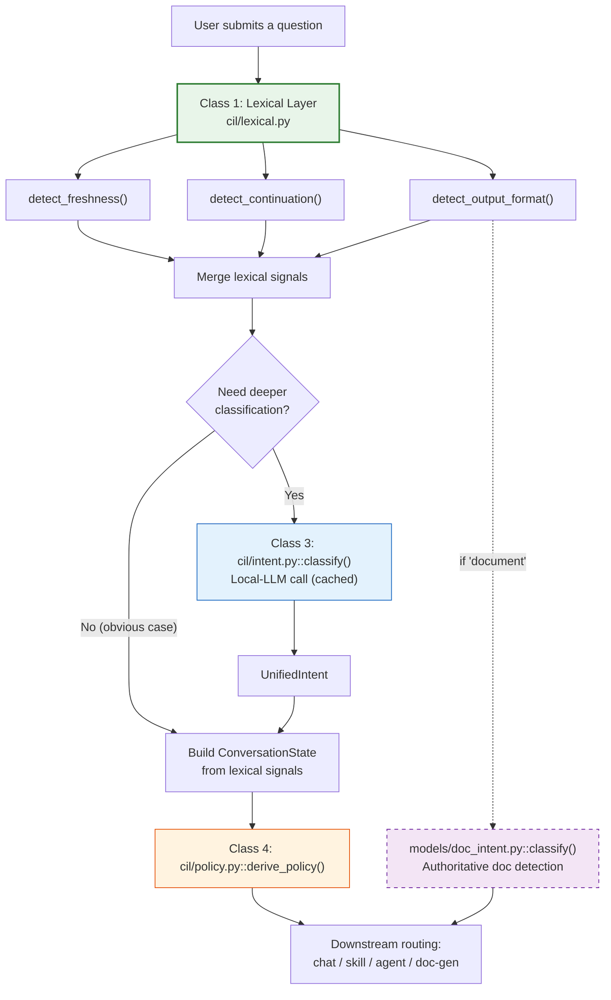

# CIL Lexical Signals (`cil_lexical`)

> **CIL Class-1 lexical prefilter** — fast, deterministic, regex-only signal extraction that resolves the common case (freshness, continuation, obvious output format) *before* any model call is made.

## 1. Introduction

The `cil_lexical` module is the first tier of the **Contextual Intent Layer (CIL)** pipeline. It inspects a user's raw question text with compiled regular expressions and returns three lightweight signals:

| Signal | Function | Return Type | Purpose |
|--------|----------|-------------|---------|
| **Freshness** | `detect_freshness` | `"high" \| "none"` | Whether the question likely needs live / up-to-date information |
| **Continuation** | `detect_continuation` | `bool` | Whether the turn opens with a discourse marker that continues the previous turn |
| **Output format** | `detect_output_format` | `"document" \| "table" \| "code" \| None` | A coarse hint about the desired response shape |

Because these signals are computed with **pure stdlib regex** — no infrastructure, no model round-trip — they are importable in a bare test environment and add negligible latency. Their role is to short-circuit the obvious cases so that the heavier Class-3 local-LLM intent classifier (see [cil_intent](cil_intent.md)) and the authoritative document detector (see models_doc_intent) are only reached when genuinely needed.

### Design Principles

- **Deterministic & side-effect free** — every function is a pure mapping from `str → signal`.
- **No model dependency** — no imports of `model_router`, Redis, Postgres, or any gateway.
- **Conservative** — signals default to neutral (`"none"`, `False`, `None`) when no regex matches; they never raise.
- **Hint, not authority** — `detect_output_format` explicitly defers to `models.doc_intent.classify` for authoritative document detection downstream.

---

## 2. Architecture

### 2.1 Position in the CIL Pipeline

The CIL pipeline is organised into numbered "classes" of signal resolution, each progressively more expensive:



### 2.2 Module Dependencies



> **Key relationship:** `cil_lexical` has **zero runtime dependencies** on other modules. It only imports `re` and `typing.Optional` from the standard library. The arrows above represent *logical data flow* — the lexical signals are consumed by [cil_intent](cil_intent.md) and potentially cross-referenced with [cil_policy](cil_policy.md), but `cil/lexical.py` itself never imports them.

---

## 3. Core Components

### 3.1 Compiled Regex Patterns

All pattern matching is performed against four module-level compiled regexes. They are compiled once at import time for performance.

| Pattern | Matches | Used By |
|--------|---------|---------|
| `_FRESHNESS_RE` | Temporal keywords: `today`, `now`, `currently`, `latest`, `recent`, `this week/month/year`, `yesterday`, `breaking`, `up-to-date`, `20XX` | `detect_freshness` |
| `_CONTINUATION_RE` | Discourse markers at the **start** of the turn: `also`, `and then`, `then`, `next`, `additionally`, `furthermore`, `plus`, `what about`, `how about`, `instead`, `actually`, `no, I meant`, `as well`, `too` | `detect_continuation` |
| `_DOC_RE` | A produce-verb (`write`, `create`, `generate`, `draft`, `make`, `prepare`) within 40 chars of a document noun (`report`, `document`, `proposal`, `letter`, `email`, `memo`, `policy`, `deck`, `presentation`, `ppt`, `spreadsheet`, `summary document`) | `detect_output_format` |
| `_TABLE_RE` | Explicit table cues: `as a table`, `in a table`, `tabular`, `table format`, `columns` | `detect_output_format` |
| `_CODE_RE` | Code-related terms: `code`, `function`, `script`, `snippet`, `implement`, `refactor`, `debug`, `regex`, `sql query` | `detect_output_format` |

### 3.2 `detect_freshness`

```python
def detect_freshness(question: str) -> str
```

**Returns:** `"high"` if any temporal keyword is found anywhere in the question, `"none"` otherwise (including for empty/`None` input).

**Semantics:** A `"high"` freshness signal tells downstream components that the answer likely requires live or recently-updated information (e.g., news, current prices, today's status). This feeds into `UnifiedIntent.freshness_need` in [cil_intent](cil_intent.md), which in turn influences retrieval and tool-need decisions.

### 3.3 `detect_continuation`

```python
def detect_continuation(question: str) -> bool
```

**Returns:** `True` if the question **starts with** (after optional whitespace) a continuation discourse marker, `False` otherwise.

**Semantics:** Continuation detection helps the conversation engine decide whether to carry forward context from the previous turn. A turn like `"also, what about the API limits?"` is flagged as a continuation, which can suppress unnecessary re-clarification and maintain conversational flow. This maps to `UnifiedIntent.is_continuation` in [cil_intent](cil_intent.md).

### 3.4 `detect_output_format`

```python
def detect_output_format(question: str) -> Optional[str]
```

**Returns:** One of `"document"`, `"table"`, `"code"`, or `None` (no confident lexical signal).

**Evaluation order matters** — an explicit document request outranks a code mention:



> **Important:** This function is a **coarse pre-LLM prefilter only**. The authoritative document detector is `models.doc_intent.classify` (see models_doc_intent), which uses a local LLM with deterministic vetoes. The lexical hint simply provides a cheap CIL signal without a model call — for example, `"write a report about the code"` correctly returns `"document"` (not `"code"`) because the document regex is checked first.

---

## 4. Data Flow

### 4.1 Signal Extraction Flow



### 4.2 Signal Consumption

The three lexical signals are consumed by downstream CIL components in different ways:

| Lexical Signal | Downstream Consumer | Field in `UnifiedIntent` | Effect |
|---------------|--------------------|--------------------------|--------|
| `detect_freshness` → `"high"` | [cil_intent](cil_intent.md) | `freshness_need` | Increases likelihood of live-data retrieval / tool use |
| `detect_continuation` → `True` | [cil_intent](cil_intent.md) | `is_continuation` | Preserves prior-turn context; may suppress clarification |
| `detect_output_format` → `"document"` | [cil_intent](cil_intent.md) + models_doc_intent | `output_format` / `doc_intent` | Routes toward document generation pipeline |
| `detect_output_format` → `"table"` | [cil_intent](cil_intent.md) | `output_format` | Shapes response formatting |
| `detect_output_format` → `"code"` | [cil_intent](cil_intent.md) | `output_format` | Shapes response formatting |

---

## 5. Relationship to Other CIL Modules

The CIL subsystem is composed of three sibling modules under `cil/`:



- **[cil_intent](cil_intent.md)** — The Class-3 local-LLM intent classifier. Produces a `UnifiedIntent` dataclass with `freshness_need`, `is_continuation`, `output_format`, `route`, `doc_intent`, and style/persona signals. Lexical signals serve as fast priors or fallback defaults when the model is unavailable.
- **[cil_policy](cil_policy.md)** — The Class-4 policy derivation layer. Consumes a `ConversationState` (built from `UnifiedIntent`) and a `DomainProfile` to derive risk level, clarification needs, sensitivity, and allowed tools.
- **models_doc_intent** — The authoritative document-intent classifier. Uses a local LLM with deterministic vetoes to decide whether a turn should route to the document-generation pipeline. `detect_output_format` provides only a cheap hint; `models.doc_intent.classify` is the final arbiter.

---

## 6. Process Flow: End-to-End Turn Classification

The following diagram shows how a single user turn flows through the lexical layer and into the broader CIL pipeline:



---

## 7. Design Notes & Constraints

### 7.1 Why Regex-Only?

The module header references `docs/architecture/05-semantic-understanding.md §5.3`. The rationale is a **cost ladder**: resolve the common case with the cheapest possible mechanism (regex), so the expensive local-LLM call (Class 3, measured at ~2.3s in production per [cil_intent](cil_intent.md)) is reached only when genuinely needed.

### 7.2 No False Authority

`detect_output_format` is deliberately documented as a "coarse pre-LLM prefilter only." The platform rule is that **regex never makes the final routing decision for document generation** — that authority belongs to `models.doc_intent.classify`, which combines LLM reasoning with deterministic vetoes (artifact-signal checks, attachment vetoes). See models_doc_intent for details.

### 7.3 Ordering Sensitivity

The evaluation order in `detect_output_format` is intentional:

1. **Document** first — `"write a report about the code"` should be treated as a document request, not a code request.
2. **Table** second — explicit table formatting cues are unambiguous.
3. **Code** last — code-related terms are common and less specific.

### 7.4 Graceful Degradation

All three functions handle empty/`None` input without raising:

| Input | `detect_freshness` | `detect_continuation` | `detect_output_format` |
|-------|---------------------|----------------------|------------------------|
| `None` | `"none"` | `False` | `None` |
| `""` | `"none"` | `False` | `None` |
| No match | `"none"` | `False` | `None` |

This ensures the lexical layer can never crash the pipeline — a critical property since it runs on every user turn.

---

## 8. API Reference Summary

```python
from cil.lexical import detect_freshness, detect_continuation, detect_output_format

# Freshness: temporal keyword detection
detect_freshness("What's the latest news today?")   # → "high"
detect_freshness("Explain quantum computing.")       # → "none"

# Continuation: discourse marker at start of turn
detect_continuation("also, what about pricing?")     # → True
detect_continuation("What is quantum computing?")    # → False

# Output format: coarse response-shape hint
detect_output_format("write a report on Q3 earnings")  # → "document"
detect_output_format("show results in a table")        # → "table"
detect_output_format("write a function to sort a list") # → "code"
detect_output_format("What is the capital of France?")  # → None
```

---

## 9. Related Documentation

| Module | Relationship |
|--------|-------------|
| [cil_intent](cil_intent.md) | Class-3 local-LLM intent classifier; consumes lexical signals as priors/fallbacks |
| [cil_policy](cil_policy.md) | Class-4 policy derivation; consumes `ConversationState` built from `UnifiedIntent` |
| models_doc_intent | Authoritative document-intent classifier; `detect_output_format` defers to this |
| [model_routing](../llm/model_routing.md) | Model router used by `cil/intent.py` and `models/doc_intent.py` for LLM calls |
