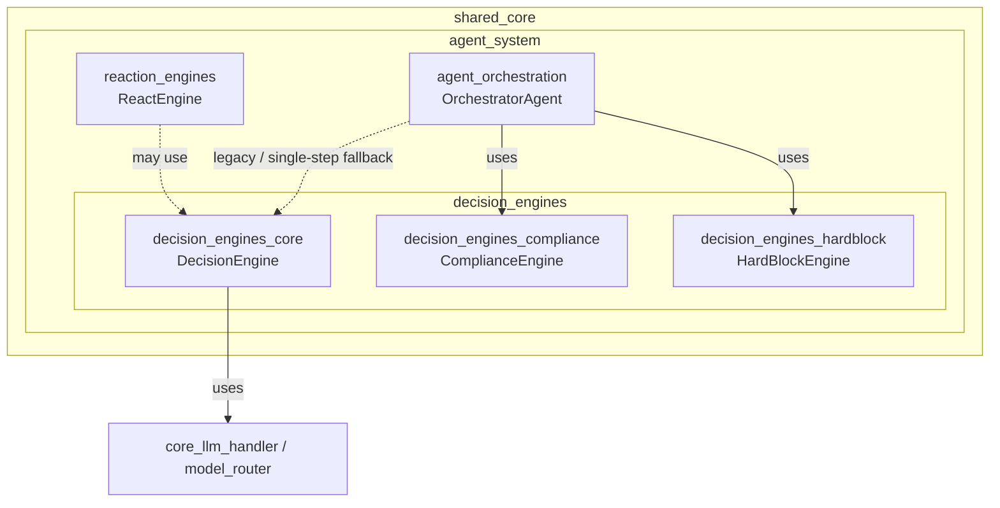
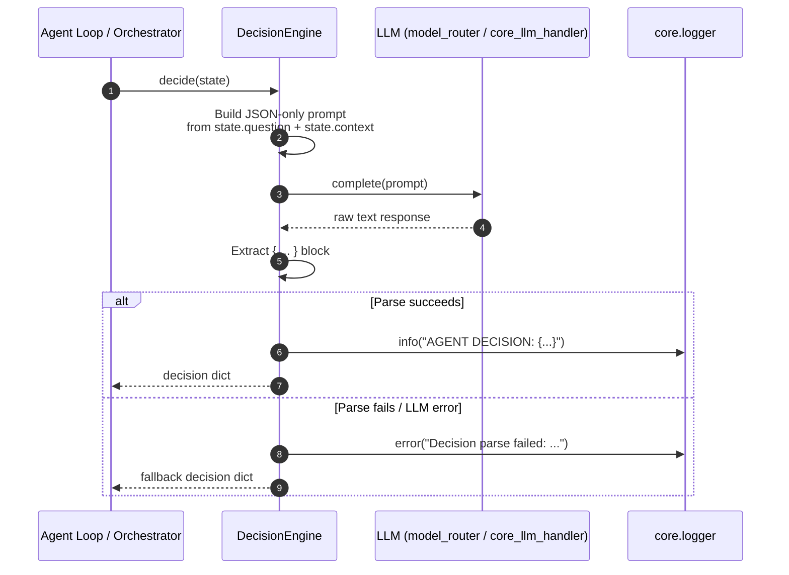
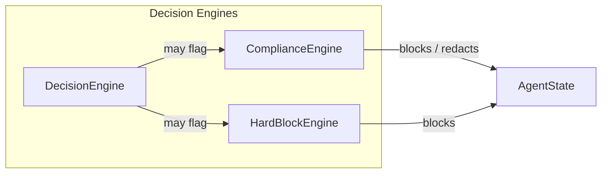
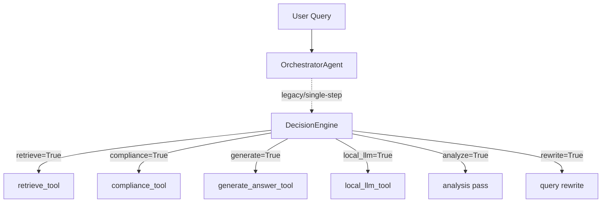
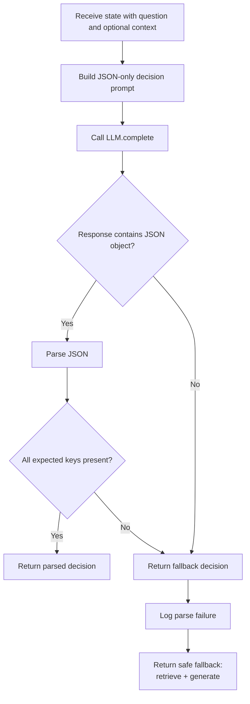
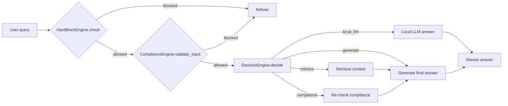

# Decision Engines Core

## Brief Introduction

The `decision_engines_core` module provides the foundational LLM-based decision capability for the agent system. Its primary component, `DecisionEngine`, is responsible for determining which high-level tools or actions an autonomous agent should invoke for a given user question. It emits a structured, boolean decision map covering actions such as retrieval, analysis, compliance checking, local-LLM fallback, rewriting, and final answer generation.

This module is part of the broader **Decision Engines** family within the [agent_system](../agents/agent_system.md). It focuses specifically on *action selection* via a lightweight JSON contract, while policy enforcement and safety decisions are delegated to sibling modules:

- [decision_engines_compliance](../security/decision_engines_compliance.md) — PCI/PII detection, redaction, and blocking.
- [decision_engines_hardblock](decision_engines_hardblock.md) — keyword-based hard-block guardrails.

> **Note:** In the current architecture, the main production orchestration path uses `OrchestratorAgent.plan()` and `OrchestratorAgent.decide()` (see [agent_system](../agents/agent_system.md)) for multi-step planning. `DecisionEngine` remains a focused, reusable primitive for single-step tool selection and is retained for backward compatibility and lightweight agent loops.

---

## Architecture

### Module Position

`decision_engines_core` sits in the `shared_core` layer under the agent system. It consumes an LLM interface and a `state` object, and produces a deterministic JSON decision map. It has no direct database, storage, or network dependencies beyond the injected LLM client.



### Component Overview

| Component | File | Responsibility |
|-----------|------|----------------|
| `DecisionEngine` | `agents/decision_engine.py` | Uses an LLM to decide which tools/actions to activate for a question. Returns a boolean map. |

---

## Core Component: `DecisionEngine`

### Purpose

`DecisionEngine` answers the question: *"Given the user's question and any available context, which tools should the agent run?"* It does this by prompting an LLM to return a JSON object where each key represents a tool and the value is a boolean flag.

### Supported Decision Flags

| Flag | Meaning |
|------|---------|
| `rewrite` | Rewrite or reformulate the query before further processing. |
| `retrieve` | Perform semantic/keyword retrieval to gather context. |
| `analyze` | Run an analysis pass over existing context. |
| `compliance` | Run compliance/PCI checks on the content. |
| `local_llm` | Use a local LLM for a lightweight answer. |
| `generate` | Produce the final generated answer. |

### Constructor

```python
DecisionEngine(llm)
```

- `llm`: An object implementing a `complete(prompt: str) -> str` method. In practice this is often a wrapper around the [model_router](../llm/model_routing.md) or a direct LLM client from [core_llm_handler](../llm/core_llm_handler.md).

### Main Method

```python
decide(state) -> dict
```

- `state`: An object expected to expose at least:
  - `state.question` — the user query.
  - `state.context` — optional already-gathered context (truthy check).
- Returns a `dict` of boolean flags.

### Behavior

1. Builds a strict JSON-only prompt containing the available tools, the question, and whether context is present.
2. Calls `llm.complete(prompt)`.
3. Extracts the first `{...}` block from the response and parses it with `json.loads`.
4. Logs the parsed decision.
5. On any parse or LLM failure, returns a safe fallback decision:

```python
{
    "rewrite": False,
    "retrieve": True,
    "analyze": False,
    "compliance": False,
    "local_llm": False,
    "generate": True
}
```

This fallback biases toward retrieving context and then generating an answer, which is the safest default for most agent loops.

---

## Data Flow



### Decision Prompt Structure

The prompt sent to the LLM is intentionally constrained:

```text
You are an autonomous code assistant agent.

Decide which tools to use.

Return ONLY JSON.

Available tools:
- rewrite
- retrieve
- analyze
- compliance
- local_llm
- generate

Question:
{state.question}

Context available: YES/NO

JSON format:
{
 "rewrite": true/false,
 "retrieve": true/false,
 "analyze": true/false,
 "compliance": true/false,
 "local_llm": true/false,
 "generate": true/false
}
```

The `Context available` signal helps the LLM decide whether retrieval is necessary.

---

## Component Interaction

### Within the Decision Engines Family



- `DecisionEngine` selects *which* tools to run.
- `ComplianceEngine` and `HardBlockEngine` decide *whether* content is safe to process.
- In production, the orchestrator typically runs compliance/hardblock checks before invoking the planner/decision engine.

### With the Agent System



For the full multi-step planning flow, see [agent_system](../agents/agent_system.md).

---

## Process Flows

### Single-Step Decision Flow



### Integration in a Minimal Agent Loop



---

## Dependencies

### Direct Dependencies

| Dependency | Module | Purpose |
|------------|--------|---------|
| `core.logger` | [core_infrastructure](../core/core_infrastructure.md) | Structured logging for decisions and parse failures. |
| `llm` (injected) | [core_llm_handler](../llm/core_llm_handler.md) / [model_routing](../llm/model_routing.md) | Provides `complete(prompt)` for decision generation. |

### Runtime Dependencies

- The `state` object passed to `decide()` must expose `question` and `context` attributes. The exact class is not defined in this module; it is typically `AgentState` from the agent loop.

### Sibling Modules

| Module | Relationship |
|--------|--------------|
| [decision_engines_compliance](../security/decision_engines_compliance.md) | Sibling policy engine for PCI/PII. `DecisionEngine` may emit `compliance: true` to trigger it. |
| [decision_engines_hardblock](decision_engines_hardblock.md) | Sibling safety engine. Usually run before decision-making. |
| [agent_system](../agents/agent_system.md) | Parent module. `OrchestratorAgent` supersedes `DecisionEngine` for production multi-step planning. |

---

## Error Handling & Resilience

| Scenario | Behavior |
|----------|----------|
| LLM call raises | Caught, logged, fallback decision returned. |
| Response is not valid JSON | Caught, logged, fallback decision returned. |
| JSON missing expected keys | Caught by generic exception handler, fallback returned. |
| Empty or malformed state | Depends on prompt rendering; any exception triggers fallback. |

The fallback decision is conservative: it always attempts retrieval and generation, ensuring the agent can still produce a useful answer even when the decision LLM fails.

---

## Configuration & Tuning

`DecisionEngine` itself has no external configuration. Tuning is indirect:

- **Prompt engineering**: The decision prompt is hardcoded. Changes to tool availability or decision semantics require editing `agents/decision_engine.py`.
- **LLM selection**: The injected `llm` object determines model quality, latency, and cost. For low-latency routing, a fast/cheap model is recommended.
- **Fallback behavior**: The fallback map is hardcoded and can be adjusted if a different safe default is desired.

---

## References

- [agent_system](../agents/agent_system.md) — Overall agent framework and orchestration.
- [decision_engines_compliance](../security/decision_engines_compliance.md) — PCI/PII compliance engine.
- [decision_engines_hardblock](decision_engines_hardblock.md) — Hard-block guardrails.
- [core_llm_handler](../llm/core_llm_handler.md) — LLM client abstraction.
- [model_routing](../llm/model_routing.md) — Model selection and routing.
