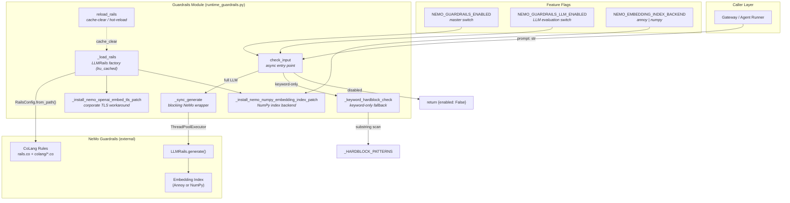
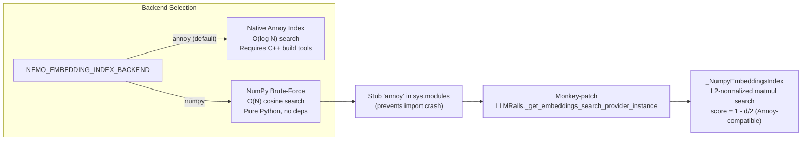
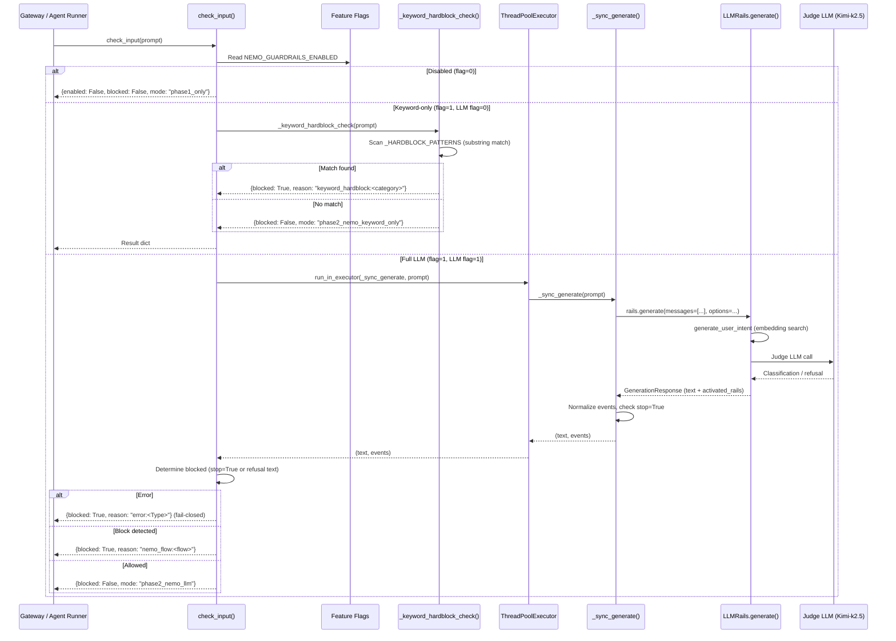
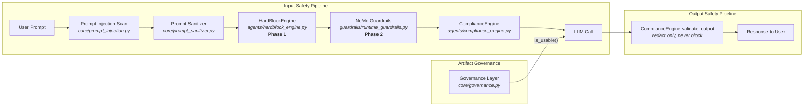
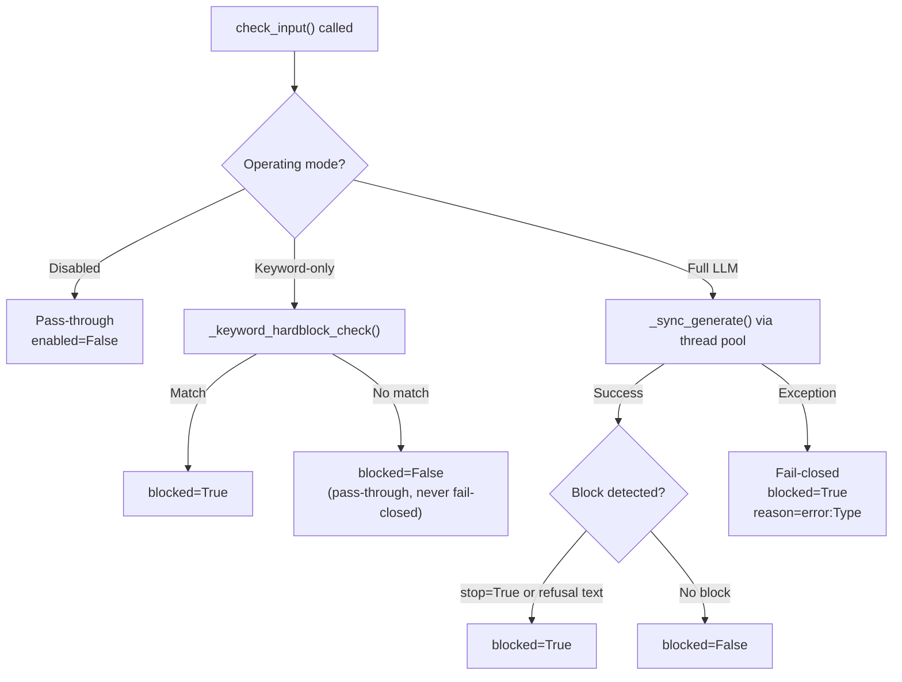

# Guardrails Module

## Overview

The **Guardrails** module (`guardrails/runtime_guardrails.py`) provides runtime input-safety evaluation for the AiNxt platform. It is built on top of [NVIDIA NeMo Guardrails](https://github.com/NVIDIA/NeMo-Guardrails) and implements a configurable, multi-tier policy enforcement layer that inspects user prompts *before* they reach the LLM. The module supports three operating modes — fully disabled, keyword-only hardblock, and full LLM-backed CoLang evaluation — controlled by two environment-variable feature flags. This design enables gradual rollout: deterministic keyword blocking can be activated first (no API key required), and the more sophisticated LLM-as-judge evaluation can be enabled separately once the infrastructure is ready.

The module is part of the broader `shared_integrations` package and is consumed by the gateway and agent execution layers. It complements — but does not replace — the Phase 1 `HardBlockEngine` (deterministic confidence-scored keyword blocking) and the `ComplianceEngine` (PII/PCI redaction and blocking). Together, these form a layered defense-in-depth strategy for prompt safety.

---

## Architecture



### Operating Modes

The module's behavior is governed by a two-flag matrix:

| `NEMO_GUARDRAILS_ENABLED` | `NEMO_GUARDRAILS_LLM_ENABLED` | Mode | Behavior |
|:---:|:---:|---|---|
| `0` (default) | any | **Disabled** (`phase1_only`) | Returns immediately with `enabled=False`. No I/O performed. The `nemoguardrails` package is not required. All blocking delegated to `HardBlockEngine`. |
| `1` | `0` (default) | **Keyword-only** (`phase2_nemo_keyword_only`) | Runs `_keyword_hardblock_check()` — a lightweight substring scan against `_HARDBLOCK_PATTERNS`. No outbound HTTP, no LLM call, no CoLang evaluation. CoLang rules in `rails.co` are **not** invoked. |
| `1` | `1` | **Full LLM** (`phase2_nemo_llm`) | Calls `rails.generate()` via a dedicated thread pool. Full CoLang flow evaluation with LLM-as-judge. Requires `OPENAI_API_KEY` and the `nemoguardrails` package. **Fails closed** on errors. |

---

## Core Components

### `check_input(prompt: str) -> Dict[str, Any]`

The primary async entry point. Accepts a user prompt string and returns a standardized result dictionary:

```python
{
    "enabled":       bool,           # Whether guardrails evaluation ran
    "blocked":       bool,           # Whether the prompt was blocked
    "reason":        str | None,     # Block reason (e.g. "nemo_flow:block criminal justice")
    "raw":           str | None,     # Raw NeMo response text (LLM mode only)
    "mode":          str,            # "phase1_only" | "phase2_nemo_keyword_only" | "phase2_nemo_llm"
    "category":      str | None,     # Keyword category (keyword-only mode)
    "events":        list[dict],     # NeMo activated-rail events (LLM mode only)
    "matched_flow":  str | None,     # CoLang flow that triggered the block (LLM mode only)
}
```

**Key design decisions:**

- **Async-safe**: The blocking `rails.generate()` call is offloaded to a bounded `ThreadPoolExecutor` (max 4 workers, prefix `nemo-rails`) so the uvicorn event loop is never blocked.
- **Authoritative block signal**: In LLM mode, a block is recorded only when an activated input rail has `stop=True` — meaning the CoLang flow explicitly reached its `bot refuse_*` / `stop` step. A bare `StartInputRail` event with `stop=False` (rail merely began evaluating) does **not** count as a block. This prevents false positives caused by silent failures in `generate_user_intent` (e.g., missing `annoy` extension).
- **Fallback refusal detection**: If NeMo doesn't surface flow events (older builds), the response text is scanned for refusal markers like `"i cannot help"`, `"request was blocked"`, etc.
- **Fail-closed (LLM mode only)**: If `rails.generate()` raises an exception, the result is `blocked=True` with `reason="error:<ExceptionType>"`. Keyword-only mode never fails closed — a keyword miss is a pass-through.

### `_sync_generate(prompt: str) -> tuple[str, list[dict]]`

Blocking wrapper around `rails.generate()`. Must be called inside a thread pool (never directly from an async context). Returns a `(text_response, events)` tuple.

**NeMo 0.21 API contract:**
- Uses `messages=[{"role": "user", "content": prompt}]` form (not the legacy `prompt=` form, which does not drive dialog/intent rails).
- Passes `GenerationOptions(log=GenerationLogOptions(activated_rails=True, llm_calls=True, internal_events=True))` to surface the internal trace.
- The return type is `GenerationResponse` (pydantic model) with `.response`, `.log.activated_rails`, `.log.llm_calls`.
- Events are normalized to `list[dict]` with keys `{type, flow, intent, stop, decisions}` so downstream consumers don't need to know about `GenerationResponse` internals.

**Diagnostic logging**: When the judge LLM is called but returns empty content, the raw prompt/completion exchange is logged at WARNING level — the single most-requested diagnostic when running NeMo against a non-OpenAI judge model (Kimi-k2.5, vLLM, Ollama proxies).

### `_load_rails() -> LLMRails`

Lazily constructs and caches (via `@lru_cache(maxsize=1)`) the `LLMRails` instance from local CoLang/config files. Called only in full LLM mode.

**Initialization sequence:**
1. Validates `OPENAI_API_KEY` is present (raises `ValueError` if missing).
2. Discovers all `*.co` files under the `guardrails/` directory tree via `glob` (confirms the full enhanced CoLang rule set is loaded).
3. Installs the NumPy embedding index patch (if `NEMO_EMBEDDING_INDEX_BACKEND=numpy`).
4. Installs the corporate TLS workaround for the OpenAI embedding provider.
5. Calls `RailsConfig.from_path()` with the `guardrails/` root directory (NeMo uses `os.walk` to discover all `*.co` files recursively).
6. Expands `${VAR}` placeholders in `config.yml` model definitions using the current process environment.
7. Constructs `LLMRails(config)`.
8. Runs a **startup probe** — force-builds the `user_message_index` to catch backend/TLS/model-config errors at startup rather than as mysterious runtime false-positive blocks.

### `_keyword_hardblock_check(prompt: str) -> Dict[str, Any]`

Lightweight substring scan against `_HARDBLOCK_PATTERNS` — a Python dictionary of category → keyword lists. No LLM call, no outbound HTTP. Mirrors the CoLang hardblock categories defined in `rails.co` so deterministic blocking works without an API key.

**Categories covered:**
- `autonomous_unsafe_systems` — nuclear reactor safety bypass, SCADA override, industrial control system safety bypass
- `criminal_justice` — risk assessment, predictive policing, recidivism
- `social_scoring` — social credit, rank individuals
- `housing`, `education`, `employment`, `migration`, `insurance` — protected-class eligibility decisions
- `profiling` — individual profiling, success probability assessment
- `hate_ethnicity` — crimes by ethnicity, economic threat
- `illegal_drugs` — cannabis cultivation, narcotics manufacturing, drug trafficking
- `criminal_activity` — counterfeit currency, human trafficking, weapons/explosives manufacture, ransomware/malware creation
- `child_safety` — CSAM, grooming, exploitation
- `pci_card_data` — credit card databases, card skimming, carding, PCI-DSS bypass, EMV cloning

### `reload_rails()`

Clears the `lru_cache` on `_load_rails()` so the next `check_input()` call reloads `config.yml` and `rails.co` from disk. Exposed to administrators via the gateway endpoint `guardrails_reload()` (see [Gateway](#gateway-integration)).

---

## Infrastructure Patches

The module includes two monkey-patches applied before `LLMRails` construction to handle environment-specific issues:

### NumPy Embedding Index Patch



**Problem**: NeMo's `nemoguardrails/embeddings/basic.py` imports `AnnoyIndex` at module load time. The `annoy` package is a C++ extension requiring MSVC C++14 build tools. Without it, `generate_user_intent` fails silently inside the action dispatcher, leaving `user_message_index = None` — input rails appear to "fire" without ever calling the judge LLM, producing false-positive blocks.

**Solution**: When `NEMO_EMBEDDING_INDEX_BACKEND=numpy`, a custom `_NumpyEmbeddingsIndex` subclass replaces `BasicEmbeddingsIndex`. It:
- Stubs `annoy` in `sys.modules` so the top-level import succeeds.
- Stores embeddings as a stacked `(N, D)` NumPy array, L2-normalized.
- Computes cosine similarity via a single matmul.
- Returns results in the same shape as `BasicEmbeddingsIndex` (sorted best-first `IndexItem` list, `score = 1 - d/2` matching Annoy's angular distance metric).

With only 72 user-message corpus items and 768-d nomic embeddings, brute-force NumPy search completes in <1ms.

### Corporate TLS Workaround

**Problem**: The embedding endpoint (`${LOCAL_LLM_BASE_URL}/v1/embeddings`) is reached through an org HTTPS proxy that performs TLS interception with a corporate root CA not in certifi's bundle. Direct `httpx.Client` raises `SSL: CERTIFICATE_VERIFY_FAILED`, which surfaces inside NeMo as `generate_user_intent` failing in <50ms with zero `llm_calls`.

**Solution**: Wraps `OpenAIEmbeddingModel.__init__` to inject `httpx.Client(verify=False, timeout=30.0)`. Scoped strictly to the embedding provider — does **not** affect the main LLM call path. Opt-out via `NEMO_EMBED_TLS_VERIFY=true`.

---

## CoLang Rule Discovery

The `guardrails/` directory contains the full enhanced CoLang rule set:

```
guardrails/
├── config.yml              # NeMo configuration (models, embedding endpoint, thresholds)
├── rails.co                # Consolidated NPCI hardblock policy
└── colang/
    ├── cat_1_1_security.co
    ├── cat_1_2_operational.co
    ├── cat_2_1_violence.co
    ├── cat_2_2_hate.co
    ├── cat_2_3_sexual.co
    ├── cat_2_4_child.co
    ├── cat_2_5_selfharm.co
    ├── cat_3_1_political.co
    ├── cat_3_2_economic.co
    ├── cat_3_3_deception.co
    ├── cat_3_4_manipulation.co
    ├── cat_3_5_defamation.co
    ├── cat_4_1_rights.co
    ├── cat_4_2_discrimination.co
    ├── cat_4_3_pii_pci_data.co
    ├── cat_4_3_privacy.co
    └── cat_4_4_criminal.co
```

`RailsConfig.from_path()` is passed the `guardrails/` root directory (not `config.yml` directly — passing a file path causes CoLang flows to be silently skipped). NeMo uses `os.walk(followlinks=True)` to discover all `*.co` files in every subdirectory automatically.

---

## Data Flow



---

## Relationship to Other Safety Modules

The guardrails module is one layer in a defense-in-depth prompt safety architecture:



| Module | Layer | Purpose | Reference |
|---|---|---|---|
| **HardBlockEngine** | Phase 1 | Deterministic, confidence-scored keyword blocking with context multipliers (tool-result dampening, code-fence dampening, short-text boost). Blocks when score ≥ `HARDBLOCK_THRESHOLD` (default 0.75). `child_safety` always blocks. | [shared_core](../reference/shared_core.md) → `agent_system` → `decision_engines` |
| **NeMo Guardrails** (this module) | Phase 2 | LLM-backed CoLang flow evaluation with intent classification. Keyword-only fallback mirrors Phase 1 categories. | This document |
| **ComplianceEngine** | PII/PCI | Regex + ML-based detection and redaction of sensitive data (PAN, CVV, Aadhaar, account numbers, secrets, API keys). Blocks on critical types; redacts on others. | [shared_core](../reference/shared_core.md) → `agent_system` → `decision_engines` |
| **Prompt Injection Scan** | Pre-LLM | Heuristic classification of prompt-injection / jailbreak intent with score and category detection. | [shared_core](../reference/shared_core.md) → `core_infrastructure` |
| **Prompt Sanitizer** | Pre-LLM | Sanitizes message content (strips injection vectors) for both string and multi-part content blocks. | [shared_core](../reference/shared_core.md) → `core_infrastructure` |
| **Governance Layer** | Artifact-level | Department-manager approval workflow for Build Studio artifacts (agents, skills, workflows). `is_usable()` enforces fail-closed for governed entity types. | [core_governance](../sdlc/core_governance.md) |

### HardBlockEngine vs. NeMo Guardrails

The `HardBlockEngine` (Phase 1) and NeMo Guardrails (Phase 2) serve complementary roles:

- **HardBlockEngine** uses a **weighted confidence-score gate** — each matched phrase contributes `pattern_weight × category_weight × context_multipliers`, and a block fires only when the aggregate score meets `HARDBLOCK_THRESHOLD`. This reduces false positives from incidental keyword matches in file content or code. It is always active (no feature flag required) and handles all blocking when NeMo is disabled.

- **NeMo Guardrails** adds **LLM-backed intent classification** — the CoLang `generate_user_intent` flow uses embedding-based semantic search to classify the user's intent, then routes to category-specific `block *` flows that invoke the judge LLM for a final decision. This catches paraphrased or obfuscated prompts that keyword matching misses. The keyword-only fallback (`_HARDBLOCK_PATTERNS`) mirrors the same categories as `HardBlockEngine` but uses simple substring matching without confidence scoring.

---

## Gateway Integration

The gateway exposes an admin endpoint for hot-reloading guardrails policy:

```python
# gateway.py
def guardrails_reload():
    """Admin: reload NeMo Guardrails policy from disk (clears LLMRails cache)."""
    from guardrails.runtime_guardrails import reload_rails
    reload_rails()
    return {"status": "ok", "message": "NeMo Guardrails cache cleared — policy will reload on next request"}
```

This allows operators to update `rails.co` or `config.yml` and apply changes without restarting the server. The next `check_input()` call will re-initialize `LLMRails` from the updated files.

See [gateway](../models/gateway.md) → `security_and_governance` for the full gateway security surface.

---

## Environment Variables

| Variable | Default | Description |
|---|---|---|
| `NEMO_GUARDRAILS_ENABLED` | `0` | Master switch. Set to `1`/`true`/`yes`/`on` to enable Phase 2 evaluation. |
| `NEMO_GUARDRAILS_LLM_ENABLED` | `0` | Controls LLM-backed `rails.generate()`. Only meaningful when master is enabled. Set to `1` for full CoLang evaluation (requires `OPENAI_API_KEY`). |
| `NEMO_EMBEDDING_INDEX_BACKEND` | `annoy` | Vector-search backend: `annoy` (native C++ extension) or `numpy` (pure Python fallback). |
| `NEMO_EMBED_TLS_VERIFY` | `false` | When `true`, leaves TLS verification enabled for the embedding provider (opt-out of the corporate TLS workaround). |
| `OPENAI_API_KEY` | — | Required for full LLM mode. Validated at `_load_rails()` time. |
| `PROMPTS_DIR` | `<repo_root>/prompts` | Set at module load via `os.environ.setdefault()`. |

---

## Configuration

### `config.yml`

The NeMo configuration file defines:
- **Models**: The judge LLM (e.g., Kimi-k2.5 via an internal proxy) and the embedding model (nomic-embed via the NPCI internal endpoint).
- **Embedding search**: Similarity threshold for intent matching.
- **Dialog**: User message corpus configuration.

Environment variable placeholders (`${VAR}`) in model definitions are expanded by `_expand_env_in_rails_config()` at load time. Unresolved variables raise `ValueError` immediately — preventing cryptic httpx/DNS errors at the first network call.

### CoLang Rules (`rails.co` + `colang/*.co`)

The CoLang rule files define `define flow block *` patterns for each safety category. These flows are only evaluated in full LLM mode (`NEMO_GUARDRAILS_LLM_ENABLED=1`). In keyword-only mode, the Python `_HARDBLOCK_PATTERNS` dictionary provides equivalent (but simpler) substring-based blocking.

---

## Error Handling & Fail-Safe Policy



**Fail-closed policy (LLM mode only)**: If `rails.generate()` raises an exception (network error, model timeout, config error), the result is `blocked=True` with `reason="error:<ExceptionType>"`. This ensures safety does not silently degrade when the guardrails infrastructure is unhealthy.

**Keyword-only mode never fails closed**: A keyword miss is a pass-through, not an error. This is intentional — keyword-only mode is meant for environments without LLM access, and failing closed on every non-matching prompt would block all legitimate traffic.

**Startup probe**: `_load_rails()` force-builds the `user_message_index` immediately after `LLMRails` construction. If the index is `None` after the probe, an ERROR is logged warning that input rails will mis-fire without the judge LLM. This catches the specific failure mode where a missing `annoy` extension or bad embeddings endpoint silently leaves the index unbuilt, causing input rails to "activate" without ever calling the LLM — producing false-positive blocks.
