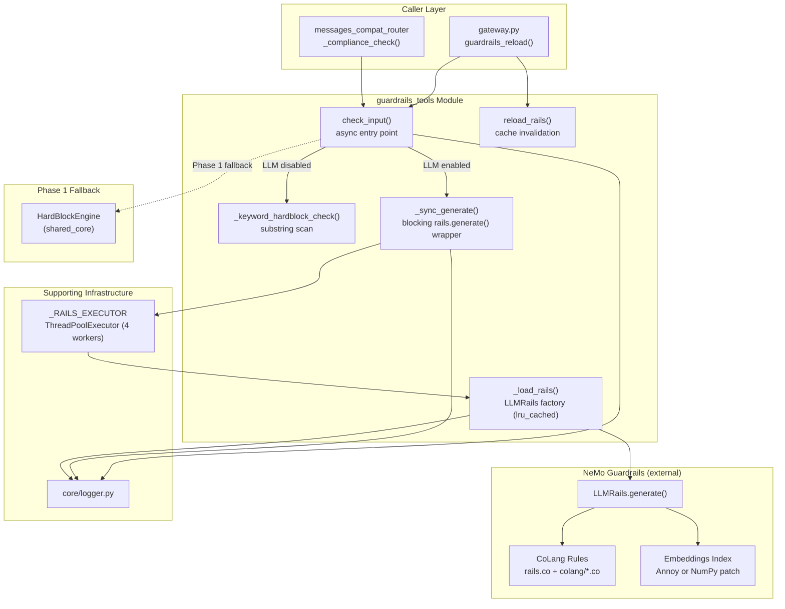
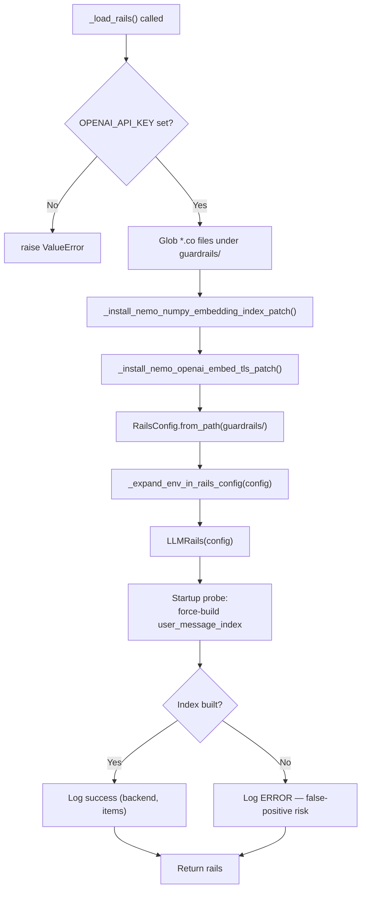
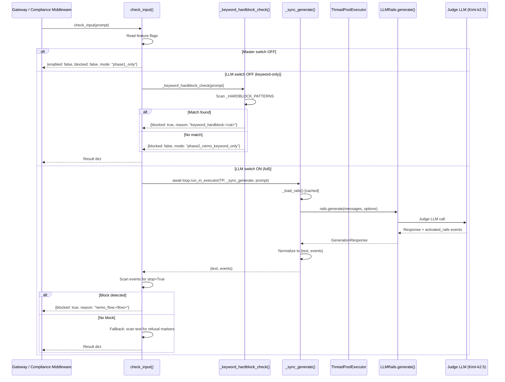
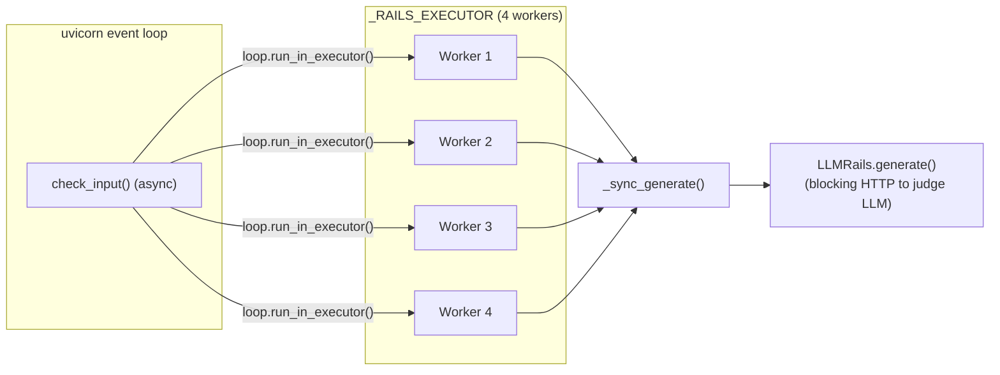

# Guardrails Tools Module

## Introduction

The **guardrails_tools** module (`guardrails/runtime_guardrails.py`) provides runtime input-safety evaluation for the AiNxt platform. It wraps NVIDIA's **NeMo Guardrails** framework to evaluate user prompts against a curated set of CoLang policy rules and keyword-based hardblock patterns before those prompts reach the LLM.

The module supports a **two-tier evaluation strategy**:

| Tier | Mode | LLM Required | Description |
|------|------|--------------|-------------|
| Phase 1 | `phase1_only` | No | Master switch off — all blocking delegated to the deterministic `HardBlockEngine` (see [shared_core](../reference/shared_core.md)). |
| Phase 2 — Keyword | `phase2_nemo_keyword_only` | No | Lightweight substring scan against `_HARDBLOCK_PATTERNS`; mirrors the CoLang hardblock categories without any outbound HTTP. |
| Phase 2 — Full LLM | `phase2_nemo_llm` | Yes | Full `rails.generate()` invocation with the judge LLM, CoLang flow evaluation, and activated-rail introspection. |

This layered design allows gradual rollout: enable keyword hardblocks first (zero cost, deterministic), then enable the LLM-backed judge separately when an API key and budget are available.

---

## Architecture Overview



---

## Core Components

### `check_input(prompt: str) -> Dict[str, Any]`

The **async public entry point**. All callers (gateway, compliance middleware) invoke this function to evaluate a user prompt.

**Behavior matrix:**

```
┌──────────────────────────┬──────────────────────────────┬──────────────────────────────────────┐
│ NEMO_GUARDRAILS_ENABLED  │ NEMO_GUARDRAILS_LLM_ENABLED  │ Behavior                             │
├──────────────────────────┼──────────────────────────────┼──────────────────────────────────────┤
│ 0 (default)              │ any                          │ Disabled — returns immediately       │
│ 1                        │ 0 (default)                  │ Keyword-only hardblock (no LLM call) │
│ 1                        │ 1                            │ Full LLM-backed rails.generate()     │
└──────────────────────────┴──────────────────────────────┴──────────────────────────────────────┘
```

**Return shape** (consistent across all modes):

```python
{
    "enabled":       bool,          # whether Phase 2 is active
    "blocked":       bool,          # whether the prompt was blocked
    "reason":        str | None,    # e.g. "keyword_hardblock:criminal_activity",
                                    #      "nemo_flow:block criminal justice",
                                    #      "nemo_refusal_text", "error:ValueError"
    "raw":           str | None,    # raw LLM response text (LLM mode only)
    "mode":          str,           # "phase1_only" | "phase2_nemo_keyword_only" | "phase2_nemo_llm"
    "category":      str | None,    # hardblock category (keyword mode only)
    "events":        list[dict],    # activated-rail events (LLM mode only)
    "matched_flow":  str | None,    # CoLang flow name that triggered block (LLM mode only)
}
```

**Fail-closed policy (LLM mode only):** If `rails` initialization or the LLM execution raises an exception, `check_input` returns `blocked=True` so safety does not silently degrade. Keyword-only mode never fails closed — a keyword miss is a pass-through, not an error.

**Block decision logic (LLM mode):**

1. **Authoritative signal:** Scan `events` for an input-rail event with `stop=True`. The `ActivatedRail.stop` flag is only set when the CoLang flow explicitly hit `stop` (reached the `bot refuse_*` branch) or NeMo emitted an `*Exception` event. A bare `StartInputRail` with `stop=False` means the rail merely began evaluating — it does **not** mean the prompt was blocked.

2. **Fallback signal:** If no `stop=True` event is found, scan the response text for refusal markers (`"i cannot help"`, `"i refuse"`, `"blocked because it violates"`, etc.). This handles older NeMo builds that don't surface flow events.

### `_sync_generate(prompt: str) -> tuple[str, list[dict]]`

A **blocking wrapper** around `rails.generate()` that must be called inside a thread pool (offloaded via `loop.run_in_executor(_RAILS_EXECUTOR, ...)`).

**Key responsibilities:**

- Constructs `GenerationOptions` with `GenerationLogOptions(activated_rails=True, llm_calls=True, internal_events=True)` to surface the internal trace.
- Normalizes the `GenerationResponse` (pydantic model in NeMo 0.21) into a `(text, events)` tuple, where each event is a dict: `{type, flow, intent, stop, decisions}`.
- Logs the judge model name, elapsed time, event count, and LLM call count for every invocation.
- When the judge LLM was called but returned empty content, logs the raw prompt/completion previews so operators can diagnose non-OpenAI judge model issues (Kimi-k2.5, vLLM, Ollama proxies).

### `_load_rails() -> LLMRails`

An `lru_cache(maxsize=1)` factory that lazily constructs the `LLMRails` instance from local CoLang/config files. Called only in LLM mode.

**Initialization sequence:**



**CoLang file discovery:** `RailsConfig.from_path()` receives the `guardrails/` root directory and uses `os.walk(followlinks=True)` to discover all `*.co` files recursively. The full rule set includes:

- `guardrails/rails.co` — consolidated NPCI hardblock policy
- `guardrails/colang/cat_1_1_security.co` through `cat_4_4_criminal.co` — per-category enhanced CoLang rules (18 files total)

**Environment variable expansion:** NeMo does not expand `${VAR}` placeholders in `config.yml`. The `_expand_env_in_rails_config()` helper post-processes every model's `model` name and `parameters` dict using `_expandvars_strict()`, which raises `ValueError` if any `${VAR}` remains unresolved — catching misconfigurations at startup rather than at the first network call.

**Startup probe:** After constructing `LLMRails`, the function force-builds the `user_message_index` to confirm the embedding backend works. If the index is `None` after the probe, it logs an `ERROR` explaining that input rails will fire on every prompt without an LLM judge call, producing false-positive blocks. This catches the historical bug where a missing `annoy` C++ extension silently left the index unbuilt.

### `reload_rails() -> None`

Clears the `_load_rails` LRU cache so the next `check_input()` call reloads `config.yml` and `*.co` files from disk. Exposed to administrators via the gateway endpoint `guardrails_reload()` (see [gateway](../models/gateway.md)).

### `_keyword_hardblock_check(prompt: str) -> Dict[str, Any]`

A lightweight substring scan against `_HARDBLOCK_PATTERNS` — no LLM call, no outbound HTTP. Returns a result dict in the same shape as `check_input()` so callers need no special-casing.

The `_HARDBLOCK_PATTERNS` dictionary mirrors the CoLang hardblock categories defined in `rails.co` and includes additions from `HardBlockEngine` (see [shared_core](../reference/shared_core.md)). Categories include:

| Category | Example Keywords |
|----------|-----------------|
| `autonomous_unsafe_systems` | nuclear reactor control rod, SCADA safety override |
| `criminal_justice` | risk assessment, predictive policing, recidivism |
| `social_scoring` | social score, social credit, rank individuals |
| `criminal_activity` | ransomware, pipe bomb, manufacture weapon, ghost gun |
| `child_safety` | CSAM, groom minor, pedophilia |
| `pci_card_data` | credit card database, card skimmer, bypass PCI-DSS |
| `illegal_drugs` | cultivate cannabis, manufacture methamphetamine |
| `hate_ethnicity` | crimes by ethnicity, economic threat |
| `housing`, `education`, `employment`, `migration`, `insurance`, `profiling` | domain-specific eligibility / ranking terms |

---

## Feature Flags

| Flag | Default | Purpose |
|------|---------|---------|
| `NEMO_GUARDRAILS_ENABLED` | `0` (off) | Master switch for Phase 2 NeMo Guardrails. When off, `check_input()` returns immediately with `enabled=False` and no I/O is performed. |
| `NEMO_GUARDRAILS_LLM_ENABLED` | `0` (off) | Fine-grained switch controlling whether `rails.generate()` (LLM-backed) is executed. Only evaluated when the master switch is on. When off, only `_keyword_hardblock_check()` runs. |
| `NEMO_EMBEDDING_INDEX_BACKEND` | `annoy` | Controls vector-search backend: `annoy` (native C++ extension, faster) or `numpy` (pure Python brute-force cosine, no build tools needed). |
| `NEMO_EMBED_TLS_VERIFY` | `false` | When `true`, leaves TLS verification enabled on the OpenAI embedding provider. When `false` (default), injects `httpx.Client(verify=False)` as a corporate TLS interception workaround. |
| `OPENAI_API_KEY` | (unset) | Required for LLM mode. Validated at `_load_rails()` time — raises `ValueError` if absent. |
| `PROMPTS_DIR` | `<repo>/prompts` | Set once at module load via `os.environ.setdefault()`. |

---

## NeMo Patches

The module applies two monkey-patches to NeMo Guardrails before `LLMRails(config)` construction. Both are idempotent (guarded by module-level booleans) and safe to call repeatedly.

### NumPy Embeddings Index Patch

`_install_nemo_numpy_embedding_index_patch()` replaces NeMo's Annoy-backed `BasicEmbeddingsIndex` with a NumPy-based implementation when `NEMO_EMBEDDING_INDEX_BACKEND=numpy`.

**Why:** The `annoy` package is a C++ extension requiring MSVC C++14 build tools. Without it, `nemoguardrails/embeddings/basic.py` crashes at import time with `ModuleNotFoundError: No module named 'annoy'`, which NeMo's action dispatcher swallows — leaving `user_message_index = None` and causing input rails to fire without ever calling the judge LLM (false-positive blocks).

**How:**

1. Stubs `annoy` in `sys.modules` with a no-op module so the top-level `from annoy import AnnoyIndex` in `basic.py` succeeds.
2. Defines `_NumpyEmbeddingsIndex(BasicEmbeddingsIndex)` that overrides `build()` (stacks embeddings into an L2-normalized NumPy array) and `search()` (computes cosine similarity via a single matmul, applies the same `score = 1 - d/2` threshold semantics as Annoy's angular metric).
3. Monkey-patches `LLMRails._get_embeddings_search_provider_instance` to route every request (including the default name) to the NumPy implementation.

With only 72 user-message corpora and 768-d nomic embeddings, brute-force NumPy cosine search completes in <1ms on commodity hardware.

### OpenAI Embedding TLS Patch

`_install_nemo_openai_embed_tls_patch()` wraps `OpenAIEmbeddingModel.__init__` to inject `httpx.Client(verify=False)` when `NEMO_EMBED_TLS_VERIFY` is not `true`.

**Why:** The corporate HTTPS proxy performs TLS interception with a corporate root CA not in certifi's bundle, causing `httpx.ConnectError: [SSL: CERTIFICATE_VERIFY_FAILED]`. This is scoped strictly to the embedding provider — the main LLM call path is unaffected.

**Security note:** Disabling TLS verification is acceptable here because the endpoint is an internal URL, the traffic carries only the user prompt (already inside the gateway's trust boundary), and the corporate proxy enforces network-level access control.

---

## Data Flow



---

## Integration Points

### Gateway

The gateway exposes `guardrails_reload()` as an admin endpoint that calls `reload_rails()` to clear the LLMRails cache after policy file updates. See [gateway](../models/gateway.md) → `security_and_governance` child module.

### Compliance Middleware

The `messages_compat_router` (`_compliance_check()`) invokes `check_input()` as part of the pre-LLM compliance pipeline. See [shared_api_routers](../api/shared_api_routers.md) → `messages_compat_router`.

### HardBlockEngine (Phase 1)

When `NEMO_GUARDRAILS_ENABLED=0` (default), `check_input()` returns `enabled=False` and all blocking is delegated to the deterministic `HardBlockEngine` in [shared_core](../reference/shared_core.md) → `agent_system` → `decision_engines`. The `HardBlockEngine` uses a weighted confidence-score gate (threshold 0.75) rather than binary keyword matching, with context multipliers for tool results, code fences, and text length.

The `_HARDBLOCK_PATTERNS` in this module mirror the `HardBlockEngine`'s categories so that keyword-only Phase 2 mode provides consistent blocking semantics without the scoring complexity.

### Core Logger

All logging flows through `core.logger` (see [shared_core](../reference/shared_core.md) → `core_infrastructure`). The module logs at multiple levels:

- `INFO`: Mode selection, rails initialization, decision outcomes, similarity scores
- `WARNING`: Keyword hardblock matches, empty judge LLM responses, near-miss probes
- `ERROR`: Startup probe failures, `check_input` exceptions (fail-closed)

---

## Thread Pool Architecture



The dedicated `ThreadPoolExecutor(max_workers=4, thread_name_prefix="nemo-rails")` prevents concurrent NeMo calls from spawning unbounded threads while keeping the async event loop unblocked. The bounded pool size of 4 matches typical concurrent request volumes and prevents resource exhaustion under load.

---

## Configuration Files

The module loads configuration from the `guardrails/` directory:

| File | Purpose |
|------|---------|
| `guardrails/config.yml` | NeMo model configuration (judge LLM, embedding model, similarity thresholds) |
| `guardrails/rails.co` | Consolidated NPCI hardblock policy (top-level CoLang flows) |
| `guardrails/colang/cat_*.co` | 18 per-category enhanced CoLang rule files (security, violence, hate, sexual, child safety, self-harm, political, economic, deception, manipulation, defamation, rights, discrimination, PII/PCI, privacy, criminal) |

**Important:** `RailsConfig.from_path()` expects a **directory** path, not a file path. Passing `config.yml` directly causes CoLang flows to be silently skipped.

---

## Operational Notes

### Gradual Rollout Strategy

1. **Phase 1 only** (default): `NEMO_GUARDRAILS_ENABLED=0`. All blocking via `HardBlockEngine`. Zero NeMo dependency.
2. **Keyword hardblocks**: `NEMO_GUARDRAILS_ENABLED=1`, `NEMO_GUARDRAILS_LLM_ENABLED=0`. Deterministic substring blocking, no API key needed, no outbound HTTP.
3. **Full LLM judge**: `NEMO_GUARDRAILS_ENABLED=1`, `NEMO_GUARDRAILS_LLM_ENABLED=1`, `OPENAI_API_KEY=<key>`. Full CoLang flow evaluation with LLM-as-judge.

### Diagnosing False-Positive Blocks

The historical false-positive pattern (block decision with `llm_calls=0`) was caused by the `annoy` `ModuleNotFoundError` being swallowed by NeMo's action dispatcher. The startup probe in `_load_rails()` now catches this at initialization. If false positives recur:

1. Check logs for `"user_message_index is None after startup probe"` — indicates embedding backend failure.
2. Verify `NEMO_EMBEDDING_INDEX_BACKEND=numpy` if `annoy` is not installed.
3. Check for TLS errors in the embedding provider logs.
4. Confirm `OPENAI_API_KEY` is set and the judge model endpoint is reachable.

### Reloading Policy Without Restart

After updating `rails.co` or `config.yml`:

```bash
# Via gateway admin endpoint
curl -X POST http://gateway/admin/guardrails/reload

# Or programmatically
from guardrails.runtime_guardrails import reload_rails
reload_rails()
```

The next `check_input()` call will re-initialize `LLMRails` from the updated files.
