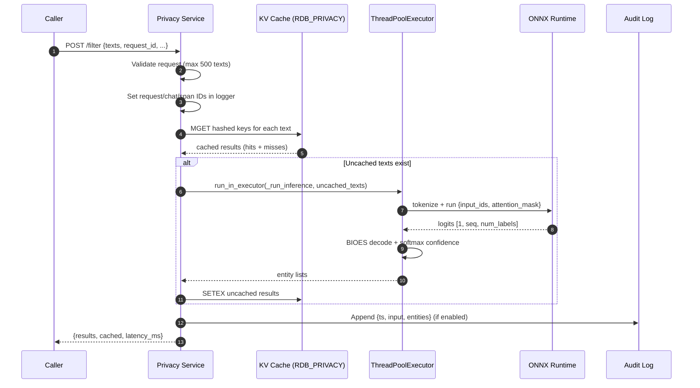
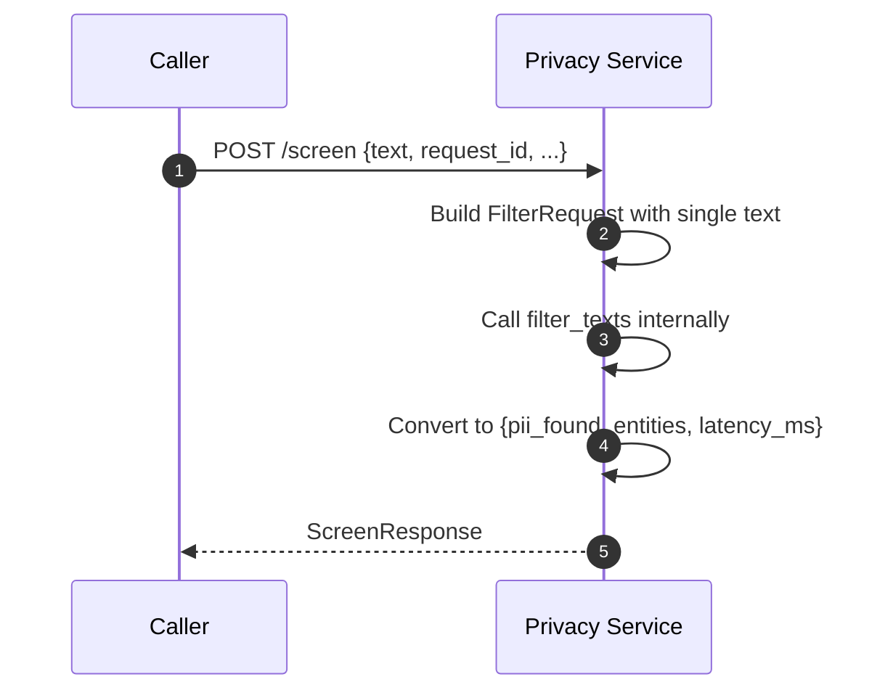
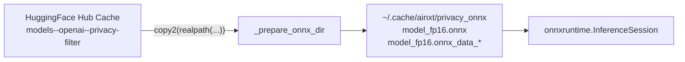

# Privacy Service

The **Privacy Service** is a dedicated FastAPI microservice that performs context-aware detection of personally identifiable information (PII) and other sensitive entities in text. It runs the `openai/privacy-filter` transformer model as an ONNX graph, augmenting the platform's regex and policy-based compliance engine with a neural entity classifier. The service exposes simple HTTP endpoints for batch filtering (`/filter`) and binary screening (`/screen`), and is designed for low-latency CPU inference with optional result caching.

---

## Core Responsibilities

- **ML-based PII detection**: Token-classification over user/assistant text to detect entities such as account numbers, names, addresses, phone numbers, email addresses, and other sensitive tokens.
- **Symlink-safe ONNX loading**: Copies the HuggingFace-hub model (graph + external weight shards) into a flat local cache so `onnxruntime` can load models whose weights are stored as content-addressed symlinks.
- **Result caching**: Caches per-text entity results in a Redis-backed KV store (database index `RDB_PRIVACY`) to avoid repeated inference on identical inputs.
- **Audit logging**: Optionally writes append-only JSONL audit records containing the raw input and detected entities when `PRIVACY_AUDIT_LOG` is configured.
- **Health reporting**: Exposes a `/health` endpoint that reports model-load status and cache connectivity.

---

## Architecture

```mermaid
flowchart TB
    subgraph Client["Calling Services"]
        Gateway[[gateway.md|Gateway]]
        Chat[[chat_router.md|Chat Router]]
        Compliance[[compliance_router.md|Compliance Router]]
    end

    subgraph PrivacyService["Privacy Service (port 8004)"]
        FastAPI[[FastAPI App]]
        FilterEP["POST /filter"]
        ScreenEP["POST /screen"]
        HealthEP["GET /health"]
        Cache[(KV Cache<br/>RDB_PRIVACY)]
        Audit[(Audit Log<br/>JSONL)]
        ONNX[[ONNX Runtime<br/>openai/privacy-filter]]
        Tok[[Tokenizer]]
        InferPool["ThreadPoolExecutor<br/>(CPU inference)"]
    end

    Gateway --> FilterEP
    Chat --> FilterEP
    Compliance --> ScreenEP

    FilterEP --> Cache
    FilterEP --> InferPool
    ScreenEP --> FilterEP
    InferPool --> ONNX
    InferPool --> Tok
    FilterEP --> Audit

    ONNX -.->|"model_fp16.onnx + shards"| ONNXCache["~/.cache/ainxt/privacy_onnx"]
```

### Component Breakdown

| Component | File | Responsibility |
|-----------|------|----------------|
| `app` | `services/privacy_svc/main.py` | FastAPI application with lifespan management, CORS, and route registration. |
| `filter_texts` | `services/privacy_svc/main.py` | `POST /filter` handler. Orchestrates cache lookup, batch inference, cache write-back, audit logging, and structured logging. |
| `screen_text` | `services/privacy_svc/main.py` | `POST /screen` handler. Thin wrapper around `/filter` that returns a binary `pii_found` flag. |
| `health` | `services/privacy_svc/main.py` | `GET /health` handler. Reports `model_loaded`, `cache_connected`, and service status. |
| `_prepare_onnx_dir` | `services/privacy_svc/main.py` | One-time copy of ONNX graph and external data shards to a symlink-free cache directory. |
| `_run_inference` / `_infer_single` | `services/privacy_svc/main.py` | Blocking token-classification inference, BIOES decoding, and confidence scoring. |
| `_decode_bioes` | `services/privacy_svc/main.py` | Converts per-token BIOES labels into contiguous entity spans. |
| `_write_privacy_audit` | `services/privacy_svc/main.py` | Best-effort append-only audit log writer. |
| `lifespan` | `services/privacy_svc/main.py` | Async startup/shutdown context: connects to KV cache and shuts down the inference thread pool. |

---

## Data Flow

### `/filter` Batch Request



### `/screen` Single-Text Request



---

## Model Loading & ONNX Cache

The service loads the model at **module import time** so that inference requests are served immediately after startup. Because HuggingFace Hub stores model weights as symlinks to content-addressed blobs, `onnxruntime` may reject external data files that resolve outside the model directory. The service solves this by copying the graph file and all matching data shards into a flat cache:



- Source path: `MODEL_PATH/onnx/model_fp16.onnx` (configurable via `PRIVACY_MODEL_PATH`).
- Destination: `~/.cache/ainxt/privacy_onnx`.
- Data shards: all files matching `model_fp16.onnx_data*` are copied to support both single-file and sharded weight formats.
- Execution providers: prefers `CoreMLExecutionProvider` on Apple Silicon, otherwise falls back to `CPUExecutionProvider`.

---

## Entity Decoding

The model outputs per-token BIOES labels. The service decodes these into contiguous spans with the following semantics:

- `B-<type>` — beginning of a new entity.
- `I-<type>` — inside an entity (continues current type).
- `E-<type>` — end of an entity (flushes the span).
- `S-<type>` — single-token entity.
- `O` — outside any entity.

Confidence scores are derived from the softmax probability at the token that starts each entity span.

---

## Configuration

| Environment Variable | Default | Description |
|----------------------|---------|-------------|
| `PRIVACY_MODEL_PATH` | `~/.cache/huggingface/hub/models--openai--privacy-filter/snapshots/...` | Path to the HuggingFace model directory containing `config.json`, `tokenizer.json`, and `onnx/`. |
| `PRIVACY_SVC_PORT` | `8004` | Port the service binds to. |
| `PRIVACY_AUDIT_LOG` | `None` | File path for append-only JSONL audit log. |
| `TOKENIZERS_PARALLELISM` | `false` | Disables tokenizer parallelism to avoid fork issues. |
| `OMP_NUM_THREADS` / `MKL_NUM_THREADS` | `2` | Limits CPU thread usage for ONNX. |

---

## API Endpoints

### `POST /filter`

Batch entity extraction.

**Request body** (`FilterRequest`):
```json
{
  "texts": ["...", "..."],
  "request_id": "uuid",
  "chat_id": "uuid",
  "user_id": "uuid",
  "span_id": "uuid"
}
```

**Response** (`FilterResponse`):
```json
{
  "results": [
    [
      {
        "entity_group": "account_number",
        "word": "1234567890",
        "start": 24,
        "end": 34,
        "score": 0.9876
      }
    ]
  ],
  "cached": [false, true],
  "latency_ms": 42.5
}
```

### `POST /screen`

Binary PII screening.

**Request body** (`ScreenRequest`):
```json
{
  "text": "...",
  "request_id": "uuid",
  "chat_id": "uuid",
  "user_id": "uuid",
  "span_id": "uuid"
}
```

**Response** (`ScreenResponse`):
```json
{
  "pii_found": true,
  "entities": [...],
  "latency_ms": 12.3
}
```

### `GET /health`

**Response**:
```json
{
  "status": "ok",
  "model_loaded": true,
  "model_path": "...",
  "onnx_cache": "~/.cache/ainxt/privacy_onnx",
  "cache_connected": true,
  "port": 8004
}
```

---

## Integration with the Platform

The Privacy Service is typically invoked by upstream services before sensitive text is persisted, logged, or sent to external LLMs:

```mermaid
flowchart LR
    User[User Input]
    Gateway[[gateway.md|Gateway]]
    Privacy[[privacy_service.md|Privacy Service]]
    Compliance[[compliance_engine.md|Compliance Engine]]
    LLM[[llm_proxy.md|LLM Proxy]]

    User --> Gateway
    Gateway --> Privacy
    Privacy -->|entities| Compliance
    Compliance -->|allow / block| LLM
```

- **Gateway**: routes chat/agent requests and can call the Privacy Service for pre-flight screening.
- **Compliance Engine**: consumes detected entities to apply policy decisions, redaction, or blocking.
- **LLM Proxy**: may receive already-scrubbed or annotated text before forwarding to model providers.

For details on how detected PII is redacted or governed, see compliance_engine.md and [guardrails.md](guardrails.md). For the KV cache implementation used for result caching, see [kv_store.md](../storage/kv_store.md).

---

## Operational Notes

- **Model failure is non-fatal to the process**: if ONNX loading fails, `_model_loaded` is `False` and `/health` returns `degraded`. Inference functions return empty entity lists rather than crashing.
- **Cache is best-effort**: KV connection failures are logged as warnings; the service continues to serve requests using direct inference.
- **Thread pool size**: `max_workers=4` keeps the asyncio event loop unblocked during CPU inference.
- **Logging hygiene**: raw text and detected entities are logged at `DEBUG` only. INFO-level logs contain counts, types, and latency metadata to avoid leaking PII into production logs.
- **Request context**: `request_id`, `user_id`, `chat_id`, and `span_id` are propagated into structured logs for traceability.

---

## File Reference

- `services/privacy_svc/main.py` — complete service implementation (app, endpoints, inference, caching, audit).
