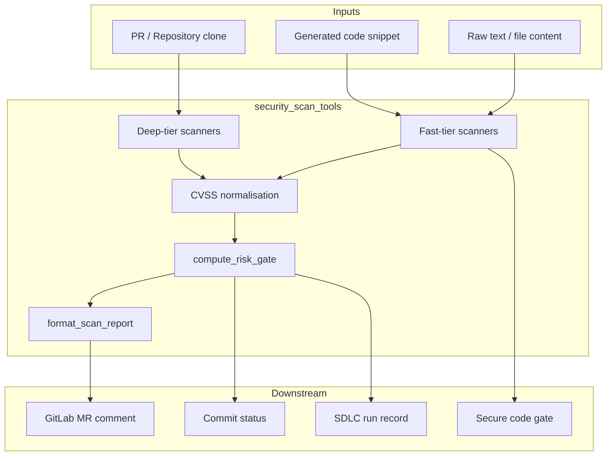
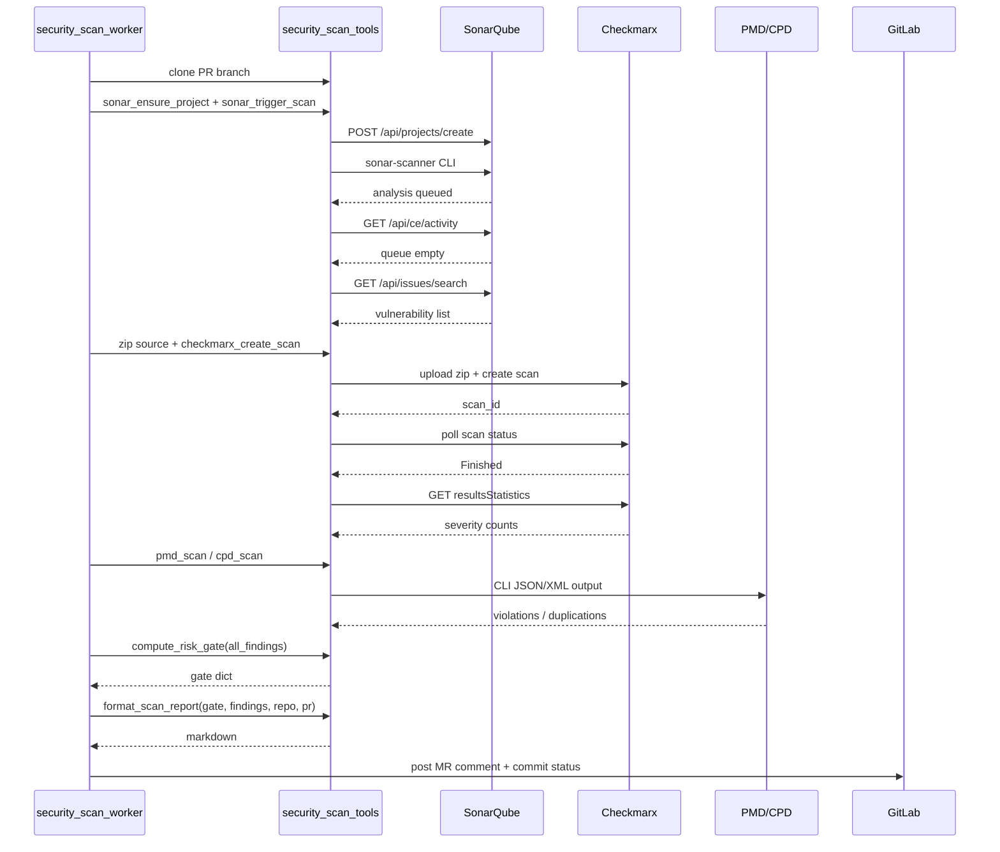
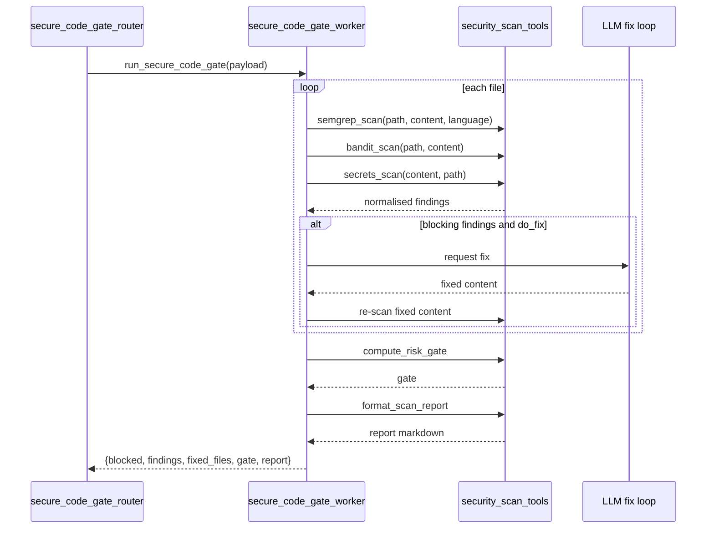
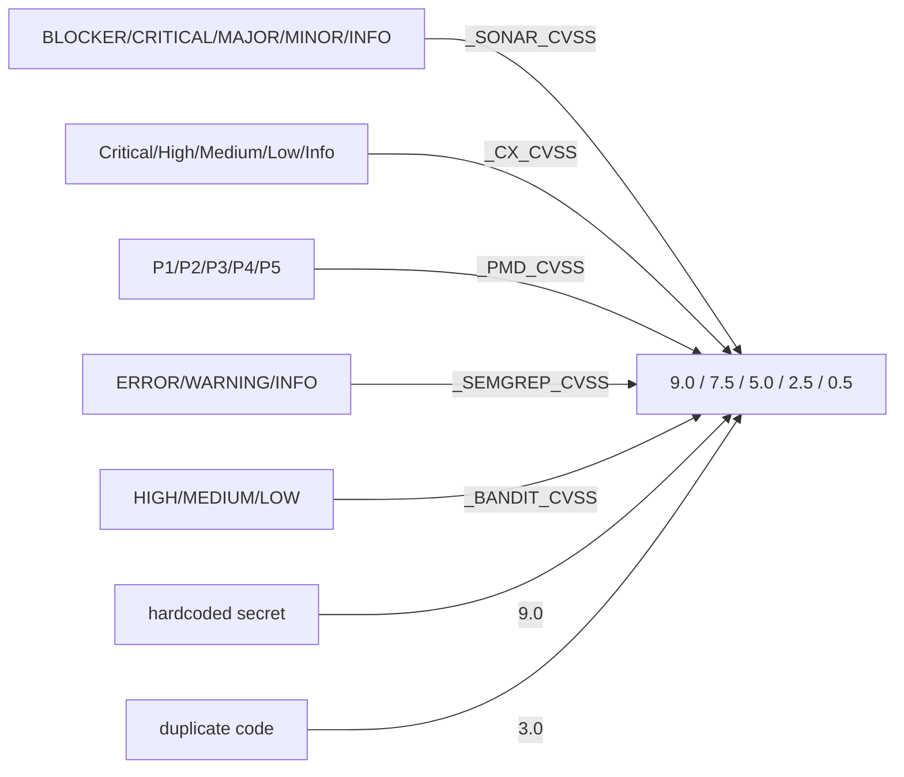
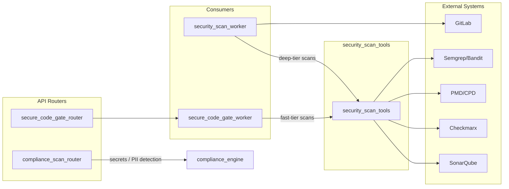

# security_scan_tools

The `security_scan_tools` module provides a unified, normalised interface for static application security testing (SAST) and code-quality scanning. It orchestrates both **deep-tier** scanners (SonarQube, Checkmarx CxSAST, PMD/CPD) that run against a full repository clone, and **fast-tier** scanners (Semgrep, Bandit, hardcoded-secret detection) that run on individual files or snippets at generation time. All findings are mapped to a common CVSS-based schema so downstream components can apply a single risk gate and produce consistent reports.

---

## Core Responsibilities

1. **Scanner abstraction** – Wrap SonarQube, Checkmarx, PMD, CPD, Semgrep, Bandit, and the platform compliance engine behind simple Python functions.
2. **CVSS normalisation** – Convert each scanner's native severity/priority into a comparable CVSS base score.
3. **Risk gate** – Aggregate findings and decide whether a PR or generated file should be blocked based on `SECURITY_CVSS_BLOCK_THRESHOLD` (default 7.0).
4. **Reporting** – Generate a markdown report suitable for GitLab MR comments or CLI output.
5. **Fail-open safety** – Every scanner is optional; missing configuration or a missing binary logs a warning and returns empty findings rather than crashing the pipeline.

---

## Architecture

### Component Breakdown

| Function | Tier | Purpose |
|----------|------|---------|
| `_http` | Shared | Small JSON HTTP helper used by SonarQube and Checkmarx REST calls. |
| `sonar_ensure_project`, `sonar_trigger_scan`, `sonar_wait_for_scan`, `sonar_get_vulnerabilities` | Deep | Create project, run `sonar-scanner`, poll CE queue, fetch VULNERABILITY/BUG issues. |
| `_cx_get_token`, `checkmarx_create_scan`, `checkmarx_poll_scan`, `checkmarx_get_findings` | Deep | OAuth2 token management, zip upload, SAST scan lifecycle, result statistics. |
| `pmd_scan`, `cpd_scan` | Deep | Run PMD rulesets and Copy-Paste Detector on a cloned working directory. |
| `semgrep_scan`, `bandit_scan`, `secrets_scan` | Fast | Multi-language / Python SAST and hardcoded-secret detection on files or strings. |
| `compute_risk_gate` | Aggregate | Calculate `max_cvss`, critical/high counts, per-tool summary, and `blocked` flag. |
| `format_scan_report` | Report | Build a markdown report with status, summary table, top findings, and blocking verdict. |

---

## Data Flow

### Deep-tier PR Scan

### Fast-tier Secure Code Gate

---

## CVSS Normalisation

Each scanner uses its own severity vocabulary. The module maps them to CVSS base scores so a single threshold can gate all tools.

A finding is considered **blocking** when its `cvss_score` is greater than or equal to `SECURITY_CVSS_BLOCK_THRESHOLD` (default 7.0). This means SonarQube CRITICAL, Checkmarx High/Critical, PMD P1/P2, Semgrep ERROR, Bandit HIGH, and any hardcoded secret will block by default.

---

## Configuration

All scanners are controlled through environment variables. If a required variable is absent, that scanner is skipped with a log message.

| Variable | Default | Purpose |
|----------|---------|---------|
| `SONAR_HOST_URL` | `""` | SonarQube base URL. |
| `SONAR_TOKEN` | `""` | SonarQube authentication token. |
| `SONAR_SCANNER_PATH` | `sonar-scanner` | Path to the `sonar-scanner` binary. |
| `CHECKMARX_HOST_URL` | `""` | Checkmarx server base URL. |
| `CHECKMARX_CLIENT_ID` | `""` | Checkmarx OAuth client ID. |
| `CHECKMARX_CLIENT_SECRET` | `""` | Checkmarx OAuth client secret. |
| `PMD_PATH` | `pmd` | Path to the PMD binary (also used for CPD). |
| `SEMGREP_PATH` | `/appdata/fastapi/venv/bin/semgrep` | Path to the Semgrep binary. |
| `SEMGREP_CONFIG` | `p/ci,p/owasp-top-ten,p/secrets` | Semgrep rule packs or local ruleset paths. |
| `BANDIT_PATH` | `bandit` | Path to the Bandit binary. |
| `SECURITY_CVSS_BLOCK_THRESHOLD` | `7.0` | CVSS score at which a scan is considered blocking. |
| `SECURITY_SCAN_ENABLED` | `true` | Master switch for the deep-tier PR scan worker. |

---

## Integration with the System

The module is consumed by two worker paths and surfaced through several routers:

- **[security_scan_worker](../security_scan_worker.md)** clones a PR, runs the deep-tier scanners, persists results, posts a GitLab MR comment, and sets the commit status.
- **[secure_code_gate_worker](../secure_code_gate_worker.md)** runs the fast-tier scanners on generated or edited code, optionally invokes an LLM fix loop, and returns per-file findings.
- **[secure_code_gate_router](../api/secure_code_gate_router.md)** exposes the secure code gate as a synchronous HTTP endpoint.
- **[compliance_scan_router](../api/compliance_scan_router.md)** uses the same compliance engine for read-path PII/secret redaction on desktop screenshots and extracted text.
- **[compliance_engine](../compliance_engine.md)** is imported by `secrets_scan` to detect hardcoded secrets without triggering PAN/PII false positives.

---

## Security and Safety Notes

- **Read-only static analysis**: Fast-tier scanners only read files; they never execute the scanned code.
- **Fail-open**: Missing binaries or missing credentials log a warning and return empty findings so the rest of the pipeline can continue.
- **No raw secret logging**: Findings include type and location, not the secret value itself.
- **Auto-fix validation**: When the secure code gate uses an LLM to fix blocking issues, the fixed code is re-scanned with `secrets_scan`; if the fix introduced a hardcoded secret, the fix is discarded.
- **Image scanning limitation**: The compliance scan router currently cannot scan screenshots for PII via OCR in all deployments; it fails closed and warns the caller not to feed the image into context.

---

## References

- [security_scan_worker](../security_scan_worker.md) – RQ worker that orchestrates full-repository PR scans.
- [secure_code_gate_worker](../secure_code_gate_worker.md) – Worker that runs fast-tier scans and optional LLM auto-fix.
- [secure_code_gate_router](../api/secure_code_gate_router.md) – HTTP router for the secure code gate.
- [compliance_scan_router](../api/compliance_scan_router.md) – HTTP router for PII/secret redaction on read paths.
- [compliance_engine](../compliance_engine.md) – Shared compliance engine used for secret detection.
- [core/logger](../core_logger.md) – Logging utility used throughout the module.
