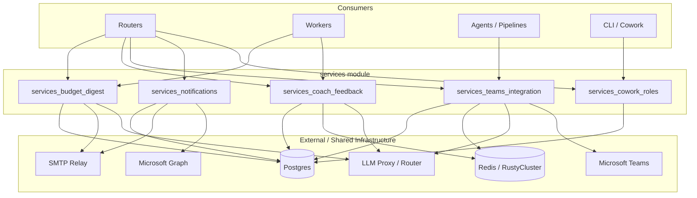
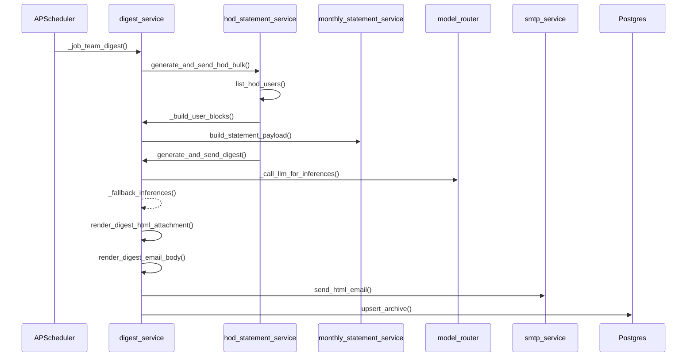

# Services Module

The `services` module is a shared core layer of the AiNxt / ABStudio platform. It contains standalone, stateless (or lightly stateful) service helpers that orchestrate cross-cutting concerns such as budget governance, usage digests, coach event ingestion, Microsoft Teams integration, email notifications, and Cowork role materialization.

Services in this module are **not API routes** — they are invoked by routers, workers, and other service layers. They encapsulate business logic that would otherwise be duplicated across multiple callers, and they typically interact with the database, SMTP relay, KV store, LLM router, and external SaaS APIs.

## Architecture Overview

## Sub-modules

| Sub-module | Purpose | Key Files |
|------------|---------|-----------|
| [services_budget_digest](services_budget_digest.md) | HOD monthly allocation caps, budget-increase request emails, and HOD/Manager monthly usage digests. | `budget_request_email.py`, `hod_budget_governor.py`, `hod_statement_service.py`, `manager_statement_service.py`, `digest_service.py` |
| [services_coach_feedback](services_coach_feedback.md) | Ingestion, redaction, and evaluation of coach events; feedback-driven chunk quality penalties and preference extraction. | `coach_ingestor/ingestor.py`, `feedback_processor.py` |
| [services_teams_integration](services_teams_integration.md) | Microsoft Teams bot adapter, proactive notifications, and WebVTT transcript parsing for meeting summaries. | `teams_adapter.py`, `teams_notifier.py`, `meeting_transcript.py` |
| [services_notifications](services_notifications.md) | Discussion mention emails and Microsoft Graph webhook subscription lifecycle. | `discussion_notify.py`, `graph_subscriptions.py` |
| [services_cowork_roles](services_cowork_roles.md) | Cowork "role specialist" packs: CRUD, skill resolution, and materialization into CLI-readable agent files. | `cowork_roles.py` |

## Module Boundaries

- **Routers** (e.g. `routers/budget_router.py`, `routers/digest_hod_router.py`, `routers/teams_router.py`) own HTTP request/response handling and call into this module for business logic.
- **Workers** (e.g. `workers/feedback_loop_worker.py`, `workers/meeting_worker.py`) run background jobs and rely on services for reusable orchestration.
- **Agents / Pipelines** (e.g. `agents/sdlc_pipeline.py`) use `teams_notifier` to push status updates into Teams conversations.
- **CLI / Cowork** materializes role packs via `cowork_roles.materialize_role`.

## Common Dependencies

Most services in this module depend on:

- `db.database.SessionLocal` and `db.models` for persistence.
- `core.logger` for structured logging.
- `core.kv.get_kv` for Redis/RustyCluster access.
- `services.smtp_service.send_html_email` for email dispatch.
- `models.model_router` for LLM inference.
- `agents.compliance_engine` for PII/secrets redaction and blocking.

## Data Flow Example: Monthly HOD Digest

## Security & Compliance Notes

- **Redaction at write**: `coach_ingestor.ingest` redacts PII/secrets before persisting prompts.
- **No auto-execution**: `cowork_roles` only materializes configuration; connector writes still require user confirmation.
- **No secrets in files**: Materialized Cowork files contain no bearer tokens.
- **Cap enforcement**: `hod_budget_governor` supports shadow mode and enforcement mode for HOD allocation caps.
- **JWT validation**: `teams_adapter` validates Microsoft Bot Framework Bearer tokens via JWKS.

## Related Modules

- [shared_core](shared_core.md) — Parent module containing agents, core infrastructure, store layer, and routers.
- [routers](shared_api_routers.md) — HTTP API layer that consumes these services.
- [workers](workers.md) — Background job workers that invoke these services.
- [llm_spend](llm_spend.md) — Sibling module for LLM spend fetching and reporting.
