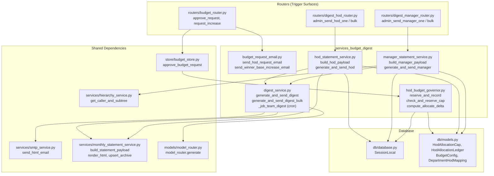
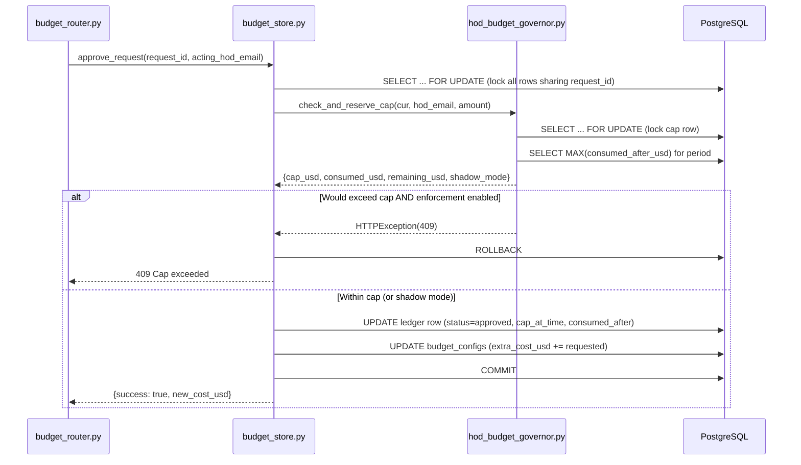
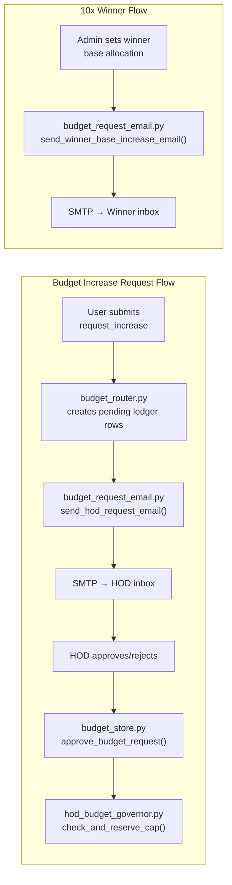
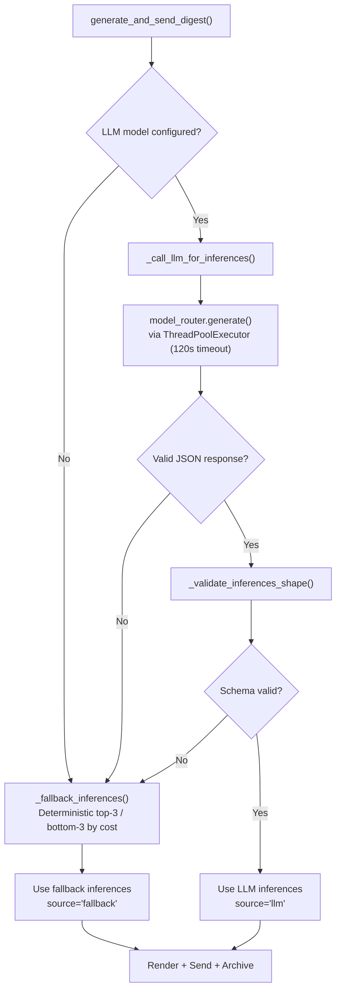
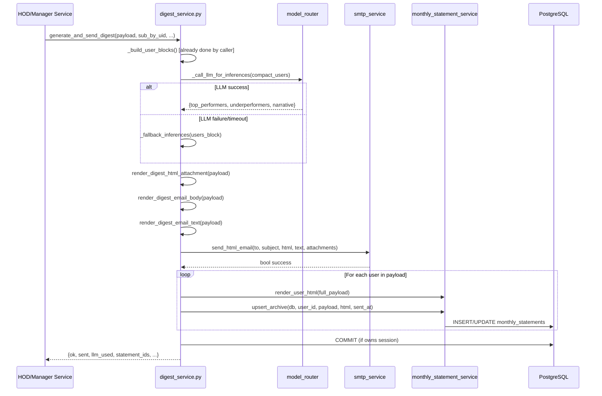
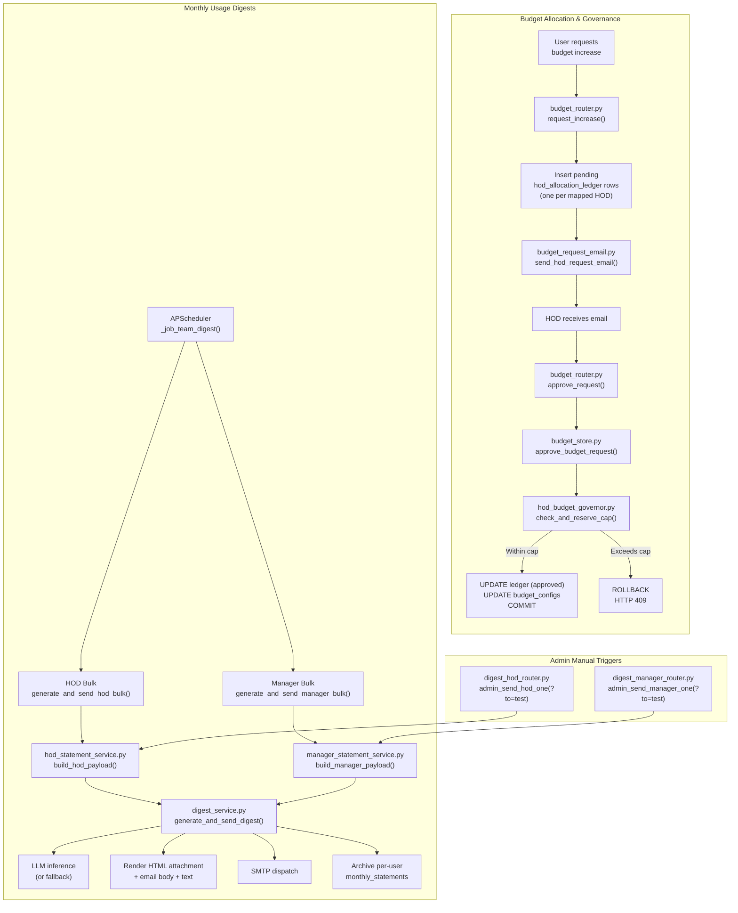
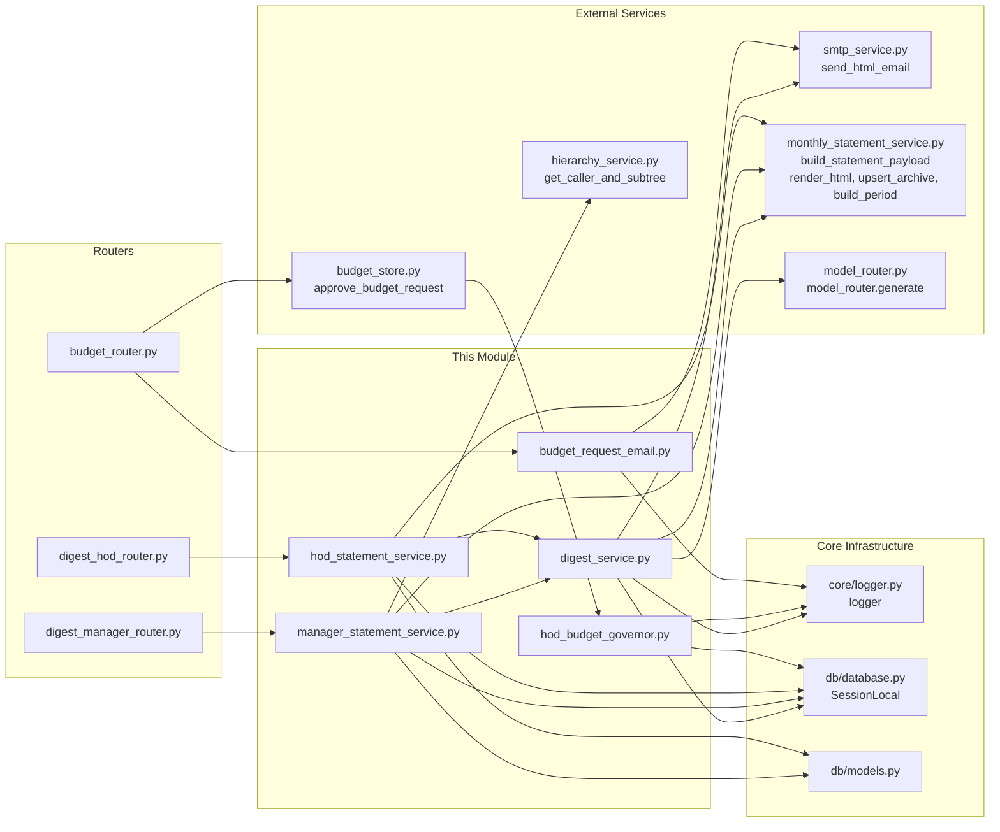

# services_budget_digest

## Introduction

The `services_budget_digest` module is the budget governance and usage-reporting backbone of the AiNxt platform. It encompasses two tightly related but distinct functional areas:

1. **HOD Budget Governance** — Enforces monthly allocation caps on Heads of Department (HODs) when they allocate budget to team members, approve budget-increase requests, or trigger SDLC pipeline runs. It maintains an append-only audit ledger and supports a shadow-mode for safe rollout.

2. **Monthly Usage Digests** — Generates and dispatches rich, LLM-augmented monthly usage statements to HODs (department-level) and Managers (team-level). The digests aggregate per-user LLM spend, token usage, and request counts, apply LLM-driven narrative analysis with a deterministic fallback, render Outlook-safe HTML emails with interactive attachments, and archive per-user audit rows.

Together, these services ensure that budget allocation is controlled, auditable, and transparent, while giving organisational leaders actionable visibility into their team's AI platform consumption.

---

## Architecture Overview



### Module Composition

The module is composed of five source files organised into two functional clusters:

| File | Cluster | Responsibility |
|------|---------|----------------|
| `services/budget_request_email.py` | Budget Governance | Outlook-safe email notifications for HOD budget-increase requests and 10x-winner base-allocation increases |
| `services/hod_budget_governor.py` | Budget Governance | Monthly allocation cap enforcement, ledger recording, cap-status lookups |
| `services/hod_statement_service.py` | Usage Digests | HOD-specific roster resolution, payload building, and pipeline orchestration |
| `services/manager_statement_service.py` | Usage Digests | Manager-specific roster resolution, payload building, and pipeline orchestration |
| `services/digest_service.py` | Usage Digests | Shared core: per-user aggregation, LLM inference, rendering, SMTP dispatch, archival, cron scheduling |

---

## Component Documentation

### 1. HOD Budget Governor (`hod_budget_governor.py`)

The HOD Budget Governor is the single authority that decides whether an HOD can allocate a given dollar amount within the current calendar month. It enforces caps via row-level locking (`SELECT ... FOR UPDATE`) and records every allocation in an append-only audit ledger.

#### Key Design Decisions

- **Shadow vs. Enforcement Mode**: Controlled by the `HOD_CAP_ENFORCEMENT_ENABLED` environment variable. In shadow mode (default), ledger rows are still written (with `shadow_mode=true`) but cap violations only log warnings — they never block the action. This allows safe rollout and retrospective analysis before flipping to enforcement.
- **Decimal Money**: All monetary values use Python `Decimal` quantised to 2 decimal places with `ROUND_HALF_UP`, matching the `NUMERIC(12,2)` column type.
- **O(1) Consumption Lookup**: Running consumption is computed via `MAX(consumed_after_usd)` over non-shadow ledger rows for the current period, leveraging a database index for constant-time lookups.
- **No Refunds**: Decreases or deletions never produce negative charges — the delta is clamped to zero per the charge model spec.

#### Core Functions

| Function | Purpose |
|----------|---------|
| `reserve_and_record()` | Atomic check + ledger insert. Locks the cap row, reads consumption, decides whether to allow or block, and inserts an audit row. Raises `HTTPException(409)` on cap overrun in enforcement mode. |
| `check_and_reserve_cap()` | Cap check only (no ledger insert). Used by `store/budget_store.approve_budget_request()` which owns its own transaction and updates the ledger row in place. |
| `compute_allocate_delta()` | Computes the chargeable delta: `max(0, new - old)`. Increases are charged; decreases yield zero. |
| `get_cap_status()` | Read-only summary for the UI banner. Fail-soft: never breaks the UI if the ledger query fails. |

#### Cap Enforcement Flow



#### Database Tables

The governor interacts with two manually-created tables in the `ainxt` schema (see [database](database.md) for ORM definitions):

- **`ainxt.hod_allocation_caps`** — One row per HOD with `monthly_cap_usd`, `is_active` flag. Read-only to the application; seeded by DBA.
- **`ainxt.hod_allocation_ledger`** — Append-only audit/spend ledger. Each row records an allocation action with `amount_usd`, `consumed_after_usd` (running total), `shadow_mode`, and request-lifecycle columns for budget-increase requests.

#### Configuration

| Env Var | Default | Description |
|---------|---------|-------------|
| `HOD_CAP_ENFORCEMENT_ENABLED` | `false` | When `true`, cap violations raise `HTTP 409`. When `false`, shadow mode logs warnings only. |
| `HOD_DEFAULT_MONTHLY_CAP_USD` | `0.00` | Fallback cap for HODs without a configured cap row. Set to a positive value to allow ungoverned HODs limited allocation. |

---

### 2. Budget Request Email (`budget_request_email.py`)

Generates Outlook-safe HTML email notifications (with plain-text fallbacks) for two budget lifecycle events:

#### `send_hod_request_email()`

Notifies an HOD that a budget-increase request from a team member is awaiting their approval. The email includes:
- Requester identity, department, and justification
- Current budget breakdown (base, extra granted, requested extra, resulting total)
- Step-by-step approval instructions
- Fan-out note when the request was sent to multiple HODs (first-actor-wins semantics)

#### `send_winner_base_increase_email()`

Notifies a 10x Award winner that their base budget allocation has been increased. Includes previous and new base budget, with a note that base allocations reset monthly.

Both functions use `services/smtp_service.send_html_email()` for dispatch and return `bool` success status. All HTML content uses inline styles (no external CSS/JS) for Outlook compatibility.



---

### 3. Digest Service — Shared Core (`digest_service.py`)

This is the single home for the end-to-end digest pipeline shared by both HOD and Manager digests. It deliberately contains no domain-specific (HOD-only or Manager-only) logic — that lives in the respective statement service modules.

#### Responsibilities

| Area | Functions |
|------|-----------|
| **Digest-type constants** | `DIGEST_TYPE_HOD`, `DIGEST_TYPE_MANAGER` |
| **Per-user aggregation** | `_build_user_blocks()` — aggregates cost, tokens, requests, models, channels per user |
| **LLM inference** | `_call_llm_for_inferences()` — one-shot LLM call for top/underperformer analysis; `_fallback_inferences()` — deterministic fallback |
| **Rendering** | `render_digest_html_attachment()`, `render_digest_email_body()`, `render_digest_email_text()` — unified Jinja templates with `digest_type` branding switch |
| **Send pipeline** | `generate_and_send_digest()` — LLM inference → render → SMTP dispatch → archive |
| **Bulk loop** | `generate_and_send_digest_bulk()` — iterates roster, isolates per-item errors |
| **Cron scheduling** | `start_scheduler()`, `stop_scheduler()`, `_job_team_digest()` — APScheduler-based monthly job |

#### LLM Inference Pipeline

The digest pipeline makes exactly one LLM call per digest to generate narrative insights (top performers, underperformers, and a summary narrative). The call is routed through `models.model_router` which supports tier aliases and raw model IDs.



#### End-to-End Digest Pipeline



#### Cron Scheduler

The module includes an APScheduler-based cron job that fires once per month (default: last day at 18:00 IST) and dispatches both the HOD bulk and Manager bulk for the current billing month. The HOD run executes first; a crash in either step does not block the other.

| Env Var | Default | Description |
|---------|---------|-------------|
| `TEAM_USAGE_DIGEST_CRON_ENABLED` | `true` | Kill switch for the scheduler |
| `TEAM_USAGE_DIGEST_CRON_TIME` | `18:00` | HH:MM (24h) fire time |
| `TEAM_USAGE_DIGEST_CRON_TZ` | `Asia/Kolkata` | IANA timezone |
| `TEAM_USAGE_DIGEST_CRON_DAY` | `last` | `'last'` or integer 1–31 |
| `HOD_STATEMENT_LLM_MODEL` | _(empty)_ | Model ID or tier alias for LLM inference |
| `MANAGER_STATEMENT_LLM_MODEL` | _(falls back to HOD model)_ | Independent model hint for manager digests |

The scheduler is wired into the gateway's FastAPI lifecycle: `start_scheduler()` is called in the startup hook and `stop_scheduler()` in the shutdown hook. Both are idempotent.

---

### 4. HOD Statement Service (`hod_statement_service.py`)

The HOD-specific layer for monthly usage digests. It handles department roster resolution and payload building, then delegates the shared pipeline (LLM inference, rendering, SMTP, archival) to `digest_service.py`.

#### Key Functions

| Function | Purpose |
|----------|---------|
| `list_hod_users()` | Resolves a department's HOD email and active user roster from `DepartmentHodMapping` |
| `build_hod_payload()` | Builds the public HOD payload with department metadata, roster totals, and per-user blocks |
| `generate_and_send_hod()` | End-to-end: build payload → delegate to shared pipeline → reshape response. Supports `to_override` for test sends. |
| `generate_and_send_hod_bulk()` | Iterates all distinct `corrected_department_name` values; isolates per-department errors |
| `render_hod_email_body/text/html_attachment()` | Backward-compatible thin shims over the shared render functions |

#### HOD Payload Structure

```json
{
  "billing_month": 7,
  "billing_year": 2025,
  "billing_period_label": "Jul 2025",
  "department": {
    "corrected_department_name": "Technology",
    "department_name": "Tech",
    "hod_email": "hod@org.com",
    "hod_name": "Jane Doe"
  },
  "roster_totals": { "total_cost": 1234.56, "total_tokens": 5000000, "total_requests": 12000, "user_count": 25 },
  "users": [ { "user_id": "...", "name": "...", "summary": {...}, "daily": [...], "models": [...], "channels": [...] } ],
  "inferences": { "source": "llm|fallback", "top_performers": [...], "underperformers": [...], "narrative": "..." }
}
```

---

### 5. Manager Statement Service (`manager_statement_service.py`)

The Manager-specific layer, structurally parallel to the HOD service but with team-based roster resolution. It resolves managers via the `hierarchy_table` and AD-level cutoffs, then delegates to the same shared pipeline.

#### Manager Eligibility

Managers are identified by joining `hierarchy_table` (users with ≥1 report) with `ainxt.users`, filtered by:

- `ad_level >= MANAGER_DIGEST_MIN_AD_LEVEL` (default: 3, configurable via env var)
- Not present in `department_hod_mapping` (HODs get the HOD digest instead)
- Active users only

The AD-level scheme: 0–1 = Admin (excluded), 2 = HOD (excluded), 3+ = Manager (this digest).

#### Key Functions

| Function | Purpose |
|----------|---------|
| `list_manager_emails()` | Returns distinct lowercase root-manager emails eligible for the digest |
| `build_manager_payload()` | Builds the manager payload with a `department.*` alias (for shared template compatibility) and a native `manager.*` identity block |
| `generate_and_send_manager()` | End-to-end pipeline with `to_override` test hook |
| `generate_and_send_manager_bulk()` | Iterates all eligible manager emails; isolates per-manager errors |

#### Skippable Reasons (Bulk Loop)

The bulk loop classifies these `ValueError` messages as "skipped" (expected) rather than "failed":

- `manager_not_found` — No user row for the email
- `manager_above_cutoff` — AD-level below the configured cutoff
- `manager_is_hod` — Present in `department_hod_mapping`
- `manager_has_no_reports` — Empty subtree

---

## Data Flow: Complete Budget & Digest Lifecycle



---

## Dependency Map



---

## Integration Points

### Router Surfaces

| Router | Endpoint Pattern | Service Function | Auth |
|--------|-----------------|-------------------|------|
| `budget_router.py` | `POST /budget/requests/{id}/approve` | `budget_store.approve_budget_request()` → `hod_budget_governor.check_and_reserve_cap()` | HOD only (routed HOD for the request) |
| `budget_router.py` | `POST /budget/requests` (request_increase) | Creates pending ledger rows → `budget_request_email.send_hod_request_email()` | Authenticated user |
| `digest_hod_router.py` | `POST /digest/hod/{dept}` | `hod_statement_service.generate_and_send_hod()` | Admin flag required |
| `digest_hod_router.py` | `POST /digest/hod/bulk` | `hod_statement_service.generate_and_send_hod_bulk()` | Admin flag required |
| `digest_manager_router.py` | `POST /digest/manager/{email}` | `manager_statement_service.generate_and_send_manager()` | Admin flag required |
| `digest_manager_router.py` | `POST /digest/manager/bulk` | `manager_statement_service.generate_and_send_manager_bulk()` | Admin flag required |

### Test Recipient Override

Both digest routers accept an optional `?to=` query parameter (admin-only). When set, the email is dispatched to the specified address instead of the real HOD/manager inbox, while all other pipeline steps (roster resolution, LLM inference, attachment rendering, archival) run exactly as in production. The override is audit-logged with `trigger=manual` and `recipient_override=` markers.

### Related Module Documentation

- **[database](database.md)** — ORM definitions for `HodAllocationCap`, `HodAllocationLedger`, `BudgetConfig`, `BudgetPeriodAudit`, `DepartmentHodMapping`, `User`
- **[store_layer](store_layer.md)** — `budget_store.py` with `approve_budget_request()` and budget CRUD operations
- **[budget_router](budget_router.md)** — Full budget management API surface including cap management and increase-request workflow
- **[digest_hod_router](digest_hod_router.md)** / **[digest_manager_router](digest_manager_router.md)** — Admin trigger endpoints for manual digest dispatch
- **[model_routing](model_routing.md)** — `model_router.py` for LLM gateway dispatch and tier alias resolution
- **[core_infrastructure](core_infrastructure.md)** — Logger, database session management, and configuration utilities
- **[services](services.md)** — Parent services module containing this sub-module alongside coach/feedback, teams integration, notifications, and cowork roles

---

## Key Design Patterns

### 1. Shared Core + Domain Wrappers

The digest pipeline follows a "shared core + thin domain wrappers" pattern. `digest_service.py` owns all cross-cutting logic (aggregation, LLM, rendering, SMTP, archival, bulk loop, cron), while `hod_statement_service.py` and `manager_statement_service.py` contain only domain-specific roster resolution and payload shaping. This ensures that bug fixes and feature changes to the pipeline need to be made in exactly one place.

### 2. Shadow Mode for Safe Rollout

The HOD cap governor supports a shadow mode where ledger rows are written but cap violations don't block actions. This allows analysts to replay what would have been blocked before flipping to enforcement, minimising operational risk.

### 3. First-Actor-Wins Request Resolution

Budget-increase requests may be fanned out to multiple HODs (when a department maps to several). The first HOD to approve or reject resolves the request for all others — sibling rows are marked `superseded`. This is enforced via `SELECT ... FOR UPDATE` on all rows sharing a `request_id`.

### 4. Fail-Soft Reads, Fail-Closed Writes

Read paths (e.g., `get_cap_status()` for the UI banner) fail soft — they return defaults on query errors rather than breaking the UI. Write paths (e.g., `reserve_and_record()`) fail closed — in enforcement mode, any uncertainty results in a `409` refusal.

### 5. Deterministic Fallback

The LLM inference step always has a deterministic fallback (`_fallback_inferences()`) that ranks users by total cost. This ensures digests are never blocked by LLM unavailability, timeouts, or malformed responses.
