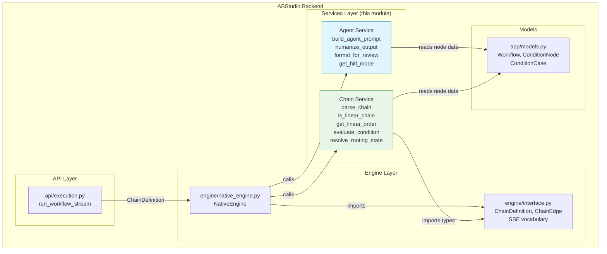
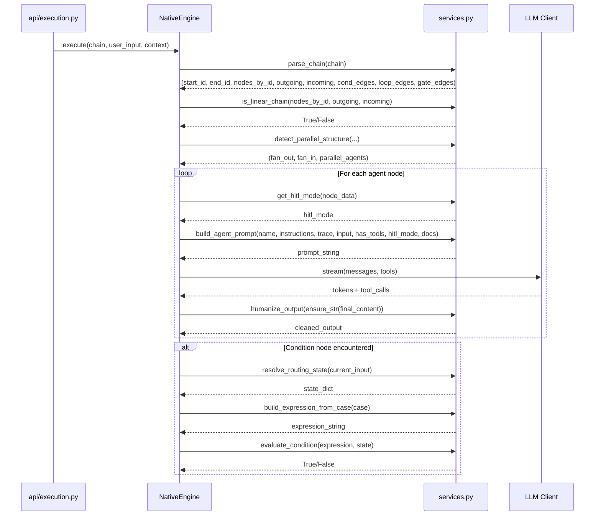
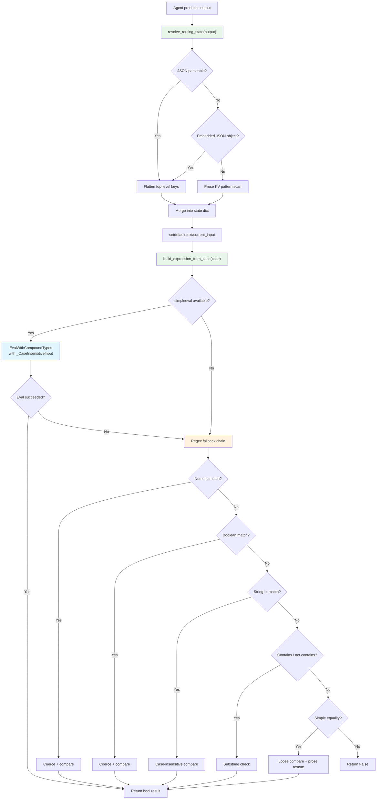
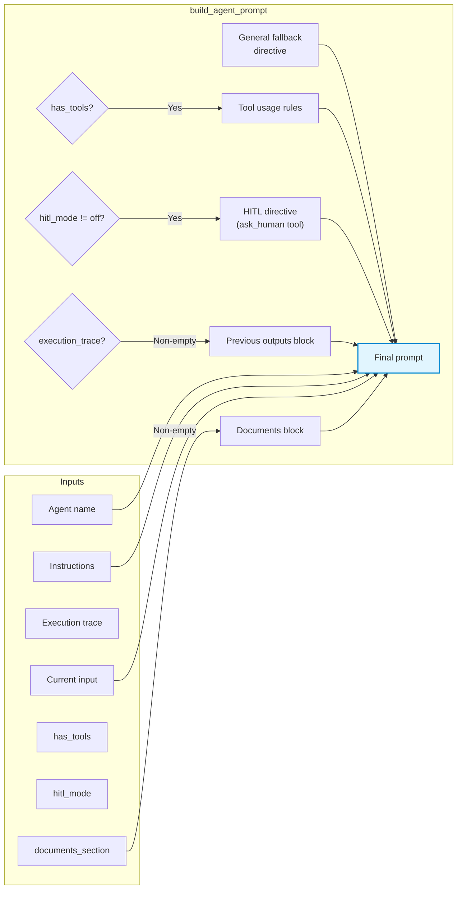
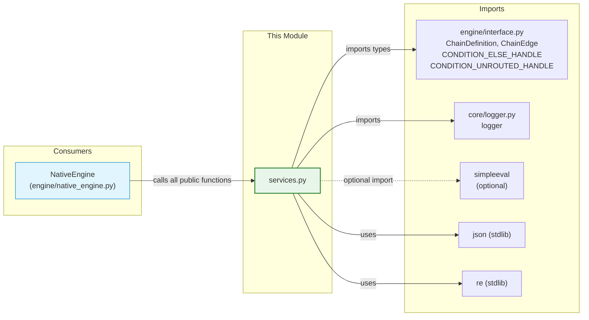

# services_services

> **File:** `ABStudio/backend/app/services/services.py`
> **Module ID:** `services_services`
> **Parent:** `abstudio_backend`

## 1. Introduction

`services_services` is the **pure-Python business-logic layer** that sits between the engine-agnostic workflow schema (defined in [`engine_native_engine`](engine_native_engine.md) → `interface.py`) and the `NativeEngine` executor. It contains **zero LLM calls, zero I/O, and zero engine-specific imports** — every function is stateless and side-effect-free, operating exclusively on plain dicts, strings, and the types from `engine/interface.py`.

The module is organised into two logical services:

| Service | Responsibility | Key Functions |
|---------|---------------|---------------|
| **Agent Service** | Prompt construction, LLM output normalisation, HITL mode parsing, Markdown formatting for human review | `build_agent_prompt`, `ensure_str`, `humanize_output`, `format_for_review`, `get_hitl_mode` |
| **Chain Service** | Workflow topology parsing, linear/parallel structure detection, condition expression evaluation, routing-state resolution | `parse_chain`, `is_linear_chain`, `get_linear_order`, `detect_parallel_structure`, `evaluate_condition`, `build_expression_from_case`, `resolve_routing_state` |

These services are consumed exclusively by [`NativeEngine`](engine_native_engine.md) (the pure-Python orchestration engine), which imports them at call sites for graph traversal, agent execution, condition routing, and loop iteration.

---

## 2. Architecture & Module Position



### Design Principles

1. **Purity** — No function in this module performs I/O, mutates global state, or calls an LLM. This makes every function trivially unit-testable and deterministic.
2. **Engine-agnostic types** — The module imports only `ChainDefinition`, `ChainEdge`, and handle constants from `engine/interface.py`, never from `native_engine.py` itself. This preserves the one-way dependency direction: services ← engine.
3. **Lenient by design** — Condition evaluation and routing-state resolution are deliberately tolerant of LLM output quirks (case differences, trailing punctuation, prose-style key/value lines, embedded JSON) so that real-world agent outputs route correctly without requiring strict JSON compliance.

---

## 3. Component Documentation

### 3.1 Agent Service

#### `build_agent_prompt(name, instructions, execution_trace, current_input, has_tools, hitl_mode, documents_section)`

Builds the full system+user prompt string for a single agent invocation. Pure function — no LLM calls, no I/O.

**Parameters:**

| Parameter | Type | Description |
|-----------|------|-------------|
| `name` | `str` | Agent display name |
| `instructions` | `str` | Agent's system instructions |
| `execution_trace` | `list[dict]` | Prior agent outputs: `[{"agent": str, "output": str}, ...]` |
| `current_input` | `str` | The live query or prior agent output |
| `has_tools` | `bool` | Whether tools are attached (injects tool-usage rules) |
| `hitl_mode` | `str` | `"off"` / `"after_response"` / `"before_tool"` / `"both"` |
| `documents_section` | `str` | Pre-rendered uploaded-document block (empty = no doc) |

**Behaviour:**
- Injects a **general fallback** directive so agents remain general-purpose assistants regardless of their specific instructions.
- When `has_tools=True`, appends **tool-usage rules** (must call file-creation tools, must not list tools, must respond in plain language after tool use).
- When `hitl_mode != "off"`, appends a **human-in-the-loop** directive instructing the agent to use the `ask_human` tool for decisions.
- When `execution_trace` is non-empty, includes prior agent outputs as context so the current agent can build upon previous work.
- The `documents_section` is injected **above** the task so the agent treats the source document as ground truth.

**Called by:** `NativeEngine._run_agent()` in [`engine_native_engine`](engine_native_engine.md).

---

#### `ensure_str(value) -> str`

Coerces any LLM output value to a plain string. Handles `None` → `""`, `dict`/`list` → `json.dumps(indent=2)`, everything else → `str()`.

---

#### `humanize_output(value: str) -> str`

Best-effort cleanup of LLM output that isn't plain prose. Handles two pathological cases:

1. **Tool-description dumps** — Detects when the LLM dumps its own tool descriptions as a bullet list (happens when `bind_tools()` falls back to text injection). Replaces with a graceful fallback message.
2. **JSON wrappers** — Strips markdown code fences, then attempts `json.loads`. If the result is a dict, extracts the most readable field (`response`, `answer`, `result`, `output`, `message`, `details`, `content`, `text`, `summary`, `reply`). Falls back to a key-value rendering.

**Called by:** `NativeEngine._run_agent()` after the ReAct loop completes, to produce the final user-visible output.

---

#### `format_for_review(value: str) -> str`

Converts raw agent output into **Markdown suitable for HITL review cards**. Used by the `after_response` HITL gate so reviewers see a readable plan instead of raw JSON braces.

**Pipeline:**
1. Strip markdown code fences (` ```json ... ``` `).
2. Attempt `json.loads` on the remainder.
3. If JSON dict: lift `title`/`name`/`heading` as an H2 heading, render remaining fields as bold-label definition blocks.
4. If JSON list: render as numbered sections with per-item headings (from `title`/`name`/`heading`/`day`).
5. If not JSON: return input untouched (prose stays prose).

Supporting helpers: `_md_escape`, `_format_value_md`, `_format_kv_md` — recursive Markdown renderers for dicts, lists (scalar bullet lists vs. dict numbered sections), and key-value pairs.

**Called by:** `NativeEngine._run_agent()` when constructing the `after_response` HITL snapshot.

---

#### `get_hitl_mode(node_dict: dict) -> str`

Normalises HITL mode from a node's data dict. Handles legacy boolean format (`True` → `"after_response"`) and current string format. Returns one of: `"off"`, `"after_response"`, `"before_tool"`, `"both"`.

**Called by:** `NativeEngine._run_agent()` at the start of each agent node execution.

---

### 3.2 Chain Service

#### `parse_chain(chain: ChainDefinition) -> tuple`

Parses a `ChainDefinition` into adjacency maps the executor can traverse. This is the **central topology parser** — every graph traversal in `NativeEngine` starts here.

**Returns an 8-tuple:**

| Index | Type | Description |
|-------|------|-------------|
| 0 | `Optional[str]` | `start_id` — the start node's id |
| 1 | `Optional[str]` | `end_id` — the end node's id |
| 2 | `Dict[str, dict]` | `nodes_by_id` — node id → raw node dict |
| 3 | `Dict[str, List[str]]` | `outgoing` — node id → list of target ids |
| 4 | `Dict[str, List[str]]` | `incoming` — node id → list of source ids |
| 5 | `Dict[str, Dict[str, str]]` | `condition_edges` — cond_id → `{handle: target_id}` |
| 6 | `Dict[str, Dict[str, str]]` | `loop_edges` — loop_id → `{'body'/'exit': target_id}` |
| 7 | `Dict[str, Dict[str, str]]` | `gate_edges` — gate_id → `{'pass'/'fail': target_id}` |

**Key behaviours:**

- **MCP node transparency** — MCP nodes are bridged out of the flow graph: their incoming and outgoing edges are connected directly, so the traversal graph only contains `start`/`agent`/`condition`/`loop`/`end`/`evaluation_gate` nodes.
- **Condition handle routing** — Each condition node's edges are stored in `condition_edges` keyed by `source_handle` (the case id or `CONDITION_ELSE_HANDLE`). Edges without a handle are routed to the synthetic `CONDITION_UNROUTED_HANDLE` so misconfigurations surface rather than silently masquerading as ELSE.
- **Loop handle routing** — Loop nodes carry `'body'` (enters the iterating subgraph) and `'exit'` (post-loop continuation) handles. Legacy edges without a handle default to `'exit'`.
- **Gate handle routing** — Evaluation-gate nodes carry `'pass'`/`'fail'` handles. Legacy edges default to `'fail'` (fail-closed).
- **Duplicate ELSE detection** — When a condition node has multiple ELSE edges, the first is kept and subsequent ones are logged and ignored.

**Called by:** `NativeEngine._build_ctx()` during `execute()` and `resume()`.

---

#### `is_linear_chain(nodes_by_id, outgoing, incoming) -> bool`

Returns `True` when the chain has **no branching and no condition nodes**. Checks:
- No node has `type == "condition"`.
- No node has more than one outgoing edge.
- No node has more than one incoming edge.

**Called by:** `NativeEngine._build_ctx()` (to determine if the fast linear path can be used).

---

#### `get_linear_order(start_id, end_id, nodes_by_id, outgoing) -> List[dict]`

Returns the **ordered list of agent nodes** from start to end, for strictly linear chains only. Walks the `outgoing` map from the start node's first successor, collecting every `agent`-type node until the end node is reached.

**Called by:** `NativeEngine._build_ctx()` when `is_linear_chain()` returns `True`.

---

#### `detect_parallel_structure(nodes_by_id, outgoing, incoming) -> Tuple[Set[str], Set[str], Set[str]]`

Identifies fan-out/fan-in and parallel agent nodes.

**Returns:**

| Element | Type | Description |
|---------|------|-------------|
| `fan_out_nodes` | `Set[str]` | Non-condition nodes with >1 outgoing edge |
| `fan_in_nodes` | `Set[str]` | Nodes with >1 incoming edge |
| `parallel_agents` | `Set[str]` | Agent node IDs that run in a parallel branch |

**Called by:** `NativeEngine._build_ctx()` and `NativeEngine._run_parallel_branches()`.

---

#### `evaluate_condition(expression: str, state: dict) -> bool`

Safely evaluates a condition expression against the current routing state. This is the **condition routing engine** — every `ConditionNode` and `while`-mode loop case is evaluated here.

**Evaluation strategy (in priority order):**

1. **simpleeval** (when available) — Uses `EvalWithCompoundTypes` with a `_CaseInsensitiveInput` wrapper over the state dict. String comparisons are case- and punctuation-insensitive via `_LooseStr`.
2. **Numeric fallback** — Matches `input.<field> <op> <number>` for `==`, `!=`, `>`, `>=`, `<`, `<=`. Coerces state values to `float`/`int`.
3. **Boolean fallback** — Matches `input.<field> == True/False`. Coerces common truthy/falsy tokens (`true`/`yes`/`1`/`approved`/`pass` → `True`; `false`/`no`/`0`/`rejected`/`fail` → `False`).
4. **String `!=` fallback** — Case-insensitive not-equals.
5. **String `contains` / `not contains` fallback** — `'X' in input.field` and `'X' not in input.field`.
6. **Simple equality fallback** — `input.<field> == 'value'` with prose-style rescue: if the field is empty, scans the full text for the value as a substring.

**Leniency features:**
- The `CLASSIFIER_NONE` sentinel (`"none"`) explicitly short-circuits to `False` so a classifier that emits "none" falls through to ELSE.
- Prose-style rescue: when the state field is empty but the value appears as a substring in the full text, the condition matches (handles LLMs that write "Intent: This is a technical issue" instead of strict JSON).

**Called by:** `NativeEngine._route_condition()` and `NativeEngine._run_loop()` (while-mode case evaluation).

---

#### `build_expression_from_case(case: dict) -> str`

Builds an evaluable expression string from a condition case dict. Handles both:
- **Structured conditions** (new format): `case.conditions[]` with `field`, `operator`, `value`, `type`. Joined by `AND`/`OR` logic.
- **Raw expression strings** (legacy): `case.expression`.

Delegates per-condition building to `_build_single_expression()`, which maps:
- `string` type → `'escaped_value'`
- `number` type → bare numeric literal (guards empty/None → `0`)
- `boolean` type → `True`/`False`
- `contains` operator → `'value' in input.field`
- `not_contains` operator → `'value' not in input.field`
- Other operators → `input.field <op> value`

**Called by:** `NativeEngine._route_condition()` and `NativeEngine._run_loop()` (pre-compiling while-mode cases).

---

#### `resolve_routing_state(current_input: str) -> dict`

Builds the evaluation dict passed to `evaluate_condition()`. This is the **state extraction engine** that turns raw agent output into the flat `input.<field>` namespace condition expressions reference.

**Extraction pipeline:**

1. **JSON parse** — Attempts `json.loads` on the full input. If that fails, tries to extract a balanced `{...}` substring from embedded JSON.
2. **Flatten** — Top-level JSON keys are spread directly into the state dict. Nested dict values are flattened one level (e.g. `{"meta": {"score": 0.8}}` → `state["score"] = 0.8`).
3. **Prose KV rescue** — Scans for key/value patterns in prose-style outputs:
   - `**Intent:** value` (bold label with colon)
   - `**Intent**: value` (bold label, colon outside)
   - `Key: value` / `Key = value` (plain key/value on its own line)
   
   Keys are normalised to Python-identifier shape (`API-Key` → `api_key`). Values are coerced: numeric strings → `int`/`float`, boolean tokens (`yes`/`no`/`true`/`false`/`approved`/`rejected`) → `bool`, trailing-prose numerics (`Score: 0.42 (high)` → `0.42`).
4. **Scan window** — For inputs >8KB, only the first and last 4KB are scanned (routing signals live at the start or end of output, never in the middle). A sentinel prevents regex matches spanning the gap.
5. **Fallbacks** — `current_input` and `text` are always available as fallback keys. `text` is seeded last via `setdefault` so JSON/KV values win over raw prose.

**Called by:** `NativeEngine._route_condition()`, `NativeEngine._run_loop()` (for_each item resolution and while-mode condition evaluation).

---

### 3.3 Helper Classes

#### `_CaseInsensitiveInput`

Attribute-style accessor over the flat state dict for `simpleeval`. Wraps string values in `_LooseStr` so condition expressions built by the UI compare case- and punctuation-insensitively against LLM output (`Technical.` vs `technical`). Performs case-insensitive key lookup as a fallback.

#### `_LooseStr(str)`

`str` subclass with case- and trailing-punctuation-insensitive equality. Overrides `__eq__`, `__ne__`, `__contains__`, and `__hash__` so that `simpleeval`'s native `==` / `in` operators compare leniently. Falls back to normal `str` semantics for all other operations.

---

## 4. Data Flow

### 4.1 Workflow Execution Data Flow



### 4.2 Condition Routing Flow



### 4.3 Prompt Construction Flow



---

## 5. Dependency Graph



### External Dependencies

| Dependency | Type | Purpose |
|-----------|------|---------|
| `engine.interface` | Internal | `ChainDefinition`, `ChainEdge`, `CONDITION_ELSE_HANDLE`, `CONDITION_UNROUTED_HANDLE` types |
| `core.logger` | Internal | Logging warnings for misconfigured edges (duplicate ELSE, missing handles) |
| `simpleeval` | External (optional) | Safe expression evaluation for condition routing. Falls back to regex-based matching when unavailable. |
| `json` | stdlib | JSON parsing for state extraction and output normalisation |
| `re` | stdlib | Regex patterns for prose KV extraction, condition fallback matching, code-fence stripping |

---

## 6. Integration with NativeEngine

The following table maps each `services.py` function to its call site(s) in [`NativeEngine`](engine_native_engine.md):

| Function | Call Site | Purpose |
|----------|-----------|---------|
| `parse_chain` | `_build_ctx()` | Build graph context (adjacency maps, edge handles) |
| `is_linear_chain` | `_build_ctx()` | Detect if fast linear path applies |
| `get_linear_order` | `_build_ctx()` | Get ordered agent list for linear chains |
| `detect_parallel_structure` | `_build_ctx()` | Identify fan-out/fan-in for parallel branch execution |
| `get_hitl_mode` | `_run_agent()` | Determine HITL gate behaviour for the node |
| `build_agent_prompt` | `_run_agent()` | Construct the LLM prompt for the agent |
| `ensure_str` | `_run_agent()`, `_build_loop_directive()` | Coerce LLM output to string |
| `humanize_output` | `_run_agent()` | Clean up final agent output for user display |
| `format_for_review` | `_run_agent()` (after_response HITL) | Render agent output as Markdown for review card |
| `resolve_routing_state` | `_route_condition()`, `_run_loop()` | Extract flat state dict from agent output |
| `build_expression_from_case` | `_route_condition()`, `_run_loop()` | Convert condition case to evaluable expression |
| `evaluate_condition` | `_route_condition()`, `_run_loop()` | Evaluate condition expression against state |

---

## 7. Key Design Decisions

### 7.1 MCP Node Transparency

MCP nodes are **bridged out** of the flow graph during `parse_chain()`. Their incoming and outgoing edges are connected directly, so the traversal graph only contains semantic node types (`start`, `agent`, `condition`, `loop`, `end`, `evaluation_gate`). This simplifies traversal logic — the engine never needs to "execute" an MCP node; it just passes through.

### 7.2 Lenient Condition Evaluation

Condition evaluation is deliberately **case- and punctuation-insensitive** for string comparisons. The UI condition builder does not enforce casing, and LLMs frequently emit values like `Technical.` or `"billing"` with trailing punctuation. Without leniency, nearly every workflow would route to ELSE by default. The `_LooseStr` subclass implements this at the value-object level so `simpleeval`'s native `==` and `in` operators compare leniently without any wrapper function.

### 7.3 Prose-Style KV Rescue

`resolve_routing_state()` includes a **prose-style key/value pattern scanner** that rescues outputs from LLMs that haven't been trained to emit strict JSON classifications. Patterns like `**Intent:** technical` or `Category = billing` are parsed into the state dict so condition nodes can still route. The scan is windowed (first/last 4KB for large outputs) to bound regex work, since routing signals never appear in the middle of a multi-KB body.

### 7.4 Fail-Closed Gate Routing

Evaluation-gate nodes default to the `'fail'` handle for legacy edges without a `source_handle`. This ensures a misconfigured gate **fails closed** rather than shipping an untested artifact — a security-conscious default.

### 7.5 Duplicate ELSE Detection

When a condition node has multiple ELSE edges (the editor doesn't prevent this), `parse_chain()` keeps the first and logs a warning for subsequent ones. This surfaces the misconfiguration rather than silently picking an arbitrary target.

---

## 8. Related Modules

| Module | Relationship |
|--------|-------------|
| [engine_native_engine](engine_native_engine.md) | **Primary consumer** — `NativeEngine` imports and calls every public function in this module for graph traversal, agent execution, condition routing, and loop iteration. |
| [app_models](app_models.md) | **Schema source** — `Workflow`, `ConditionNode`, `ConditionCase` models define the node/edge structure that `parse_chain()` consumes (via `ChainDefinition`). |
| [core_config](core_config.md) | **Configuration** — environment flags and settings that influence engine behaviour (e.g. `AGENT_MAX_ITER`, Postgres enablement). |
| [loop_runner](loop_runner.md) | **Loop integration** — `LoopRunner` uses `evaluate_condition` and `resolve_routing_state` for while-mode loop continuation checks, and `build_expression_from_case` for pre-compiling cases. |
| [engine_loop_evaluator](engine_loop_evaluator.md) | **Evaluation gates** — `LLMEvaluator` and `LoopController` work alongside the condition evaluation logic for LLM-judge-driven loop stopping. |
