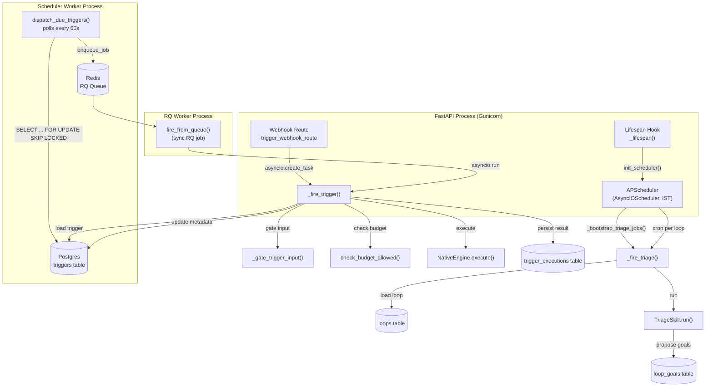
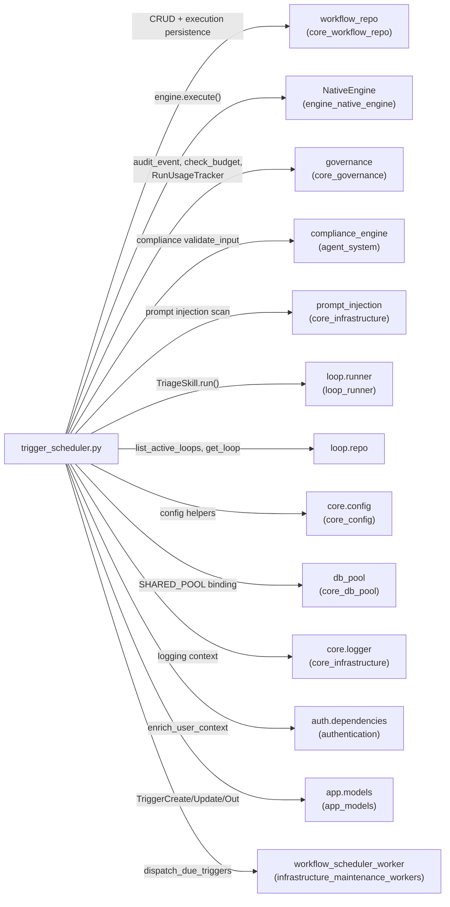
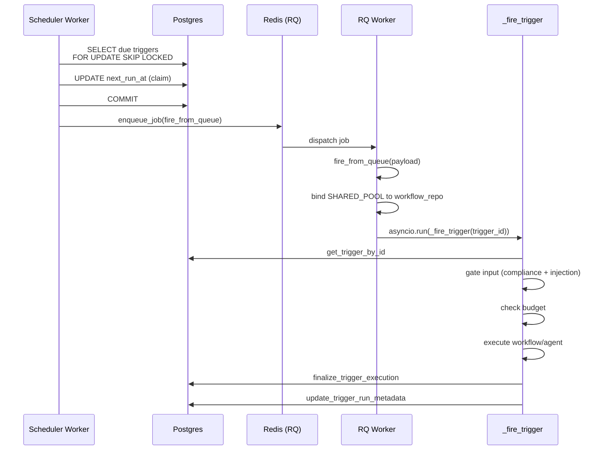
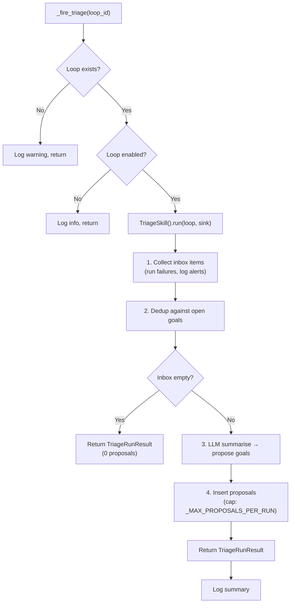
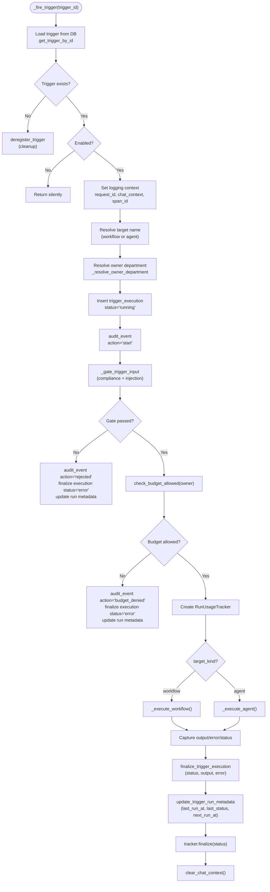
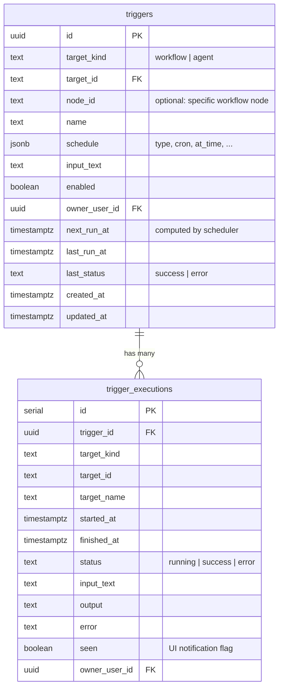
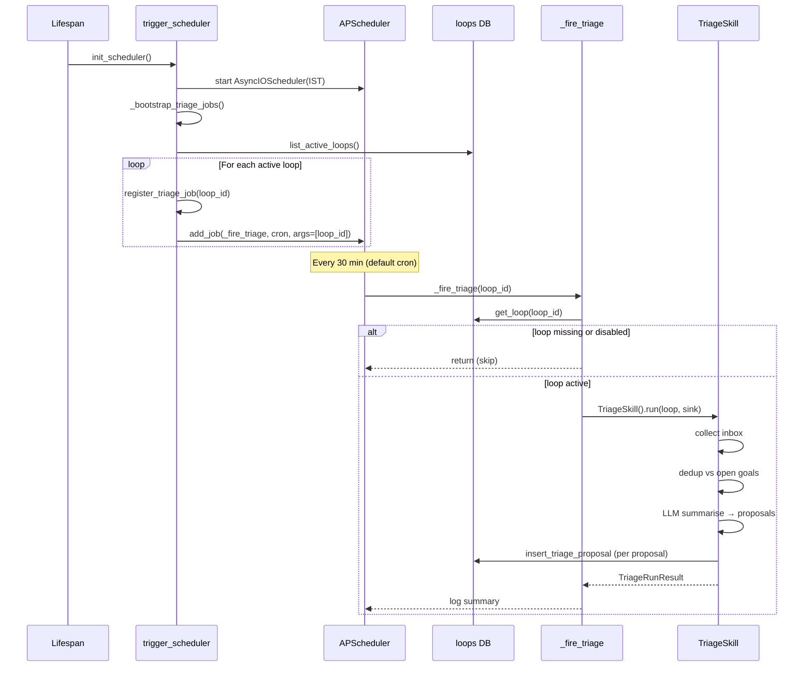
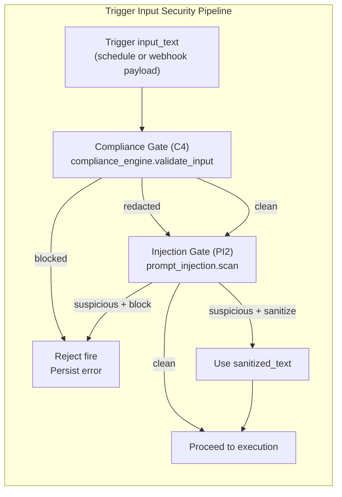

# Trigger Scheduler (`services_trigger_scheduler`)

> **File:** `ABStudio/backend/app/services/trigger_scheduler.py`
> **Core Components:** `fire_from_queue`, `_fire_triage`

## 1. Introduction

The Trigger Scheduler is the background execution engine for ABStudio's **scheduled** and **event-driven** workflow and agent runs. It bridges the gap between a user-defined schedule (cron, one-off, webhook) and the same `NativeEngine` that powers interactive runs — ensuring that triggered executions behave identically to manual ones in terms of LLM routing, RAG, tool dispatch, compliance gating, and audit logging.

The module operates on **two distinct execution paths**:

| Path | Trigger Source | Dispatch Mechanism | Entry Point | Runs In |
|------|---------------|-------------------|-------------|---------|
| **User-defined triggers** | `triggers` table (cron / date / webhook / event) | External scheduler worker → Redis (RQ) | `fire_from_queue` | RQ worker process |
| **P5 TriageSkill jobs** | Active Loop Engineering loops | In-process APScheduler | `_fire_triage` | Gunicorn / FastAPI process |

All schedules are interpreted in **IST (Asia/Kolkata)** regardless of the host machine's timezone.

---

## 2. Architecture Overview



### Key Architectural Decisions

1. **No in-process APScheduler for user triggers** — Previously, every gunicorn worker held its own APScheduler instance, causing duplicate fires (N workers = N fires per trigger). User-defined triggers are now dispatched by a **single** scheduler worker process that polls Postgres and enqueues to Redis, guaranteeing exactly-once dispatch.

2. **APScheduler retained for TriageSkill** — Loop Engineering's triage jobs are independent of the user trigger path and remain on the in-process APScheduler. They are registered at startup via `_bootstrap_triage_jobs()` and managed via `register_triage_job` / `deregister_triage_job`.

3. **Fail-safe ordering** — The scheduler worker advances `next_run_at` **before** enqueuing to Redis. This means a crash mid-batch may lose a fire (acceptable) but never double-fire (critical for user-visible triggers).

---

## 3. Dependencies



### External Module References

| Dependency | Module Doc | Role |
|-----------|-----------|------|
| `workflow_repo` | [core_workflow_repo](core_workflow_repo.md) | Trigger CRUD, execution persistence, workflow/agent lookups |
| `NativeEngine` | [engine_native_engine](engine_native_engine.md) | Workflow/agent execution via SSE streaming |
| `governance` | [core_governance](core_governance.md) | Audit events, budget checks, usage tracking |
| `compliance_engine` | [agent_system](agent_system.md) | PII/PCI compliance validation on trigger inputs |
| `prompt_injection` | [core_infrastructure](core_infrastructure.md) | Injection detection on trigger payloads |
| `loop.runner` | [loop_runner](loop_runner.md) | `TriageSkill` for Loop Engineering triage cycles |
| `core.config` | [core_config](core_config.md) | `triage_interval_cron`, `loop_triage_enabled`, LLM endpoint helpers |
| `db_pool` | [core_db_pool](core_db_pool.md) | `SHARED_POOL` for lazy pool binding in RQ workers |
| `app.models` | [app_models](app_models.md) | `TriggerCreate`, `TriggerUpdate`, `TriggerSchedule`, `TriggerOut` |
| `workflow_scheduler_worker` | [infrastructure_maintenance_workers](infrastructure_maintenance_workers.md) | `dispatch_due_triggers` — the external poller |

---

## 4. Core Components

### 4.1 `fire_from_queue(payload: Dict[str, Any]) -> None`

**Synchronous RQ job function** — the entry point invoked by the scheduler worker after it picks a due trigger from Postgres and enqueues it to Redis.

#### Responsibilities

1. **Extract `trigger_id`** from the RQ payload (`{"trigger_id": "<id>"}`).
2. **Lazy-bind the DB pool** — RQ worker processes don't run the FastAPI lifespan, so `workflow_repo._pool` may be `None`. The function binds it to the platform's `SHARED_POOL` from `app.core.db_pool`. Critically, it writes to `app.core.workflow_repo._pool` (the real module), not the `app.workflow_repo` back-compat shim, because the shim's `from … import *` does not re-export underscore-prefixed names.
3. **Delegate to async `_fire_trigger`** via `asyncio.run()`, with a fallback to a fresh event loop if already inside a running loop (dev-mode oddity).

#### Data Flow



---

### 4.2 `_fire_triage(loop_id: str) -> None`

**APScheduler callback** — runs one `TriageSkill` triage cycle for a Loop Engineering loop.

#### Responsibilities

1. **Lazy-import** `loop.repo` and `loop.runner.TriageSkill` to avoid import cycles (module load order: `trigger_scheduler` → `loop.repo` → `loop.runner`).
2. **Load the loop** from the loops repository; skip if it no longer exists or is disabled.
3. **Run `TriageSkill().run()`** with a logging-only SSE sink (the cron path has no live consumer; the manual `/run-now` endpoint pushes frames into a real SSE queue).
4. **Log the result** — inbox size, proposals accepted, elapsed time, failure reason.
5. **Never raises** — wrapped in try/except so a rogue change in the skill can't kill the scheduler thread.

#### TriageSkill Execution Flow



---

## 5. Internal Execution Pipeline (`_fire_trigger`)

The async `_fire_trigger` function is the heart of user-defined trigger execution. It is called by both `fire_from_queue` (RQ path) and `trigger_webhook_route` (webhook path via `asyncio.create_task`).



### 5.1 Input Gate (`_gate_trigger_input`)

Trigger inputs are an **untrusted ingestion point**. The gate enforces two layers, both failing **open** on scanner errors:

| Layer | Requirement | Behavior on Block | Config |
|-------|------------|-------------------|--------|
| **Compliance (C4)** | `compliance_engine.validate_input` | Reject fire; persist error | Blocks on PAN/CVV/sensitive data |
| **Injection (PI2)** | `core.prompt_injection.scan` | Block (default) or sanitize | `ABS_INJECTION_POLICY_TRIGGER` env: `block` \| `sanitize` |

### 5.2 Budget Preflight

Before execution, `check_budget_allowed(owner)` verifies the trigger owner has remaining LLM budget. If denied, the execution is finalized as `error` with the deny reason, and an audit event with `action="budget_denied"` is recorded. Budget enforcement fails open when the budget store is unavailable.

### 5.3 Workflow Execution (`_execute_workflow`)

1. **Load workflow** graph data from Postgres via `workflow_repo.get_workflow`.
2. **Normalise nodes** — `_normalise_workflow_nodes` converts React-Flow stored nodes into the engine's expected shape, resolving LLM config via proxy-first endpoint resolution (`LLM_PROXY_URL` → `OPENAI_COMPATIBLE_BASE_URL` → `LOCAL_LLM_BASE_URL` → localhost).
3. **Optional node slicing** — if the trigger is bound to a specific `node_id`, `_slice_chain_from_node` performs a BFS forward from that node, keeping the original Start node as the engine entry point with a synthetic direct edge.
4. **Build `ChainDefinition`** with normalised nodes and `ChainEdge` objects.
5. **Execute** via `get_engine().execute(chain, user_input, context)` — streams SSE events, capturing the last `agent_complete` or `complete` payload as the final output.
6. **Usage tracking** — `RunUsageTracker.observe_event` processes each SSE payload for token/cost accounting.

### 5.4 Agent Execution (`_execute_agent`)

Wraps a saved agent in a **one-node Start → Agent → End workflow** so it routes through the same engine, history, and RAG plumbing as an interactive `/run`:

```
start-1 → agent-1 → end-1
```

The agent's stored `model_name` is used; when blank, it falls back to `LOCAL_LLM_MODEL` env var.

---

## 6. Schedule System

### 6.1 Schedule Types

Defined in `app.models.TriggerScheduleType`:

| Type | Fields Used | APScheduler Trigger | Description |
|------|------------|---------------------|-------------|
| `once` | `run_at` | `DateTrigger` | One-time fire at a specific IST datetime |
| `hourly` | `at_minute` | `CronTrigger(minute=…)` | Recurring hourly at a specific minute |
| `daily` | `at_time` | `CronTrigger(hour=…, minute=…)` | Daily at HH:MM IST |
| `weekdays` | `at_time` | `CronTrigger(day_of_week="mon-fri", …)` | Mon–Fri at HH:MM IST |
| `weekly` | `at_time`, `day_of_week` | `CronTrigger(day_of_week=…, …)` | Weekly on a specific day at HH:MM IST |
| `custom` | `cron` | `CronTrigger.from_crontab(…)` | Arbitrary 5-field cron in IST |
| `webhook` | `event_source`, `event_type`, `secret` | None (event-driven) | Fires via signed webhook ingestion |
| `event` | `event_source`, `event_type` | None (event-driven) | Fires via platform event |

### 6.2 Schedule → APScheduler Conversion

`_build_apscheduler_trigger(schedule)` translates the JSON schedule blob into an APScheduler trigger. Returns `None` for malformed schedules so a single bad row can't crash startup. `_compute_next_run_at(schedule)` reuses this function to compute the next fire time, with a special guard for `once` triggers that have already passed.

### 6.3 Webhook / Event Triggers

Webhook triggers are **not** time-scheduled. They fire via the signed ingestion route (`api/triggers.py::trigger_webhook_route`), which:

1. Verifies an HMAC-SHA256 signature (or GitLab shared-secret token) over the raw body.
2. Rate-limits after signature verification (so only authenticated callers consume the bucket).
3. Matches the event type against the trigger's configured filter.
4. Fires `_fire_trigger` as a background `asyncio.create_task` (returns 202 immediately).

See [api_triggers](api_triggers.md) for the full webhook flow.

---

## 7. Public API

The module exposes a minimal public surface; everything else is implementation detail.

| Function | Purpose | Called By |
|----------|---------|-----------|
| `init_scheduler()` | Start APScheduler (triage only) + bootstrap triage jobs | `_lifespan` in [app_main](app_main.md) |
| `shutdown_scheduler()` | Stop APScheduler, clear job indices | `_lifespan` |
| `register_trigger(trigger)` | Compute initial `next_run_at` for a new/updated trigger | `create_trigger_route`, `update_trigger_route` in [api_triggers](api_triggers.md) |
| `deregister_trigger(trigger_id)` | No-op (DB is source of truth) | `delete_trigger_route` |
| `reschedule_trigger(trigger)` | Compute new `next_run_at` after update | `update_trigger_route` |
| `get_next_run(trigger_id)` | Legacy shim — returns `None` (read DB row directly) | `_trigger_to_out` fallback |
| `register_triage_job(loop_id, cron)` | Register/replace a TriageSkill cron job | Loop CRUD endpoints, `_bootstrap_triage_jobs` |
| `deregister_triage_job(loop_id)` | Remove a triage job | Loop disable/delete endpoints |
| `fire_from_queue(payload)` | RQ entry point for user trigger fires | Scheduler worker via Redis |

---

## 8. Persistence Model



The UI polls `trigger_executions` for notifications ("your scheduled task has been executed"). The `seen` flag drives the unseen-execution badge in the frontend trigger notifications panel.

---

## 9. TriageSkill Job Lifecycle



### Triage Configuration

| Config | Env Var | Default | Description |
|--------|---------|---------|-------------|
| `loop_triage_enabled()` | `LOOP_TRIAGE_ENABLED` | `true` | Master switch for triage cron jobs |
| `triage_interval_cron()` | `TRIAGE_INTERVAL_CRON` | `*/30 * * * *` | Cron expression for triage frequency (IST) |

Triage jobs use APScheduler's `misfire_grace_time=300`, `max_instances=1`, and `coalesce=True` so a missed tick (host pause/restart) doesn't trigger a thundering herd of catch-up runs.

---

## 10. Security & Compliance



| Control | ID | Layer | Fail Mode |
|---------|-----|-------|-----------|
| Compliance validation | C4 | `compliance_engine.validate_input` | Fail open (scanner error → proceed) |
| Prompt injection scan | PI2 | `core.prompt_injection.scan` | Fail open (scanner error → proceed) |
| Budget preflight | — | `check_budget_allowed` | Fail open (store unavailable → proceed) |
| Webhook signature | REQ-T1 | HMAC-SHA256 / GitLab token | Fail closed (bad signature → 401) |
| Webhook rate limit | REQ-T4 | Per-trigger token bucket | Fail closed (over limit → 503) |
| Audit trail | — | `audit_event` at start/reject/budget_denied/success/error | Best-effort (never raises) |

---

## 11. Integration Points

### 11.1 FastAPI Lifespan ([app_main](app_main.md))

`init_scheduler()` is called from `_lifespan` **after** `workflow_repo.init_db()` completes. `shutdown_scheduler()` is called during lifespan teardown.

### 11.2 API Layer ([api_triggers](api_triggers.md))

The triggers API (`api/triggers.py`) calls `register_trigger` / `reschedule_trigger` / `deregister_trigger` on CRUD operations to compute and persist `next_run_at`. The webhook route calls `_fire_trigger` directly via `asyncio.create_task`.

### 11.3 Scheduler Worker ([infrastructure_maintenance_workers](infrastructure_maintenance_workers.md))

`workers/workflow_scheduler_worker.py::dispatch_due_triggers` runs every 60 seconds, polls the `triggers` table for due rows using `FOR UPDATE SKIP LOCKED`, advances `next_run_at`, and enqueues `fire_from_queue` to Redis.

### 11.4 Loop Engineering ([loop_runner](loop_runner.md))

Loop CRUD endpoints call `register_triage_job` / `deregister_triage_job` to keep APScheduler in sync with the loops table. `_fire_triage` delegates to `TriageSkill.run()` from [loop_runner](loop_runner.md).

### 11.5 Execution Engine ([engine_native_engine](engine_native_engine.md))

Both `_execute_workflow` and `_execute_agent` build a `ChainDefinition` and call `get_engine().execute()`, streaming SSE events. The engine handles LLM routing, tool dispatch, RAG, HITL, compliance gates, and chat history — identical to interactive runs.

---

## 12. Logging & Observability

Each trigger fire stamps the `core.logger` thread-local context for correlatable logs:

| Field | Value |
|-------|-------|
| `request_id` | `trigger_id` |
| `chat_context.user_id` | Owner user ID |
| `chat_context.chat_id` | Target ID (workflow/agent) |
| `span_id` | `"trigger"` |
| `client_source` | `"abstudio"` |

The context is cleared via `clear_chat_context()` at the end of each fire so the next job on the same thread starts clean.

Audit events are written at four lifecycle points:
- **`start`** — trigger fire begins (with execution_id, target_kind)
- **`rejected`** — compliance/injection gate blocked the input
- **`budget_denied`** — owner's budget was exhausted
- **`success` / `error`** — via `RunUsageTracker.finalize()` (with tokens, cost, latency)
