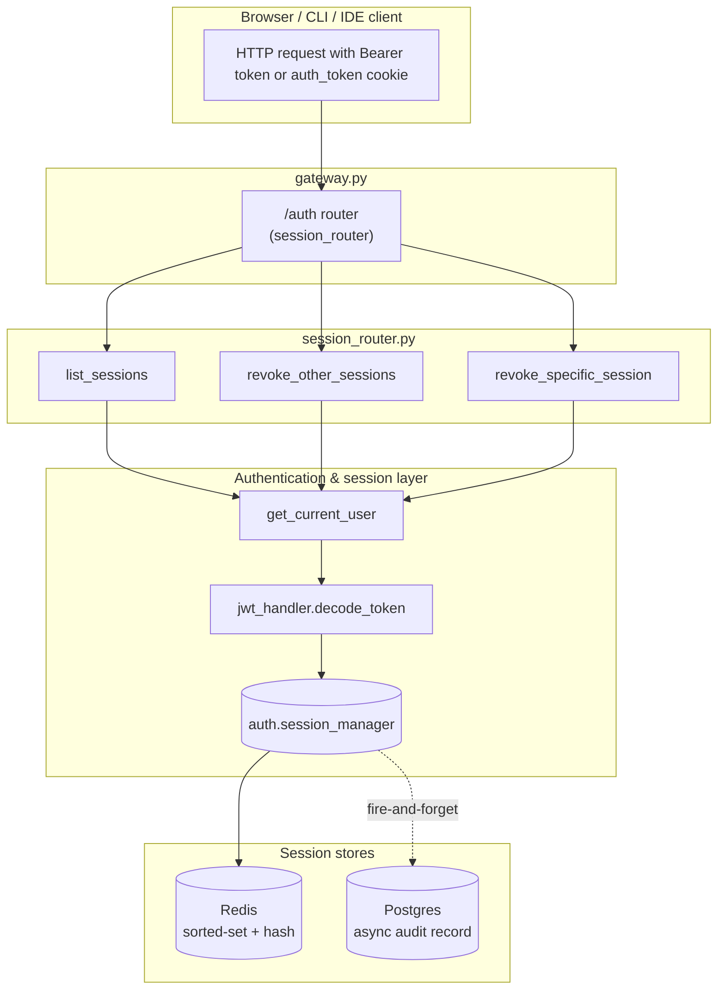
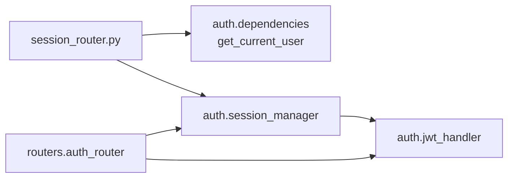
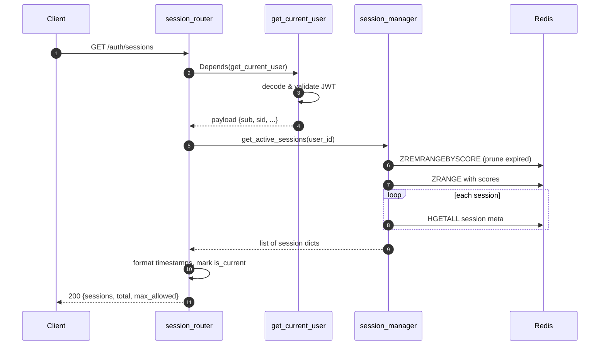
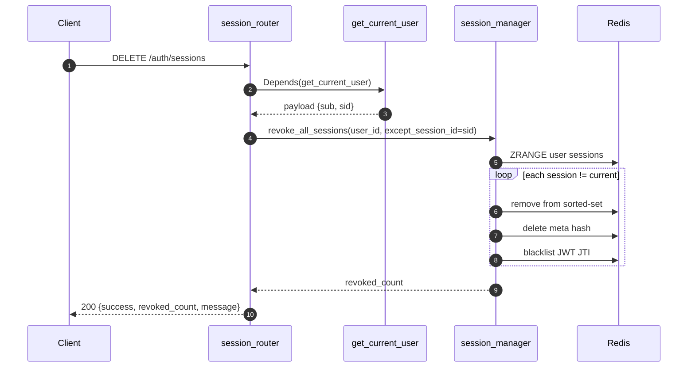
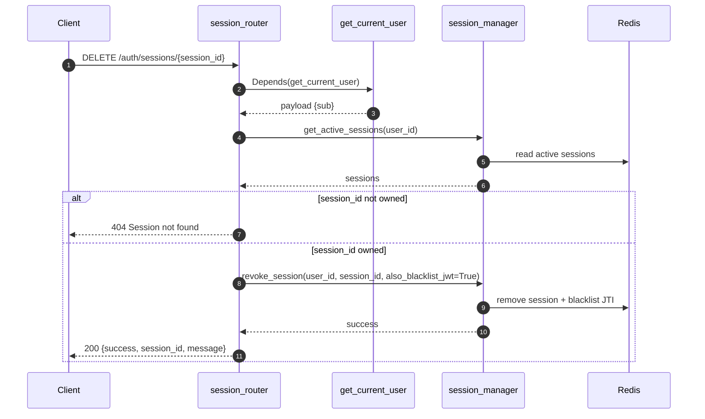
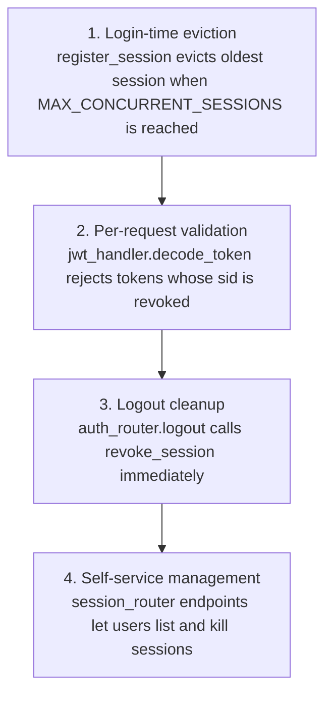

# session_router

The `session_router` module exposes self-service REST endpoints that let authenticated users inspect and terminate their own active login sessions. It was introduced to remediate a DAST finding about uncontrolled concurrent sessions: the platform previously allowed an unlimited number of parallel authenticated sessions for the same user account without visibility or remediation controls.

The router is mounted under the `/auth` prefix (see [gateway.md](gateway.md) for the application route table) and provides three operations:

- `GET /auth/sessions` — list all active sessions for the calling user.
- `DELETE /auth/sessions` — revoke every session **except** the current one ("sign out everywhere else").
- `DELETE /auth/sessions/{session_id}` — revoke a single, user-owned session.

Session enforcement is not implemented in the router alone; it is one layer of a broader concurrent-session control strategy that also includes automatic eviction at login time, per-request `sid` validation in the JWT decoder, and immediate revocation on logout.

---

## Architecture

The router is intentionally thin. It validates identity through `get_current_user`, delegates all session state operations to `auth.session_manager`, and relies on Redis as the source of truth for active sessions. Postgres receives an asynchronous audit record when sessions are created or revoked.

---

## Core Components

### `list_sessions`

Returns every active session belonging to the authenticated user, newest first. Each entry contains:

| Field | Description |
|-------|-------------|
| `session_id` | UUID that identifies the session. |
| `ip` | IP address captured at login time. |
| `device` | Browser / OS hint derived from the `User-Agent`. |
| `user_agent` | Raw `User-Agent` string, truncated to 512 characters. |
| `created_at` | Human-readable login timestamp in UTC. |
| `is_current` | `true` when the entry is the session making the request. |

The response also includes `total` and `max_allowed` (read from the `MAX_CONCURRENT_SESSIONS` environment variable, default `5`).

### `revoke_other_sessions`

Implements "sign out everywhere else". It revokes every session for the user except the one identified by the `sid` claim in the current JWT. The endpoint returns the number of revoked sessions and leaves the caller's session active.

### `revoke_specific_session`

Revokes a single session by ID. The router first verifies that the supplied `session_id` belongs to the authenticated user; otherwise it returns HTTP 404. When a session is revoked, the corresponding JWT is also added to the revocation blacklist (`also_blacklist_jwt=True`), so any in-flight request carrying that token is rejected immediately by `jwt_handler.decode_token`.

---

## Dependencies

| Dependency | Role in this module |
|------------|---------------------|
| `auth.dependencies.get_current_user` | Extracts and validates the JWT or API key, enriches the identity payload, and returns the user's `sub` and current `sid`. See [auth_dependencies.md](auth_dependencies.md). |
| `auth.session_manager` | Provides `get_active_sessions`, `revoke_all_sessions`, and `revoke_session`. This is the authoritative session store interface. See [session_manager.md](session_manager.md). |
| `auth.jwt_handler.decode_token` | Validates the JWT on every request and checks that the `sid` claim is still active. See [jwt_handler.md](jwt_handler.md). |
| `routers.auth_router` | Creates sessions during login/SSO and calls `revoke_session` on logout. See [auth_router.md](auth_router.md). |

---

## Data Flow

### Listing sessions

### Revoking all other sessions

### Revoking a specific session

---

## Concurrent-Session Control Strategy

The router is the user-facing piece of a four-layer defense:

1. **Login-time eviction** — `auth.session_manager.register_session` prunes expired sessions and evicts the oldest active sessions when the concurrent limit would be exceeded.
2. **Per-request validation** — `jwt_handler.decode_token` checks the `sid` claim against the active session registry on every authenticated request, so revoked-session tokens fail with HTTP 401 even before their natural expiry.
3. **Logout cleanup** — `auth_router.logout` calls `revoke_session` to free the slot immediately.
4. **Self-service management** — the endpoints in this module let users inspect activity and terminate suspicious sessions.

---

## Security & Operational Notes

- **No PII in JWTs**: the JWT contains only opaque claims (`sub`, `sid`, `role`, `org_id`, `ad_level`). Display metadata such as email and department is fetched server-side by `get_current_user`.
- **Immediate revocation**: `revoke_specific_session` blacklists the JWT JTI, so revocation takes effect on the next request without waiting for the token to expire.
- **Ownership enforcement**: users can only list or revoke sessions that belong to their own `sub`.
- **Grace TTLs**: Redis keys receive a small TTL buffer (`_SESSION_TTL + 60`) to avoid race conditions between expiry and cleanup.
- **Postgres persistence**: session creation and revocation are mirrored to Postgres asynchronously for audit and analytics; the operational source of truth remains Redis.
- **Environment variable**: `MAX_CONCURRENT_SESSIONS` controls the platform-wide limit and is surfaced in the list response so clients can display capacity.

---

## Related Modules

- [auth_router.md](auth_router.md) — login, logout, SSO, and token cookie handling.
- [session_manager.md](session_manager.md) — Redis/Postgres session registry implementation.
- [jwt_handler.md](jwt_handler.md) — token encoding, decoding, and `sid` validation.
- [auth_dependencies.md](auth_dependencies.md) — identity extraction and enrichment.
- [gateway.md](gateway.md) — top-level FastAPI application and router mounting.
