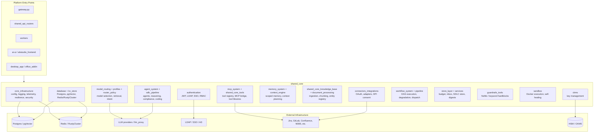
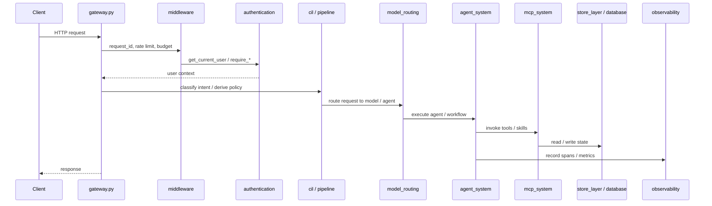

# `shared_core` Module Overview

## Purpose

`shared_core` is the foundational, shared layer of the AiNxt / ABStudio platform. It contains the cross-cutting infrastructure, business logic, and integration primitives that every other module depends on, while remaining free of product-specific UI or standalone service entry points. Its responsibilities span:

- **Core infrastructure** — configuration, structured logging, telemetry, resilience primitives, security controls, and LLM-agnostic tooling.
- **Data persistence** — SQLAlchemy engines, ORM models, Row-Level Security, and backend-agnostic KV storage.
- **Identity & access control** — JWT/API-key authentication, LDAP/AD integration, SSO, and RBAC/ABAC helpers.
- **Agentic runtime** — agent builders, ReAct / multi-agent orchestration, advanced reasoning, compliance engines, and the SDLC coding pipeline.
- **Model routing & context** — model selection, hybrid retrieval, knowledge-graph traversal, intent classification, and context engineering.
- **Tooling & integrations** — MCP registry, connector adapters, guardrails, document processing, sandbox execution, and shared tool libraries.
- **Workflows, memory, notifications, budgets, evals, and governance** — durable state machines, scoped memory, inbox/notifications, cost governance, and safe self-improvement hooks.

The design goal of `shared_core` is to centralize behavior that would otherwise be duplicated across gateways, routers, workers, and frontends, while exposing stable, backend-agnostic primitives that keep higher-level modules small and focused.

---

## Architecture

`shared_core` sits between the platform's entry points (gateway, routers, workers, frontends) and the external infrastructure (Postgres, Redis/RustyCluster, LLM providers, identity providers, SaaS APIs).

### Request Flow Through `shared_core`

A typical request is authenticated, routed, and executed through several `shared_core` layers before a response is returned.

---

## Core Components Documentation

The `shared_core` module is organized into the following sub-modules. Each has its own detailed documentation.

| Sub-module | Responsibility | Documentation |
|------------|----------------|---------------|
| `core_infrastructure` | Configuration, logging, telemetry, resilience, security, LLM tooling, jobs, notifications, i18n | [core_infrastructure](core_infrastructure.md) |
| `database` | SQLAlchemy engines, ORM models, RLS, migrations | [database](database.md) |
| `authentication` | JWT/API-key auth, LDAP, SSO, RBAC/ABAC | [authentication](authentication.md) |
| `agent_system` | Agent framework, orchestration, reasoning, compliance, safety | [agent_system](agent_system.md) |
| `shared_core_sdlc_pipeline` | AI-driven software delivery lifecycle engine | [shared_core_sdlc_pipeline](shared_core_sdlc_pipeline.md) |
| `mcp_system` | MCP registry, tool/skill routing, external MCP clients | [mcp_system](mcp_system.md) |
| `memory_system` | Durable scoped memory and sensitivity-aware storage | [memory_system](memory_system.md) |
| `middleware` | Request ID, client source, rate limiting, budget middleware | [middleware](middleware.md) |
| `model_routing` | Model selection, hybrid search, knowledge graph, KB versioning | [model_routing](model_routing.md) |
| `shared_core_knowledge_base` | Document ingestion, chunking, entity registry | [shared_core_knowledge_base](shared_core_knowledge_base.md) |
| `connectors_integrations` | OAuth, connector adapters, DPI consent | [connectors_integrations](connectors_integrations.md) |
| `guardrails_tools` | Runtime input safety / NeMo Guardrails | [guardrails_tools](guardrails_tools.md) |
| `workflow_system` | DAG-based workflow execution and planners | [workflow_system](workflow_system.md) |
| `store_layer` | Domain stores for budget, inbox, SDLC, threads, SSO | [store_layer](store_layer.md) |
| `services` | Budget digests, coach ingestion, Teams integration, notifications | [services](services.md) |
| `llm_spend` | LLM spend fetching and reporting | [llm_spend](llm_spend.md) |
| `coach_system` | Coach rule evaluation and feedback | [coach_system](coach_system.md) |
| `tenx_system` | TenX award submission and evaluation | [tenx_system](tenx_system.md) |
| `evals_evolution` | Evaluation harness and safe self-improvement | [evals_evolution](evals_evolution.md) |
| `pipeline` | Degradation ladder, dispatch decisions, stream events | [pipeline](pipeline.md) |
| `profiles` | Domain profiles and policy-as-data | [profiles](profiles.md) |
| `router_policy` | Pure model-selection policy | [router_policy](router_policy.md) |
| `observability` | Turn tracing and metrics | [observability](observability.md) |
| `sandbox` | Secure code and document execution | [sandbox](sandbox.md) |
| `cil` | Conversation Intelligence Layer | [cil](cil.md) |
| `context_engine` | Context-window planning | [context_engine](context_engine.md) |
| `document_processing` | Docling / legacy document parsing | [document_processing](document_processing.md) |
| `kv_store` | Backend-agnostic Redis/RustyCluster layer | [kv_store](kv_store.md) |
| `ckms` | Centralized key management | [ckms](ckms.md) |
| `indexers` | Confluence / Jira indexing | [indexers](indexers.md) |
| `ainxt_scripts` | CI indexing and validation scripts | [ainxt_scripts](ainxt_scripts.md) |
| `presenton_patches` | Presentation-generation compatibility layer | [presenton_patches](presenton_patches.md) |
| `shared_core_tools` | Agent-callable tool libraries | [shared_core_tools](shared_core_tools.md) |
| `scripts_utilities` | Operational and seeding scripts | [scripts_utilities](scripts_utilities.md) |
| `dev_workspace` | Development scratchpad utilities | [dev_workspace](dev_workspace.md) |
| `gunicorn_config` | Production Gunicorn configuration | [gunicorn_config](gunicorn_config.md) |
| `doc_generation` | Document-generation helpers | [doc_generation](doc_generation.md) |