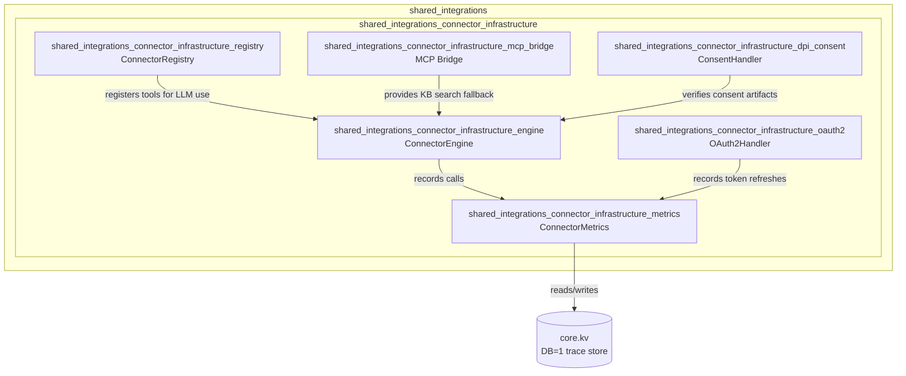
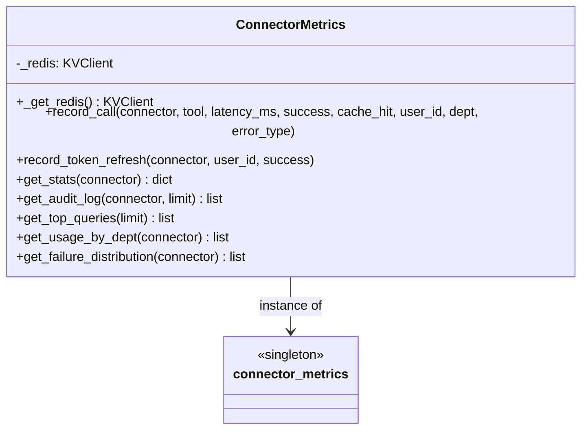
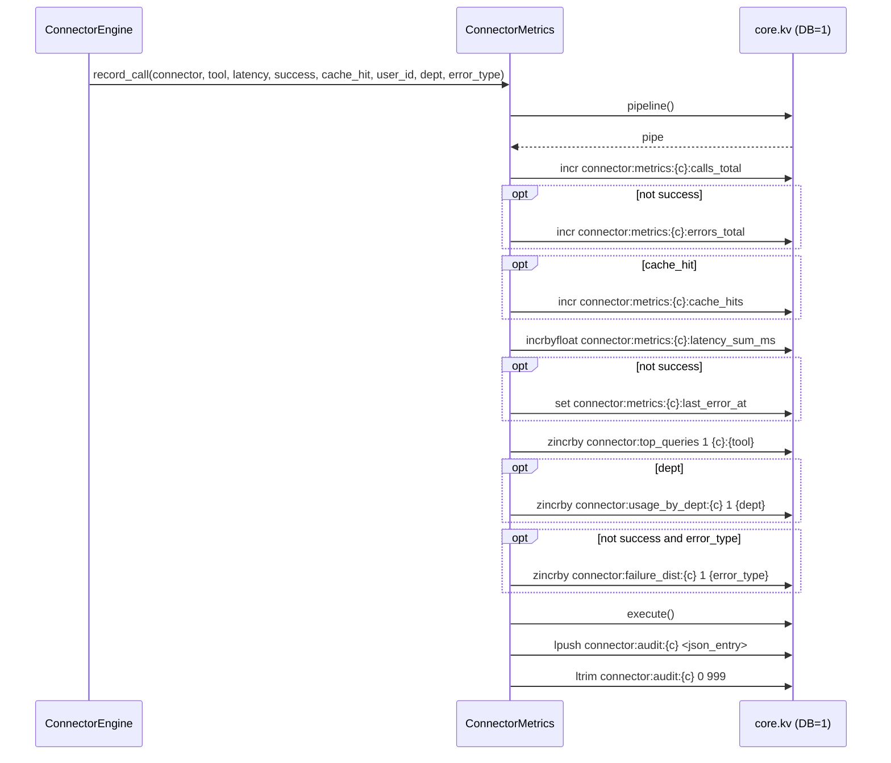
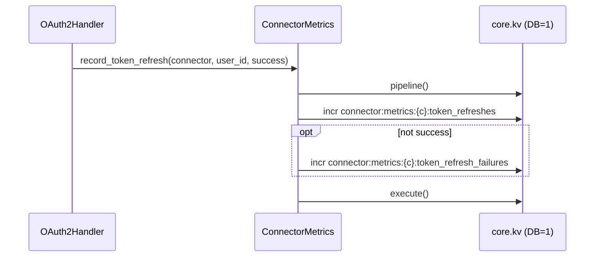
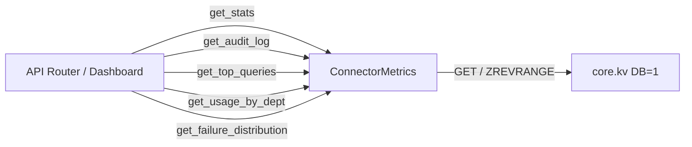
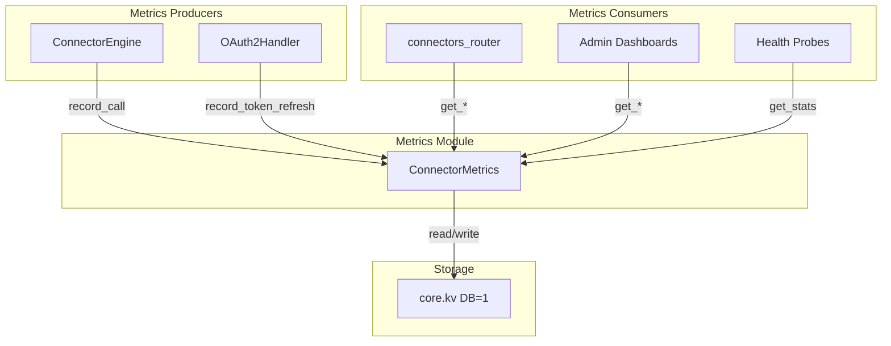

# shared_integrations_connector_infrastructure_metrics

## Brief Introduction

The `shared_integrations_connector_infrastructure_metrics` module provides lightweight, KV-backed observability for connector executions across the AiNxt platform. It is implemented by a single class, `ConnectorMetrics`, which records per-connector call statistics, token refresh outcomes, and structured audit trails without adding synchronous database load. All metrics are written to the trace KV store (logical DB 1) and are designed to be best-effort: failures are logged at debug level and never propagate into the critical connector execution path.

This module is part of the broader [shared_integrations_connector_infrastructure](shared_integrations_connector_infrastructure.md) subsystem, sitting alongside the connector engine, registry, OAuth2 handler, MCP bridge, and DPI consent handler.

---

## Module Purpose and Core Functionality

`ConnectorMetrics` is responsible for:

1. **Recording connector tool invocations** — success/failure, latency, cache hits, user, department, and error type.
2. **Recording OAuth token refresh attempts** — success and failure counters per connector.
3. **Serving aggregated statistics** — call totals, error rates, average latency, cache hit rates, and last error timestamps.
4. **Maintaining audit history** — the last 1,000 JSON audit entries per connector for operational forensics.
5. **Exposing usage analytics** — top queries across connectors, per-department usage, and failure distributions grouped by error type.

The class is intentionally simple and stateless. It lazily initializes a KV client on first use and exposes a module-level singleton, `connector_metrics`, that the rest of the platform imports directly.

### Core Components

| Component | File | Responsibility |
|-----------|------|----------------|
| `ConnectorMetrics` | `connectors/metrics.py` | Records and retrieves all connector-related metrics. |
| `connector_metrics` | `connectors/metrics.py` | Module-level singleton instance of `ConnectorMetrics`. |

### Key Methods

| Method | Purpose |
|--------|---------|
| `record_call(connector, tool, latency_ms, success, cache_hit, user_id, dept, error_type)` | Atomically updates counters, sorted sets, and the audit log for a single tool invocation. |
| `record_token_refresh(connector, user_id, success)` | Tracks successful and failed OAuth token refresh attempts. |
| `get_stats(connector)` | Returns aggregate statistics for a connector. |
| `get_audit_log(connector, limit)` | Returns recent audit entries. |
| `get_top_queries(limit)` | Returns the most frequently invoked `connector:tool` pairs globally. |
| `get_usage_by_dept(connector)` | Returns per-department call counts for a connector. |
| `get_failure_distribution(connector)` | Returns failure counts grouped by `error_type`. |

---

## Architecture and Component Relationships

### High-Level Placement

### Internal Class Structure

---

## Data Flow

### Recording a Connector Tool Call

When [ConnectorEngine](shared_integrations_connector_infrastructure_engine.md) executes a tool, it calls `connector_metrics.record_call(...)` both on cache hits and after the adapter returns. The metrics layer writes the following data atomically via a pipeline:

### Recording a Token Refresh

The [OAuth2Handler](shared_integrations_connector_infrastructure_oauth2.md) calls `record_token_refresh` after every refresh attempt. This updates two counters per connector:

### Reading Metrics

Read methods are used by dashboards, health probes, and the [connectors_router](shared_api_routers_connectors_router.md) `get_metrics` endpoint. They fetch from the same KV keys and sorted sets written during recording.

---

## KV Key Schema

All keys live in the trace store (`RDB_TRACE = 1`). The backend is selected by `REDIS_CLIENT_CONFIG_DB1` and defaults to the global `REDIS_CLIENT_CONFIG` setting.

| Key Pattern | Type | Description |
|-------------|------|-------------|
| `connector:metrics:{connector}:calls_total` | String (counter) | Total tool invocations. |
| `connector:metrics:{connector}:errors_total` | String (counter) | Failed invocations. |
| `connector:metrics:{connector}:cache_hits` | String (counter) | Cache hits. |
| `connector:metrics:{connector}:latency_sum_ms` | String (float) | Sum of latencies in milliseconds. |
| `connector:metrics:{connector}:last_error_at` | String (epoch) | Timestamp of the last error. |
| `connector:metrics:{connector}:token_refreshes` | String (counter) | Successful token refresh attempts. |
| `connector:metrics:{connector}:token_refresh_failures` | String (counter) | Failed token refresh attempts. |
| `connector:top_queries` | Sorted set | Global `connector:tool` → call count. |
| `connector:usage_by_dept:{connector}` | Sorted set | Department → call count per connector. |
| `connector:failure_dist:{connector}` | Sorted set | `error_type` → failure count per connector. |
| `connector:audit:{connector}` | List (JSON) | Last 1,000 audit entries. |

---

## Error Handling and Resilience

- **Lazy connection**: The KV client is created only on first use via `_get_redis()`.
- **Non-critical failures**: All `record_*` and `get_*` methods wrap operations in `try/except` and log at `debug` level. A missing KV backend does not block connector execution.
- **Pipeline atomicity**: Counter and sorted-set updates for a single call are sent as one pipeline, but the audit log push is a separate operation after `pipe.execute()`.
- **Bounded audit log**: Each connector's audit list is trimmed to the most recent 1,000 entries to prevent unbounded growth.

---

## How It Fits into the Overall System

`ConnectorMetrics` is a cross-cutting observability utility consumed by the connector execution layer. It does not own business logic; it only records and surfaces operational data.

### Upstream Callers

- **[ConnectorEngine](shared_integrations_connector_infrastructure_engine.md)** — records every tool execution outcome, including cache hits, successes, and failures with error classification.
- **[OAuth2Handler](shared_integrations_connector_infrastructure_oauth2.md)** — records token refresh success/failure.

### Downstream Consumers

- **[connectors_router](shared_api_routers_connectors_router.md)** — exposes metrics through the `get_metrics` endpoint.
- **Admin dashboards and health probes** — use `get_stats`, `get_top_queries`, and `get_failure_distribution` for operational visibility.
- **core.kv** — provides the backend-agnostic storage layer (Redis or RustyCluster).

### Integration with the Platform Stack

---

## References

- [shared_integrations_connector_infrastructure](shared_integrations_connector_infrastructure.md) — parent module overview.
- [shared_integrations_connector_infrastructure_engine](shared_integrations_connector_infrastructure_engine.md) — `ConnectorEngine`, the primary producer of metrics.
- [shared_integrations_connector_infrastructure_oauth2](shared_integrations_connector_infrastructure_oauth2.md) — `OAuth2Handler`, producer of token-refresh metrics.
- [shared_integrations_connector_infrastructure_registry](shared_integrations_connector_infrastructure_registry.md) — `ConnectorRegistry`, which registers connector tools for LLM invocation.
- [shared_api_routers_connectors_router](shared_api_routers_connectors_router.md) — API surface that exposes connector metrics.
- [shared_core_core_infrastructure](shared_core_core_infrastructure.md) — `core.config` and `core.kv` configuration details.
