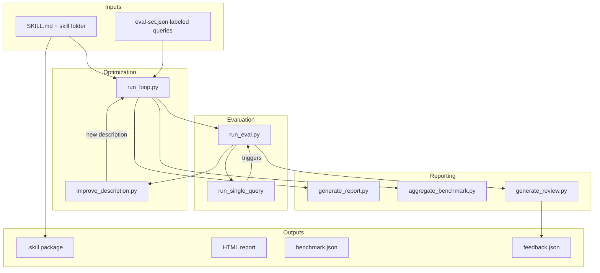

# skill_creator_tools

## Overview

`skill_creator_tools` is a local developer toolkit for authoring, evaluating, packaging, and refining Claude Code skills. A "skill" in this context is a prompt-like artifact (a `SKILL.md` file plus supporting resources) that Claude Code can discover and invoke based on its title and description. This module automates the hardest part of skill authoring: making sure the skill's short description triggers correctly for relevant user queries while avoiding false triggers for irrelevant ones.

The module is located under `ABStudio/skills/ainxt-skills/skill-creator/` and is designed to run from a developer workstation. It has no production server dependencies; it shells out to the local `claude -p` CLI for model inference and uses only the Python standard library for its HTTP viewer.

## What the module does

- **Evaluates skill descriptions** against a labeled query set to measure trigger accuracy.
- **Optimizes descriptions** in an iterative loop using Claude to rewrite the description based on failure patterns.
- **Generates live and final HTML reports** so authors can watch the optimization progress.
- **Aggregates benchmark results** across multiple runs and configurations into summary statistics.
- **Packages skills** into distributable `.skill` zip archives.
- **Serves an interactive review UI** for inspecting per-run outputs and recording feedback.

## Architecture



## Component map

| Sub-module / component | File | Responsibility |
|------------------------|------|----------------|
| [skill_creator_tools_description_optimizer](skill_creator_tools_description_optimizer.md) | `scripts/run_loop.py`, `scripts/improve_description.py`, `scripts/generate_report.py` | Iteratively evaluates and rewrites skill descriptions, producing live and final HTML reports. |
| [skill_creator_tools_evaluation](skill_creator_tools_evaluation.md) | `scripts/run_eval.py`, `scripts/aggregate_benchmark.py` | Measures whether a description triggers correctly for each query and aggregates multi-run statistics. |
| Packaging | `scripts/package_skill.py` | Validates and zips a skill folder into a `.skill` file. |
| Review viewer | `eval-viewer/generate_review.py` | Serves a self-contained HTML page for reviewing eval outputs and saving feedback. |
| Shared utilities | `scripts/utils.py`, `scripts/quick_validate.py` | Parse `SKILL.md` frontmatter and validate skill structure. |

## How it fits into the system

`skill_creator_tools` is a sibling to the other document-oriented skill packs under `ABStudio/skills/ainxt-skills/` (e.g., `docx_skills`, `pptx_skills`, `pdf_skills`). While those modules contain end-user skills for manipulating Office documents, `skill_creator_tools` contains meta-tools for building better skills. It is not invoked by the ABStudio backend at runtime; instead, it is used during skill development and before skills are uploaded through the [api_catalog](api_catalog.md) or [marketplace_router](marketplace_router.md) endpoints.

The optimization loop relies on the same `claude -p` CLI that powers the [cli_runtime](cli_runtime.md) subsystem, but here it is used locally for rapid experimentation rather than as a persistent session runtime.

## Typical workflow

```mermaid
sequenceDiagram
    participant Author
    participant Loop as run_loop.py
    participant Eval as run_eval.py
    participant Claude as claude -p CLI
    participant Improve as improve_description.py
    participant Report as generate_report.py

    Author->>Loop: provide SKILL.md + eval-set.json
    loop up to max_iterations
        Loop->>Eval: evaluate current description
        Eval->>Claude: run each query (parallel)
        Claude-->>Eval: trigger / no-trigger
        Eval-->>Loop: train/test results
        Loop->>Improve: request improved description
        Improve->>Claude: rewrite based on failures
        Claude-->>Improve: new description
        Improve-->>Loop: new description
        Loop->>Report: update live HTML report
    end
    Loop-->>Author: results.json + report.html
```

## Key design decisions

- **Local CLI inference**: All model calls go through `claude -p` subprocesses, so no API keys or remote endpoints are configured in this module.
- **Stream-based trigger detection**: `run_single_query` uses `--include-partial-messages` and inspects `content_block_start` / `content_block_delta` events to detect a `Skill` or `Read` tool call as early as possible, rather than waiting for full assistant responses.
- **Train/test split**: `run_loop.py` holds out a stratified fraction of the eval set to reduce overfitting during description optimization.
- **Blinded improvement history**: Test scores are stripped from the history passed to `improve_description.py` so the model cannot optimize directly against the held-out set.
- **Self-contained viewer**: `generate_review.py` embeds all output files as base64 data URIs in a single HTML file and serves it with the Python standard-library HTTP server.

## Files in this module

- `ABStudio/skills/ainxt-skills/skill-creator/scripts/run_loop.py`
- `ABStudio/skills/ainxt-skills/skill-creator/scripts/run_eval.py`
- `ABStudio/skills/ainxt-skills/skill-creator/scripts/improve_description.py`
- `ABStudio/skills/ainxt-skills/skill-creator/scripts/generate_report.py`
- `ABStudio/skills/ainxt-skills/skill-creator/scripts/aggregate_benchmark.py`
- `ABStudio/skills/ainxt-skills/skill-creator/scripts/package_skill.py`
- `ABStudio/skills/ainxt-skills/skill-creator/eval-viewer/generate_review.py`
- `ABStudio/skills/ainxt-skills/skill-creator/scripts/utils.py`
- `ABStudio/skills/ainxt-skills/skill-creator/scripts/quick_validate.py`

## Related documentation

- [skill_creator_tools_description_optimizer](skill_creator_tools_description_optimizer.md) — description optimization loop and reporting
- [skill_creator_tools_evaluation](skill_creator_tools_evaluation.md) — per-query evaluation and benchmark aggregation
- [api_catalog](api_catalog.md) — backend catalog API where packaged skills are uploaded
- [marketplace_router](marketplace_router.md) — marketplace registration for tools and skills
- [cli_runtime](cli_runtime.md) — runtime subsystem that also uses the `claude -p` CLI
