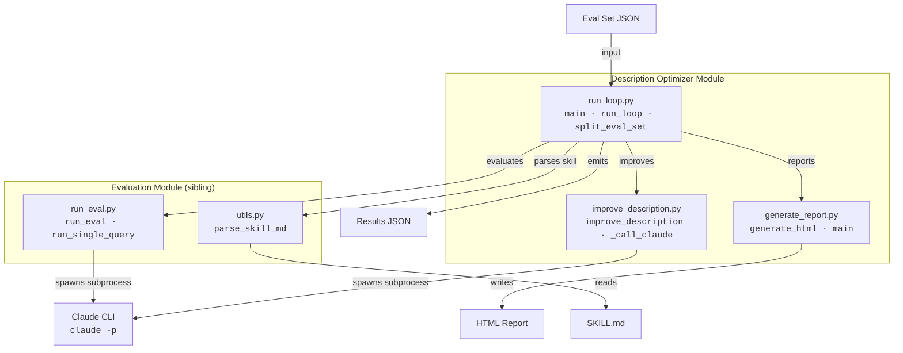
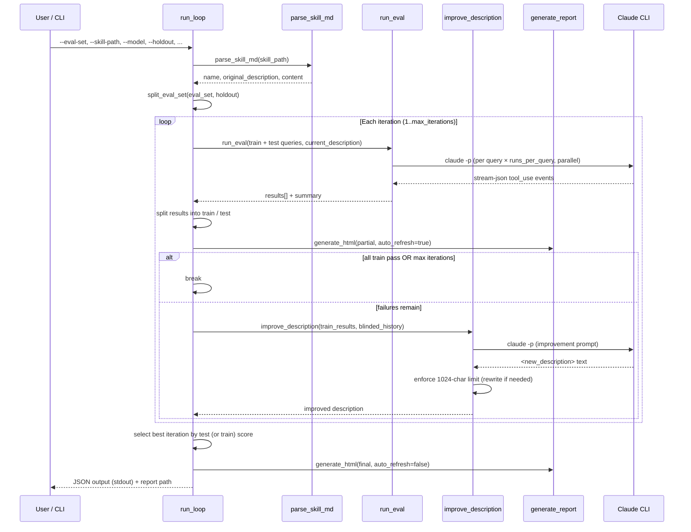
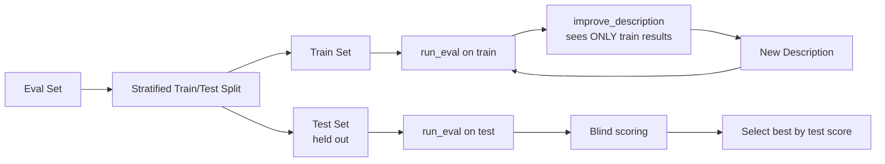

# Skill Creator Tools — Description Optimizer

## Overview

The **Description Optimizer** module is the iterative optimization engine within the Anthropic skill-creator toolkit. Its purpose is to automatically refine a Claude Code skill's **description** — the short text Claude sees when deciding whether to invoke a skill — so that the skill triggers correctly for relevant user queries and stays silent for irrelevant ones.

The module combines three cooperating scripts into a single evaluate → improve → report loop:

| Script | Role |
|---|---|
| `run_loop.py` | Orchestrates the full optimization loop: evaluate, improve, repeat. Supports train/test split to guard against overfitting. |
| `improve_description.py` | Calls Claude via `claude -p` to generate an improved description based on eval failures and prior attempts. |
| `generate_report.py` | Produces a visual HTML report showing per-iteration, per-query pass/fail results with live auto-refresh. |

This module is a child of the broader **skill-creator tools** collection. See [skill_creator_tools.md](skill_creator_tools.md) for the parent overview and [skill_creator_tools_evaluation.md](skill_creator_tools_evaluation.md) for the evaluation engine (`run_eval.py`, `aggregate_benchmark.py`) that this optimizer depends on.

---

## Architecture



### Key design decisions

1. **Claude CLI as the LLM backend** — Both evaluation and improvement invoke `claude -p` as a subprocess, reusing the session's Claude Code auth. No separate `ANTHROPIC_API_KEY` is required. The `CLAUDECODE` environment variable is stripped to allow nesting inside an existing Claude Code session.

2. **Train/test split** — A configurable fraction of the eval set is held out. The improvement model only sees training-set results; the best iteration is selected by test-set score, preventing overfitting to specific queries.

3. **Live reporting** — An HTML report is written after every iteration with a `<meta http-equiv="refresh">` tag, so users can watch optimization progress in a browser in real time.

4. **Character-limit safety net** — Descriptions have a hard 1024-character limit. If Claude produces a longer description, a follow-up single-turn call asks for a shorter rewrite.

---

## Core Components

### `run_loop.py`

The central orchestrator. It ties evaluation and improvement together in a bounded loop and tracks full history for reporting.

#### `main()`

CLI entry point. Parses arguments, loads the eval set, validates `SKILL.md`, sets up the live report path (optionally opening a browser), creates a results directory if requested, then delegates to `run_loop()`.

**Key CLI arguments:**

| Argument | Default | Description |
|---|---|---|
| `--eval-set` | *(required)* | Path to eval set JSON (list of `{query, should_trigger}`) |
| `--skill-path` | *(required)* | Path to skill directory containing `SKILL.md` |
| `--description` | `None` | Override the starting description |
| `--max-iterations` | `5` | Maximum improvement iterations |
| `--holdout` | `0.4` | Fraction of eval set held out for testing (`0` disables) |
| `--runs-per-query` | `3` | Number of parallel runs per query for statistical reliability |
| `--trigger-threshold` | `0.5` | Trigger rate above which a query is considered "triggered" |
| `--model` | *(required)* | Model identifier for `claude -p` |
| `--report` | `auto` | HTML report path (`auto` = temp file, `none` = disable) |
| `--results-dir` | `None` | Save `results.json`, `report.html`, and logs to a timestamped subdirectory |

#### `run_loop()`

Runs the evaluate → improve cycle. For each iteration:

1. Evaluates **all** queries (train + test together) in a single `run_eval()` call for maximum parallelism.
2. Splits results back into train and test sets by matching query strings.
3. Appends a history entry with both train and test metrics.
4. Writes a partial live report (auto-refreshing).
5. If all train queries pass or max iterations reached, exits.
6. Otherwise, calls `improve_description()` with **blinded history** (test metrics stripped) to generate a new description.

After the loop, the best iteration is selected by **test score** (if a test set exists) or **train score** (if `holdout=0`).

**Exit reasons:**

- `"all_passed (iteration N)"` — all training queries passed before max iterations.
- `"max_iterations (N)"` — the iteration cap was reached.

#### `split_eval_set()`

Performs a **stratified** train/test split: queries are separated by `should_trigger` (positive vs. negative), each group is shuffled with a fixed seed, and the holdout fraction is applied independently to each group. This ensures both train and test sets contain a representative mix of should-trigger and should-not-trigger cases.

---

### `improve_description.py`

Generates an improved skill description by prompting Claude with the current failures, prior attempts, and the full skill content.

#### `_call_claude()`

A thin subprocess wrapper around `claude -p`. The prompt is sent over **stdin** (not argv) because it embeds the full `SKILL.md` body and can exceed comfortable argv lengths. Returns the raw text response.

#### `improve_description()`

Builds a structured prompt containing:

- The current description and current scores.
- **Failed triggers** — queries that should have triggered the skill but didn't.
- **False triggers** — queries that triggered but shouldn't have.
- **Previous attempts** — prior descriptions with their scores and per-query results, with an instruction not to repeat them.
- The full `SKILL.md` content for context.
- Guidelines: imperative phrasing, focus on user intent, generalize from failures (don't overfit), 100–200 words, hard 1024-character limit.

The response is parsed for `<new_description>` tags. If the parsed description exceeds 1024 characters, a **follow-up rewrite call** is made that quotes the too-long version and asks for a shorter version. The final description is returned.

When `log_dir` is provided, a full transcript JSON (prompt, response, parsed description, char count, any rewrite interaction) is written per iteration as `improve_iter_{N}.json`.

#### `main()`

Standalone CLI for single-step improvement. Takes eval results JSON, skill path, optional history JSON, and a model. Outputs a JSON object with the new description and updated history.

---

### `generate_report.py`

Transforms the JSON output of `run_loop.py` into a styled HTML report.

#### `generate_html()`

Produces a self-contained HTML document with:

- **Summary panel** — original description, best description, best score, iteration count, train/test sizes.
- **Legend** — color-coded indicators for should-trigger / should-not-trigger queries and train / test columns.
- **Results table** — one row per iteration, one column per query. Each cell shows a ✓/✗ icon and the trigger rate (e.g., `2/3`). Train and test columns are visually distinguished. The best iteration row is highlighted.
- **Auto-refresh** — when `auto_refresh=True`, a `<meta http-equiv="refresh" content="5">` tag is injected so the page reloads every 5 seconds during live optimization.

#### `main()`

Standalone CLI. Accepts a JSON file path (or `-` for stdin) and writes HTML to a file or stdout.

---

## Data Flow



---

## Evaluation Integration

The optimizer delegates all trigger-testing to the sibling evaluation module. See [skill_creator_tools_evaluation.md](skill_creator_tools_evaluation.md) for full internals. A summary of the interface:

- **`run_eval()`** accepts an eval set, skill name, description, and parallelism parameters. It returns a dict with `results` (per-query pass/fail, trigger rate, run count) and `summary` (passed / failed / total).
- **`run_single_query()`** creates a temporary command file in `.claude/commands/` so the skill appears in Claude's available-skills list, then runs `claude -p` with `--output-format stream-json --include-partial-messages`. It detects triggering by inspecting `tool_use` content blocks for `Skill` or `Read` tool calls referencing the temporary command name.
- **`find_project_root()`** (imported from `run_eval.py`) locates the project root for the `.claude/commands/` directory.

### Eval set format

```json
[
  {"query": "Create a quarterly sales report in DOCX", "should_trigger": true},
  {"query": "What is the capital of France?", "should_trigger": false}
]
```

### Per-query result structure (from `run_eval`)

| Field | Type | Description |
|---|---|---|
| `query` | `str` | The user query text |
| `should_trigger` | `bool` | Whether the skill was expected to trigger |
| `trigger_rate` | `float` | Fraction of runs that triggered (0.0–1.0) |
| `triggers` | `int` | Number of runs that triggered |
| `runs` | `int` | Total number of runs |
| `pass` | `bool` | Whether the trigger rate met the threshold correctly |

---

## Overfitting Prevention

The module employs several strategies to avoid producing descriptions that are overfit to the specific eval queries:



1. **Stratified split** — `split_eval_set()` ensures both train and test contain proportional positive/negative cases.
2. **Blinded history** — Before passing history to `improve_description()`, all keys starting with `test_` are stripped, so the improvement model cannot see test performance.
3. **Best-by-test selection** — The final description is chosen as the iteration with the highest **test** score, not the highest train score.
4. **Generalization guidance** — The improvement prompt explicitly instructs Claude to generalize from failures into broader intent categories rather than enumerating specific queries.

---

## Output Data Model

The JSON object emitted by `run_loop.py` (to stdout and optionally `results.json`):

| Field | Type | Description |
|---|---|---|
| `exit_reason` | `str` | Why the loop ended (`all_passed` or `max_iterations`) |
| `original_description` | `str` | Description from `SKILL.md` before optimization |
| `best_description` | `str` | Description from the best-scoring iteration |
| `best_score` | `str` | Best score as `"passed/total"` (test if available, else train) |
| `best_train_score` | `str` | Best iteration's train score |
| `best_test_score` | `str \| null` | Best iteration's test score (null if no holdout) |
| `final_description` | `str` | Description from the last iteration (may differ from best) |
| `iterations_run` | `int` | Number of iterations executed |
| `holdout` | `float` | Holdout fraction used |
| `train_size` | `int` | Number of training queries |
| `test_size` | `int` | Number of test queries |
| `history` | `list[dict]` | Per-iteration records (see below) |

### History entry structure

| Field | Type | Description |
|---|---|---|
| `iteration` | `int` | 1-based iteration number |
| `description` | `str` | Description tested in this iteration |
| `train_passed` / `train_failed` / `train_total` | `int` | Train set metrics |
| `train_results` | `list[dict]` | Per-query results for train set |
| `test_passed` / `test_failed` / `test_total` | `int \| null` | Test set metrics (null if no holdout) |
| `test_results` | `list[dict] \| null` | Per-query results for test set |
| `passed` / `failed` / `total` / `results` | — | Backward-compatible aliases for train metrics (used by `generate_report.py`) |

---

## CLI Usage

### Full optimization loop

```bash
python -m scripts.run_loop \
  --eval-set ./eval/my-skill-eval.json \
  --skill-path ./skills/my-skill \
  --model claude-sonnet-4-20250514 \
  --max-iterations 5 \
  --holdout 0.4 \
  --runs-per-query 3 \
  --trigger-threshold 0.5 \
  --verbose \
  --results-dir ./optimization-results
```

This will:
- Open a live HTML report in the browser.
- Run up to 5 iterations of evaluate → improve.
- Save `results.json`, `report.html`, and per-iteration improvement logs to `./optimization-results/<timestamp>/`.
- Print the final JSON output to stdout.

### Standalone description improvement

```bash
python -m scripts.improve_description \
  --eval-results ./eval-results.json \
  --skill-path ./skills/my-skill \
  --model claude-sonnet-4-20250514 \
  --history ./history.json \
  --verbose
```

### Standalone report generation

```bash
python -m scripts.generate_report ./results.json \
  -o ./report.html \
  --skill-name my-skill
```

---

## Dependencies

### Internal

| Dependency | Source | Purpose |
|---|---|---|
| `scripts.run_eval` | [skill_creator_tools_evaluation.md](skill_creator_tools_evaluation.md) | `run_eval()`, `run_single_query()`, `find_project_root()` |
| `scripts.utils` | skill-creator scripts | `parse_skill_md()` — parses `SKILL.md` frontmatter |
| `scripts.generate_report` | This module | `generate_html()` for live and final reports |
| `scripts.improve_description` | This module | `improve_description()` for LLM-driven description refinement |

### External

| Dependency | Purpose |
|---|---|
| `claude` CLI | Subprocess invoked via `claude -p` for both evaluation and improvement |
| Python stdlib | `argparse`, `json`, `subprocess`, `concurrent.futures`, `pathlib`, `webbrowser`, `tempfile`, `re`, `html` |

---

## Error Handling & Safety

- **Process cleanup** — `run_single_query()` kills the `claude` subprocess on timeout or exception and removes the temporary command file in a `finally` block.
- **Character-limit enforcement** — If Claude's response exceeds 1024 characters, a second `claude -p` call is made with the over-limit text and an explicit rewrite instruction.
- **Blinded history** — Test-set metrics are stripped from history before passing to the improvement model, preventing information leakage.
- **Graceful degradation** — If a query fails entirely (subprocess error, timeout), `run_eval()` records it as a non-trigger (`False`) and continues with the remaining queries.
- **Log transcripts** — When `--results-dir` is used, each improvement call's full prompt/response transcript is persisted as `logs/improve_iter_{N}.json` for debugging and auditability.
