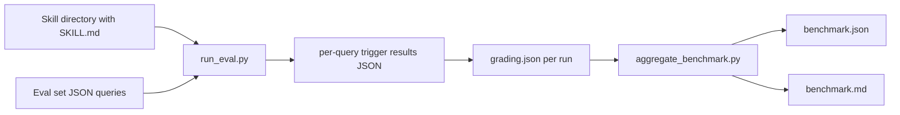
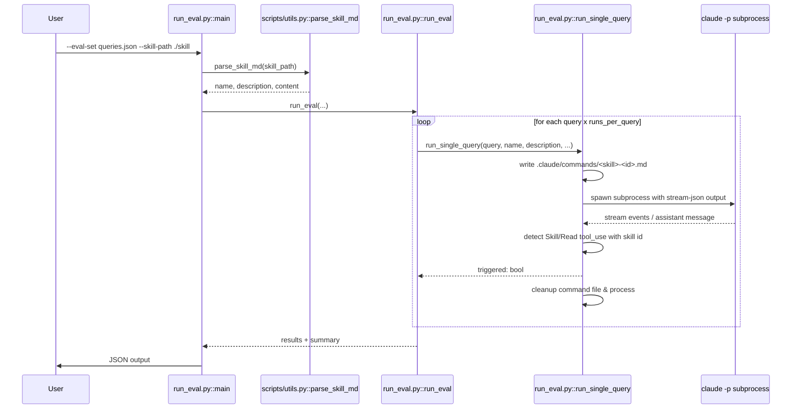
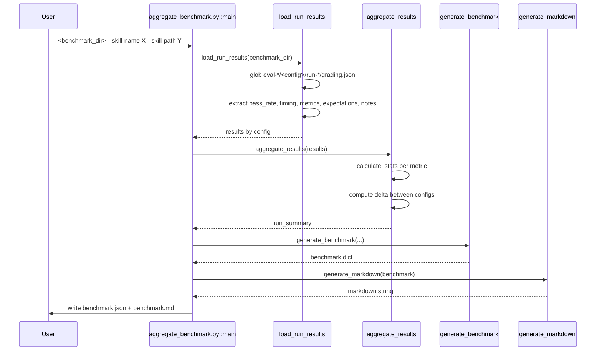
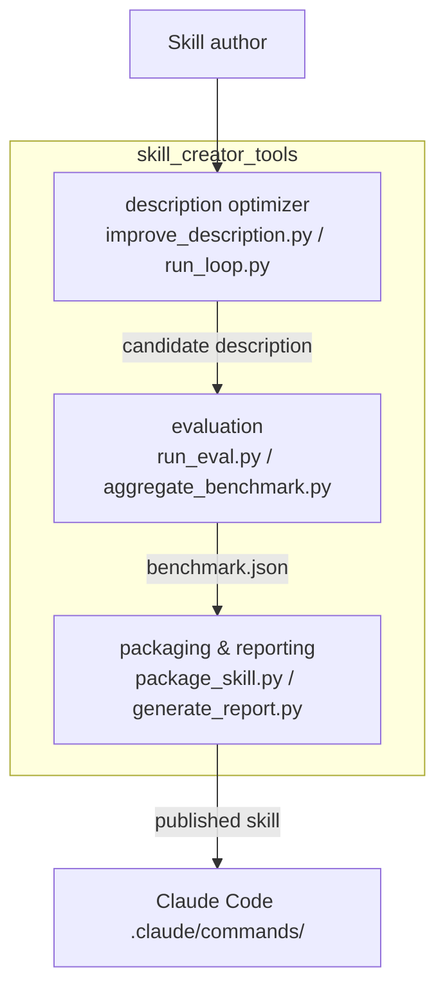

# skill_creator_tools_evaluation

The `skill_creator_tools_evaluation` module provides the benchmarking and evaluation harness for the [skill_creator_tools](skill_creator_tools.md) ecosystem. It measures whether a skill's description and metadata cause Claude Code to *trigger* (read/invoke the skill) for a representative set of queries, and aggregates repeated run results into statistical benchmark reports.

This module is intended for skill authors and maintainers who need objective, reproducible signal on skill discoverability before publishing or iterating on a skill description.

---

## Purpose and Core Functionality

The evaluation layer answers two questions:

1. **Trigger accuracy** — For each query in an evaluation set, does Claude decide to read the skill? This is measured by `run_eval.py`.
2. **Comparative benchmark quality** — Across multiple runs and configurations (e.g. `with_skill` vs. `without_skill`), what is the mean pass rate, latency, and token usage? This is measured by `aggregate_benchmark.py`.

The module is deliberately CLI-first and self-contained: it writes temporary command files into the local `.claude/commands/` directory, invokes `claude -p` as a subprocess, parses the streaming JSON output, and cleans up afterward. No server runtime is required.

### Main capabilities

- **Parallel query execution** with configurable workers and per-query timeouts.
- **Early-trigger detection** via `content_block_start` / `content_block_delta` stream events, avoiding the need to wait for full tool execution.
- **Repeated runs per query** to compute stable trigger rates.
- **Threshold-based pass/fail** logic for positive and negative test cases.
- **Statistical aggregation** (mean, stddev, min, max) across benchmark runs.
- **Delta reporting** between two configurations (e.g. new description vs. baseline).
- **Human-readable Markdown summaries** alongside machine-readable `benchmark.json`.

---

## Architecture

The module consists of two primary scripts that are usually run in sequence:



### Component overview

| Component | File | Responsibility |
|-----------|------|----------------|
| `main` (eval) | `run_eval.py` | CLI entry point. Parses `SKILL.md`, loads the eval set, orchestrates parallel evaluation, and prints JSON results. |
| `run_single_query` | `run_eval.py` | Creates a temporary `.claude/commands/<skill>.md` file, runs `claude -p <query>`, streams output, and returns whether the skill was triggered. |
| `run_eval` | `run_eval.py` | Higher-level runner that repeats each query `runs_per_query` times, computes trigger rates, applies the threshold, and returns a structured result dict. |
| `main` (aggregate) | `aggregate_benchmark.py` | CLI entry point. Discovers run directories, aggregates metrics, and writes `benchmark.json` and `benchmark.md`. |
| `load_run_results` | `aggregate_benchmark.py` | Walks a benchmark directory (workspace or legacy layout), reads `grading.json` files, and normalizes per-run metrics. |
| `aggregate_results` | `aggregate_benchmark.py` | Computes mean/stddev/min/max per configuration and the delta between the first two configurations. |
| `generate_benchmark` | `aggregate_benchmark.py` | Builds the full `benchmark.json` schema including metadata, runs, run summary, and notes. |
| `generate_markdown` | `aggregate_benchmark.py` | Renders the benchmark summary as a Markdown table. |
| `calculate_stats` | `aggregate_benchmark.py` | Helper for mean/sample stddev/min/max. |

---

## Component Relationships

### Evaluation flow (`run_eval.py`)



### Aggregation flow (`aggregate_benchmark.py`)



---

## Data Flow

### Input formats

**Eval set (`--eval-set`)** — a JSON list of objects:

```json
[
  {
    "query": "How do I reset my password?",
    "should_trigger": true
  },
  {
    "query": "What is the weather today?",
    "should_trigger": false
  }
]
```

**Skill directory (`--skill-path`)** — must contain a `SKILL.md` with YAML frontmatter including `name` and `description`. The description is the primary variable under test.

### Intermediate artifacts

- `.claude/commands/<skill>-<uuid>.md` — temporary command file injected for each query and removed immediately after.
- `eval-*/<config>/run-*/grading.json` — per-run grading output consumed by the aggregator.
- `eval-*/<config>/run-*/timing.json` — optional sibling file with duration and token counts.

### Output formats

**`run_eval.py` output** — JSON with per-query trigger rates and a summary:

```json
{
  "skill_name": "password-reset",
  "description": "Helps users reset their passwords",
  "results": [
    {
      "query": "How do I reset my password?",
      "should_trigger": true,
      "trigger_rate": 1.0,
      "triggers": 3,
      "runs": 3,
      "pass": true
    }
  ],
  "summary": { "total": 1, "passed": 1, "failed": 0 }
}
```

**`benchmark.json` output** — produced by `aggregate_benchmark.py`:

```json
{
  "metadata": { "skill_name": "...", "timestamp": "...", "evals_run": [1, 2] },
  "runs": [ { "eval_id": 1, "configuration": "with_skill", "run_number": 1, "result": {...} } ],
  "run_summary": {
    "with_skill": { "pass_rate": { "mean": 0.9, "stddev": 0.05, ... } },
    "without_skill": { ... },
    "delta": { "pass_rate": "+0.15", ... }
  },
  "notes": []
}
```

**`benchmark.md` output** — a Markdown table summarizing the same data for human readers.

---

## How It Fits into the Overall System

The `skill_creator_tools_evaluation` module is one of three sub-modules under [skill_creator_tools](skill_creator_tools.md):



- The [skill_creator_tools_description_optimizer](skill_creator_tools_description_optimizer.md) module generates and refines candidate descriptions.
- This module evaluates those candidates against real Claude Code behavior.
- The parent [skill_creator_tools](skill_creator_tools.md) module ties the loop together with packaging and report generation.

The evaluation harness is also reusable outside the optimizer loop: any skill author can run `run_eval.py` against an existing skill directory and an eval set to get a trigger-accuracy score.

---

## Key Design Decisions

1. **Subprocess-based evaluation** — By shelling out to `claude -p`, the harness tests the *actual* skill-discovery path used by Claude Code, including command-file parsing and available-skills matching.
2. **Stream-event early detection** — Instead of waiting for the full assistant message (which may arrive only after tool execution), the code inspects `content_block_start` and `content_block_delta` events to detect `Skill` or `Read` tool use as soon as it begins.
3. **Temporary command files** — Each query gets a uniquely named command file to avoid collisions during parallel execution and to ensure cleanup even on exceptions.
4. **Flexible directory layouts** — `aggregate_benchmark.py` supports both the workspace layout (`eval-*/...`) and the legacy layout (`runs/eval-*/...`).
5. **Dynamic configuration discovery** — The aggregator does not hardcode `with_skill` / `without_skill`; it discovers any directory that contains `run-*` subdirectories.

---

## Usage Examples

### Run a trigger evaluation

```bash
python ABStudio/skills/ainxt-skills/skill-creator/scripts/run_eval.py \
  --eval-set ./evals/password-reset.json \
  --skill-path ./skills/password-reset \
  --runs-per-query 3 \
  --num-workers 5 \
  --timeout 30 \
  --verbose
```

### Aggregate benchmark results

```bash
python ABStudio/skills/ainxt-skills/skill-creator/scripts/aggregate_benchmark.py \
  ./benchmarks/2026-01-15T10-30-00 \
  --skill-name password-reset \
  --skill-path ./skills/password-reset
```

---

## Dependencies

- `scripts/utils.py::parse_skill_md` — parses `SKILL.md` frontmatter. See [skill_creator_tools](skill_creator_tools.md) for the broader skill-creator context.
- External CLI: `claude` must be installed and authenticated.
- Standard library only (`argparse`, `json`, `subprocess`, `concurrent.futures`, `pathlib`, etc.).

---

## Related Documentation

- [skill_creator_tools](skill_creator_tools.md) — parent module overview.
- [skill_creator_tools_description_optimizer](skill_creator_tools_description_optimizer.md) — description optimization loop that feeds candidates into this evaluator.
- [docx_skills](docx_skills.md), [pptx_skills](pptx_skills.md), [xlsx_skills](xlsx_skills.md), [pdf_skills](pdf_skills.md) — examples of skill families that can be evaluated with this harness.
