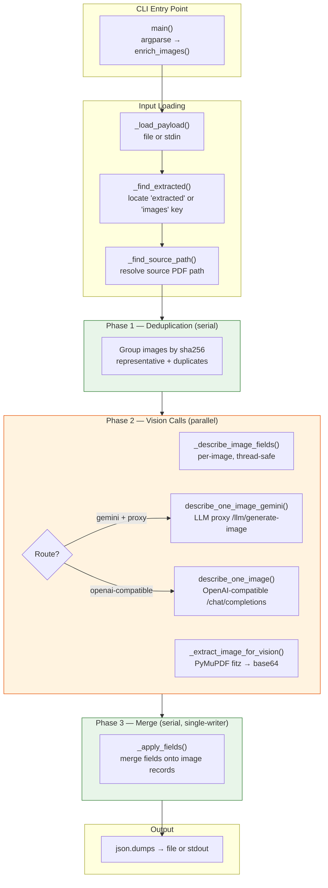
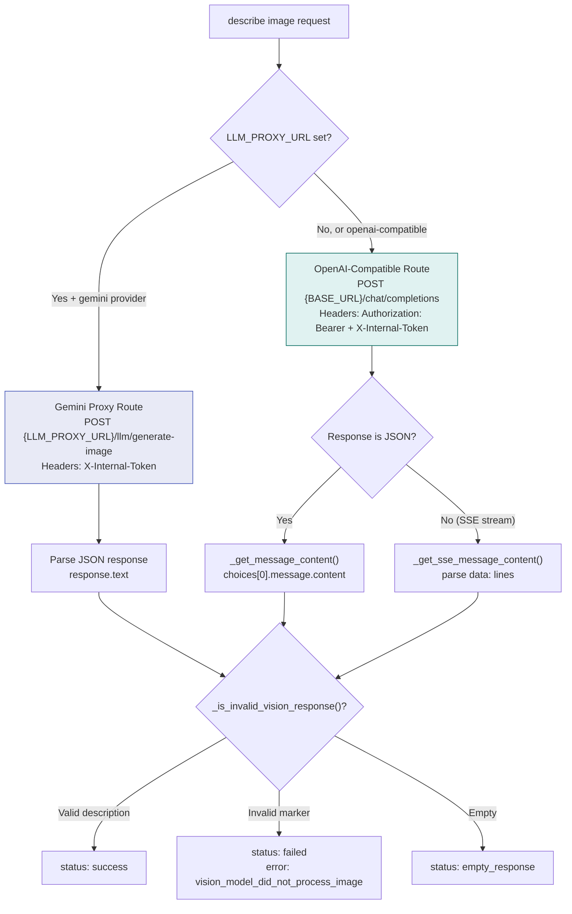
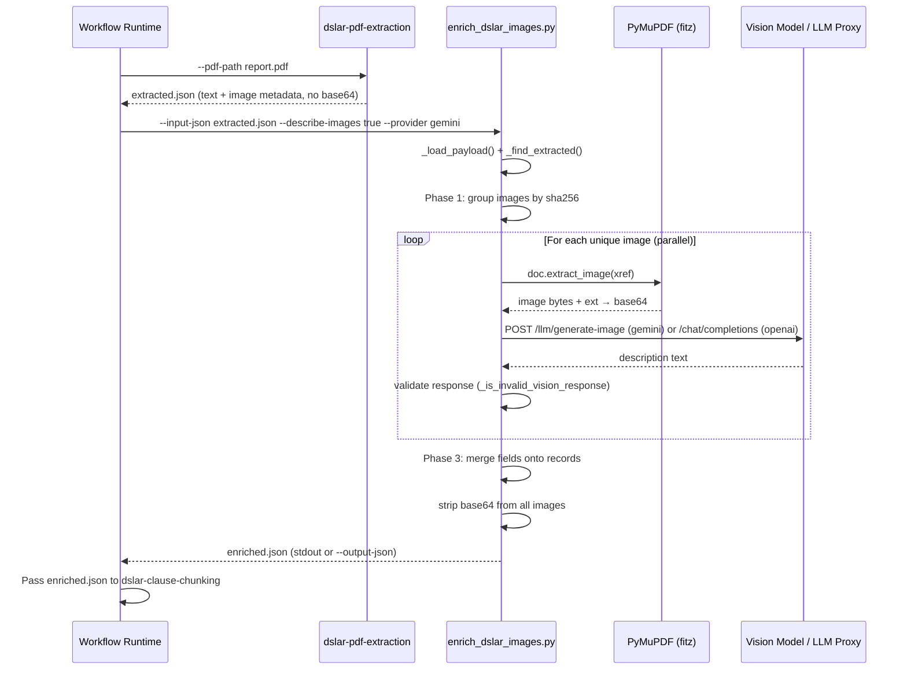
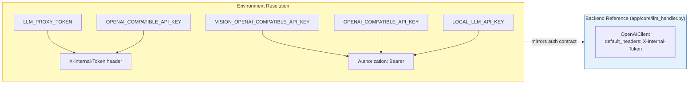
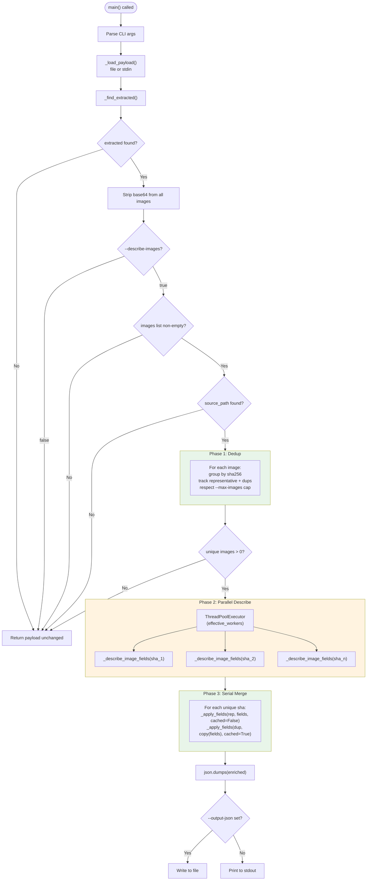
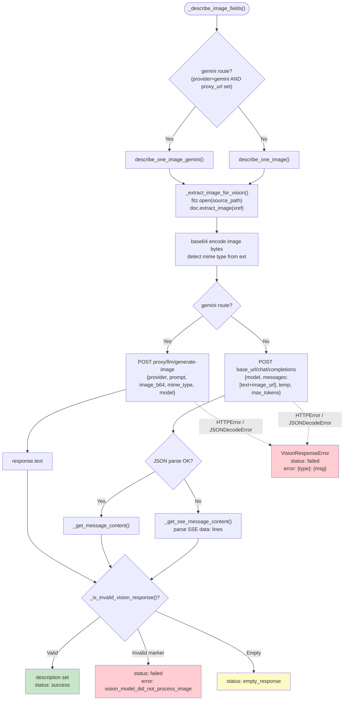
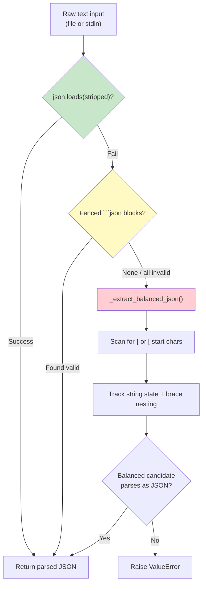
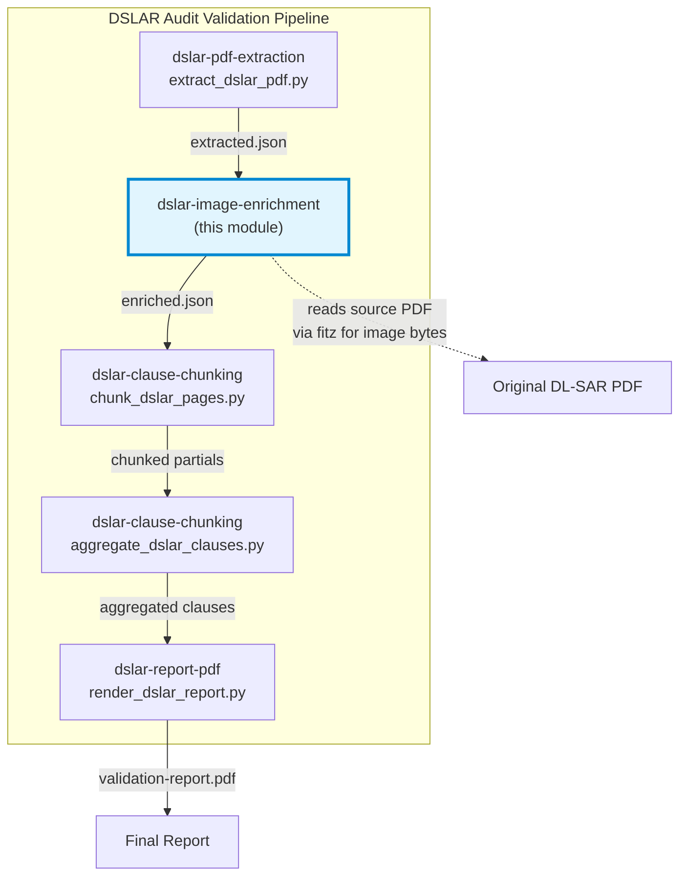

# DSLAR Image Enrichment

## Introduction

The **dslar-image-enrichment** skill is the second stage of the NPCI DL-SAR (Digital Lending – System Audit Report) audit-validation pipeline. It receives a JSON payload produced by the [DSLAR PDF Extraction](dslar_skills_dslar_pdf_extraction.md) skill, locates every embedded image record inside that payload, and enriches each one with a natural-language **description** generated by a vision-capable LLM. The descriptions focus on compliance-relevant content — signatures, seals, stamps, tables, diagrams, screenshots, architecture, data flow, and audit proof — so that downstream clause-validation and report-rendering stages can reason about images without re-reading the raw pixels.

The module ships two standalone CLI scripts:

| Script | Purpose |
|--------|---------|
| `enrich_dslar_images.py` | Core enrichment engine — extracts image bytes from the source PDF, calls a vision model (OpenAI-compatible or Gemini proxy), deduplicates by `sha256`, and writes the enriched payload. |
| `materialize_extracted_json.py` | Pre-processing utility that converts raw, possibly messy agent/LLM output (fenced code blocks, embedded JSON, streaming fragments) into a clean JSON file suitable as input to the enrichment step. |

Both scripts are deterministic, side-effect-free with respect to shared state, and designed to be invoked by the ABStudio workflow runtime as discrete pipeline steps.

---

## Architecture

### Module Position in the DSLAR Pipeline

```mermaid
flowchart LR
    PDF["DL-SAR Audit PDF"] --> EXTRACT["dslar-pdf-extraction<br/>extract_dslar_pdf.py"]
    EXTRACT -- "extracted.json<br/>(text + image metadata)" --> MAT["materialize_extracted_json.py<br/>(optional clean-up)"]
    MAT -- "clean extracted.json" --> ENRICH["dslar-image-enrichment<br/>enrich_dslar_images.py"]
    EXTRACT -- "extracted.json" --> ENRICH
    ENRICH -- "enriched.json<br/>(images + descriptions)" --> CHUNK["dslar-clause-chunking<br/>chunk_dslar_pages.py"]
    CHUNK -- "chunked partials" --> AGG["dslar-clause-chunking<br/>aggregate_dslar_clauses.py"]
    AGG -- "aggregated clause results" --> REPORT["dslar-report-pdf<br/>render_dslar_report.py"]
    REPORT -- "validation-report-*.pdf" --> OUT["Final Audit Report"]

    style ENRICH fill:#e1f5fe,stroke:#0288d1,stroke-width:2px
    style MAT fill:#f3e5f5,stroke:#7b1fa2,stroke-width:1px
```



### Internal Component Architecture



### Vision Model Routing

The enrichment engine supports two mutually exclusive routing strategies, selected at runtime based on the `--provider` flag and environment configuration:



---

## Core Components

### `enrich_dslar_images.py::main`

The CLI entry point and orchestration hub. It parses arguments, loads the input payload, delegates to `enrich_images()`, and writes the result.

**Key responsibilities:**
- Argument parsing (`--input-json`, `--output-json`, `--describe-images`, `--provider`, `--model`, `--max-images`, `--timeout`, `--workers`)
- Model resolution from `--model` or `LOCAL_LLM_MODEL` env var (default: `gemini-3.5-flash`)
- Boolean parsing of `--describe-images` (defaults to `false` — when disabled, the script still strips `base64` fields but skips vision calls)
- Output routing to file or stdout

### `enrich_images()`

The core enrichment function implementing a **three-phase parallel-safe design**:

| Phase | Concurrency | Responsibility |
|-------|-------------|----------------|
| **Phase 1 — Dedup** | Serial (main thread) | Group describable images by `sha256`. The lowest-index image for each hash becomes the "representative" that actually calls the model. `--max-images` caps the number of *unique* images described. |
| **Phase 2 — Describe** | Parallel (`ThreadPoolExecutor`) | Each unique image is described independently via `_describe_image_fields()`. No shared state is mutated — each task returns a pure dict of fields. Per-image failures are captured as status fields, never raised. |
| **Phase 3 — Merge** | Serial (main thread, single-writer) | Computed fields are merged onto image records via `_apply_fields()`. Duplicates reuse the representative's result with `description_cached: true`. |

**Concurrency controls:**
- `DEFAULT_WORKERS = 6`, `MAX_WORKERS = 8`
- Effective workers = `max(1, min(workers, MAX_WORKERS, len(unique_order)))`
- Falls back to serial loop when `effective_workers == 1`

### `materialize_extracted_json.py::main`

A pre-processing utility that normalizes raw agent/LLM output into clean JSON. It implements a three-tier parsing strategy:

1. **Direct parse** — attempt `json.loads()` on the stripped text
2. **Fenced extraction** — regex-match ```` ```json ... ``` ```` blocks and parse each
3. **Balanced-brace scan** — `_extract_balanced_json()` walks the text character-by-character, tracking string state and brace/bracket nesting, to find the first valid JSON object or array

This handles the common case where an LLM wraps JSON in markdown fences or surrounds it with explanatory prose.

---

## Data Flow

### Input Payload Structure

The enrichment script expects a JSON payload with the following shape (produced by [dslar-pdf-extraction](dslar_skills_dslar_pdf_extraction.md)):

```json
{
  "ingested_doc": {
    "source_path": "/path/to/audit-report.pdf"
  },
  "extracted": {
    "ingested": {
      "source_path": "/path/to/audit-report.pdf"
    },
    "images": [
      {
        "xref": 42,
        "sha256": "a1b2c3...",
        "mime_type": "image/png",
        "base64": "<raw base64 data — stripped during enrichment>",
        "page": 5
      }
    ],
    "pages": [ ... ]
  }
}
```

The `_find_extracted()` helper tolerates two layouts:
- A top-level `extracted` object containing `images`
- A top-level `images` array (treats the payload itself as the extracted object)

### Output Payload Structure

After enrichment, each image record gains description fields:

```json
{
  "xref": 42,
  "sha256": "a1b2c3...",
  "mime_type": "image/png",
  "page": 5,
  "description": "A table showing transaction validation rules with columns for rule ID, condition, and action. Includes a digital signature seal in the bottom-right corner.",
  "description_status": "success",
  "description_route": "gemini_proxy",
  "description_endpoint": "http://llm-proxy/llm/generate-image",
  "description_model": "gemini-3.5-flash",
  "description_cached": false
}
```

For duplicate images (same `sha256`), `description_cached` is set to `true` and all description fields are copied from the representative.

### Status Field Values

| `description_status` | `description_error` | Meaning |
|----------------------|---------------------|---------|
| `success` | *(cleared)* | Vision model returned a valid, useful description |
| `failed` | `vision_model_did_not_process_image` | Model responded but claimed it couldn't see the image |
| `failed` | `vision_model_returned_empty_response` | Model returned an empty string |
| `failed` | `{ExceptionType}: {message}` | Network/HTTP/parse error during the call |

### End-to-End Data Flow



---

## Dependencies

### External Libraries

| Library | Usage |
|---------|-------|
| `fitz` (PyMuPDF) | Extracts raw image bytes from the source PDF by `xref` during `_extract_image_for_vision()` |
| `concurrent.futures` | `ThreadPoolExecutor` for parallel vision calls in Phase 2 |
| Standard library: `argparse`, `base64`, `json`, `os`, `sys`, `urllib.request`, `urllib.error`, `re`, `copy` | CLI parsing, HTTP calls, JSON I/O, deep copying |

### Environment Variables

| Variable | Purpose | Default |
|----------|---------|---------|
| `VISION_OPENAI_COMPATIBLE_BASE_URL` | Base URL for OpenAI-compatible vision endpoint (highest priority) | — |
| `OPENAI_COMPATIBLE_BASE_URL` | Fallback base URL | — |
| `LOCAL_LLM_BASE_URL` | Last-resort base URL | `http://localhost:11434/v1` |
| `VISION_OPENAI_COMPATIBLE_API_KEY` | API key for vision endpoint (highest priority) | — |
| `OPENAI_COMPATIBLE_API_KEY` | Fallback API key | — |
| `LOCAL_LLM_API_KEY` | Last-resort API key | `not-needed` |
| `LLM_PROXY_TOKEN` | Internal token sent as `X-Internal-Token` header; also used for Gemini proxy auth | — |
| `LLM_PROXY_URL` | If set, Gemini route calls `{LLM_PROXY_URL}/llm/generate-image` instead of the OpenAI-compatible endpoint | — |
| `LOCAL_LLM_MODEL` | Default vision model ID | `gemini-3.5-flash` |

### Platform Integration

The enrichment script mirrors the authentication contract used by the platform's [`OpenAIClient`](../llm/core_llm_handler.md) in `app/core/llm_handler.py`. Specifically, it sends the `X-Internal-Token` header (resolved from `LLM_PROXY_TOKEN`) alongside the standard `Authorization: Bearer` header. This is critical because the deployed ainxt gateway authenticates OpenAI-compatible agent calls with `X-Internal-Token`; without it, the gateway accepts the request but the vision turn returns `"Error generating response"`, which the script records as `vision_model_did_not_process_image`.



---

## Process Flows

### Enrichment Execution Flow



### Image Description Task Flow



### Invalid Vision Response Detection

The `_is_invalid_vision_response()` function guards against a known failure mode where the vision model acknowledges the request but claims it cannot see the image. It checks the lowercased description against a set of marker phrases:

- `"i don't see any image attached"`
- `"no image attached"`
- `"error generating response"`
- `"couldn't generate a response"`
- *(and several variants)*

When triggered, the image is marked `failed` with `vision_model_did_not_process_image`, preserving the response preview for debugging.

---

## Materialize Extracted JSON

The `materialize_extracted_json.py` script is a lightweight pre-processing utility that may be inserted between the PDF extraction and image enrichment stages when the upstream agent output is not already clean JSON.

### Parsing Strategy



The balanced-brace scanner correctly handles:
- Strings containing `{`, `}`, `[`, `]` characters (string state tracking)
- Escaped quotes (`\"`) inside strings
- Nested objects and arrays
- Multiple candidate start positions (tries each `{`/`[` in order)

---

## Error Handling & Resilience

The enrichment engine is designed for **batch resilience** — a single image failure never aborts the entire enrichment run.

| Scenario | Behavior |
|----------|----------|
| HTTP error from vision endpoint | `VisionResponseError` raised inside `_describe_image_fields()`, caught, recorded as `description_status: failed` with error type and response preview |
| JSON decode failure (non-SSE) | Falls back to SSE parsing (`_get_sse_message_content()`); if that also fails, raises `VisionResponseError` |
| Model claims it can't see image | Detected by `_is_invalid_vision_response()`, recorded as `failed` with `vision_model_did_not_process_image` |
| Empty response | Recorded as `empty_response` status |
| Missing `source_path` | Enrichment skipped entirely; payload returned with `base64` stripped |
| No images / no `xref` | Enrichment skipped; payload returned unchanged |
| `--describe-images false` | `base64` stripped from all images; no vision calls made |

The `VisionResponseError` custom exception carries a `response_preview` attribute (first 500 chars of the raw response) to aid debugging without leaking full response bodies.

---

## Relationship to Sibling DSLAR Skills



| Sibling Module | Relationship |
|----------------|-------------|
| [dslar-pdf-extraction](dslar_skills_dslar_pdf_extraction.md) | **Upstream** — produces the `extracted.json` payload consumed by this module. The extraction script always strips `base64` from image records; this module re-extracts image bytes from the source PDF via PyMuPDF when descriptions are needed. |
| [dslar-clause-chunking](dslar_skills_dslar_clause_chunking.md) | **Downstream** — consumes `enriched.json`, splits pages into chunks for LLM-based clause validation, then aggregates results. Image descriptions provide context for clause validation. |
| [dslar-report-pdf](dslar_skills_dslar_report_rendering.md) | **Downstream** — renders the final validation report PDF from the aggregated clause results. Image descriptions may appear as evidence in the report. |

---

## Usage

### Enrich Images

```bash
# Basic invocation (reads from stdin, writes to stdout)
cat extracted.json | python enrich_dslar_images.py \
  --describe-images true \
  --provider gemini \
  --model gemini-3.5-flash \
  --workers 6 \
  --timeout 120

# File-based invocation
python enrich_dslar_images.py \
  --input-json extracted.json \
  --output-json enriched.json \
  --describe-images true \
  --provider gemini \
  --max-images 50

# OpenAI-compatible provider (no LLM proxy)
python enrich_dslar_images.py \
  --input-json extracted.json \
  --output-json enriched.json \
  --describe-images true \
  --provider openai-compatible \
  --model gpt-4o
```

### Materialize Raw Agent Output

```bash
# From file
python materialize_extracted_json.py \
  --raw-input agent_output.txt \
  --output-json extracted.json

# From stdin
cat agent_output.txt | python materialize_extracted_json.py --output-json extracted.json
```

### CLI Arguments Reference

#### `enrich_dslar_images.py`

| Argument | Default | Description |
|----------|---------|-------------|
| `--input-json` | *(stdin)* | Path to input JSON payload |
| `--output-json` | *(stdout)* | Path to write enriched JSON |
| `--describe-images` | `false` | Whether to call the vision model (`true`/`false`/`1`/`0`) |
| `--provider` | `gemini` | Vision provider: `gemini` or `openai-compatible` |
| `--model` | `LOCAL_LLM_MODEL` or `gemini-3.5-flash` | Vision-capable model ID |
| `--max-images` | *(unlimited)* | Cap on unique images to describe |
| `--timeout` | `120` | Per-image request timeout (seconds) |
| `--workers` | `6` | Parallel vision-call workers (clamped 1–8) |

#### `materialize_extracted_json.py`

| Argument | Default | Description |
|----------|---------|-------------|
| `--raw-input` | *(stdin)* | Path to raw previous-agent output |
| `--output-json` | `extracted.json` | Path to write clean JSON |
