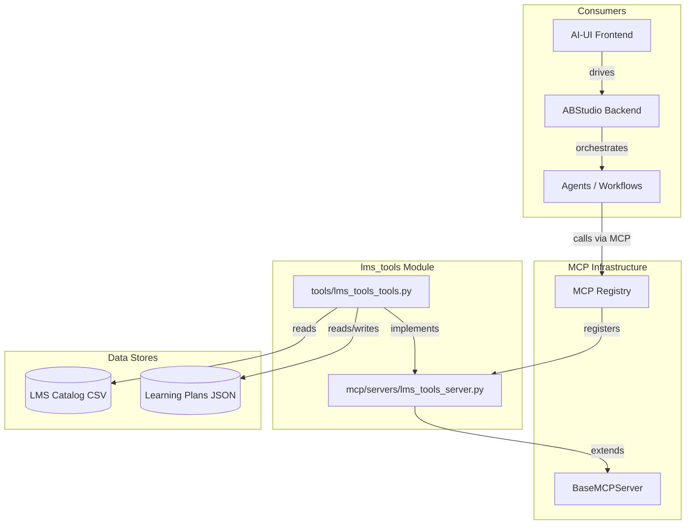
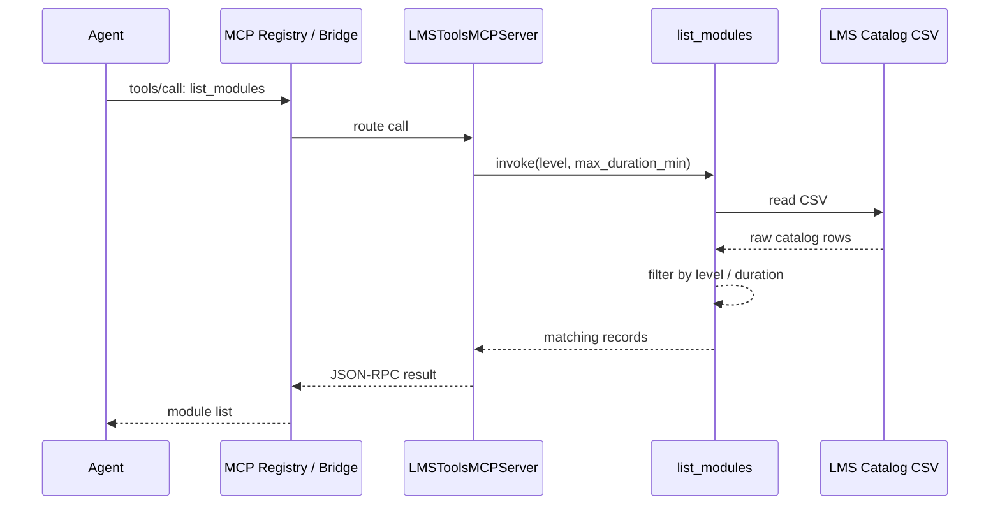
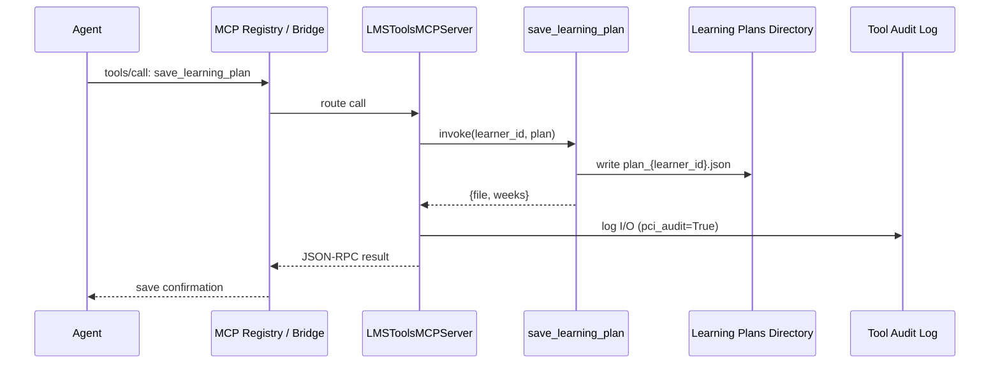
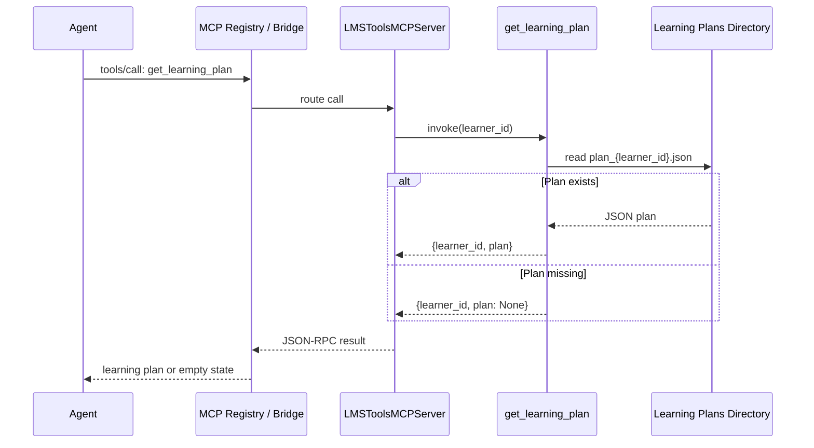
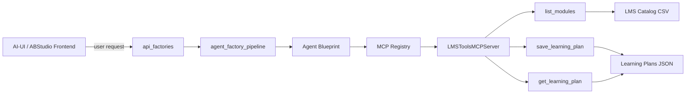

# LMS Tools Module

## Brief Introduction

The `lms_tools` module provides the NPCI Agentic Platform with a small, focused set of tools for accessing a Learning Management System (LMS) content catalog and persisting personalized learning plans. It is designed to support two primary use cases:

- **UC-96 — Training Material Creation**: Agents can query the catalog to discover reusable training modules.
- **UC-100 — Personalized Learning Tutor**: Agents can retrieve catalog content, build adaptive learning plans per learner, save those plans, and fetch them later.

The module deliberately keeps pedagogy and adaptation logic outside its scope; its responsibility is limited to **catalog read access** and **learning plan persistence**. The tools are exposed to agents through the platform's Model Context Protocol (MCP) infrastructure, making them discoverable and callable by any agent or workflow that has access to the MCP server registry.

---

## Core Responsibilities

| Responsibility | Description |
| --- | --- |
| Catalog Access | Read the LMS module catalog from a configurable CSV file and filter by level or maximum duration. |
| Plan Persistence | Save per-learner learning plans as JSON files on disk. |
| Plan Retrieval | Fetch a previously saved learning plan for a learner. |
| MCP Exposure | Register the three operations as MCP tools so agents can call them via the platform's MCP bridge. |

---

## Architecture

### Component Overview



### Tool Layer

The tool layer (`tools/lms_tools_tools.py`) is a plain Python module with no web-framework dependencies. It reads configuration from environment variables and operates directly on the filesystem:

- **`list_modules(level, max_duration_min)`** — Loads the catalog CSV using `pandas`, applies optional filters, and returns matching modules as a list of dictionaries.
- **`save_learning_plan(learner_id, plan)`** — Serializes a learning plan to a JSON file named `plan_{learner_id}.json` under the configured plans directory.
- **`get_learning_plan(learner_id)`** — Reads the learner's plan file if it exists; otherwise returns a structured response with `plan: None`.

### MCP Server Layer

The MCP server layer (`mcp/servers/lms_tools_server.py`) wraps the tool functions in a `LMSToolsMCPServer` class that extends `BaseMCPServer`. It registers three `MCPTool` instances:

- `list_modules`
- `save_learning_plan` (marked with `pci_audit=True` so inputs and outputs are written to the audit log)
- `get_learning_plan`

By implementing the MCP protocol, the server becomes discoverable through the platform's MCP registry and callable over stdio, SSE, or streamable HTTP transports.

---

## Data Flow

### Listing Modules



### Saving a Learning Plan



### Retrieving a Learning Plan



---

## Configuration

The module is configured entirely through environment variables:

| Variable | Default | Purpose |
| --- | --- | --- |
| `LMS_TOOLS_DATA_DIR` | `/data/lms` | Root directory for the LMS module catalog. |
| `LMS_TOOLS_CATALOG_CSV` | `uc100_personalized_tutor/content_catalog.csv` | Relative path to the catalog CSV. |
| `LMS_TOOLS_PLANS_DIR` | `/data/mcp_outbox/learning_plans` | Directory where saved learning plans are written. |

---

## Tool Reference

### `list_modules(level: str = "", max_duration_min: int = 0) -> List[dict]`

Returns learning modules from the configured catalog. Filters are applied only when non-empty / non-zero values are supplied.

**Parameters**

- `level` — Exact string match against the `level` column in the catalog.
- `max_duration_min` — Only modules with `duration_min <= max_duration_min` are returned.

**Returns**

A list of dictionaries, one per catalog row, with columns preserved as keys.

---

### `save_learning_plan(learner_id: str, plan: List[dict]) -> dict`

Persists a learning plan for a specific learner.

**Parameters**

- `learner_id` — Unique identifier for the learner.
- `plan` — List of plan entries. The expected shape is `{week, modules, milestone, quiz_topic}`, though the tool stores the payload as-is.

**Returns**

```json
{
  "file": "/data/mcp_outbox/learning_plans/plan_<learner_id>.json",
  "weeks": 4
}
```

This tool is marked `pci_audit=True` in the MCP server, so every call is written to the `tool_audit_log` table.

---

### `get_learning_plan(learner_id: str) -> dict`

Fetches a previously saved learning plan.

**Parameters**

- `learner_id` — Unique identifier for the learner.

**Returns**

```json
{
  "learner_id": "<learner_id>",
  "plan": [ ... ] // null if no plan exists
}
```

---

## Integration with the Platform

### MCP Registration

`LMSToolsMCPServer` is registered through the platform's MCP registry (`mcp/registry.py`). Once registered, the tools become available to:

- Agents built with the [agent_factory_pipeline](../agents/agent_factory_pipeline.md).
- Workflows executed by the [engine_native_engine](../agents/engine_native_engine.md).
- Chat and agent-runner flows exposed by [api_factories](../api/api_factories.md) and [api_agent_chat](../api/api_agent_chat.md).

For details on how MCP servers are bootstrapped and discovered, see [mcp_system](../mcp/mcp_system.md).

### Use-Case Wiring



The adaptive tutor logic lives in the agent or workflow layer; `lms_tools` only supplies the data and persistence primitives.

---

## Dependencies

### Internal Modules

| Module | Relationship |
| --- | --- |
| [mcp_system](../mcp/mcp_system.md) | Provides `BaseMCPServer`, `MCPTool`, and the registry that exposes `lms_tools` to agents. |
| [agent_factory_pipeline](../agents/agent_factory_pipeline.md) | May compose `lms_tools` into agent blueprints for training or tutoring use cases. |
| [engine_native_engine](../agents/engine_native_engine.md) | Executes workflows that invoke MCP tools such as `list_modules` and `save_learning_plan`. |
| [api_factories](../api/api_factories.md) | Serves factory chat endpoints where agents are assembled and may bind to LMS tools. |

### External Libraries

- `pandas` — Used to load and filter the catalog CSV.
- Standard library: `json`, `os`.

---

## Security & Compliance

- `save_learning_plan` is flagged for PCI audit logging. Every invocation records the tool name, inputs, truncated output, and duration to the `tool_audit_log` table.
- All MCP tool inputs and outputs pass through the platform's compliance gate (`_compliance_check`) in `BaseMCPServer` before execution and before returning results.
- Learning plans are stored as plain JSON on the local filesystem; ensure the configured `LMS_TOOLS_PLANS_DIR` has appropriate filesystem permissions and backup policies.

---

## Operational Notes

- The catalog CSV is read on every `list_modules` call; there is no in-memory cache. For large catalogs, consider caching at the consumer or registry layer.
- Plan files are keyed strictly by `learner_id`. No versioning or concurrency control is implemented; concurrent writes to the same learner may result in last-write-wins behavior.
- The module does not enforce a schema on the `plan` payload beyond requiring it to be JSON-serializable. Agents are responsible for producing well-formed plan entries.

---

## Related Documentation

- [mcp_system](../mcp/mcp_system.md) — MCP server framework and registration.
- [agent_factory_pipeline](../agents/agent_factory_pipeline.md) — Agent assembly and tool binding.
- [engine_native_engine](../agents/engine_native_engine.md) — Workflow execution engine that invokes MCP tools.
- [api_factories](../api/api_factories.md) — Factory chat API where LMS tools are consumed.
