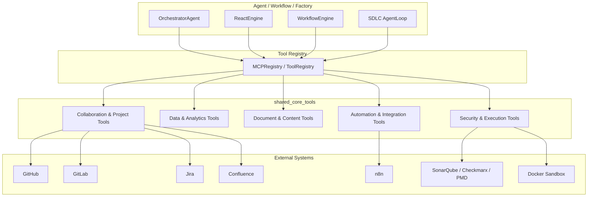
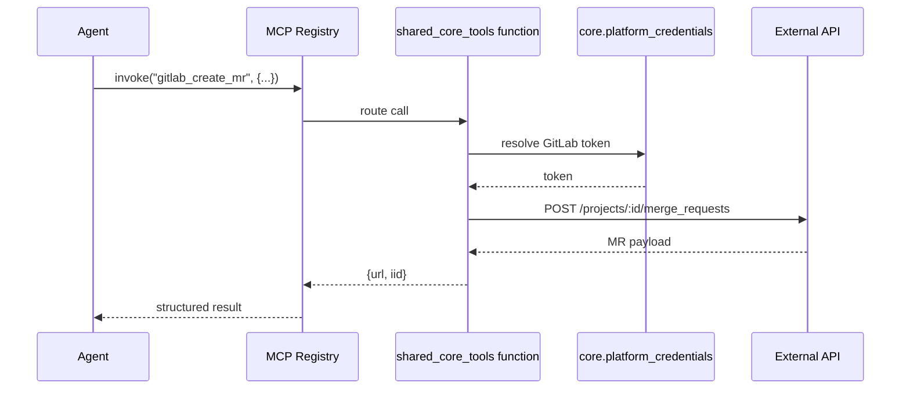

# shared_core_tools

## Overview

`shared_core_tools` is the central **tool library** of the NPCI Agentic Platform. It exposes a large collection of deterministic, agent-callable functions that give LLM agents the ability to interact with enterprise systems, manipulate documents, query data, execute code safely, and integrate with third-party services. Every tool in this module is designed to be registered with the platform's [MCP registry](../mcp/mcp_system.md) and invoked by agents, workflows, or factory pipelines.

The module follows a few core design principles:

- **Deterministic side-effects are explicit.** Tools that write data (create issues, draft emails, commit files) return confirmation payloads and log outcomes; destructive or outbound actions are gated or written to outboxes for human approval.
- **Credentials are resolved per-user.** Integrations such as Jira, Confluence, GitLab, and GitHub look up user tokens from the platform credential store rather than relying on a single service account.
- **Read-only tools are safe to call repeatedly.** Search, listing, extraction, and diff tools have no mutating side effects.
- **Output is LLM-friendly.** Results are returned as structured dicts/lists or concise strings so agents can consume them without heavy parsing.

This module is a sibling of [shared_integrations](shared_integrations.md) (which focuses on connector adapters and OAuth flows) and [shared_core](../core/shared_core.md) (which provides the agent framework, memory, routing, and governance). The tools here are the **executable surface** that agents use to act on the world.

---

## Architecture

### How tools are consumed

1. An agent or workflow decides it needs external data or wants to perform an action.
2. It calls the platform [MCP registry](../mcp/mcp_system.md), which maps tool names to the functions in this module.
3. The tool performs the requested operation, resolves credentials via [core.platform_credentials](../core/shared_core.md), and returns a structured result.
4. The agent uses the result to continue reasoning or to present output to the user.

### Relationship to other modules

- **[shared_core](../core/shared_core.md)** provides the agent runtime, memory, model routing, governance, and core utilities that call these tools.
- **[shared_integrations](shared_integrations.md)** provides OAuth-based connector adapters for the same external systems; the tools here are the lower-level, function-call interface.
- **[mcp_system](../mcp/mcp_system.md)** registers and dispatches these tools to agents.
- **abstudio_backend** exposes many of these capabilities through REST API routes and factory chat flows.

---

## Sub-modules

| Sub-module | Purpose | Key external systems | Documentation |
|------------|---------|----------------------|---------------|
| **Collaboration & Project Tools** | Issue tracking, source control, code review, email, calendar, task tracking, and Confluence pages. | GitHub, GitLab, Jira, Confluence, Email (.eml), Calendars (.ics), local task store | shared_core_tools_collaboration.md |
| **Data & Analytics Tools** | Tabular analysis, KB search, ATS pipeline scoring, and LMS catalog access. | Local CSV/XLSX, local KB corpora, ATS pipeline CSV, LMS catalog CSV | shared_core_tools_data_analytics.md |
| **Document & Content Tools** | Document text extraction, markdown/Word/PowerPoint generation, and glossary-aware translation. | Local files, python-docx, python-pptx | shared_core_tools_document_content.md |
| **Automation & Integration Tools** | Trigger and autonomously build n8n workflows. | n8n REST API | shared_core_tools_automation.md |
| **Security & Execution Tools** | Security scanning (SonarQube, Checkmarx, PMD, Semgrep, Bandit), Docker sandbox execution, and multi-repo diff inspection. | SonarQube, Checkmarx, PMD, Semgrep, Bandit, Docker | shared_core_tools_security_execution.md |

---

## Common patterns

### Outbox pattern

Many write tools do **not** perform live mutations. Instead they write drafts to an outbox directory (e.g., `/data/mcp_outbox/email`, `/data/mcp_outbox/calendar`, `/data/mcp_outbox/ats`). A separate approval step or gated tool is responsible for sending, booking, or committing the draft. This keeps agents in an "instant" tier where mistakes are recoverable.

### Credential resolution

Tools that integrate with SaaS systems follow a consistent credential resolution order:

1. Thread-local credentials injected by a connector adapter (e.g., `jira_tools.set_credentials`).
2. Per-user token stored in the platform credential store (`core.platform_credentials`).
3. Service account credentials from environment variables.
4. Raise `PermissionError` with a clear message if none are found.

### Circuit breaker and retry

Network calls to external APIs are wrapped with the shared [CircuitBreaker](../core/shared_core.md) and `retry_llm` helpers. This prevents cascading failures when GitLab, Jira, or GitHub are temporarily unavailable.

### Path safety

Tools that read from a configured data directory (documents, tables, KB) normalize the requested path and reject any path that escapes the configured root. This prevents directory traversal from agent-supplied inputs.

---

## Configuration

Most tools are configured through environment variables. Common examples include:

| Variable | Used by | Purpose |
|----------|---------|---------|
| `GITHUB_TOKEN` | `github_tools` | GitHub REST API authentication |
| `GITLAB_TOKEN` / `GITLAB_URL` | `gitlab_tools` | GitLab REST API authentication and base URL |
| `JIRA_URL` / `JIRA_PROJECT` / `JIRA_EMAIL` / `JIRA_API_TOKEN` | `jira_tools` | Jira Cloud authentication and default project |
| `CONFLUENCE_URL` / `CONFLUENCE_SPACE_KEY` | `confluence_tools` | Confluence Cloud base URL and default space |
| `LLM_PROXY_URL` | `jira_tools`, `confluence_tools` | Route Atlassian calls through the web02 LLM proxy in production |
| `DATA_TOOLS_DATA_DIR` / `DATA_TOOLS_CHARTS_DIR` | `data_tools_tools` | Root for tabular data and chart output |
| `DOCUMENT_TOOLS_DATA_DIR` | `document_tools_tools` | Root for readable documents |
| `KB_SEARCH_DATA_DIR` / `KB_SEARCH_NAMESPACES` | `kb_search_tools` | KB corpora root and namespace mapping |
| `SECURITY_SCAN_ENABLED` / `SECURITY_CVSS_BLOCK_THRESHOLD` | `security_scan_tools` | Enable scans and risk gate threshold |
| `N8N_BASE_URL` / `N8N_API_KEY` | `n8n_tool`, `n8n_autonomous_builder` | n8n instance access |

Each sub-module documentation file lists the exact environment variables for its tools.

---

## Data flow example

---

## See also

- shared_core_tools_collaboration.md — GitHub, GitLab, Jira, Confluence, email, calendar, task tracker
- shared_core_tools_data_analytics.md — data tables, charts, KB search, ATS, LMS
- shared_core_tools_document_content.md — document extraction, docx/pptx generation, translation
- shared_core_tools_automation.md — n8n workflow triggers and autonomous builder
- shared_core_tools_security_execution.md — security scanners, Docker sandbox, run diff
- [shared_core.md](../core/shared_core.md) — agent framework, memory, routing, governance
- [shared_integrations.md](shared_integrations.md) — connector adapters and OAuth flows
- [mcp_system.md](../mcp/mcp_system.md) — tool registration and dispatch
