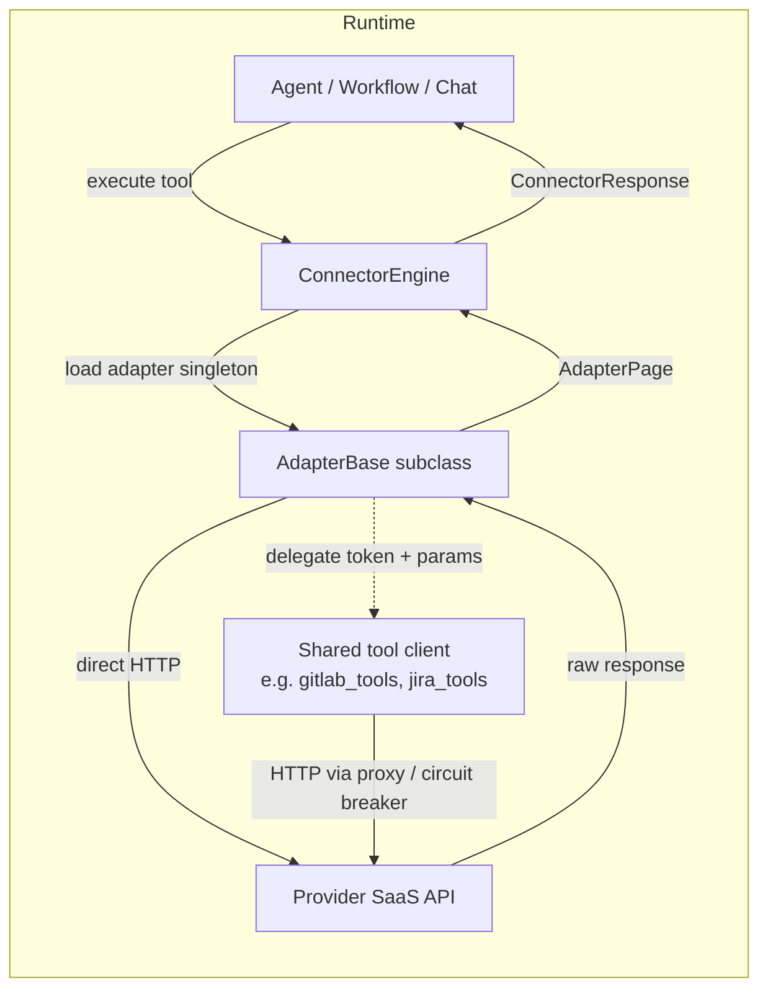
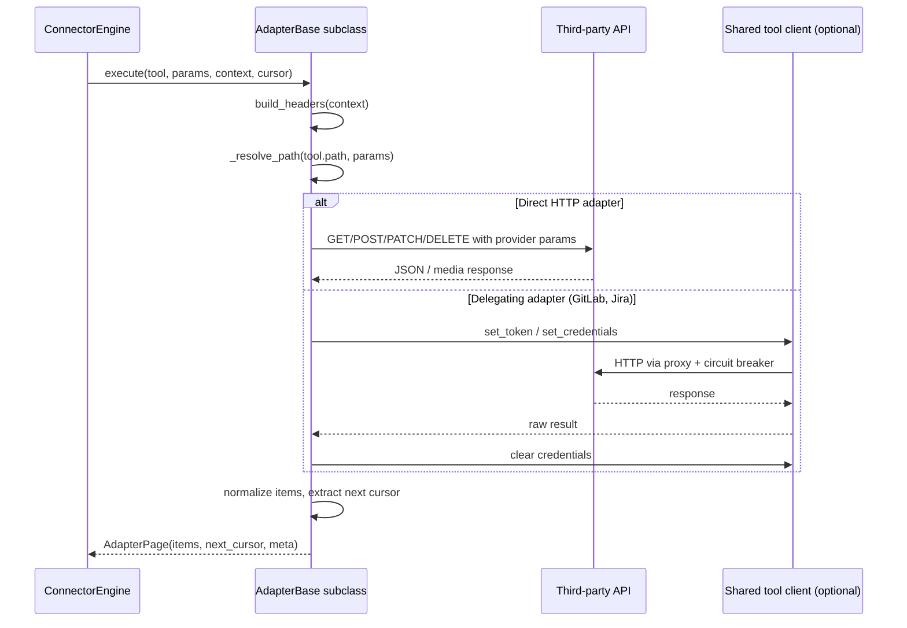

# Connector Adapters

The `shared_integrations_connector_adapters` module contains the provider-specific adapter implementations that bridge the generic connector execution model to third-party SaaS APIs. Each adapter is a thin, stateless shim that:

* Receives a normalized [`ConnectorTool`](shared_integrations_connector_infrastructure.md) request and [`ConnectorContext`](shared_integrations_connector_infrastructure.md) from the `ConnectorEngine`.
* Builds the correct authentication headers (OAuth2 bearer, PAT, Basic, or DPI consent artifact).
* Translates simple LLM-facing parameters into provider-specific query strings, request bodies, and URL paths.
* Handles provider-specific pagination (cursor tokens, `nextLink`, `pageToken`, `start_position`, etc.).
* Normalizes heterogeneous provider responses into a flat `AdapterPage` of items.
* Maps provider errors to the connector exception taxonomy (`ConnectorReauthRequired`, `ConnectorScopeError`, etc.) so the engine can prompt reconnection, retry, or fail gracefully.

Adapters do **not** contain business logic, orchestration, or persistence. They are pure integration glue and are intentionally isolated from the connector lifecycle (registration, OAuth2 flow, permission checks, caching, metrics) which lives in [`shared_integrations_connector_infrastructure`](shared_integrations_connector_infrastructure.md).

---

## Architecture Overview

All adapters inherit from `AdapterBase` (defined in `connectors/adapters/base.py`) and are discovered by the engine as module-level singletons named `{connector_name}_adapter`. The base class provides:

* `build_headers(context)` — auth header construction for OAuth2, PAT, and Basic schemes.
* `_resolve_path(path, params)` — template path interpolation and leftover-parameter extraction.
* The abstract `execute(tool, params, context, cursor)` contract returning an `AdapterPage`.

The runtime data structures are defined in `connectors/base.py`:

* `ConnectorTool` — the LLM-visible tool definition (method, path, schema, pagination, write flag, max items).
* `ConnectorContext` — per-execution context carrying the decrypted token, scopes, tenant id, metadata, and auth type.
* `AdapterPage` — a single page of results (`items`, `next_cursor`, `meta`).

### Adapter Taxonomy

The adapters can be grouped by the domain they integrate with:

| Sub-module | Adapters | Integration Domain |
|---|---|---|
| Atlassian Adapters | `ConfluenceAdapter`, `JiraAdapter` | Confluence Cloud and Jira Cloud |
| Cloud Productivity Adapters | `Microsoft365Adapter`, `GoogleDriveAdapter`, `GmailAdapter` | Microsoft Graph, Google Drive, Gmail |
| DevOps & Communication Adapters | `GitLabAdapter`, `SlackAdapter`, `ZoomAdapter` | GitLab, Slack, Zoom |
| DPI & eSignature Adapters | `DpiAccountAggregatorAdapter`, `DpiDigilockerAdapter`, `DocuSignAdapter` | India DPI sandbox, DocuSign eSignature |

Each group is documented in its own sub-module file (see [Sub-modules](#sub-modules)).

---

## Generic Execution Flow

### Pagination Patterns

Different providers paginate differently, and each adapter encapsulates that knowledge:

| Provider | Cursor Mechanism | Adapter Handling |
|---|---|---|
| Confluence | `_links.next` relative URL | `_fetch_cursor` follows relative or absolute next links. |
| DocuSign | `nextUri` / `endPosition` | `_next_cursor` returns `endPosition + 1` as `start_position`. |
| Gmail | `nextPageToken` | Forwarded as `pageToken`; metadata fetched per message. |
| Google Drive | `nextPageToken` | Forwarded as `pageToken`. |
| Jira | `nextPageToken` in search results | Delegated through `jira_search_issues`. |
| Microsoft 365 | `@odata.nextLink` | Auto-followed for selected read tools with bounded budget and page cap. |
| Slack | `response_metadata.next_cursor` | Forwarded as `cursor`. |
| Zoom | `next_page_token` | Forwarded as `next_page_token`. |

### Write Operations

Write tools (`is_write=True`) are routed through `POST`, `PATCH`, or `DELETE` paths. Adapters:

* Build verbose provider request bodies from simple LLM parameters (e.g., `to`/`subject`/`body` → Graph `message` object).
* Forward the engine-generated `Idempotency-Key` when the provider supports it (DocuSign, Confluence, Zoom).
* Return synthetic confirmation items when the provider responds with `202 Accepted` or an empty body.
* Map `401` to `ConnectorReauthRequired` and `403` to `ConnectorScopeError` where appropriate.

---

## Error Handling & Retry Semantics

Adapters intentionally do **not** implement their own retry loops (except for bounded Microsoft 365 auto-pagination). Instead they translate status codes into exceptions that the `ConnectorEngine` understands:

* `401 Unauthorized` → `ConnectorReauthRequired`: the user must reconnect the connector.
* `403 Forbidden` (Microsoft 365 / Graph) → `ConnectorScopeError`: the token is valid but lacks the required OAuth scope; reconsent is needed.
* `429 Too Many Requests` and `5xx` → re-raised as `httpx.HTTPStatusError` so the engine's retry/backoff policy applies.
* `400 Bad Request` / `404 Not Found` → re-raised as fatal so the engine does not retry.

Adapters also avoid logging secrets: request bodies, headers, and tokens are never emitted in logs.

---

## Security & Consent

* **Token isolation**: Adapters receive already-decrypted tokens via `ConnectorContext.access_token`. They never fetch or store credentials.
* **Thread-local cleanup**: `GitLabAdapter` and `JiraAdapter` inject credentials into shared tool clients using thread-local setters and always clear them in a `finally` block.
* **DPI sandbox**: The DPI adapters fail closed in production (`DPI_SANDBOX=false`) because real Account Aggregator / DigiLocker access requires regulatory licensing and partner credentials.
* **PII minimization**: The `Microsoft365Adapter` deliberately omits phone numbers from people-search results and whitelists only non-sensitive member fields.

---

## Sub-modules

Detailed documentation for each adapter group:

* **Atlassian Adapters** — Confluence Cloud and Jira Cloud integration details.
* **Cloud Productivity Adapters** — Microsoft 365 Graph, Google Drive, and Gmail adapters.
* **DevOps & Communication Adapters** — GitLab, Slack, and Zoom adapters.
* **DPI & eSignature Adapters** — India DPI sandbox adapters and DocuSign eSignature.

---

## Dependencies

* [`shared_integrations_connector_infrastructure`](shared_integrations_connector_infrastructure.md) — `ConnectorEngine`, `ConnectorRegistry`, `OAuth2Handler`, `ConnectorMetrics`, and the connector base types.
* [`shared_core_tools`](shared_core_tools.md) — `tools/gitlab_tools.py` and `tools/jira_tools.py` are reused by `GitLabAdapter` and `JiraAdapter` to keep the SDLC and connector code paths identical.
* `connectors/base.py` — `ConnectorContext`, `ConnectorTool`, `AdapterPage`, and connector exceptions.
* `connectors/adapters/base.py` — `AdapterBase` base class.
* `connectors/dpi/sandbox.py` — synthetic fixtures for DPI sandbox mode.
* `connectors/net_relay.py` — network relay used by `Microsoft365Adapter` for Graph requests.

---

## Related Modules

* [`shared_integrations_connector_infrastructure`](shared_integrations_connector_infrastructure.md) — connector lifecycle, OAuth2, registry, and engine.
* [`shared_core_tools`](shared_core_tools.md) — canonical tool implementations reused by some adapters.
* [`shared_api_routers`](../core/shared_api_routers.md) — HTTP routers that expose connector actions to clients (e.g., `connectors_router.py`).
