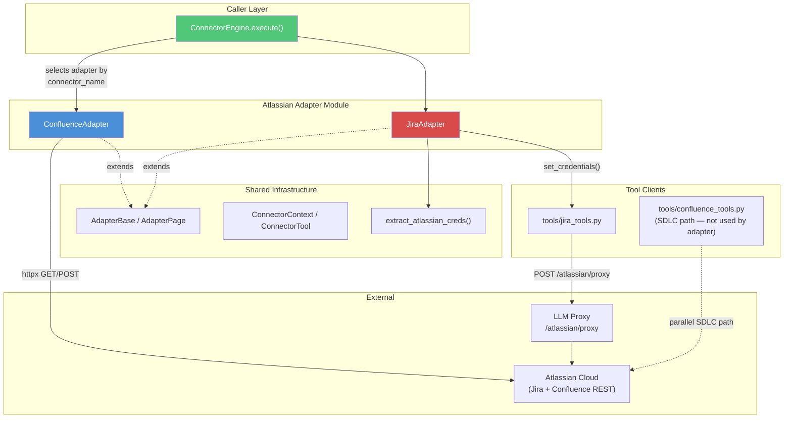
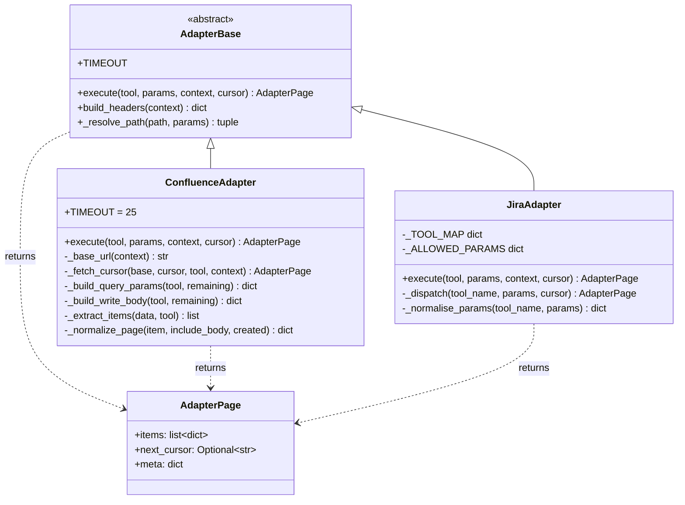
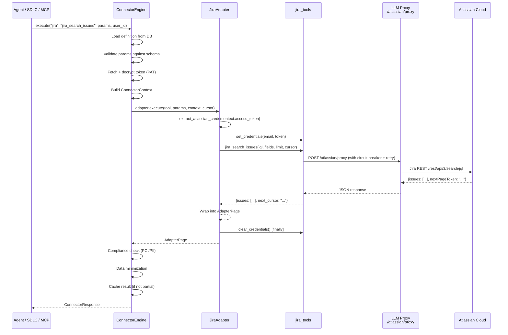
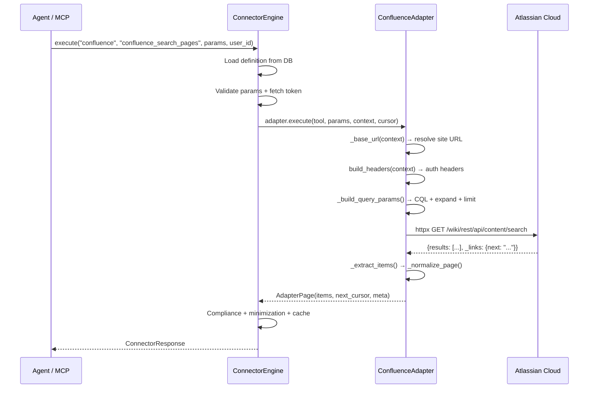
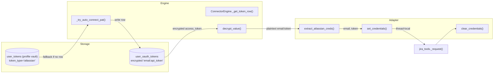
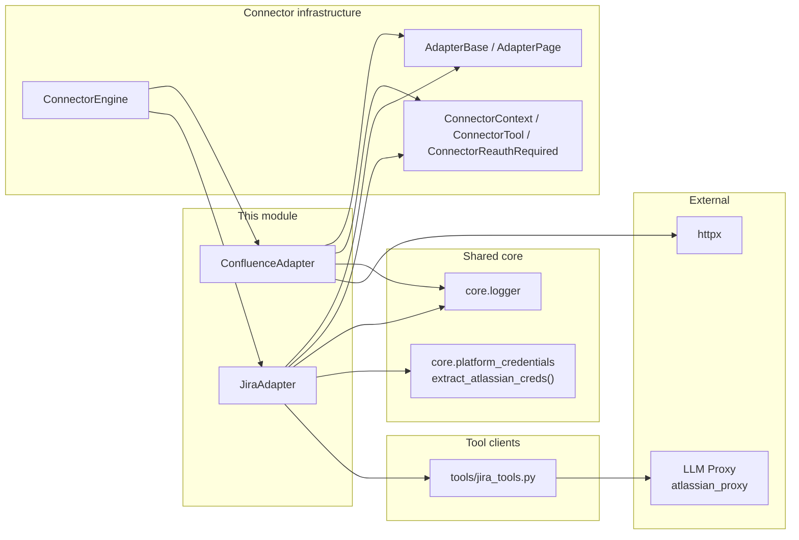
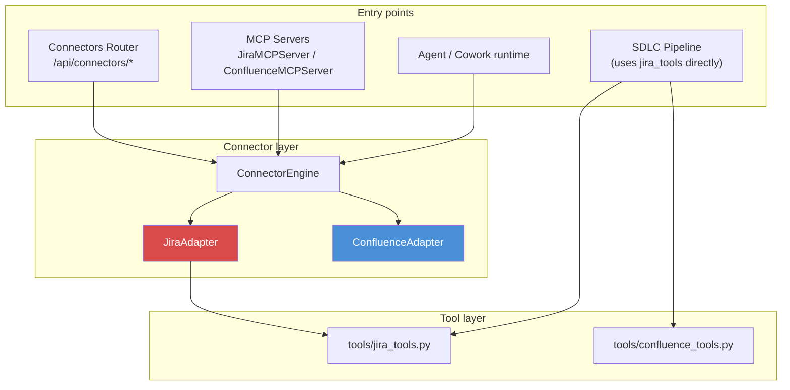

# Atlassian Connector Adapters (Confluence & Jira)

> **Module ID:** `shared_integrations_connector_adapters_atlassian`
> **Source files:** `connectors/adapters/confluence.py`, `connectors/adapters/jira.py`
> **Parent module:** [shared_integrations_connector_adapters](shared_integrations_connector_adapters.md)

## Overview

This module provides two custom connector adapters that integrate **Atlassian Cloud** services — **Jira** and **Confluence** — into the platform's unified connector execution pipeline. Both adapters subclass `AdapterBase` and are discovered by `ConnectorEngine` as module-level singletons (`confluence_adapter`, `jira_adapter`).

| Adapter | File | Atlassian API | HTTP strategy |
|---|---|---|---|
| `ConfluenceAdapter` | `connectors/adapters/confluence.py` | Confluence Cloud REST API v1 | Direct `httpx` calls |
| `JiraAdapter` | `connectors/adapters/jira.py` | Jira Cloud REST API v3 | Delegates to `tools/jira_tools.py` (shared SDLC client) |

The two adapters follow the same contract but differ in implementation philosophy:

- **ConfluenceAdapter** implements HTTP calls, CQL query building, pagination, and response normalization directly — it is self-contained.
- **JiraAdapter** is a thin dispatch layer that injects per-user credentials and delegates all HTTP work to `tools/jira_tools.py`. This ensures the connector path and the SDLC pipeline share identical code for proxy relay, circuit breaking, retry, and tracing.

## Architecture

### Class relationships

## Core Components

### ConfluenceAdapter

**File:** `connectors/adapters/confluence.py`
**Singleton:** `confluence_adapter = ConfluenceAdapter()`

A self-contained adapter for the Confluence Cloud REST API. It handles Confluence-specific quirks directly:

- **CQL (Confluence Query Language)** search via `/content/search`
- **Cursor pagination** using the `_links.next` relative-URL convention
- **HTML storage body** extraction for page content (`body.storage`)
- **Create-page** request shaping with optional ancestor (parent page) support

#### Supported tools

| Tool name | Method | Description |
|---|---|---|
| `confluence_search_pages` | GET | Search pages via CQL; auto-builds CQL from `query`/`space_key` if raw `cql` not supplied |
| `confluence_get_page` | GET | Retrieve a single page by ID with full `body.storage` content |
| `confluence_create_page` | POST | Create a page in a space with title, body, and optional `parent_id` |

#### Key behaviours

- **Base URL resolution:** `_base_url()` reads `context.metadata["base_url"]`, falling back to the `CONFLUENCE_BASE` constant.
- **Pagination:** For GET requests with a cursor, `_fetch_cursor()` follows the `_links.next` relative path (or absolute URL). `_next_cursor()` extracts the next token from the response.
- **Query building:** `_build_query_params()` constructs CQL from simple params (`query`, `space_key`) when raw CQL is not provided, and sets `expand` fields appropriate to each tool.
- **Write body:** `_build_write_body()` shapes `confluence_create_page` params into the Confluence create-page JSON structure (`type`, `title`, `space.key`, `body.storage`, optional `ancestors`).
- **Normalization:** `_normalize_page()` flattens Confluence's nested content object into a flat dict with `id`, `title`, `space_key`, `version`, `url`, and optionally `body`/`body_format`.
- **Error handling:** HTTP 401 raises `ConnectorReauthRequired` (engine deactivates token and prompts reconnect). HTTP 429/5xx are re-raised so the engine's retry/backoff handles them. HTTP 400/403/404 are re-raised as fatal. Response bodies are never logged to avoid token leakage through proxy echoes.

### JiraAdapter

**File:** `connectors/adapters/jira.py`
**Singleton:** `jira_adapter = JiraAdapter()`

A thin dispatch layer over `tools/jira_tools.py`. It does **not** make HTTP calls directly. Instead, it:

1. Extracts the per-user Atlassian credential (`email:api_token`) from `context.access_token` via `extract_atlassian_creds()`.
2. Injects credentials into `jira_tools`'s thread-local via `set_credentials()`.
3. Maps the connector tool name to the matching `jira_tools` function via `_TOOL_MAP`.
4. Normalizes the return value into an `AdapterPage`.
5. **Always** clears credentials in a `finally` block to prevent cross-request leakage in thread-pooled workers.

#### Why delegate instead of calling HTTP directly

`jira_tools._request()` carries four production-critical behaviours that a raw `httpx` call cannot replicate:

| Behaviour | Detail |
|---|---|
| **Proxy relay** | Routes through `POST {LLM_PROXY_URL}/atlassian/proxy` — Atlassian Cloud is reachable only from `web02` in production; direct calls from `app02` fail |
| **Circuit breaker** | Uses `get_breaker("jira")` to short-circuit during outages |
| **Retry with backoff** | `retry_llm()` handles 429/5xx with exponential backoff |
| **Correlation** | `request_id` / `chat_id` tracing links Jira calls back to the originating `/ask` or SDLC run |

#### Tool dispatch map (`_TOOL_MAP`)

| Connector tool | `jira_tools` function | Read/Write | Returns list |
|---|---|---|---|
| `jira_get_current_user` | `jira_get_current_user` | Read | No |
| `jira_search_issues` | `jira_search_issues` | Read | Yes |
| `jira_get_issue` | `jira_get_issue_dict` | Read | No |
| `jira_list_projects` | `jira_list_projects` | Read | Yes |
| `jira_get_project` | `jira_get_project` | Read | Yes |
| `jira_get_transitions` | `jira_get_transitions` | Read | Yes |
| `jira_list_comments` | `jira_list_comments` | Read | Yes |
| `jira_count_issues` | `jira_count_issues` | Read | No |
| `jira_create_issue` | `jira_create_issue` | Write | No |
| `jira_add_comment` | `jira_add_comment` | Write | No |
| `jira_update_issue` | `jira_update_issue` | Write | No |
| `jira_transition_issue` | `jira_transition_issue` | Write | No |
| `jira_assign_issue` | `jira_assign_issue` | Write | No |

> **Note:** `_TOOL_MAP` must stay in sync with the tool list in `connectors/seed.py` and the DB row in `ainxt.connector_definitions`. A tool listed in seed but unmapped here raises `"unknown tool"`; a mapped tool missing from seed is unreachable.

#### Parameter normalization

`_normalise_params()` bridges the connector schema (LLM-facing param names) and `jira_tools` function signatures:

- `project_key` → `project` (for `jira_create_issue`)
- `assignee_account_id` → `account_id` (for `jira_assign_issue`)
- Issue keys are uppercased (Jira is case-sensitive on some endpoints)
- `description` defaults to `""` for `jira_create_issue` (required by the function, optional in the tool schema)
- Unsupported params are dropped via `_ALLOWED_PARAMS` to prevent `TypeError` from hallucinated extra arguments
- `user_id` / `user_email` are **never** accepted from caller params — credentials arrive exclusively through the thread-local

#### Pagination

Only `jira_search_issues` supports cursor pagination. The `jira_tools` function returns `{"issues": [...], "next_cursor": str|None}` using Jira's `nextPageToken` convention. The adapter passes the engine-supplied `cursor` through as `call_params["cursor"]`.

## Data Flow

### Jira tool execution flow

### Confluence tool execution flow

## Authentication & Security

### Jira (PAT — email + API token)

Jira Cloud authenticates with `Authorization: Basic base64(email:api_token)`. The credential lifecycle:

Key security properties:

- **Thread-local isolation:** Credentials are set per-thread and always cleared in a `finally` block — no leakage across concurrent requests in thread-pooled workers.
- **No caller-supplied identity:** `_ALLOWED_PARAMS` explicitly excludes `user_id` / `user_email` — credentials arrive only through the thread-local, never from LLM-generated params.
- **Auto-connect from profile vault:** If no `user_oauth_tokens` row exists, the engine attempts to read the user's stored Atlassian token from the profile vault (`user_tokens` table) and auto-create the connection. See [shared_integrations_connector_infrastructure](shared_integrations_connector_infrastructure.md).
- **401/403 handling:** Both adapters translate authentication failures into `ConnectorReauthRequired`, which causes the engine to deactivate the stored token and surface a reconnect prompt.

### Confluence (OAuth2 / token-based)

`ConfluenceAdapter` relies on `AdapterBase.build_headers(context)` to construct auth headers. The base class supports OAuth2 Bearer (default) and PAT variants (`Basic`, raw token). The adapter itself does not handle credential extraction — it trusts the engine to deliver a valid `context.access_token`.

## Error Handling Strategy

| Scenario | ConfluenceAdapter | JiraAdapter | Engine response |
|---|---|---|---|
| HTTP 401 | Raises `ConnectorReauthRequired` | Detects `"401"`/`"403"` in exception → raises `ConnectorReauthRequired` | Deactivates token; returns `REAUTH_REQUIRED` |
| HTTP 403 | Re-raised (fatal) | Raises `ConnectorReauthRequired` | Deactivates token; returns `REAUTH_REQUIRED` |
| HTTP 429 / 5xx | Re-raised | Handled inside `jira_tools` (retry + circuit breaker) | Engine retries with backoff |
| HTTP 400 / 404 | Re-raised (fatal) | Re-raised | Returns error to caller |
| Missing token | N/A (engine checks first) | Raises `ConnectorReauthRequired` | Returns `REAUTH_REQUIRED` |
| Unknown tool | N/A | Raises `ValueError` | Returns error to caller |

## Dependencies

### Internal dependencies

| Dependency | Purpose |
|---|---|
| [`connectors/adapters/base.py`](shared_integrations_connector_infrastructure.md) — `AdapterBase`, `AdapterPage` | Abstract base class and page result container |
| [`connectors/base.py`](shared_integrations_connector_infrastructure.md) — `ConnectorContext`, `ConnectorTool`, `ConnectorReauthRequired` | Runtime context, tool definition, reauth exception |
| [`connectors/engine.py`](shared_integrations_connector_infrastructure.md) — `ConnectorEngine` | Loads adapters via `_load_custom_adapter()`, handles retry/pagination/compliance |
| `tools/jira_tools.py` — `set_credentials`, `clear_credentials`, 13 tool functions | Shared Jira HTTP client with proxy, circuit breaker, retry |
| `core/platform_credentials.py` — `extract_atlassian_creds()` | Splits stored `email:api_token` credential |
| `core/logger.py` — `logger` | Structured logging (no token/secret logging) |

### External dependencies

| Dependency | Purpose |
|---|---|
| `httpx` | HTTP client for Confluence direct calls |
| [LLM Proxy `atlassian_proxy`](../llm/llm_proxy_main.md) | Production egress relay for Jira calls (reachable only from `web02`) |

## System Integration

### Where these adapters fit

- **Connectors Router** (`routers/connectors_router.py`) — manages connector definitions, OAuth/PAT connections, permissions, and execution. See shared_api_routers_connectors_router.
- **MCP Servers** — `JiraMCPServer` and `ConfluenceMCPServer` expose Jira/Confluence tools to LLM agents via the MCP protocol. See [mcp_servers](../mcp/mcp_servers.md).
- **SDLC Pipeline** — uses `tools/jira_tools.py` directly (not through the adapter) for governance workflows, PR reviews, and issue linking. The Jira adapter's delegation design ensures both paths share the same HTTP client.
- **ConnectorEngine** — the central orchestrator that loads definitions, validates params, manages tokens, enforces scopes/rate limits, handles retry/pagination, and runs compliance checks. See [shared_integrations_connector_infrastructure](shared_integrations_connector_infrastructure.md).

### Adapter discovery

`ConnectorEngine._load_custom_adapter()` maps connector names to adapter modules:

| Connector name(s) | Module path | Singleton |
|---|---|---|
| `jira`, `jira_connector` | `connectors.adapters.jira` | `jira_adapter` |
| `confluence` | `connectors.adapters.confluence` | `confluence_adapter` |

The engine uses the convention `connector_name.replace("-", "_") + "_adapter"` to find the module-level singleton, falling back to scanning for any `AdapterBase` instance.

## Related Documentation

- [shared_integrations_connector_adapters](shared_integrations_connector_adapters.md) — parent module covering all connector adapters
- [shared_integrations_connector_infrastructure](shared_integrations_connector_infrastructure.md) — `ConnectorEngine`, `ConnectorRegistry`, `OAuth2Handler`, `ConnectorMetrics`
- shared_integrations_jira_tools — shared Jira HTTP client used by both the adapter and SDLC pipeline
- shared_integrations_confluence_tools — standalone Confluence tool functions (SDLC path)
- [llm_proxy_main](../llm/llm_proxy_main.md) — LLM proxy service including the `atlassian_proxy` endpoint
- shared_api_routers_connectors_router — REST API for connector management
- [mcp_servers](../mcp/mcp_servers.md) — MCP server implementations for Jira and Confluence
