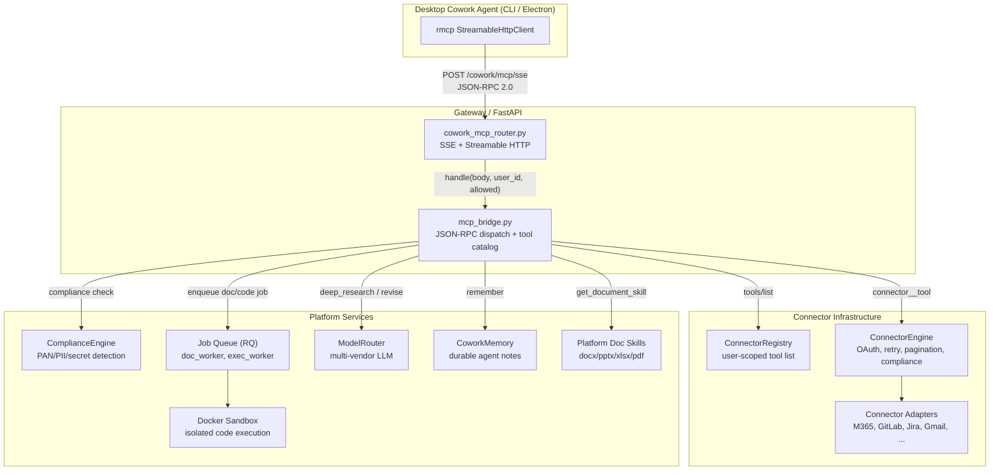
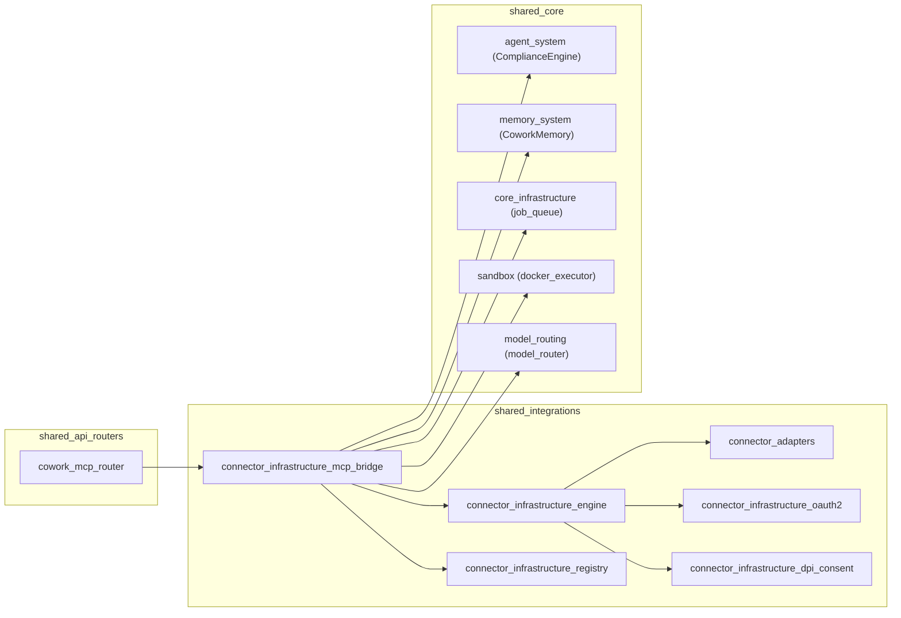
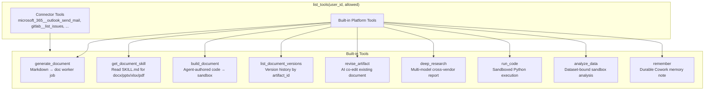
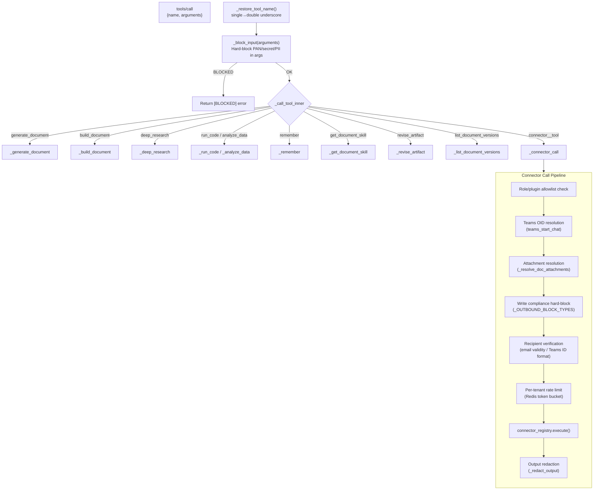
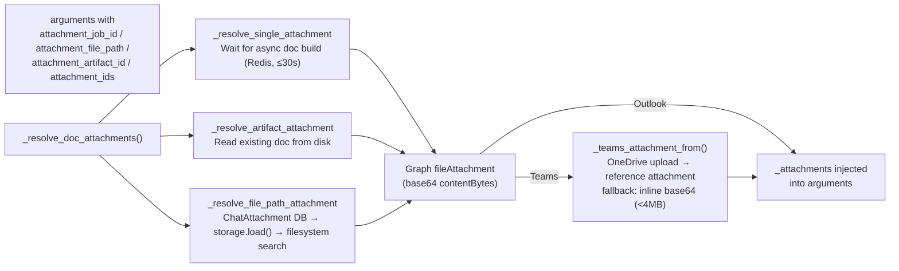
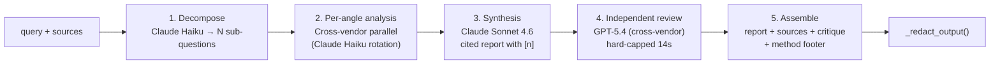
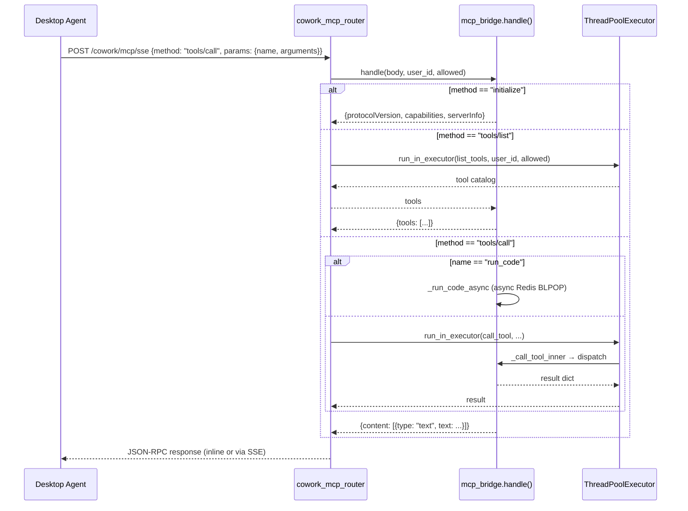

# Connector Infrastructure — MCP Bridge

> **Module:** `shared_integrations › connector_infrastructure › mcp_bridge`
> **Source file:** `connectors/mcp_bridge.py`
> **Protocol:** MCP (Model Context Protocol) JSON-RPC 2.0 over SSE / Streamable HTTP

## 1. Introduction

The **MCP Bridge** (`connectors/mcp_bridge.py`) is the per-user tool surface that
exposes the platform's connectors (Outlook, Teams, Jira, GitLab, Gmail, etc.) and
a suite of built-in productivity tools to the **desktop Cowork agent** — the local
full agent that powers the Code/Buddy tab. It implements the MCP server protocol
so the same engine driving the Code tab can read Outlook/Teams/Jira and generate
documents without re-implementing any connector logic.

The bridge is served over SSE (and Streamable HTTP) by
[`routers/cowork_mcp_router.py`](#5-transport-layer--cowork-mcp-router), which
resolves the user from the JWT and routes every JSON-RPC message to
`mcp_bridge.handle()`. All tool calls are **user-scoped**: the connector
registry, OAuth tokens, rate limits, and compliance gates are all keyed to the
authenticated user.

### Design principles

| Principle | Implementation |
|---|---|
| **Compliance-first** | Input (tool arguments) is **hard-blocked** if it carries PAN/secret/PII; output (connector/KB results) is **redacted, not blocked** so the user can still read their own data. Write actions get an additional outbound hard-block on financial/secret types. |
| **Scale to 2k users** | Blocking tool work runs on a bounded `ThreadPoolExecutor` (64 workers); long sandbox waits use async Redis BLPOP so they never tie up a pool thread or the event loop. |
| **Never false-success** | Connector write results are only reported as "sent" when the upstream API actually accepted the action (e.g. Graph 202). |
| **Recipient safety** | All outbound sends (email, Teams, calendar) are guarded against hallucinated/partial recipients — the agent must resolve and confirm before sending. |
| **Model-agnostic** | Document generation, deep research, and code execution use `model_router` hints, never hardcoding a provider SDK. |

---

## 2. Architecture Overview

### Module relationships

The MCP Bridge sits at the intersection of three major subsystems:

---

## 3. Tool Catalog

The bridge exposes a dynamic, per-user tool catalog via `list_tools()`. Tools fall
into two categories: **connector tools** (sourced from the user's connected
connectors) and **built-in platform tools** (always available).

### Connector tool naming convention

Connector tools use a `connector__tool` double-underscore naming scheme (e.g.
`microsoft_365__outlook_send_mail`). However, the CLI v0.2.101 uses `__` as its
own server/tool delimiter, so `list_tools()` exposes connector tools with a
**single underscore** between connector and tool
(`microsoft_365_outlook_send_mail`). The `call_tool()` function reverses this
mapping via `_restore_tool_name()` before dispatching to the connector engine.

### PAT auto-connect

`_ensure_pat_connectors_connected()` proactively auto-connects PAT-based
connectors (GitLab, Jira) at the start of `list_tools()` by reading the user's
stored token from the profile vault. Without this, the tool list would be empty
until the first tool call triggers the lazy auto-connect — by which point the
agent has already seen an empty list and fallen back to shell/git guesses.

### Role/plugin scoping

The `allowed` parameter (a set of connector slugs or fully-qualified tool names)
restricts which connector tools are visible. An empty/`None` allowlist means no
per-role restriction (generic Cowork). Org/department connector policy
(`org_denies_tool`) is also enforced at listing time.

---

## 4. Tool Dispatch & Compliance Pipeline

Every `tools/call` request flows through a multi-stage pipeline that enforces
compliance, resolves attachments, verifies recipients, and rate-limits before
the actual connector or platform tool executes.

### 4.1 Compliance model

The bridge implements a **dual compliance model** that distinguishes reads from
writes:

| Path | Input (tool args) | Output (results) | Write actions |
|---|---|---|---|
| **Read** (connector reads, KB search) | Hard-blocked if PAN/secret/PII | Redacted (keep EMAIL/MOBILE/UPI) | N/A |
| **Write** (email send, Teams message) | Hard-blocked if PAN/secret/PII | N/A | Outbound text hard-blocked on `_OUTBOUND_BLOCK_TYPES`; recipient identifiers (EMAIL/MOBILE/UPI) preserved |

The `_OUTBOUND_BLOCK_TYPES` set includes financial secrets (PAN, CVV, AADHAAR,
account numbers, IFSC, API keys, private keys, etc.) but deliberately excludes
contact identifiers (EMAIL, MOBILE, UPI) — these are legitimate content in
outbound mail/messages.

Compliance is delegated to:
- **`mcp/servers/base._compliance_check`** — for input blocking (reuses
  `ComplianceEngine.validate_input`)
- **`agents/compliance_engine.ComplianceEngine`** — for output redaction via
  `redact_text(keep_types={"EMAIL", "MOBILE", "UPI"})` and for write-path
  `validate_input` with the outbound block set

> See shared_core_agent_system for full
> ComplianceEngine documentation.

### 4.2 Attachment resolution

When the agent calls a write tool (e.g. `outlook_send_mail`,
`teams_send_message`) with attachment parameters, the bridge resolves them
**before** the compliance text scan (attachments are binary, not free-text).

The resolution supports multiple input forms:
- **DOCJOB markers** — `[DOCJOB:job_id:format:name]` from `build_document` results
- **ChatAttachment IDs** — files uploaded by the user via the chat UI (resolved
  from DB + `core.storage.load()`, handling both local disk and MinIO backends)
- **Artifact IDs** — previously built documents (latest version read from disk)
- **File paths** — absolute paths or filename-only searches across cwd, `/work`,
  `~/Downloads`, `~/Desktop`, `~/Documents`

If attachment resolution returns `"pending"` (document still building), the
bridge returns a retry instruction with a `_attachment_retry` counter (max 3
attempts). If it returns `"none"` (nothing could be resolved), the send is
**blocked** — the agent is told to ask the user to upload the file first.

### 4.3 Recipient verification

All outbound sends are guarded against misdirected messages:

- **Teams** (`teams_send_chat_message`, `teams_send_message`): the `chat_id` /
  `channel_id` must look like a real Teams ID (contains `:` or is >30 chars),
  not a free-text name or bare email. For `teams_start_chat`, the target email is
  resolved to an Azure AD OID via `_resolve_teams_user_oid()` (Graph `/users`
  lookup with exact-match, search, and `startswith` fallback). Ambiguous matches
  surface all candidates and ask the user to confirm.
- **Email/Calendar** (`outlook_send_mail`, `outlook_forward_email`,
  `calendar_create_event`, `calendar_forward_event`): every `to`/`cc`/`bcc`/
  `attendees` field is validated via `_invalid_recipients()` — each token must
  contain a syntactically valid email address. Bare names like "the finance team"
  are rejected with guidance to resolve via `people_search` first.
- **People search disambiguation**: when `people_search` returns multiple
  matches for a partial name, all candidates are surfaced and the agent is told
  to confirm the exact person before proceeding.

### 4.4 Rate limiting

Per-tenant connector rate limiting is implemented as a Redis token bucket
(`_connector_rate_limited`): max `_RATE_MAX` (default 60) calls per user+connector
per `_RATE_WINDOW` (default 60s). This protects external APIs (M365/Graph) from
throttling under load. The limiter is best-effort — a Redis outage never blocks
a tool call.

---

## 5. Transport Layer — Cowork MCP Router

The bridge is exposed to the desktop agent by
`routers/cowork_mcp_router.py`, which mounts four endpoints under `/cowork`:

| Endpoint | Method | Purpose |
|---|---|---|
| `/cowork/mcp/sse` | GET | SSE stream; first event is `endpoint`, then JSON-RPC replies + 15s keep-alive pings |
| `/cowork/mcp/message` | POST | JSON-RPC message; with `sessionId` → reply pushed to SSE via Redis; without → inline response |
| `/cowork/mcp/tools` | GET | REST shortcut: list this user's tools (no SSE needed) |
| `/cowork/mcp/sse` | POST | Streamable HTTP transport (MCP 2024-11-05) — single request/response, used by CLI v0.2.101+ |

### Multi-worker session routing

The gateway runs `uvicorn --workers 4`. The SSE GET can land on worker A while
the matching POST `/message` lands on worker B. Session routing state lives in
**Redis** (db=5), not in-process dicts:

- `cowork:mcp:q:{sid}` — Redis list for JSON-RPC replies (async BLPOP on the
  SSE stream, RPUSH from any worker's POST)
- `cowork:mcp:allowed:{sid}` — JSON allowlist (TTL'd)
- `cowork:mcp:user:{sid}` — owning user_id (prevents cross-user session hijacking)

A single-worker in-process fallback (`asyncio.Queue` dict) is kept for dev when
Redis is unavailable.

### Streamable HTTP (MCP 2024-11-05)

The `POST /cowork/mcp/sse` endpoint handles the full MCP lifecycle in a single
request/response cycle. It assigns/echoes a `Mcp-Session-Id` response header on
every response — the CLI's `StreamableHttpClientWorker` (rmcp) validates this
header, and without it the handshake fails immediately.

---

## 6. Built-in Tool Details

### 6.1 Document generation pipeline

```mermaid
flowchart TD
    subgraph MarkdownPath["generate_document (Markdown)"]
        MD1["Agent writes content_md"]
        MD2["_md_to_sections()<br/>deterministic parse (no LLM)"]
        MD3["Enqueue doc_worker.generate_doc_job<br/>Q_DOC queue, timeout=180s"]
        MD4["Return [DOCJOB:job_id:fmt:name] marker"]
    end

    subgraph SkillPath["build_document (Skill-driven)"]
        SK1["Agent calls get_document_skill(fmt)"]
        SK2["Read SKILL.md + brand guide<br/>from skills/ainxt_docskills/"]
        SK3["Agent authors build code<br/>(docx-js / pptxgenjs / openpyxl)"]
        SK4["Enqueue doc_skill_worker.build_doc_skill_job<br/>Q_DOC queue, timeout=1800s"]
        SK5["Return [DOCJOB:job_id:fmt:name] + artifact_id"]
    end

    subgraph RevisePath["revise_artifact (AI co-edit)"]
        RV1["Load latest version source<br/>from GeneratedDocument DB"]
        RV2["model_router.generate()<br/>apply instruction to source"]
        RV3["Re-route to generate_document or build_document<br/>with artifact_id (new version)"]
    end

    MD1 --> MD2 --> MD3 --> MD4
    SK1 --> SK2 --> SK3 --> SK4 --> SK5
    RV1 --> RV2 --> RV3
```

The document pipeline supports **iterative editing**: every `build_document` call
returns an `artifact_id`. Subsequent calls can pass the same `artifact_id` to
produce a new version (history kept in the `GeneratedDocument` table).
`list_document_versions` retrieves the full version history.

**Compliance on document builds**: the build code is audited (not hard-blocked)
because business figures the LLM writes (transaction counts, ₹ values) routinely
trip the Luhn/account heuristic as false positives. Genuine outbound leakage is
still blocked at the connector-write boundary (`_OUTBOUND_BLOCK_TYPES`).

### 6.2 Deep research (multi-model, cross-vendor)

The research pipeline is the platform's standout differentiator — no competitor
cross-examines across model vendors. Each stage uses `model_router` hints
(`haiku`, `complex`, `medium`) rather than hardcoding provider SDKs. All model
calls are hard-capped with wall-clock timeouts (`_gen_bounded`) so a slow/retrying
model can never blow the CLI's tool-call timeout.

### 6.3 Sandboxed code execution

`run_code` and `analyze_data` enqueue jobs to the exec worker queue
(`workers.exec_worker.run_code_job`), which runs the script in an isolated,
network-disabled Docker container. Results are handed back via a Redis
BLPOP on `cowork:exec:result:{job_id}` (75s timeout).

- **Sync path** (`_run_code`): used by REST/inline — enqueues and waits on a
  sync Redis BLPOP
- **Async path** (`_run_code_async`): used by the SSE handler — awaits an async
  Redis BLPOP so a long sandbox run never blocks the event loop or a thread-pool
  thread
- **Dev fallback** (`_run_code_inline`): when RQ is unavailable, runs inline via
  `docker_executor` (Docker-only, never host-FS subprocess)

`analyze_data` binds a dataset file (CSV/TSV/JSON, ≤2MB) into the sandbox so the
script reads it via `open(filename)` — keeping the code clean and allowing
analysis of real uploaded/fetched data.

### 6.4 Durable memory

The `remember` tool persists a durable fact to the user's Cowork memory via
`memory.cowork_memory.add_note()`. The note is injected into the agent's system
prompt every future session. Compliance-guarded: secrets/PII are hard-blocked
from landing in the prompt store.

> See shared_core_memory_system for CoworkMemory
> documentation.

---

## 7. JSON-RPC Dispatch

The `handle()` function processes one JSON-RPC 2.0 message per user:

### Supported methods

| Method | Behavior |
|---|---|
| `initialize` | Returns protocol version, capabilities, server info |
| `notifications/initialized` | No-op (returns `None`) |
| `ping` | Returns empty result |
| `tools/list` | Returns per-user tool catalog (offloaded to thread pool) |
| `tools/call` | Dispatches to the appropriate tool handler |
| `notifications/*` | No-op (returns `None`) |

All dispatch is wrapped in an **OTLP span** (`cowork_span`) so enterprise
dashboards see every Cowork tool call — name + connector + status only, never
the arguments/results (those are compliance-sensitive).

---

## 8. Dependencies

```mermaid
graph TD
    Bridge["mcp_bridge.py"]

    Bridge -->|"connector tool list + execute"| RegMod["shared_integrations_connector_infrastructure_registry"]
    Bridge -->|"OAuth token, adapter, retry"| EngMod["shared_integrations_connector_infrastructure_engine"]
    Bridge -->|"input blocking"| BaseComp["mcp/servers/base._compliance_check"]
    Bridge -->|"output redaction + write block"| CompMod["shared_core_agent_system<br/>(ComplianceEngine)"]
    Bridge -->|"durable notes"| MemMod["shared_core_memory_system<br/>(CoworkMemory)"]
    Bridge -->|"doc/code job enqueue"| JobMod["shared_core_core_infrastructure<br/>(job_queue, RQ)"]
    Bridge -->|"sandbox execution"| SandMod["shared_core_sandbox<br/>(docker_executor)"]
    Bridge -->|"research + revise"| ModelMod["shared_core_model_routing<br/>(model_router)"]
    Bridge -->|"doc skill files"| SkillsMod["shared_skills<br/>(ainxt_docskills)"]
    Bridge -->|"GeneratedDocument DB"| DBMod["shared_core_database<br/>(db.models)"]
    Bridge -->|"ChatAttachment + storage"| StoreMod["shared_core_core_infrastructure<br/>(storage)"]
    Bridge -->|"OTEL spans"| OtelMod["shared_core_core_infrastructure<br/>(otel)"]
    Bridge -->|"cowork policy"| PolicyMod["shared_core_services<br/>(cowork_policy)"]
```

### Key dependency references

| Dependency | Module | Purpose |
|---|---|---|
| `ConnectorRegistry` | [shared_integrations_connector_infrastructure_registry](shared_integrations_connector_infrastructure_registry.md) | User-scoped tool listing, connector execution |
| `ConnectorEngine` | [shared_integrations_connector_infrastructure_engine](shared_integrations_connector_infrastructure_engine.md) | OAuth token management, adapter selection, retry, pagination, compliance |
| `ComplianceEngine` | shared_core_agent_system | PAN/PII/secret detection, redaction, blocking |
| `CoworkMemory` | shared_core_memory_system | Durable agent-remembered facts |
| `job_queue` (RQ) | shared_core_core_infrastructure | Async doc/code job enqueue |
| `docker_executor` | shared_core_sandbox | Isolated code execution |
| `model_router` | shared_core_model_routing | Multi-vendor LLM dispatch |
| `cowork_mcp_router` | [shared_api_routers](../core/shared_api_routers.md) | SSE/HTTP transport, session routing |
| Platform doc skills | `skills/ainxt_doc_craft/` | SKILL.md files for docx/pptx/xlsx/pdf |

---

## 9. Configuration

| Environment variable | Default | Purpose |
|---|---|---|
| `COWORK_TOOL_POOL` | `64` | Max workers in the blocking tool thread pool |
| `COWORK_CONNECTOR_RATE_MAX` | `60` | Max connector calls per user per window |
| `COWORK_CONNECTOR_RATE_WINDOW` | `60` | Rate limit window in seconds |
| `COMPLIANCE_SCAN_TOOL_RESULTS` | — | Enable/disable output redaction of tool results |
| `M365_ATTACHMENT_FILE_MAX_BYTES` | `10485760` (10MB) | Max attachment file size |
| `REDIS_HOST` / `REDIS_PORT` | `localhost` / `6379` | Redis for session routing, rate limiting, sandbox results |
| `REDIS_PASSWORD` | — | Redis auth (optional) |
| `GITLAB_URL` | `https://your-gitlab-instance` | GitLab API base URL (PAT auto-connect) |
| `JIRA_URL` | — | Jira API base URL (PAT auto-connect) |
| `PRIVACY_SVC_URL` | — | ML privacy filter service URL (ComplianceEngine) |

---

## 10. Error Handling Philosophy

The bridge follows a **fail-loud, never false-success** philosophy:

1. **Connector write failures** — if the upstream API rejects the action, the
   agent is told `"The {connector} send did not complete — {error}"` with
   `isError: true`. The agent never reports "sent" unless Graph returned 202.

2. **Attachment resolution failures** — if the user asked to attach a file but
   nothing could be resolved, the send is blocked (not silently sent without
   the attachment). The agent is told to ask the user to upload the file first.

3. **Compliance blocks** — blocked actions return `[BLOCKED] {reason}` with
   `isError: true`. The agent is expected to remove the sensitive data and retry.

4. **Rate limiting** — over-limit calls return a user-friendly message asking
   to wait a moment, not a raw 429.

5. **Sandbox timeouts** — if a code execution exceeds 75s, the agent is told
   `"The analysis took too long and was stopped. Try a smaller computation."`

6. **Missing dev connectors** — if GitLab/Jira tools are absent from the tool
   list (not connected or denied by policy), an `INFO` log is emitted so the
   "Buddy used the command line instead of GitLab" class of bug is diagnosable
   from the server log alone.
