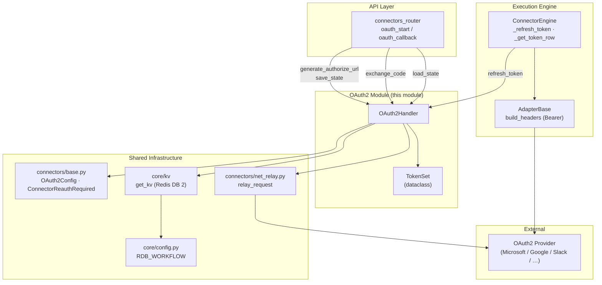
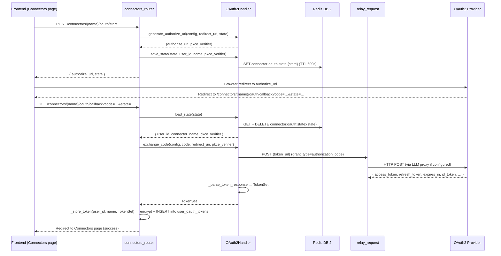
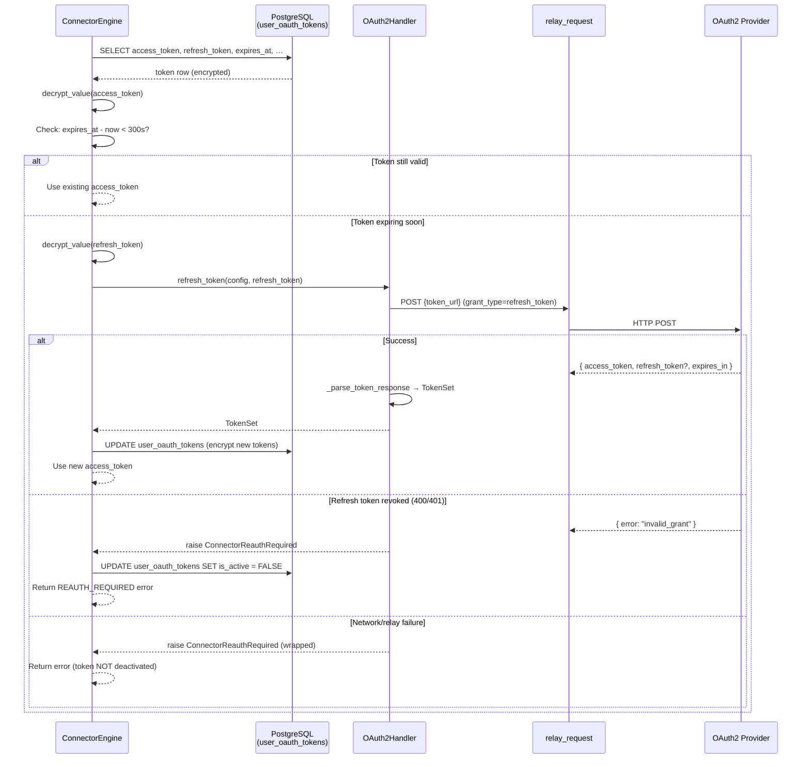
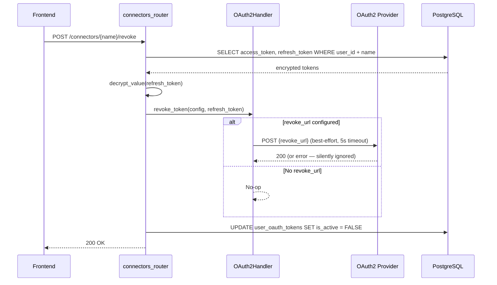
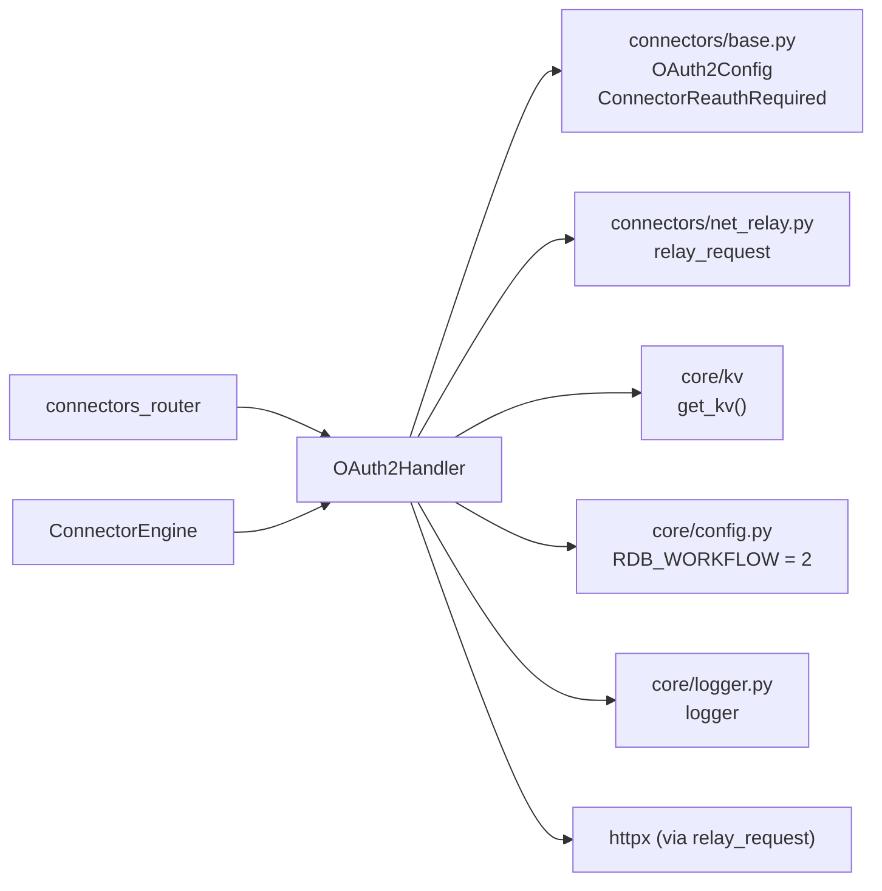
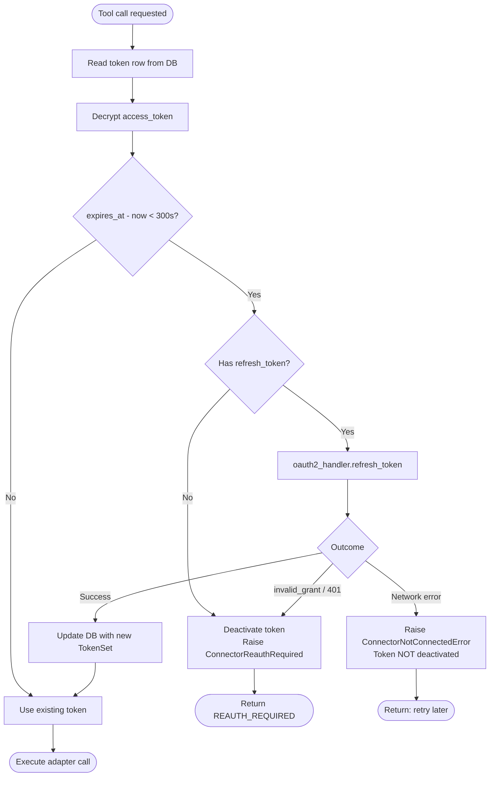

# shared_integrations_connector_infrastructure_oauth2

> Universal OAuth2 handler that manages the full authorization-code lifecycle — PKCE challenge generation, authorization-URL construction, code exchange, token refresh, and revocation — for **any** OAuth2 provider (Microsoft Graph, Google, Slack, Atlassian, Zoom, DocuSign, and custom providers).

---

## 1. Introduction

The `shared_integrations_connector_infrastructure_oauth2` module is the single, provider-agnostic OAuth2 engine used by every third-party connector in the platform. It lives inside the broader [shared_integrations_connector_infrastructure](shared_integrations_connector_infrastructure.md) subsystem and is consumed by:

| Consumer | Role |
|---|---|
| **`connectors_router`** (`oauth_start` / `oauth_callback`) | Initiates the authorization-code flow and persists the resulting tokens. |
| **`ConnectorEngine`** ([shared_integrations_connector_infrastructure_engine](shared_integrations_connector_infrastructure_engine.md)) | Auto-refreshes expiring access tokens before each tool call. |
| **Connector adapters** (Microsoft 365, Google Drive, Slack, Gmail, Jira, Confluence, Zoom, DocuSign, etc.) | Receive a valid `access_token` via `ConnectorContext` and attach it as a `Bearer` header. |

The handler is intentionally stateless across requests — transient OAuth2 flow state (PKCE verifier, user ID, connector name) is stored in the platform's KV store (Redis DB 2) with a 10-minute TTL, keyed by a cryptographically random `state` parameter. Long-lived tokens are persisted encrypted in PostgreSQL (`ainxt.user_oauth_tokens`) by the router layer, not by this module.

---

## 2. Architecture

### 2.1 Component overview



### 2.2 Key design decisions

| Decision | Rationale |
|---|---|
| **PKCE (S256) by default** | Protects against authorization-code interception; `OAuth2Config.pkce` defaults to `True`. |
| **State stored in Redis DB 2** | The workflow KV (`RDB_WORKFLOW`) is already shared across gateway + workers; a 10-minute TTL auto-cleans abandoned flows. |
| **All outbound HTTP via `relay_request`** | The gateway host (APP01) has no direct internet egress — `relay_request` transparently forwards through the LLM proxy on WEB02 when `LLM_PROXY_URL` is set. |
| **60-second safety buffer on `expires_at`** | Tokens are marked expired 60 s before the provider's actual expiry to avoid race conditions during refresh. |
| **`ConnectorReauthRequired` on refresh failure** | Distinguishes a *revoked* refresh token (user must reconnect) from a *transient* network error (retry later). The engine deactivates the token row only for the former. |
| **`id_token` JWT decoding** | When the provider returns an `id_token` (Microsoft, Google), the handler extracts `email`, `name`, and `tenant_id` claims into `TokenSet.metadata` — used by the UI to show "connected as". |

---

## 3. Core Components

### 3.1 `OAuth2Handler`

The central class. A module-level singleton `oauth2_handler` is imported by both the router and the engine.

#### Public methods

| Method | Purpose | Called by |
|---|---|---|
| `generate_pkce_pair()` | Returns `(verifier, challenge)` using `secrets.token_urlsafe(64)` + SHA-256. | `generate_authorize_url` |
| `generate_authorize_url(config, redirect_uri, state, extra_scopes?)` | Builds the provider authorization URL with all required params (`client_id`, `response_type=code`, `scope`, `state`, `access_type=offline`, optional `code_challenge`). Returns `(url, pkce_verifier)`. | `connectors_router.oauth_start` |
| `exchange_code(config, code, redirect_uri, pkce_verifier?)` | POSTs to the provider's token endpoint to exchange the auth code for `access_token` + `refresh_token`. Returns a `TokenSet`. | `connectors_router.oauth_callback` |
| `refresh_token(config, refresh_token)` | POSTs a `refresh_token` grant. Raises `ConnectorReauthRequired` if the refresh token is revoked (`invalid_grant`, `invalid_token`, `token_revoked`) or the HTTP call fails. | `ConnectorEngine._refresh_token` |
| `revoke_token(config, token)` | Best-effort revocation at the provider's `revoke_url`. Silent on failure. | `connectors_router` (on disconnect) |
| `save_state(state, user_id, connector_name, pkce_verifier)` | Stores flow state in Redis DB 2 under `connector:oauth:state:{state}` with a 600 s TTL. | `connectors_router.oauth_start` |
| `load_state(state)` | Loads **and deletes** flow state (single-use). Returns `None` if expired/missing. | `connectors_router.oauth_callback` |

#### Internal helper

| Method | Purpose |
|---|---|
| `_parse_token_response(data, config)` | Normalizes the provider's token JSON into a `TokenSet`. Computes `expires_at` with a 60 s safety buffer, splits scopes, and decodes the `id_token` JWT (if present) to extract `email`, `display_name`, and `tenant_id`. |

### 3.2 `TokenSet` (dataclass)

```python
@dataclass
class TokenSet:
    access_token: str
    refresh_token: Optional[str]
    expires_at: int          # Unix timestamp (60 s safety buffer applied)
    scopes: list[str]
    metadata: dict           # email, display_name, tenant_id, id_token, etc.
```

This is the canonical token representation passed back to the router (for persistence) and to the engine (for in-memory use during a tool call).

### 3.3 `OAuth2Config` (from `connectors/base.py`)

Provider-specific configuration, typically loaded from the `auth_config` JSON column of `ainxt.connector_definitions`:

| Field | Type | Description |
|---|---|---|
| `authorize_url` | `str` | Provider authorization endpoint. |
| `token_url` | `str` | Provider token endpoint (used for exchange + refresh). |
| `client_id_env` | `str` | Name of the env var holding the client ID. |
| `client_secret_env` | `str` | Name of the env var holding the client secret. |
| `scopes` | `list[str]` | Default OAuth2 scopes. |
| `pkce` | `bool` | Whether to use PKCE (default `True`). |
| `extra_params` | `dict` | Provider-specific query params (e.g. `{"response_mode": "query"}`). |
| `revoke_url` | `Optional[str]` | Revocation endpoint (optional). |

---

## 4. Data Flow

### 4.1 Authorization-code flow (connect)



### 4.2 Token refresh flow (auto-refresh before tool call)



> **Note:** The engine distinguishes between a *revoked* refresh token (deactivates the row, user must reconnect) and a *transient* network failure (surfaces a `ConnectorNotConnectedError` with a "server-side issue" message but does **not** deactivate the token). See [shared_integrations_connector_infrastructure_engine](shared_integrations_connector_infrastructure_engine.md) for the full error-handling matrix.

### 4.3 Token revocation flow (disconnect)



---

## 5. Dependencies

### 5.1 Internal dependencies



| Dependency | Module | Purpose |
|---|---|---|
| `OAuth2Config` | `connectors/base.py` | Provider configuration dataclass. |
| `ConnectorReauthRequired` | `connectors/base.py` | Exception raised when a refresh token is revoked — signals the engine to deactivate the stored token. |
| `relay_request` | `connectors/net_relay.py` | HTTP client that transparently proxies through WEB02's LLM proxy when `LLM_PROXY_URL` is set (APP01 has no direct internet). |
| `get_kv` | `core/kv` | KV store abstraction (Redis). Used with `RDB_WORKFLOW` (DB 2) for transient OAuth2 flow state. |
| `RDB_WORKFLOW` | `core/config.py` | Constant `= 2` — the Redis DB allocated for workflow + connector state. |
| `logger` | `core/logger.py` | Structured logging. |

### 5.2 External dependencies

| Dependency | Purpose |
|---|---|
| `httpx` | HTTP client (used indirectly via `relay_request`; also referenced directly for `HTTPStatusError` exception type matching). |
| `secrets` | Cryptographically secure random generation for PKCE verifiers and state tokens. |
| `hashlib` / `base64` | PKCE S256 challenge computation. |

### 5.3 Downstream consumers

| Consumer | Module doc | How it uses OAuth2 |
|---|---|---|
| `connectors_router` | [connectors_router](../connectors/connectors_router.md) | `oauth_start` → `generate_authorize_url` + `save_state`; `oauth_callback` → `load_state` + `exchange_code`. |
| `ConnectorEngine` | [shared_integrations_connector_infrastructure_engine](shared_integrations_connector_infrastructure_engine.md) | `_refresh_token` → `oauth2_handler.refresh_token`; `_build_oauth_config` constructs `OAuth2Config` from DB. |
| `ConnectorRegistry` | [shared_integrations_connector_infrastructure_registry](shared_integrations_connector_infrastructure_registry.md) | Reads `user_oauth_tokens` to determine which connectors a user has connected (does not call OAuth2Handler directly). |
| Adapter base | [shared_integrations_connector_adapters](shared_integrations_connector_adapters.md) | `AdapterBase.build_headers` attaches `Authorization: Bearer {access_token}` — the token itself was obtained/refreshed by this module. |

---

## 6. Process Flows

### 6.1 Full OAuth2 lifecycle

```mermaid
flowchart TD
    A([User clicks "Connect"]) --> B[Router: oauth_start]
    B --> C[OAuth2Handler.generate_authorize_url]
    C --> D{PKCE enabled?}
    D -->|Yes| E[Generate verifier + challenge]
    D -->|No| F[Skip challenge]
    E --> G[Build authorize URL]
    F --> G
    G --> H[OAuth2Handler.save_state → Redis DB 2]
    H --> I([Browser redirect to provider])
    I --> J[User consents at provider]
    J --> K([Provider redirects to callback])
    K --> L[Router: oauth_callback]
    L --> M[OAuth2Handler.load_state → Redis DB 2]
    M --> N{State valid?}
    N -->|No| O([Return error: invalid_state])
    N -->|Yes| P[OAuth2Handler.exchange_code]
    P --> Q[relay_request POST to token_url]
    Q --> R{HTTP success?}
    R -->|No| S([Return error])
    R -->|Yes| T[_parse_token_response → TokenSet]
    T --> U{id_token present?}
    U -->|Yes| V[Decode JWT → extract email/name/tid]
    U -->|No| W[Skip]
    V --> X[Router: _store_token → encrypt + INSERT]
    W --> X
    X --> Y([Redirect: success])

    style A fill:#e1f5e1
    style Y fill:#e1f5e1
    style O fill:#f5e1e1
    style S fill:#f5e1e1
```

### 6.2 Token refresh decision tree (in ConnectorEngine)



---

## 7. Security Considerations

| Aspect | Implementation |
|---|---|
| **PKCE** | S256 challenge method; 64-byte URL-safe verifier. Prevents code interception even if the redirect URI is intercepted. |
| **State parameter** | 32-byte URL-safe random (`secrets.token_urlsafe(32)`) generated by the router. Prevents CSRF. Stored in Redis with 10-minute TTL and deleted on first read (single-use). |
| **Client secrets** | Never hardcoded — resolved at runtime from env vars named in `OAuth2Config.client_secret_env`. |
| **Token encryption at rest** | Access and refresh tokens are encrypted via `store.credential_vault.encrypt_value` (Fernet) before being written to `user_oauth_tokens`. Decryption uses the same `FERNET_KEY` — a mismatch between gateway and worker hosts is detected and surfaced as a distinct error. |
| **Token revocation** | Best-effort call to the provider's `revoke_url` on disconnect; failures are logged at DEBUG level and do not block the UI operation. |
| **Safety buffer** | `expires_at` is set 60 seconds before the provider's actual expiry to prevent edge-case races where a token expires between the refresh check and the API call. |
| **Network egress** | All token-exchange and refresh calls go through `relay_request`, which routes through the LLM proxy on WEB02 (the only host with internet access) when `LLM_PROXY_URL` is set. Direct `httpx` calls are used only in dev/hosts with direct egress. |

---

## 8. Configuration

### 8.1 Environment variables

| Variable | Default | Purpose |
|---|---|---|
| `LLM_PROXY_URL` | _(empty)_ | Base URL of the LLM proxy on WEB02. When set, `relay_request` forwards all OAuth2 HTTP calls through `{LLM_PROXY_URL}/net/forward`. |
| `REDIS_HOST` / `REDIS_PORT` / `REDIS_PASSWORD` | `localhost` / `6379` / _(none)_ | Redis connection for KV state storage. |
| `REDIS_CLIENT_CONFIG` | `REDIS` | KV backend selector (`REDIS`). |
| `REDIS_CLIENT_CONFIG_DB2` | _(inherits global)_ | Per-DB override for the workflow KV (DB 2). |
| `{client_id_env}` | _(per connector)_ | OAuth2 client ID for a specific provider (e.g. `M365_CLIENT_ID`). |
| `{client_secret_env}` | _(per connector)_ | OAuth2 client secret for a specific provider (e.g. `M365_CLIENT_SECRET`). |
| `FERNET_KEY` | _(required in prod)_ | Encryption key for token at-rest encryption. Must be identical across gateway and all worker hosts. |

### 8.2 Redis DB allocation

The OAuth2 flow state lives in **Redis DB 2** (`RDB_WORKFLOW`), which is shared with workflow and agent-run history. The key namespace is `connector:oauth:state:{state}` with a 600-second TTL.

> See [core_infrastructure](../core/core_infrastructure.md) for the full Redis DB allocation map.

---

## 9. Error Handling

| Error | Raised by | Meaning | Engine action |
|---|---|---|---|
| `ConnectorReauthRequired` | `refresh_token` | Refresh token is revoked, expired, or the HTTP call failed. | Deactivate token row (`is_active = FALSE`); return `REAUTH_REQUIRED` to the agent/UI. |
| `ValueError` | `generate_authorize_url` | `client_id_env` env var is not set. | Router returns HTTP 400. |
| `httpx.HTTPStatusError` | `exchange_code` / `refresh_token` | Provider returned a non-2xx status not matching reauth conditions. | Propagated to the caller; router returns HTTP 500. |
| KV read/write failure | `save_state` / `load_state` | Redis unavailable. | `save_state` re-raises (router returns 500); `load_state` returns `None` (router returns `invalid_state`). |

---

## 10. Related Documentation

| Document | Description |
|---|---|
| [shared_integrations_connector_infrastructure](shared_integrations_connector_infrastructure.md) | Parent module — engine, registry, metrics, MCP bridge, DPI consent. |
| [shared_integrations_connector_infrastructure_engine](shared_integrations_connector_infrastructure_engine.md) | `ConnectorEngine` — token auto-refresh, access control, caching, compliance. |
| [shared_integrations_connector_infrastructure_registry](shared_integrations_connector_infrastructure_registry.md) | `ConnectorRegistry` — connector definition loading, user tool listing. |
| [shared_integrations_connector_adapters](shared_integrations_connector_adapters.md) | Provider-specific adapters (Microsoft 365, Google Drive, Slack, Gmail, Jira, etc.). |
| [connectors_router](../connectors/connectors_router.md) | API endpoints: `oauth_start`, `oauth_callback`, `connector_execute`, `connection_status`. |
| [core_infrastructure](../core/core_infrastructure.md) | Redis DB allocation, KV store abstraction, logging, config. |
