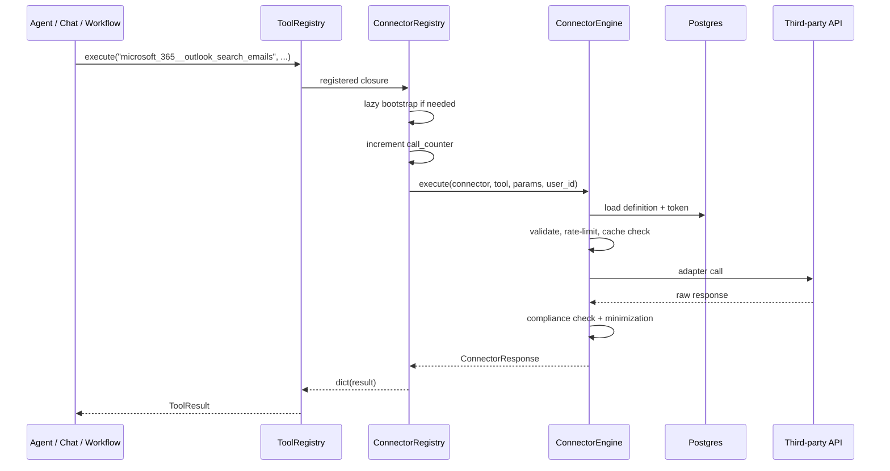
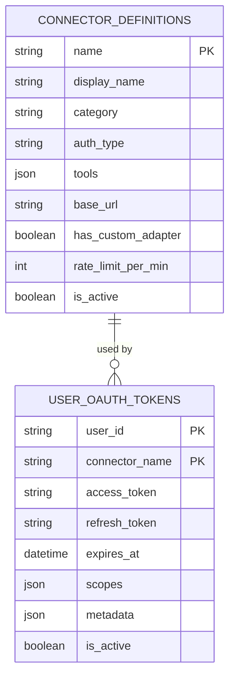
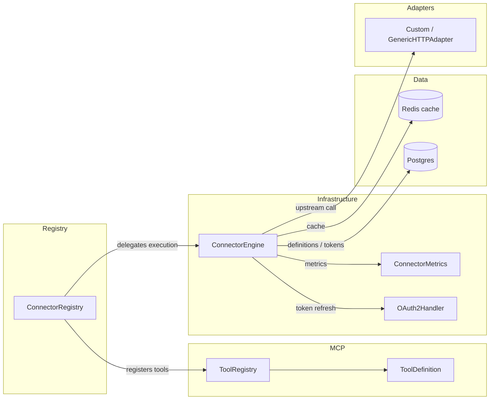

# shared_integrations_connector_infrastructure_registry

## Brief Introduction

The `shared_integrations_connector_infrastructure_registry` module provides the central, DB-backed registry for all connector tools in the platform. It is implemented by `connectors/registry.py` and exposes the `ConnectorRegistry` singleton. At startup the registry loads active connector definitions from Postgres, registers each connector tool as an LLM-callable function in the MCP `ToolRegistry`, and dispatches runtime execution through the `ConnectorEngine`. It also enforces per-request call limits, lazy-bootstraps in RQ workers, and self-heals when definitions are missing or stale.

This module sits at the boundary between the connector infrastructure layer and the MCP tool layer: it makes third-party integrations (Microsoft 365, Slack, Gmail, GitLab, Jira, Confluence, DPI, etc.) discoverable and usable by agents, workflows, and chat without hard-coding tool logic in callers.

---

## Module Purpose and Core Functionality

### 1. Central Registry for Connector Tools

`ConnectorRegistry` is a thread-safe singleton (`connector_registry`) that maintains an in-memory cache of active connector definitions loaded from `ainxt.connector_definitions`. Each definition carries metadata (name, display name, category, auth type, base URL, rate limit) and a list of tools with JSON input schemas.

### 2. Bootstrap and MCP Registration

During application startup, `mcp/registry.py` calls `ConnectorRegistry.bootstrap(mcp_tools_registry)` after registering built-in tools. The registry:

1. Loads all `is_active = TRUE` connector definitions from the DB.
2. Iterates over each connector's tool list.
3. Registers every tool into the provided `ToolRegistry` as a `ToolDefinition` with:
   - **Name**: `{connector_name}__{tool_name}` (e.g. `microsoft_365__outlook_search_emails`)
   - **Description**: prefixed with the connector display name
   - **Callable**: a closure that delegates to `ConnectorEngine.execute`
   - **Tags**: `connector`, category, and connector name
   - **Input schema**: the schema stored in the definition

This makes connector tools indistinguishable from native platform tools for the agent / workflow engine.

### 3. Runtime Execution Dispatch

The public `execute(connector_name, tool_name, params, user_id, query_text, call_counter)` method:

- Lazy-bootstraps the registry if it has not been initialized (critical for RQ workers that do not run the gateway startup sequence).
- Enforces `MAX_CONNECTOR_CALLS_PER_REQUEST` (default 3) using a mutable `call_counter` dict to prevent runaway tool loops in a single request.
- Delegates the actual call to `ConnectorEngine.execute` and returns a `ConnectorResponse`.

### 4. User-Scoped Tool Discovery

Several query methods return only the tools a specific user can actually invoke:

- `get_user_tools(user_id)` — LLM-facing tool definitions for connectors with active tokens.
- `get_user_status(user_id)` — connection status for every connector.
- `list_connected_tools(user_id)` — detailed tool list for the Cowork office planner, including `is_write` flags and required parameters.
- `get_available()` — all active connector definitions (no token required); self-heals by reloading from DB if the cache is empty.

### 5. Self-Healing and Worker Safety

The registry is designed to work correctly in multiple process types:

- **Gateway / FastAPI workers**: bootstrapped at startup.
- **RQ workers**: bootstrapped lazily on the first connector call.
- **Gunicorn workers**: `get_available()` reloads definitions from DB when the cache is empty, avoiding the "some workers see no connectors" UI flicker.

---

## Architecture and Component Relationships

### Class Overview

| Component | File | Responsibility |
|-----------|------|----------------|
| `ConnectorRegistry` | `connectors/registry.py` | Singleton registry: load definitions, register tools, dispatch execution, user-scoped discovery. |
| `connector_registry` | `connectors/registry.py` | Module-level singleton instance. |
| `ConnectorEngine` | `connectors/engine.py` | Executes connector tool calls: auth, token refresh, rate limits, caching, pagination, compliance. |
| `ConnectorResponse` | `connectors/base.py` | Normalized response shape returned to callers. |
| `ToolRegistry` / `ToolDefinition` | `mcp/tool_registry.py` | MCP layer that stores and executes registered tools. |
| `OAuth2Handler` | `connectors/oauth2.py` | OAuth2 authorization, code exchange, and token refresh. |
| `ConnectorMetrics` | `connectors/metrics.py` | Records call counts, latency, errors, cache hits, and audit logs. |

### Registry Lifecycle

```mermaid
flowchart TD
    A[Application startup] --> B[MCPRegistry._bootstrap]
    B --> C[Register built-in tools]
    C --> D[ConnectorRegistry.bootstrap]
    D --> E[Load active connector definitions from DB]
    E --> F[Register each tool as {connector}__{tool} in ToolRegistry]
    F --> G[Agent / Workflow / Chat requests tool]
    G --> H[ToolRegistry.execute]
    H --> I{Tool is connector?}
    I -->|yes| J[Closure calls ConnectorRegistry.execute]
    J --> K[ConnectorEngine.execute]
    K --> L[Adapter + upstream API]
    L --> M[ConnectorResponse]
```

### Execution Flow



### Data Model



### Dependency Graph



---

## How It Fits into the Overall System

The connector registry is a foundational piece of the **shared integrations** layer. It enables the rest of the platform to treat external SaaS tools as first-class platform tools:

- **Agent / chat runtime**: LLMs discover connector tools through the MCP `ToolRegistry` and invoke them by name. The registry ensures only connected integrations are exposed to the model.
- **Workflow engine**: Workflow nodes can call connector tools; the registry dispatches execution and normalizes responses.
- **Cowork / office planner**: `list_connected_tools` tells the planner which connector actions are available for a user right now.
- **Settings / connectors UI**: `get_available()` and `get_user_status()` power the connectors list and connection status badges.
- **RQ workers**: Lazy bootstrap lets background jobs (scheduled workflows, dispatch tasks, etc.) use connectors without requiring a full gateway startup sequence.

The registry intentionally does **not** implement adapter logic, OAuth flows, or response normalization itself. Those responsibilities live in sibling modules so the registry stays a thin, replaceable dispatch and discovery layer.

---

## Key Design Decisions

1. **Singleton with lazy bootstrap**: Guarantees that any process can call connectors successfully, even if it missed the initial bootstrap.
2. **Per-request call counter**: Prevents agents from entering infinite connector-call loops (`MAX_CONNECTOR_CALLS_PER_REQUEST = 3`).
3. **Tool name namespacing**: `{connector}__{tool}` avoids collisions and makes provenance explicit.
4. **Self-healing cache**: `get_available()` reloads from DB when empty, fixing gunicorn worker cache drift.
5. **No raises on registration errors**: Individual tool registration failures are logged and skipped so one bad definition cannot break the whole registry.

---

## References

- For the actual execution pipeline (auth, refresh, rate limiting, caching, pagination, compliance), see [shared_integrations_connector_infrastructure_engine](shared_integrations_connector_infrastructure_engine.md).
- For the normalized response object returned by connector calls, see shared_integrations_connector_infrastructure_base (or the `connectors/base.py` component in the connector infrastructure module).
- For OAuth2 authorization, code exchange, and token refresh, see [shared_integrations_connector_infrastructure_oauth2](shared_integrations_connector_infrastructure_oauth2.md).
- For connector call metrics and audit logging, see [shared_integrations_connector_infrastructure_metrics](shared_integrations_connector_infrastructure_metrics.md).
- For the MCP tool layer where connector tools are registered, see shared_core_mcp_system (specifically `mcp/tool_registry.py`).
- For the set of custom adapters the registry may dispatch to, see [shared_integrations_connector_adapters](shared_integrations_connector_adapters.md).
- For the DPI consent handling used by DPI connectors, see [shared_integrations_connector_infrastructure_dpi_consent](shared_integrations_connector_infrastructure_dpi_consent.md).
