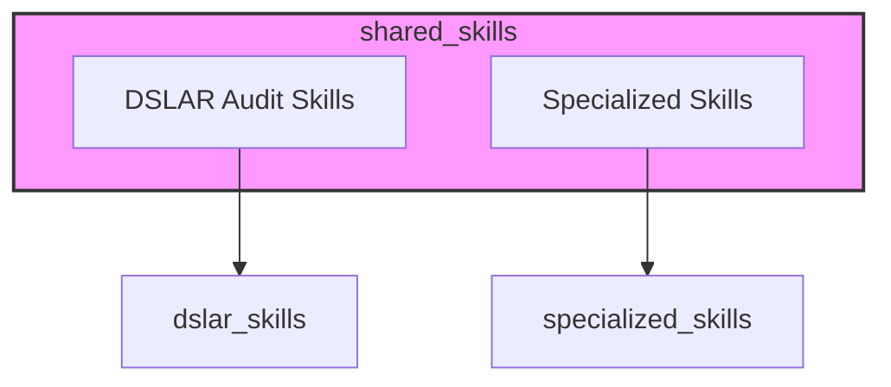
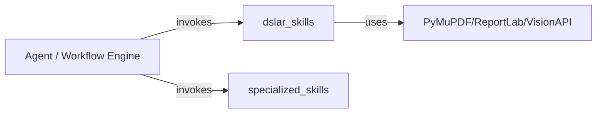

# shared_skills Module Overview

## Purpose

`shared_skills` is a repository-wide skill library that bundles reusable, file-system-based utilities and domain-specific scripts. It is organized as a flat collection of purpose-specific skill packs that can be invoked standalone, orchestrated by the ABStudio workflow engine, or embedded into agent-generated code running in sandboxed environments.

The module's current responsibilities are:

1. **Specialized audit pipelines** — Run deterministic, multi-stage document audits such as the NPCI DL-SAR validation pipeline.
2. **Deterministic skill helpers** — Provide narrow, auditable scripts for domain-specific calculations and regulated-data detection.

## Architecture

`shared_skills` is a leaf module under the repository root. It contains no runtime service dependencies; instead, each sub-module is a self-contained script pack.

### Skill Pack Interaction

## Core Components

| Component | Responsibility | Documentation |
|-----------|----------------|---------------|
| `dslar_skills` | Multi-stage NPCI DL-SAR audit pipeline: PDF extraction, image enrichment, clause chunking/validation, and report rendering. | [dslar_skills](dslar_skills.md) |
| `specialized_skills` | Narrow, deterministic helpers for domain-specific skills (e.g., DPDP personal-data detection). | [specialized_skills](specialized_skills.md) |

DOCX/PPTX/XLSX document generation is handled by the separate `skills/ainxt_doc_craft/` skill set, which is unrelated to this module.

## Relationship to the Rest of the System

- **ABStudio backend** — The workflow engine and agent factory can invoke these scripts as workflow nodes or tool steps, passing artifacts via `WORKFLOW_ARTIFACT_DIR` and collecting outputs from `OUTPUT_DIR`.
- **Agent runtime / sandbox** — Many scripts are designed to run inside sandboxed code execution environments with minimal or no platform imports.

## Notes

- Validation is typically baseline-aware: only *new* errors introduced by edits are reported when an original file is supplied.
- The module favors deterministic, auditable operations over silent rewriting, making it suitable for governance-sensitive document workflows.
