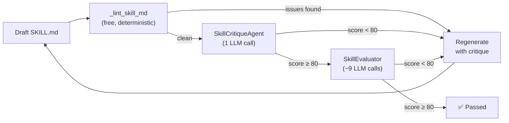
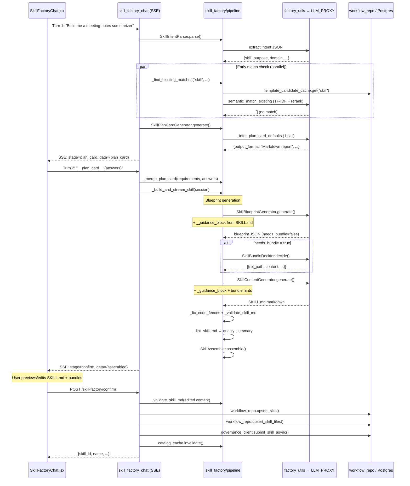
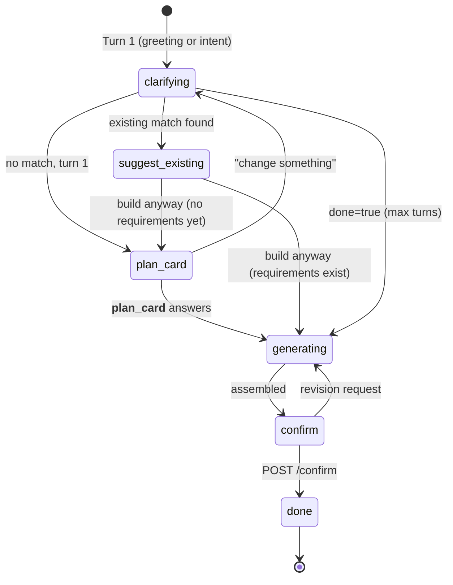
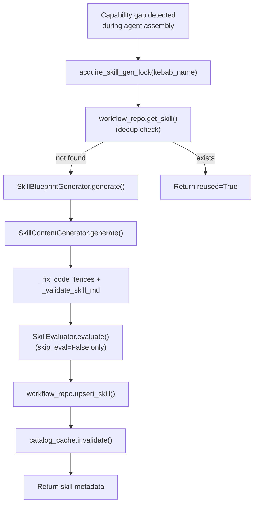
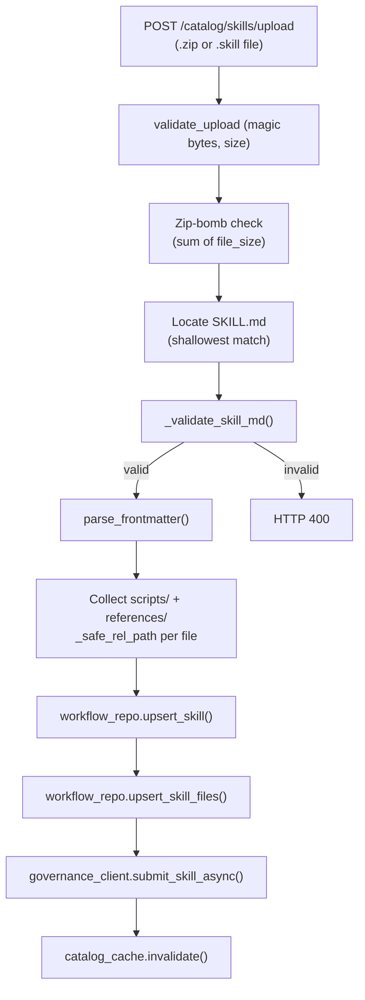
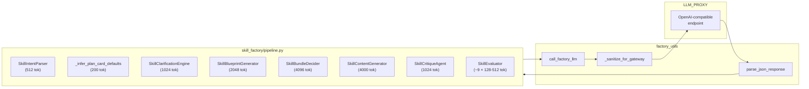

# Skill Factory Pipeline

> **Module:** `ABStudio/backend/skill_factory/pipeline.py`
> **Domain:** ABStudio backend — conversational AI skill authoring
> **Related modules:** [agent_factory_pipeline](../agents/agent_factory_pipeline.md) · [api_factories](../api/api_factories.md) · [api_catalog](../api/api_catalog.md) · [core_factory_utils](../agents/core_factory_utils.md) · [core_workflow_repo](../workflows/core_workflow_repo.md) · [core_governance](../sdlc/core_governance.md) · [workflow_factory_pipeline](../workflows/workflow_factory_pipeline.md) · [skills_feature](skills_feature.md)

## 1. Introduction

The **Skill Factory Pipeline** is the conversational engine that turns a plain-language request ("build me a skill that summarizes meeting notes into action items") into a production-ready, spec-compliant **SKILL.md** artifact — optionally bundled with helper scripts and reference documents — and persists it to the shared skills catalog.

Rather than hand-copying authoring guidance into prompts (where it drifts), the pipeline can read a Markdown guidance file from disk at runtime and inject the authoring-relevant sections into every generation prompt. No such file ships by default, so the pipeline runs on its inline prompts; point `AINXT_SKILL_GUIDANCE_MD` at a file to supply your own. The pipeline owns *the machinery* (staging, validation, quality loop, packaging).

The module is consumed by three distinct entry points:

| Consumer | Entry point | Purpose |
|---|---|---|
| **Skill Factory Chat** (UI) | `skill_factory_chat` SSE endpoint in [api_factories](../api/api_factories.md) | Multi-turn conversational creation: clarify → plan card → generate → confirm |
| **Agent Factory** (programmatic) | `DynamicSkillGenerator` in [agent_factory_pipeline](../agents/agent_factory_pipeline.md) | Headless one-shot generation to fill a capability gap detected during agent assembly |
| **Catalog upload** (import) | `upload_catalog_skill` in [api_catalog](../api/api_catalog.md) | Validates and imports a packaged `.skill`/`.zip` archive using the same validation rules |

## 2. Architecture Overview

```mermaid
flowchart TB
    subgraph ABStudio["ABStudio Backend"]
        subgraph API["API Layer (api_factories, api_catalog)"]
            Chat["skill_factory_chat<br/>(SSE)"]
            Confirm["skill_factory_confirm"]
            Validate["skill_factory_validate"]
            Download["skill_factory_download"]
            Upload["upload_catalog_skill"]
            GenCatalog["generate_catalog_skill"]
        end

        subgraph Pipeline["skill_factory/pipeline.py"]
            Guidance["_SkillCreatorGuidance<br/>reads SKILL.md from disk"]
            IntentParser["SkillIntentParser"]
            Clarify["SkillClarificationEngine"]
            PlanCard["SkillPlanCardGenerator"]
            Blueprint["SkillBlueprintGenerator"]
            BundleDecider["SkillBundleDecider"]
            ContentGen["SkillContentGenerator"]
            Critic["SkillCritiqueAgent"]
            Evaluator["SkillEvaluator"]
            QualityLoop["SkillQualityLoop"]
            Assembler["SkillAssembler"]
            Pkg["_package_skill"]
            ValidateFn["_validate_skill_md<br/>_lint_skill_md<br/>parse_frontmatter"]
            CatalogCache["_CatalogCache"]
            TemplateCache["_TemplateCandidateCache"]
        end

        subgraph Core["Core Services"]
            FactoryUtils["factory_utils<br/>call_factory_llm<br/>semantic_match_existing"]
            WorkflowRepo["workflow_repo<br/>upsert_skill / list_skills"]
            Governance["governance_client<br/>submit_skill_async"]
            LLMHandler["llm_handler<br/>→ LLM_PROXY"]
        end

        subgraph Storage["Postgres"]
            SkillsTable["skills_catalog"]
            SkillFiles["skill_files"]
            FactorySessions["factory_sessions"]
        end
    end

    subgraph External["External"]
        SkillCreatorMD["AINXT_SKILL_GUIDANCE_MD<br/>(optional)"]
        Frontend["SkillFactoryChat.jsx<br/>(skills_feature)"]
    end

    Frontend -->|SSE / REST| API
    Chat --> IntentParser
    Chat --> Clarify
    Chat --> PlanCard
    Chat --> Blueprint
    Chat --> ContentGen
    Chat --> Assembler
    Chat --> TemplateCache
    Blueprint --> Guidance
    ContentGen --> Guidance
    Guidance -->|reads mtime| SkillCreatorMD
    QualityLoop --> Critic
    QualityLoop --> Evaluator
    QualityLoop --> ContentGen
    Assembler --> ValidateFn
    Confirm --> WorkflowRepo
    Confirm --> Governance
    Upload --> ValidateFn
    Upload --> WorkflowRepo
    GenCatalog -->|DynamicSkillGenerator| Blueprint
    Pipeline --> FactoryUtils
    FactoryUtils --> LLMHandler
    WorkflowRepo --> SkillsTable
    WorkflowRepo --> SkillFiles
    CatalogCache --> WorkflowRepo
    TemplateCache --> WorkflowRepo
```



## 3. Core Components

### 3.1 `_SkillCreatorGuidance` — Canonical Authoring Spec Loader

A singleton (`_skill_creator_guidance`) that reads the optional guidance file (`AINXT_SKILL_GUIDANCE_MD`) from disk and caches the **authoring-relevant sections** only. It re-reads the file when its `mtime` changes, so editing the `.md` immediately changes how skills are generated — no code change or redeploy required. When the file is absent it yields empty guidance and the inline prompts are used.

- **Wanted sections** (matched case-insensitively against Markdown headings): *"Write the SKILL.md"*, *"Skill Writing Guide"*, *"How skill triggering works"*.
- **Fenced-code awareness**: lines inside ```` ``` ```` blocks are never treated as headings, preventing the spec's own ``## ``-prefixed examples from spuriously starting/stopping capture.
- **Graceful degradation**: when the file is missing (e.g. `skills/` not deployed), `_guidance_block()` returns `""` so callers can safely concatenate it onto their inline system prompt. The inline prompts remain a self-sufficient fallback; the on-disk guidance *augments* them.

`_guidance_block(context_hint)` is the public helper every generator calls — it returns an injectable prompt block that explicitly states *"Where it conflicts with anything above, the guidance below wins."*

### 3.2 Intent Parsing & Clarification

#### `SkillIntentParser`
Single LLM call that extracts structured intent from the user's first message: `skill_purpose`, `domain`, `raw_intent`, `inferred_trigger`, `inferred_output`. Falls back to the raw message truncated to 200 chars when the LLM omits `skill_purpose`.

#### `SkillClarificationEngine`
Multi-turn Q&A. Asks **one question at a time** with 2–4 domain-specific suggestion chips, and force-declares `done` after `SKILL_CLARIFY_MAX_TURNS` (default 2) user turns — never more than 4 questions total. When done, returns a structured `requirements` dict including a `wants_scripts` flag that gates bundle generation.

#### `SkillPlanCardGenerator`
Produces a **structured Plan Card** with 4 static questions (output format, avoid-when, detail level, include examples). Option lists are always the hardcoded static lists — never hallucinated. One fast LLM call (`_infer_plan_card_defaults`) picks the best default per question, constrained to verbatim options from the list.

> **Note:** `_infer_plan_card_defaults` is duplicated in [workflow_factory_pipeline](../workflows/workflow_factory_pipeline.md) — both factories share the same Plan Card UX pattern. The skill variant uses a 200-token cap and a skill-specific context string.

### 3.3 Blueprint & Content Generation

#### `SkillBlueprintGenerator`
Produces an implementation-ready **blueprint** JSON from requirements. The system prompt is heavily engineered with:
- **Description rules** — exactly 2 sentences; sentence 1 starts with "Use when"; sentence 2 lists concrete trigger phrases/file types so agents trigger the skill even when the user doesn't name it ("be a little pushy").
- **Approach rules** — every step is an imperative directive ("Extract X", "Identify Y by Z rule"), never narration.
- **Do-not-use-when rules** — lists adjacent tasks the skill should refuse, preventing false-positive triggers.
- **`needs_bundle` gate** — honestly decides whether the skill needs bundled scripts/references. Defaults to `false` (most skills are LLM-native text work). An explicit user `wants_scripts` opt-in overrides the model's conservative bias.

The blueprint generator injects `_guidance_block("designing the blueprint and writing the description")` and applies Plan Card answers as **hard constraints** (output format, example inclusion).

#### `SkillContentGenerator`
Writes the actual **SKILL.md** markdown body from the blueprint. Key behaviors:
- **Strict structure**: frontmatter → Overview → Input Format → When to Use (with literal `**Do not use when:**`) → Approach → Output Format → Example.
- **Code-fence repair** (`_fix_code_fences`): detects bare language identifiers the LLM dropped opening backticks on, and re-fences them — but only when the next line looks like code (not prose), preventing false positives on markdown text.
- **Auto-fix on validation failure**: if `_validate_skill_md` fails, makes one repair LLM call to fix the frontmatter, then re-validates.
- **Bundle-aware**: when `bundle_files` are present, appends a `BUNDLE_HINT_TEMPLATE` instructing the body to reference each file by relative path with a "when to read this" hint — never inline their contents (progressive disclosure).
- **Critique-aware**: when called from the quality loop's regeneration pass, appends the accumulated issue list so the next draft fixes them.

#### `SkillBundleDecider`
Decides whether the skill needs bundled scripts/references, and generates them. Returns 0–3 files with:
- **Safe path enforcement** (`_safe_rel_path`): forces `scripts/` or `references/` prefixes, rejects path traversal (`..`), validates extensions (`.py`/`.sh`/`.js` for scripts, `.md` for references).
- **Placeholder rejection**: drops files containing `"todo: implement"` / `"your code here"` / `"placeholder"` when under 400 bytes.
- **Size caps**: max 4 files, 12KB per file (`_MAX_BUNDLE_FILE_BYTES`).

### 3.4 Validation & Linting

#### `parse_frontmatter(content)` → `dict`
PyYAML-free frontmatter parser. Shared by validation, description extraction, and the upload importer so parsing rules stay in one place. Handles simple `key: value` lines (quoted or unquoted).

#### `_validate_skill_md(content)` → `(bool, str)`
Validates frontmatter only:
- Must start with `---` and have a closing `---`.
- Allowed keys: `name`, `description`, `license`, `allowed-tools`, `metadata`, `compatibility`.
- `name`: kebab-case, max 64 chars, no leading/trailing/consecutive hyphens.
- `description`: no angle brackets, max 1024 chars.

#### `_lint_skill_md(content)` → `list[str]`
Style/quality lint that runs *after* validation passes. Not a blocker (the skill still saves), but feeds into the quality loop's critique. Checks:
- Description length ≥ 30 chars, starts with "Use when", ≥ 2 sentences.
- Body contains a "Do not use when" section.
- Flags narration anti-patterns ("the skill will", "it scans", "this skill helps").
- Flags placeholder example text ("sample input here", "<example>").

### 3.5 Quality Evaluation

#### `SkillEvaluator`
LLM-based trigger evaluation. Tests **trigger accuracy** without needing an external CLI:
1. Generates 5 positive + 3 negative test scenarios from the skill description.
2. Judges each scenario in parallel (all independent LLM calls) — "would you load this skill for this message?"
3. Returns a 0–100 score plus actionable feedback (description too narrow → broaden "Use when"; too broad → add "Do not use when").

#### `SkillCritiqueAgent`
Reviews a SKILL.md against **five structural quality axes** (each 0–20): trigger specificity, imperative approach, realistic example, output format clarity, false-positive guard. Returns a 0–100 score + actionable issue list. `passed` requires score ≥ 80 AND no axis below 12.

#### `SkillQualityLoop`
Orchestrates the **iterate-and-improve loop**: lint → critique → evaluate → regenerate. Cost-aware tier ordering:



- **Short-circuit**: skips the expensive evaluator (~9 LLM calls) when lint or critique already flag problems — trigger accuracy is meaningless on a malformed skill.
- **Budget**: `SKILL_QUALITY_MAX_ITERS` (default 2) regeneration passes. Worst case ~18 LLM calls; typical well-formed first draft ~10.
- **Best-draft tracking**: always returns the highest-scoring draft across iterations, even if thresholds never clear.
- **Progress callback**: emits SSE-friendly progress messages via `progress_cb`.

> **Important:** The live `skill_factory_chat` endpoint currently uses only `_lint_summary` (deterministic, free) — the full LLM quality loop was removed from the chat path to cut ~10–18 serial LLM round-trips that dominated create latency. `SkillQualityLoop` remains available for programmatic callers (e.g. `DynamicSkillGenerator` with `skip_eval=False`).

### 3.6 Caching

#### `_CatalogCache` (`catalog_cache`)
60-second TTL cache for the skills + tools catalog. Avoids hitting Postgres on every blueprint generation call. Lazily creates its `asyncio.Lock` inside the event loop. Also derives a **service index** (`get_service_index()`) from the cached tools, memoised until the next refresh — gives the workflow factory catalog-accurate tool matching for ~free.

#### `_TemplateCandidateCache` (`template_candidate_cache`)
5-minute TTL cache (`FACTORY_TEMPLATE_CACHE_TTL_S`) for workflow/agent/skill template candidates used by semantic matching. Templates change rarely (admin-only), so the match task starts its LLM call almost immediately instead of waiting on Postgres. Shared across all three factory kinds.

### 3.7 Session Management

#### `SkillFactorySession` (dataclass)
In-memory session state: `session_id`, `stage` (`clarifying` → `plan_card` → `generating` → `confirm` → `done`), `messages`, `intent`, `requirements`, `blueprint`, `content`, `assembled`, `bundle_files`, `pending_matches`.

#### Persistence (write-through / read-through)
Mirrors the in-memory session to the `factory_sessions` Postgres table so an interrupted "build me a skill" conversation survives a backend restart. Best-effort — persistence failures never break the live chat turn (logged at debug level).

- `get_or_restore_skill_session(session_id, owner_user_id)` — checks memory first, then Postgres.
- `persist_skill_session(session, owner_user_id)` — called in the `finally` block of every chat turn.

#### Dedup lock (`acquire_skill_gen_lock`)
Per-skill-name `asyncio.Lock` preventing two concurrent agent creations from generating the same skill simultaneously. Used by `DynamicSkillGenerator` in [agent_factory_pipeline](../agents/agent_factory_pipeline.md).

### 3.8 Assembly & Packaging

#### `SkillAssembler`
Produces the final manifest dict streamed to the creation UI: name, display_name, description, category, content, tags, `bundle_files` (with content capped at `_MANIFEST_CONTENT_MAX_BYTES` = 16KB per file for SSE frame safety), and `quality` summary.

#### `_package_skill(name, content, bundle_files)` → `bytes`
Returns a `.skill` (ZIP) file as bytes containing `SKILL.md` plus any bundled scripts/references. Enforces path safety — never lets a `rel_path` escape the skill folder.

## 4. Conversational Skill Creation Flow



### Stage State Machine



## 5. Programmatic Generation (Agent Factory)

The `DynamicSkillGenerator` in [agent_factory_pipeline](../agents/agent_factory_pipeline.md) uses the same pipeline components but **skips conversational clarification** — the agent factory already knows what skill is needed (gap name + agent blueprint context).



## 6. Skill Upload / Import Flow

The `upload_catalog_skill` endpoint in [api_catalog](../api/api_catalog.md) imports a packaged `.skill`/`.zip` archive using the **same validation rules** as the generation path:



## 7. Governance Integration

All AI-generated and uploaded skills are submitted for **HOD (Head of Department) approval** before use via `governance_client.submit_skill_async()`. This is a fail-closed control:

- `is_usable("skills", name)` returns `False` when no governance record exists — a freshly-created-but-unsubmitted skill cannot be run until it goes through approval.
- The submit happens off the event loop (`asyncio.to_thread`) and failures are logged at warning level (not silently at debug) — a failed submit is a governance-control failure, but it does not break the create/upload response.
- Visibility (`public` / `private`) is normalized and passed through to the governance system.

See [core_governance](../sdlc/core_governance.md) for the full governance lifecycle.

## 8. LLM Call Topology

Every LLM call in the pipeline routes through `call_factory_llm` in [core_factory_utils](../agents/core_factory_utils.md), which:
- Builds an `LLMConfig` pointing at `FACTORY_BASE_URL` (LLM_PROXY-aware).
- Sanitizes outbound text through `_sanitize_for_gateway` (replaces PCI-trigger words that would cause content-filter blocks).
- Prefers **non-streaming** requests (factory calls wait for full JSON; some gateways return errors on streaming for large generations).
- Retries once on transient gateway errors; does NOT retry content-filter rejections (`SecurityGatewayRejection` propagates).
- Logs per-call timing when `FACTORY_LLM_TIMING=1`.



### Typical LLM call counts

| Path | Calls | Notes |
|---|---|---|
| Chat: clarify (2 turns) + plan card + generate (no bundle) | ~5 | Intent + 2× clarify + plan-card defaults + blueprint + content |
| Chat: clarify (2 turns) + plan card + generate (with bundle) | ~6 | + bundle decider |
| Chat: confirm with revision | ~3 | Revision + re-draft (+ bundle if needed) |
| DynamicSkillGenerator (skip_eval=True) | ~2 | Blueprint + content |
| DynamicSkillGenerator (skip_eval=False) | ~11 | + evaluator (9 calls) |
| SkillQualityLoop (2 iterations, full) | ~18 | Worst case |

## 9. Configuration

| Env var | Default | Purpose |
|---|---|---|
| `SKILL_CLARIFY_MAX_TURNS` | `2` | Force `done` after this many user turns in clarification |
| `SKILL_CONTENT_MAX_TOKENS` | `4000` | Max tokens for SKILL.md body generation |
| `SKILL_QUALITY_MAX_ITERS` | `2` | Max regeneration passes in `SkillQualityLoop` |
| `FACTORY_TEMPLATE_CACHE_TTL_S` | `300` | Template candidate cache TTL (seconds) |
| `FACTORY_LLM_TIMING` | `1` | Log per-call LLM timing |
| `FACTORY_LLM_FORCE_STREAM` | `0` | Force streaming endpoint (debugging) |
| `FACTORY_MODEL` | *(set in config)* | Model name for all factory LLM calls |

## 10. Key Design Decisions

1. **On-disk guidance as an extension point** — When `AINXT_SKILL_GUIDANCE_MD` points at a file it is read at runtime rather than hardcoded, so editing it changes generation behaviour with no code change. No such file ships by default; the pipeline owns the *machinery* either way.

2. **Progressive disclosure** — SKILL.md stays compact; bundled scripts/references are loaded on demand by the agent via `read_skill_file`. The content generator never inlines bundled file contents into SKILL.md.

3. **Cost-aware quality loop** — Tier ordering (free lint → 1-call critique → 9-call evaluator) short-circuits expensive evaluation on malformed drafts. The live chat path uses lint-only to keep create latency low.

4. **Fail-safe semantic matching** — `_find_existing_matches` fails safe to `[]` so the factory silently proceeds to build new rather than erroring the whole chat turn. Only curated templates are recommended (never the user's own saved items).

5. **Bundle gating** — `needs_bundle` defaults to `false`. Most skills are LLM-native text work that need no bundled files. Only an explicit model `true` or user `wants_scripts` opt-in triggers the extra 4096-token bundle-decider call.

6. **Dedup lock** — Per-skill-name `asyncio.Lock` prevents concurrent generation of the same skill during parallel agent assembly. The lock holder re-checks the catalog after acquiring the lock (double-checked locking).

7. **Session persistence is best-effort** — Write-through to `factory_sessions` table so interrupted conversations survive restarts, but persistence failures never break the live chat turn.

## 11. File Layout

```
skill_factory/
└── pipeline.py          # This module — all generation, validation, quality, packaging logic

# Consumed by:
app/api/factories.py     # skill_factory_chat, _confirm, _validate, _download (SSE/REST endpoints)
app/api/catalog.py       # upload_catalog_skill, generate_catalog_skill, upsert_catalog_skill
agent_factory/pipeline.py # DynamicSkillGenerator (headless one-shot generation)

# Depends on:
app/core/factory_utils.py # call_factory_llm, parse_json_response, semantic_match_existing, build_service_index
app/core/workflow_repo.py # upsert_skill, upsert_skill_files, list_skills, get_skill, save/load_factory_session
app/core/governance_client.py # submit_skill_async, is_usable
app/core/llm_handler.py   # get_llm_client (→ LLM_PROXY)

# Guidance source (read at runtime):
AINXT_SKILL_GUIDANCE_MD (optional)
```
