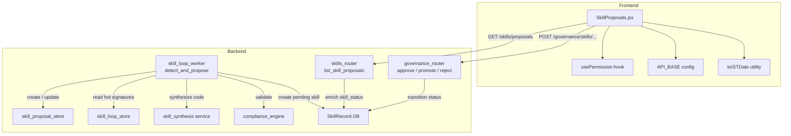
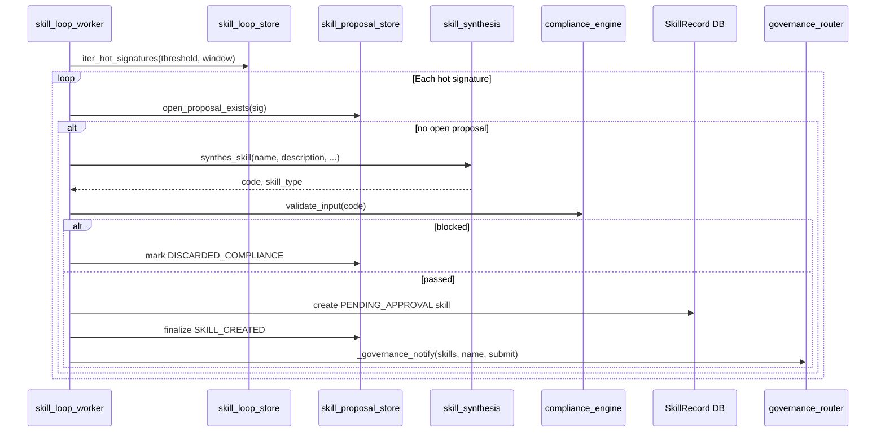
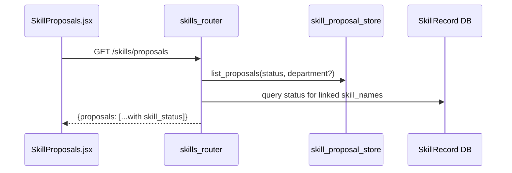
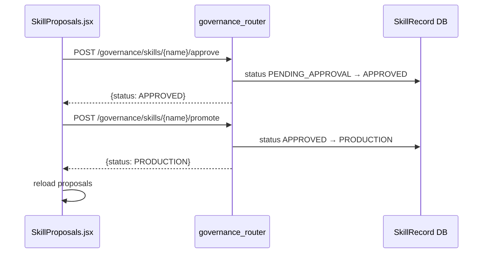
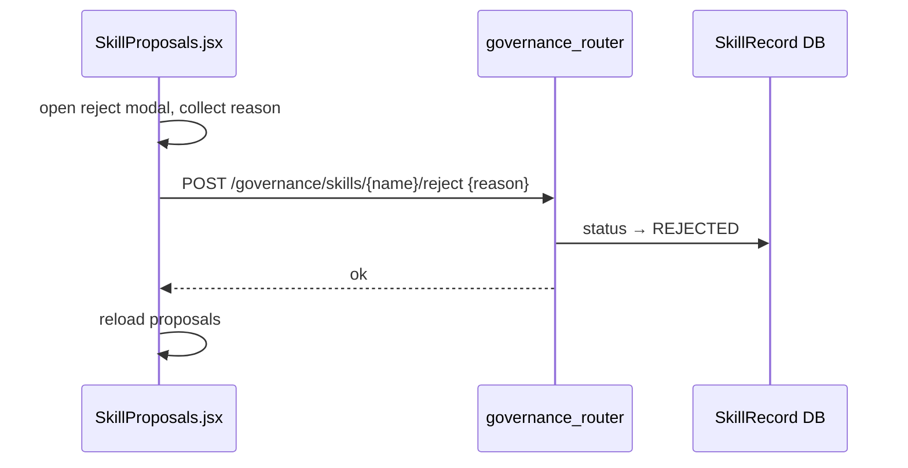
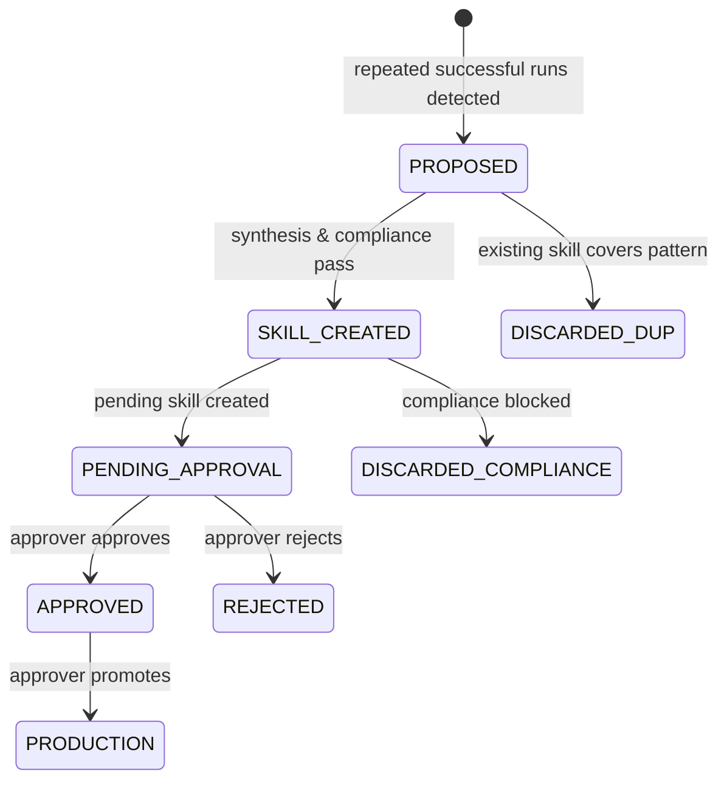

# Skill Proposals Module

The **Skill Proposals** module is the human-in-the-loop (HITL) surface for the platform’s self-improving skill loop. It lives in the `ai-ui` frontend as a React component (`SkillProposals.jsx`) and lets administrators and approvers review, approve, promote, or reject skills that the system auto-synthesizes from repeated successful agent/tool runs.

## What it does

- **Surfaces candidate skills**: Lists auto-detected skill proposals produced by the background skill_loop_worker.
- **Shows provenance**: For each proposal, displays the representative prompt, observed tool sequence, occurrence count, source, department, and current governance status.
- **Enables governance actions**: Approvers can approve & promote a pending skill to production, promote an already-approved skill, or reject it with a reason.
- **Department-scoped visibility**: Non-approvers can review proposals for their own department; approvers and admins see proposals across the organization.

## Core responsibilities

| Responsibility | Implementation |
| --- | --- |
| Load and display proposals | `GET /skills/proposals` via [skills_router](skills_router.md) |
| Filter proposals by status | Local state filter (`ALL`, `SKILL_CREATED`, `PROPOSED`, `DISCARDED_*`) |
| Expand row details | Toggleable panel showing representative prompt, tool sequence, and linked skill |
| Approve / promote / reject | `POST /governance/skills/{skill_name}/{approve|promote|reject}` via [governance_router](../sdlc/governance_router.md) |
| Permission gating | `usePermission` hook (`canApprove`) |
| Time formatting | `toISTDate` utility |

## Architecture

## Proposal and skill statuses

The UI distinguishes between the **proposal lifecycle** and the **skill governance lifecycle**.

### Proposal statuses

| Status | Meaning |
| --- | --- |
| `PROPOSED` | Candidate detected but not yet synthesized into a skill. |
| `SKILL_CREATED` | A pending skill has been created from the proposal and is awaiting governance. |
| `DISCARDED_COMPLIANCE` | Synthesized code failed the compliance hard gate and was discarded. |
| `DISCARDED_DUP` | An existing skill already covers this pattern; proposal was discarded. |
| `REJECTED` | A human approver rejected the proposal (via the linked skill). |

### Skill statuses

| Status | Meaning |
| --- | --- |
| `PENDING_APPROVAL` | Skill exists but has not been approved. |
| `APPROVED` | Skill passed approval but is not yet in production. |
| `PRODUCTION` | Skill is live and available for use. |
| `REJECTED` | Skill was rejected by an approver. |
| `DEPRECATED` | Skill is no longer recommended. |

## Data flow

### 1. Background detection and synthesis

The skill_loop_worker periodically scans for repeated successful run signatures. When a signature crosses the configured threshold, it:

1. Checks for duplicate open proposals and existing skills.
2. Synthesizes skill code via the shared skill_synthesis service.
3. Runs a compliance hard-gate check through the compliance_engine.
4. Creates a `PENDING_APPROVAL` `SkillRecord` and finalizes the proposal as `SKILL_CREATED`.
5. Notifies approvers through the governance notification path.

### 2. UI list load

When the component mounts, it fetches the proposal list and renders each row. The backend enriches `SKILL_CREATED` proposals with the live `skill_status` from the `SkillRecord` table so the UI knows which actions to show.

### 3. Approve and promote flow

Approvers see **Approve & Promote** for `PENDING_APPROVAL` skills. Clicking it calls the governance `approve` action followed by `promote`, then refreshes the list.

### 4. Reject flow

Rejecting opens a modal that requires a reason. The reason is sent to the governance `reject` endpoint.

## State transitions

## Permissions and access control

- The frontend uses `usePermission(user).canApprove` to decide whether to render action buttons.
- The backend [skills_router](skills_router.md) scopes the list:
  - Admins and users with `can_approve` / `ad_level <= 3` see all proposals.
  - Other users see only proposals whose `department` matches their own.
- The destructive actions (`approve`, `promote`, `reject`) are enforced by the [governance_router](../sdlc/governance_router.md), which validates scoped approver rights.

## Component API

`SkillProposals` accepts a single prop:

| Prop | Type | Description |
| --- | --- | --- |
| `user` | object | Current user object, passed to `usePermission` for role checks. |

## Key implementation notes

- **Governance actions act on the skill, not the proposal**: The UI calls `/governance/skills/{skill_name}/{verb}` using the `skill_name` produced when the proposal was finalized.
- **Busy state**: The `busy` state tracks the `skill_name` currently being acted on so buttons disable and show “…” while an async governance call is in flight.
- **Refresh after action**: Every governance action ends with `load()` to reflect the latest statuses.
- **Fail-closed compliance**: If compliance validation cannot run, the worker releases the proposal claim and retries later rather than creating an unverified skill.
- **No client-side caching**: Proposals are fetched fresh on mount and on manual refresh.

## Dependencies and related modules

- **[skills_router](skills_router.md)** — backend endpoint that lists proposals and enriches them with live skill status.
- **[governance_router](../sdlc/governance_router.md)** — backend endpoint for `approve`, `promote`, and `reject` actions.
- **skill_loop_worker** — background worker that detects repeated runs and synthesizes candidate skills.
- **skill_proposal_store** — persistence layer for proposal records.
- **skill_loop_store** — persistence layer for run-signature aggregation.
- **skill_synthesis** — service that generates skill code from a description.
- **compliance_engine** — hard-gate validator for synthesized skill code.
- `usePermission` hook — frontend permission helper.
- `API_BASE` in [config](../core/config.md) — backend base URL.
- `toISTDate` utility — formats UTC timestamps to IST for display.
