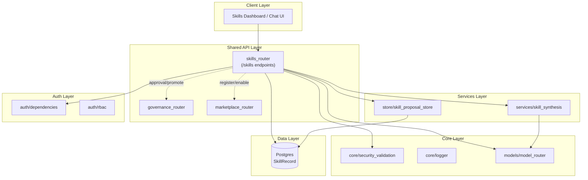
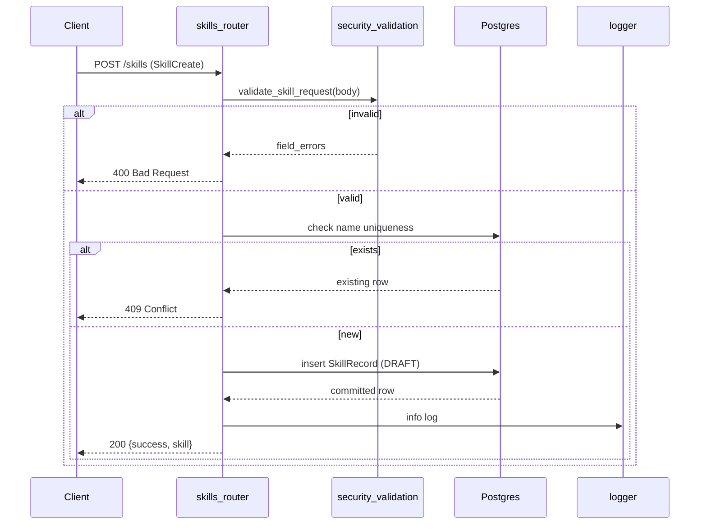
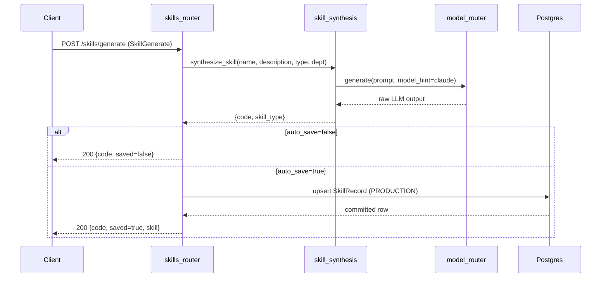
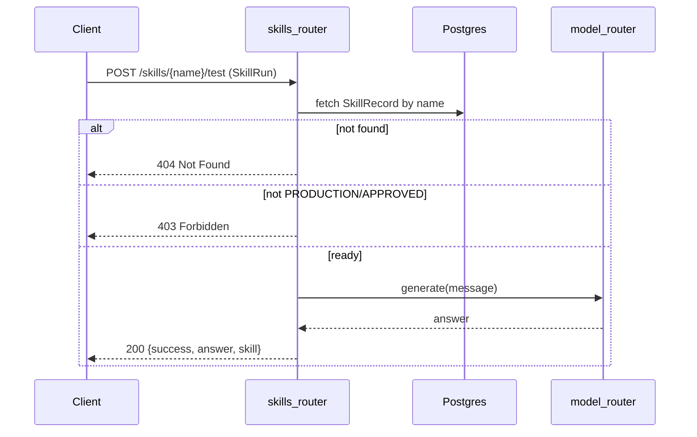
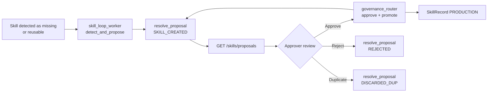

# skills_router

The `skills_router` module exposes the `/skills` REST API surface for managing platform skills in the shared API layer. It provides CRUD operations, natural-language skill generation, skill testing, and visibility into auto-synthesized skill proposals. Skills are stored as `SkillRecord` rows in Postgres and represent reusable, executable capabilities—typically Python functions—that agents and workflows can invoke.

This router is the runtime counterpart to the richer skill factories in abstudio_backend and [skill_factory_pipeline](skill_factory_pipeline.md). While those modules focus on iterative skill authoring, quality loops, and catalog publishing, `skills_router` offers the lightweight, direct API used by dashboards and chat interfaces to create, list, test, and delete skills.

---

## Core Functionality

### Skill Lifecycle Management

The router implements the full lifecycle of a skill from creation to deletion:

| Stage | Endpoint | Purpose |
|-------|----------|---------|
| List | `GET /skills` | Discover visible skills with RBAC-aware filtering |
| Create | `POST /skills` | Manually create a skill from a structured payload |
| Update | `PUT /skills/{name}` | Edit an existing skill's metadata and code |
| Delete | `DELETE /skills/{name}` | Remove a skill from the platform |
| Generate | `POST /skills/generate` | Create a skill from plain-English description via LLM |
| Test | `POST /skills/{name}/test` | Execute a skill against a sample message |
| Proposals | `GET /skills/proposals` | Review auto-synthesized skill proposals |

### Visibility and Access Control

Skill visibility follows a tiered model:

- **Admins** see all skills.
- **Regular users** see:
  - Skills they created.
  - Legacy skills with no creator or visibility field.
  - Public skills in `APPROVED` or `PRODUCTION` status.
  - Private skills scoped to their department.

This logic is enforced directly in `list_skills` using SQLAlchemy filters against the `SkillRecord` table.

### Natural-Language Skill Generation

The `generate_skill` endpoint allows non-technical users to describe a desired capability in plain English. The router delegates code synthesis to [services/skill_synthesis](../core/shared_core.md#services), which uses the [model_router](../core/shared_core.md#model-routing) to generate Python code. Generated skills can be returned as drafts or saved directly as `PRODUCTION`.

### AiNxt Platform Skill Seeding

At gateway startup, `seed_platform_skills()` idempotently inserts a curated set of platform skills (`code_review`, `debugging`, `documentation`, `architecture_analysis`). These skills embed their own system prompts and call the model router at execution time, requiring no external dependencies.

---

## Architecture

### Component Relationships

- **`SkillCreate`** and **`SkillRun`** are Pydantic request models for skill creation/update and skill testing respectively.
- **`SkillGenerate`** is the request model for natural-language skill generation.
- **`_row_to_dict`** normalizes `SkillRecord` rows into a stable API response shape.
- **`seed_platform_skills`** bootstraps built-in platform skills at startup.

---

## Data Flow

### Creating a Skill

### Generating a Skill from Natural Language

### Testing a Skill

---

## Endpoints Reference

### `GET /skills`

Lists skills visible to the authenticated user. Admins see all skills; non-admins see a filtered view based on ownership, visibility, status, and department.

**Dependencies:** `get_current_user`, `is_admin`

**Returns:** `{ "skills": [...] }`

### `GET /skills/proposals`

Returns the audit trail of auto-synthesized skill proposals. Visible to admins and users with `can_approve` or `ad_level <= 3`. Non-approvers are scoped to their department.

**Dependencies:** `get_current_user`, `is_admin`, `store/skill_proposal_store.list_proposals`

**Returns:** `{ "proposals": [...] }` with optional `skill_status` enrichment.

### `POST /skills`

Creates a new skill in `DRAFT` status. Validates and sanitizes inputs via `validate_skill_request`. Rejects duplicate names.

**Body:** `SkillCreate`

**Returns:** `{ "success": true, "skill": {...} }`

### `PUT /skills/{name}`

Updates an existing skill. Re-validates inputs. The `code` field is intentionally not sanitized because it contains Python source.

**Returns:** `{ "success": true, "skill": {...} }`

### `DELETE /skills/{name}`

Removes a skill by name.

**Returns:** `{ "success": true }`

### `POST /skills/generate`

Generates a skill from a natural-language description. Optionally saves it as `PRODUCTION`.

**Body:** `SkillGenerate`

**Returns:** `{ "success": true, "code": "...", "saved": bool, "skill": {...} }`

### `POST /skills/{name}/test`

Tests a skill by running a sample message through the model router. Only `PRODUCTION` or `APPROVED` skills can be tested.

**Body:** `SkillRun`

**Returns:** `{ "success": true, "answer": "...", "skill": "name" }`

---

## Integration with the Broader System

### Relation to ABStudio Catalog

The abstudio_backend/api_catalog module manages a separate catalog of skills and tools used by the ABStudio workflow editor. While `skills_router` stores skills in the shared `SkillRecord` table, ABStudio's catalog stores skills in a workflow-specific repository. When a skill needs to be exposed to ABStudio workflows, it typically goes through the catalog upsert flow or is published as a template via the [governance_router](../core/shared_api_routers.md#governance_router).

### Relation to Skill Factory Pipeline

The [skill_factory_pipeline](skill_factory_pipeline.md) provides an iterative, quality-aware skill authoring loop with linting, critique, and evaluation. `skills_router` offers a simpler, direct API that does not run the quality loop. For production-grade skills generated from natural language, consider routing through the skill factory instead.

### Relation to MCP and Tool Registry

Skills registered via this router can be discovered and invoked by agents through the [MCP system](../core/shared_core.md#mcp-system) and the [tool registry](../core/shared_core.md#mcp-system). The `tools` field on `SkillRecord` declares which tools a skill depends on, and the [marketplace_router](../core/shared_api_routers.md#marketplace_router) can expose skills as registerable marketplace tools.

### Relation to Governance

Skills created through `generate_skill` or the self-improving loop may produce proposals tracked in `skill_proposal_store`. The actual approve/reject/promote actions are enforced by [governance_router](../core/shared_api_routers.md#governance_router), which also updates the proposal status via `resolve_proposal` or `resolve_by_skill_name`.

---

## Security and Validation

- All mutating endpoints require authentication via `get_current_user`.
- `create_skill` and `update_skill` sanitize user inputs through `validate_skill_request` to prevent injection and enforce identifier rules.
- The `code` field is not sanitized; callers must ensure generated or uploaded code is trusted.
- `delete_skill` currently does not enforce ownership checks in the provided implementation; deployments should verify this aligns with their authorization model.
- `test_skill` restricts execution to `PRODUCTION` or `APPROVED` skills to prevent accidental execution of draft or rejected code.

---

## Process Flow: Self-Improving Skill Loop

This flow connects the router to the background [skill_loop_worker](../workers/workers.md#chat_agent_execution_workers) and governance layer, enabling the platform to learn and publish new skills over time.

---

## Notes for Maintainers

- The router uses raw `SessionLocal()` contexts with explicit `db.close()` in `finally` blocks. Consider migrating to dependency-injected sessions for consistency with newer FastAPI patterns.
- `SkillGenerate` references `body.skill_type` in `generate_skill`, but the Pydantic model in the provided code does not declare it. Ensure the model is kept in sync with the endpoint logic.
- The AiNxt platform skills are embedded as string literals. Updates to these prompts should be versioned and tested for prompt-injection safety.
- The `test_skill` endpoint currently runs the skill's input through the generic model router rather than executing the skill's `run()` function. This behavior may differ from expectations for execution-type skills.
