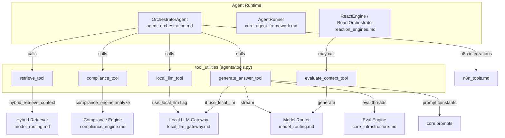
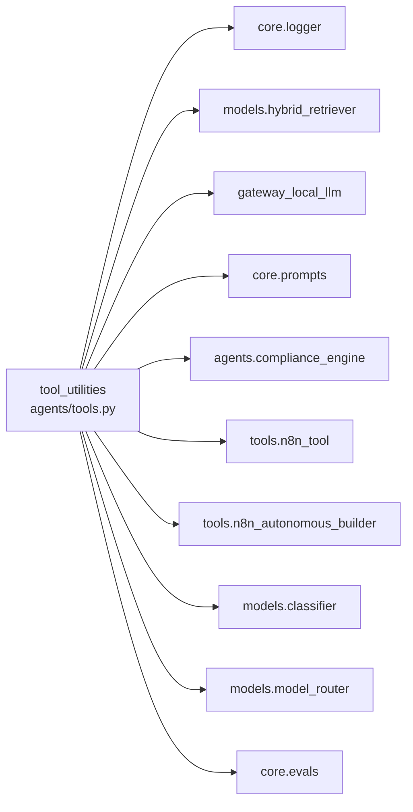
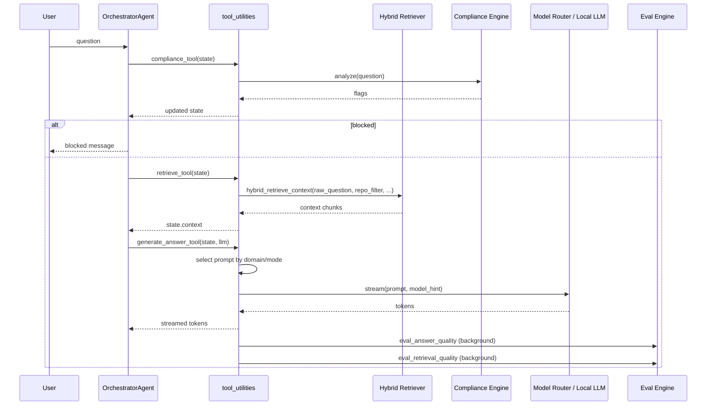

# tool_utilities

## Brief Introduction

`tool_utilities` (`agents/tools.py`) is the enterprise-grade tool-execution layer used by the platform's agentic runtime. It exposes a small, stateful set of reusable tools that operate on a shared `AgentState` object:

- **retrieve_tool** – fetches relevant code/KB context via hybrid retrieval.
- **compliance_tool** – scans user input and retrieved context for PCI and security violations.
- **local_llm_tool** – forces the downstream generator to use the in-house local LLM gateway.
- **generate_answer_tool** – builds the right prompt and streams an answer through the model router.
- **evaluate_context_tool** – scores whether retrieved context is sufficient to answer the question.

These tools are intentionally low-level and state-mutating: each tool receives an `AgentState`, updates it, and returns it. They are invoked directly by the [agent_orchestration.md](../agents/agent_orchestration.md) loop and are also available to the broader [agent_system.md](../agents/agent_system.md) runtime.

> **Scope note:** This module only covers the tool implementations in `agents/tools.py`. The orchestrator that schedules them, the compliance engine that analyzes text, the retrieval models, and the LLM gateways are documented in their own modules and linked below.

---

## Core Functionality

### 1. Context Retrieval (`retrieve_tool`)

`retrieve_tool` loads relevant text chunks into `state.context`.

- Uses the **bare user question** (`state.raw_question` or `state.question`) for embedding, avoiding noise from injected conversation history.
- Calls `hybrid_retrieve_context` from [model_routing.md](../llm/model_routing.md) with the user's repo filter, user context, and query complexity.
- Cleans the returned chunks (non-empty strings only) and stores them in `state.context`.
- Logs the number of clean chunks loaded; on failure, sets `state.context = []`.

### 2. Compliance Scanning (`compliance_tool`)

`compliance_tool` runs the shared compliance engine over the question and every retrieved chunk.

- Calls `compliance_engine.analyze()` from compliance_engine.md.
- Stores findings in `state.compliance_flags`.
- Logs critical alerts when blocking violations are detected.
- Never raises; on error, clears flags so the agent can degrade safely.

### 3. Local-LLM Toggle (`local_llm_tool`)

`local_llm_tool` is a simple state toggle that sets `state.use_local_llm = True`. When this flag is set, `generate_answer_tool` routes the final generation through the in-house [local_llm_gateway.md](../llm/local_llm_gateway.md) instead of the cloud model router.

### 4. Answer Generation (`generate_answer_tool`)

`generate_answer_tool` is the primary response producer. It is a generator that yields answer tokens.

Key behaviors:

- **PCI block check:** If `state.compliance_flags` contains blocking findings, yields a compliance-block message and stops.
- **Context cleaning:** Filters out empty or non-string chunks.
- **Domain-aware prompt selection:**
  - `mode == "office"` → `OFFICE_PROMPT` (for Cowork / office-assistant tasks).
  - Codebase overview questions → `CODEBASE_OVERVIEW_PROMPT`.
  - Code domain with context → `CODE_PROMPT`.
  - Other domains with context → `GROUNDED_PROMPT`.
  - Project-scoped question with no retrieved context → `PROJECT_NO_CONTEXT_PROMPT`.
  - No context → `GENERAL_PROMPT`.
- **Model routing:** Uses [model_routing.md](../llm/model_routing.md) by default, with complexity upgrades when context is present. Honors `state.model_hint` and `state.use_local_llm`.
- **Multi-turn support:** When `state.messages` contains prior turns, builds a proper OpenAI-style messages array instead of flattening history into a single prompt.
- **Fire-and-forget evaluation:** Spawns background threads to evaluate retrieval quality (Point C) and answer quality (Point D) via [core_infrastructure.md](../core/core_infrastructure.md)'s `eval_engine`.

### 5. Context Sufficiency Scoring (`evaluate_context_tool`)

`evaluate_context_tool` asks an LLM to score whether the retrieved context is sufficient to answer the question.

- Samples up to two context chunks.
- Prompts the model to return a single number between 0 and 1.
- Stores the parsed float in `state.confidence`.
- On failure, sets confidence to `0.0`.

This is used by reasoning loops (e.g., [reaction_engines.md](../llm/reaction_engines.md)) to decide whether to retrieve more context or synthesize an answer.

---

## Architecture & Component Relationships

### Dependency Graph

### Data Flow Through a Typical Agent Turn

---

## How It Fits into the Overall System

`tool_utilities` sits at the **center of the agent execution pipeline**, between planning/orchestration and the underlying model/retrieval infrastructure.

- **[agent_orchestration.md](../agents/agent_orchestration.md)** (`OrchestratorAgent`) is the primary caller. It builds an execution plan, then dispatches `retrieve_tool`, `compliance_tool`, `local_llm_tool`, and `generate_answer_tool` in sequence.
- **[core_agent_framework.md](../agents/core_agent_framework.md)** (`AgentRunner`) uses the same underlying concepts but executes tools through the [mcp_system.md](../mcp/mcp_system.md) registry rather than calling this module directly.
- **[reaction_engines.md](../llm/reaction_engines.md)** (`ReactEngine`, `ReactOrchestrator`) use `evaluate_context_tool` and similar retrieval patterns inside their iterative reasoning loops.
- **[model_routing.md](../llm/model_routing.md)** provides the hybrid retriever and model router consumed by `retrieve_tool` and `generate_answer_tool`.
- **compliance_engine.md** provides the security scanning used by `compliance_tool`.
- **[local_llm_gateway.md](../llm/local_llm_gateway.md)** is the optional generation backend selected by `local_llm_tool`.
- **[core_infrastructure.md](../core/core_infrastructure.md)** provides logging, telemetry, and the evaluation engine used for fire-and-forget quality scoring.
- **[n8n_tools.md](../connectors/n8n_tools.md)** provides workflow-automation tools that are imported but defined outside this module.

Because the tools are state-mutating and self-contained, they can be composed into different agent loops without changing their internal logic. This makes `tool_utilities` a stable, reusable foundation for both the orchestrator's deterministic plan execution and the more dynamic ReAct-style loops.

---

## Key Design Decisions

1. **Stateful `AgentState` pattern** – Each tool mutates and returns the same state object, making tool composition trivial for the orchestrator.
2. **Fail-safe defaults** – Every tool catches exceptions, logs them, and returns a sane default state so a single tool failure does not crash the agent run.
3. **Bare-question retrieval** – Retrieval uses `raw_question` rather than the history-injected `question`, preserving semantic signal.
4. **Domain-aware prompt routing** – Prompt selection is driven by domain detection, mode flags, and whether context exists, avoiding one-size-fits-all prompts.
5. **Background evaluation** – Retrieval and answer quality are evaluated in daemon threads so observability does not block the user-facing stream.
6. **PCI-first blocking** – Compliance checks gate generation; blocking flags short-circuit the stream before any LLM call.

---

## References

- [agent_orchestration.md](../agents/agent_orchestration.md) – OrchestratorAgent that schedules these tools.
- [core_agent_framework.md](../agents/core_agent_framework.md) – AgentBuilder / AgentRunner runtime.
- [reaction_engines.md](../llm/reaction_engines.md) – ReAct loops that use context evaluation.
- compliance_engine.md – Security and PCI compliance scanning.
- [model_routing.md](../llm/model_routing.md) – Hybrid retrieval and model routing.
- [local_llm_gateway.md](../llm/local_llm_gateway.md) – In-house local LLM backend.
- [core_infrastructure.md](../core/core_infrastructure.md) – Logging, telemetry, and evaluation engine.
- [n8n_tools.md](../connectors/n8n_tools.md) – n8n workflow automation tools.
- [mcp_system.md](../mcp/mcp_system.md) – MCP registry used by AgentRunner for tool dispatch.
