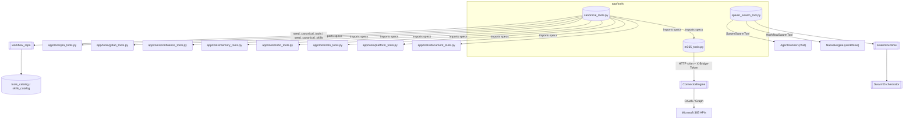
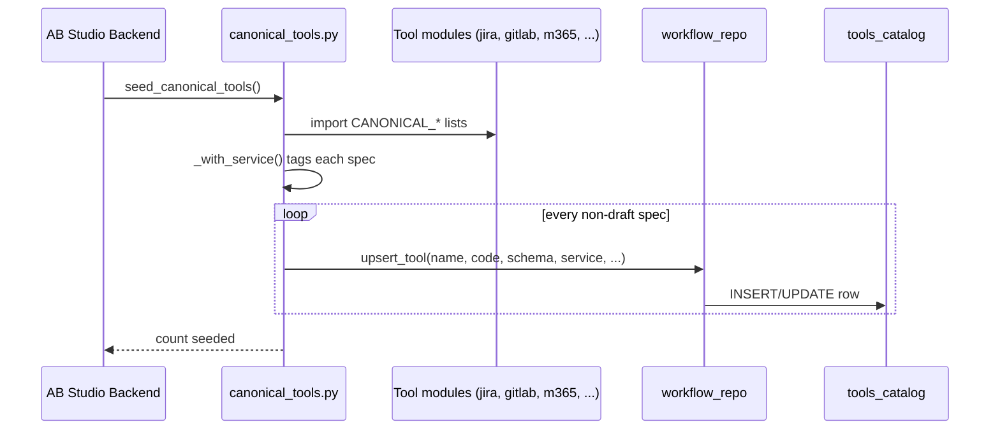
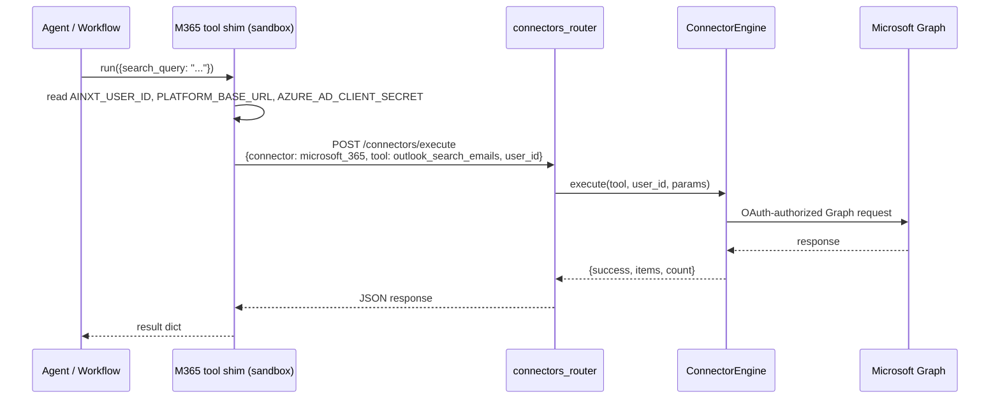
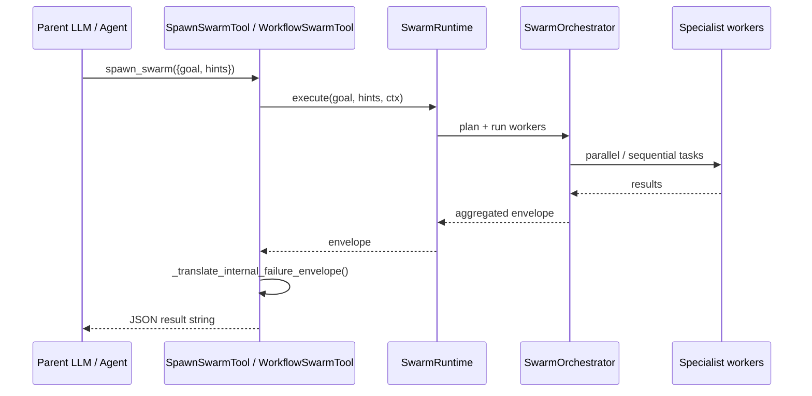

# Tools Module

The `tools` module (located under `ABStudio/backend/app/tools`) is responsible for defining, packaging, and surfacing the tools that agents and workflows can invoke. It bridges raw third-party integrations, the canonical tool catalog persisted in the database, and the synthetic `spawn_swarm` capability that delegates work to the swarm runtime.

## Purpose

- Provide a curated, version-controlled set of **canonical tools** (Jira, GitLab, Confluence, M365, document extraction, platform utilities, etc.) that are seeded into `tools_catalog` on startup.
- Implement **integration-specific shims** — especially the Microsoft 365 connector-bridge tools — that run inside the sandbox and call back into platform services.
- Expose the **swarm runtime** as a single callable tool (`spawn_swarm`) to both the chat agent path and the workflow engine path.
- Keep tool metadata (name, description, JSON schema, code, service tag) in a shape that the agent runner, workflow engine, and catalog API can consume without transformation.

## Architecture Overview

### Component Responsibilities

| File | Responsibility |
|------|----------------|
| `canonical_tools.py` | Aggregates tool specs from sibling modules, tags each with a default `service`, and seeds non-draft entries into the database on startup. |
| `m365_tools.py` | Builds Microsoft 365 tool specs whose `code` is a self-contained HTTP shim. The shim calls the platform's `/connectors/execute` endpoint so that OAuth, scopes, and Graph logic remain in the connector layer. |
| `spawn_swarm_tool.py` | Defines `SpawnSwarmTool` and `WorkflowSwarmTool`, two adapters that expose the same `spawn_swarm` function to the chat agent loop and the workflow engine. Includes failure-envelope translation to prevent the parent LLM from hallucinating missing-tool explanations. |

## Sub-modules

The module is split into three focused sub-modules. The generated documentation files are:

- **[tools_canonical_seed](tools_canonical_seed.md)** — canonical catalog aggregation and database seeding.
- **[tools_m365_bridge](../connectors/tools_m365_bridge.md)** — Microsoft 365 connector-bridge tool specs.
- **[tools_swarm_spawn](../agents/tools_swarm_spawn.md)** — `spawn_swarm` adapters for chat and workflow execution.

## Data Flows

### Canonical Tool Seeding (Startup)

### Microsoft 365 Tool Call

### Swarm Delegation

## Integration with the Rest of the System

- **Agent chat path**: `AgentRunner` intercepts `spawn_swarm` before dispatching catalog tools and uses `SpawnSwarmTool`. See [agent_factory_pipeline](../agents/agent_factory_pipeline.md).
- **Workflow engine**: `NativeEngine._run_agent` injects `WorkflowSwarmTool` into the tool loop. See [engine_native_engine](../agents/engine_native_engine.md).
- **Catalog API**: `api_catalog` lists, generates, and deletes tools from `tools_catalog`, including the canonical entries seeded by this module. See [api_catalog](../api/api_catalog.md).
- **Connector layer**: M365 tools rely on `ConnectorEngine` and the Microsoft 365 adapter for all Graph operations. See [shared_integrations_connector_infrastructure](shared_integrations_connector_infrastructure.md).
- **Swarm runtime**: The swarm adapters are thin wrappers around `SwarmRuntime` and `SwarmContext`. See [swarm](../agents/swarm.md).

## Configuration & Environment

Key environment variables consumed by tools in this module:

| Variable | Used by | Purpose |
|----------|---------|---------|
| `JIRA_URL`, `JIRA_EMAIL`, `JIRA_API_TOKEN`, `JIRA_PROJECT` | Jira tools | API access |
| `GITLAB_URL`, `GITLAB_TOKEN` | GitLab tools | API access |
| `CONFLUENCE_URL`, `CONFLUENCE_EMAIL`, `CONFLUENCE_API_TOKEN`, `CONFLUENCE_SPACE_KEY` | Confluence tools | API access |
| `REDIS_URL`, `DATABASE_URL` | Memory tools | Session / episodic memory |
| `ZOHO_PEOPLE_URL`, `ZOHO_CRM_URL`, `ZOHO_ACCESS_TOKEN` | Zoho tools | API access |
| `N8N_URL`, `N8N_API_KEY` | n8n tools | API access |
| `PLATFORM_BASE_URL`, `AZURE_AD_CLIENT_SECRET` | M365 tools | Bridge URL and shared bridge token |
| `LLM_PROXY_URL` | Platform / M365 host | LLM / Graph egress |

Draft tools are skipped during seeding until their integration is configured and the `"draft": True` flag is removed from the spec.
