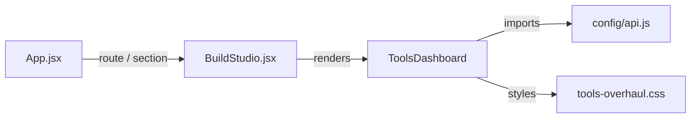
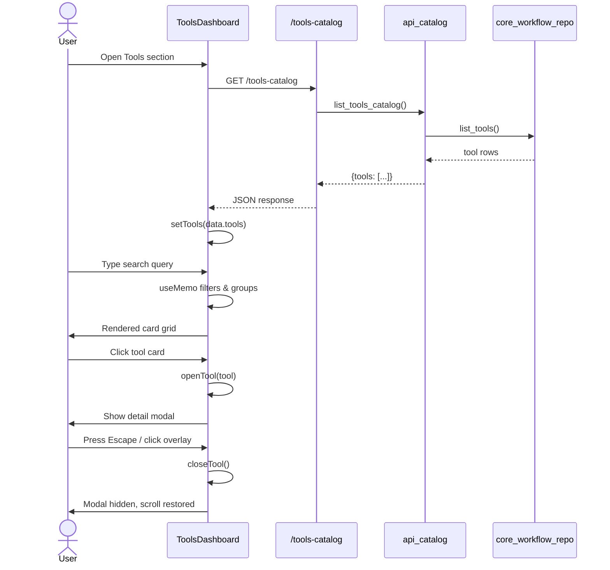

# Tools Feature Module

## Brief Introduction

The `tools_feature` module is the frontend surface for discovering and inspecting integration tools available to agents in ABStudio. It renders the **Tools Catalog** — a searchable, grouped directory of every registered tool — and lets users open a detail modal to review each tool's input schema, description, and source code.

In the broader ABStudio architecture, tools are the executable capabilities that agents and workflows invoke at runtime. The backend owns tool storage, generation, dispatch, and governance (see [api_catalog](../api/api_catalog.md), [core_workflow_repo](../workflows/core_workflow_repo.md), and [engine_native_engine](../agents/engine_native_engine.md)). The `tools_feature` module consumes that backend catalog and presents it to users without duplicating tool-management logic.

---

## Core Components

### `ToolsDashboard`

`ToolsDashboard` is the default export of `ABStudio/frontend/src/features/tools/index.jsx`. It is a self-contained React page that:

1. Fetches the full tools catalog from `/tools-catalog` on mount.
2. Displays loading, error, and empty states.
3. Provides a live search filter by tool name and description.
4. Groups tools by `service` (e.g., `microsoft_365`, `platform`, `other`).
5. Opens a read-only detail modal when a tool card is clicked.

Key state:

| State | Purpose |
|-------|---------|
| `tools` | Raw list returned by the catalog API. |
| `search` | Current search query. |
| `selectedTool` | Tool currently shown in the detail modal. |
| `modalRect` | Absolute position of the modal overlay within the scroll owner. |

### `handler`

`handler` is a local helper inside the `useEffect` that binds the `Escape` key to close the detail modal. It is registered only while a tool is selected and cleaned up on unmount or when the modal closes.

---

## Architecture

```mermaid
flowchart TB
    subgraph Frontend["Frontend — abstudio_frontend"]
        TD[ToolsDashboard]
        CSS[tools-overhaul.css]
    end

    subgraph Backend["Backend — abstudio_backend"]
        CAT[api_catalog /list_tools_catalog]
        WFR[core_workflow_repo / list_tools]
        NE[engine_native_engine / _CatalogTool]
        AF[agent_factory_pipeline / ToolDispatcher]
    end

    TD -->|GET /tools-catalog| CAT
    CAT --> WFR
    WFR -->|rows| CAT
    CAT -->|{tools: [...]}| TD
    NE -->|dispatches| AF
```

### Component Placement



---

## Data Flow

### 1. Catalog Fetch

On mount, `ToolsDashboard` calls:

```http
GET ${API_BASE}/tools-catalog
Authorization: <auth headers from buildAuthHeaders()>
```

The backend endpoint `list_tools_catalog` (in [api_catalog](../api/api_catalog.md)):

1. Loads all tool rows via `workflow_repo.list_tools()`.
2. Filters out generated tools if `include_generated=false`.
3. Hides `microsoft_365` tools unless the user has an active M365 OAuth connection.
4. Returns a slimmed JSON shape: `name`, `description`, `input_schema`, `generated`, `service`, `code`.

### 2. Frontend Rendering

`ToolsDashboard` stores the raw list in `tools` and derives the displayed groups with `useMemo`:

1. Filter by `search` against `name` and `description`.
2. Group by `service`.
3. Sort groups alphabetically.
4. Render a card grid per group.

### 3. Detail Modal

Clicking a card calls `openTool(tool)`, which:

1. Finds the nearest scroll owner (`.dashboard-content-area` or `.main-content`).
2. Locks the container's `overflow` to prevent background scrolling.
3. Computes `modalRect` from the scroll owner's `scrollTop` and `clientHeight`.
4. Sets `selectedTool`, causing the overlay to render absolutely positioned at the current viewport.

The modal displays:

- Tool name and service chip.
- Description.
- Input parameters table (from `input_schema.properties` and `required`).
- Source code block (from `code`).

Pressing `Escape` or clicking the overlay calls `closeTool()`, restoring the previous `overflow` value.



---

## Dependencies

### Direct Frontend Dependencies

| Dependency | Role |
|------------|------|
| `react` (useState, useEffect, useMemo, useRef) | Component state and lifecycle. |
| `API_BASE`, `buildAuthHeaders` from `config/api.js` | Backend URL and authenticated request headers. |
| `tools-overhaul.css` | Module-specific styling for the dashboard and modal. |

### Related Backend Modules

| Module | Relationship |
|--------|--------------|
| [api_catalog](../api/api_catalog.md) | Exposes `/tools-catalog` and filters tools by visibility rules (generated, platform, M365 connection). |
| [core_workflow_repo](../workflows/core_workflow_repo.md) | Reads tool rows from the database and maps them to the catalog shape. |
| [engine_native_engine](../agents/engine_native_engine.md) | Wraps catalog rows as `_CatalogTool` instances at runtime and dispatches calls via `ToolDispatcher`. |
| [agent_factory_pipeline](../agents/agent_factory_pipeline.md) | Provides `ToolDispatcher`, which executes tool code in a sandboxed subprocess. |
| [tools](tools.md) | Backend tool definitions, including canonical seeds, M365 bridge, and swarm-spawn tools. |

---

## How It Fits into the Overall System

ABStudio separates **tool authoring/management** from **tool discovery**. The `tools_feature` module is firmly on the discovery side:

- **Authoring** happens in [skills_feature](skills_feature.md) and [agent_factory_pipeline](../agents/agent_factory_pipeline.md), where new tools can be generated, packaged, and registered.
- **Governance** is handled by [api_governance](../api/api_governance.md) and [core_governance](../sdlc/core_governance.md), which approve or deny tool submissions before they appear in the catalog.
- **Execution** is performed by [engine_native_engine](../agents/engine_native_engine.md) and [agent_factory_pipeline](../agents/agent_factory_pipeline.md) when an agent or workflow invokes a tool.
- **Discovery** is the sole responsibility of `tools_feature`, giving users a read-only, searchable view of what tools exist, what parameters they accept, and how they are implemented.

The Tools Catalog is typically reachable from the main navigation rendered by [app_core](../core/app_core.md) and embedded inside [build_studio](../ui/build_studio.md).

---

## Key Design Decisions

### Scroll-Lock Strategy

The dashboard lives inside a scrollable ancestor with CSS transforms, which breaks `position: fixed` positioning. `ToolsDashboard` therefore:

- Detects the actual scroll owner at open time.
- Uses absolute positioning anchored to `scrollTop`.
- Locks `overflow` on the scroll owner and restores it on close or unmount.
- Captures the previous `overflow` value in `scrollLockRef` to avoid stale reads across re-renders.

### Fail-Safe Filtering

The backend already filters M365 tools when the user is not connected. The frontend simply renders whatever the API returns, keeping visibility logic centralized in [api_catalog](../api/api_catalog.md).

### Read-Only Surface

`ToolsDashboard` does not create, edit, delete, or execute tools. Those operations are delegated to:

- [api_catalog](../api/api_catalog.md) for CRUD and generation.
- [skills_feature](skills_feature.md) for skill-centric tool packaging.
- [engine_native_engine](../agents/engine_native_engine.md) for runtime invocation.

This keeps the module small, focused, and safe to expose broadly.
