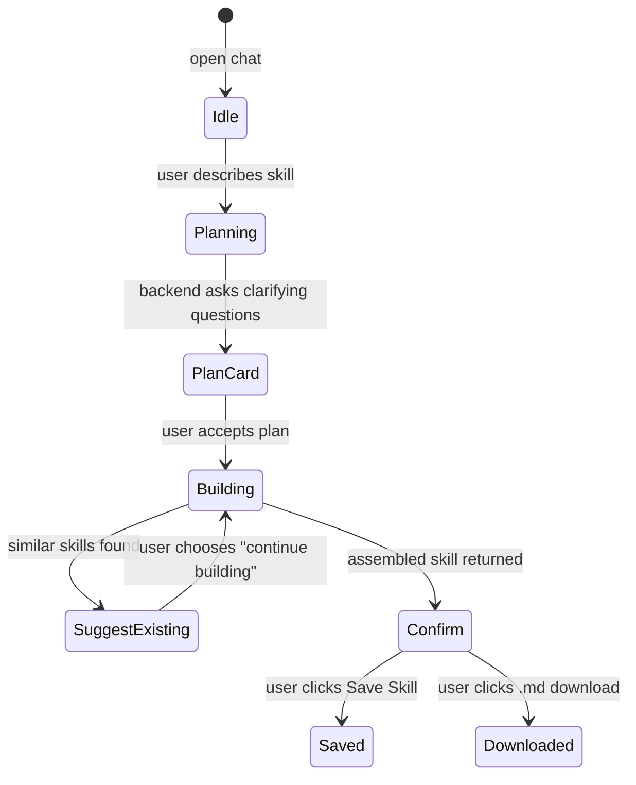

# Skills Feature (ABStudio Frontend)

## Introduction

The **Skills Feature** is the frontend surface in ABStudio for discovering, creating, uploading, and governing *skills*. A skill is a reusable capability — typically described by a `SKILL.md` manifest and optional bundled helper scripts or reference documents — that can be invoked by agents and workflows across the platform.

The feature is split into two primary views:

1. **Skills Dashboard** — a browsable, filterable catalog of all available skills.
2. **Skill Factory Chat** — an AI-guided, conversational interface for generating new skills from plain-language descriptions.

This module lives in `ABStudio/frontend/src/features/skills` and is part of the larger `abstudio_frontend` application. It relies on shared chat infrastructure, common UI components, and the governance subsystem documented elsewhere.

---

## Architecture Overview

```mermaid
flowchart TB
    subgraph "Skills Feature"
        D[SkillsDashboard]
        S[SkillFactoryChat]
        U[SkillUploadModal]
        M[SkillDetailModal]
        C[SkillCard]
    end

    subgraph "Shared Frontend"
        FCS[FactoryChatShell]
        UCS[useFactoryChatStream]
        PC[PlanCard]
        HT[HoverTooltip]
    end

    subgraph "Governance"
        SB[StatusBadge]
        SAB[SubmitApprovalButton]
    end

    subgraph "Backend API"
        API1[/skills-catalog/]
        API2[/skill-factory/chat/]
        API3[/skill-factory/confirm/]
        API4[/skill-factory/{session}/download/]
        API5[/skills-catalog/upload/]
    end

    D --> C
    D --> M
    D --> U
    D --> S
    C --> SB
    C --> SAB
    C --> HT
    S --> FCS
    S --> UCS
    S --> PC
    S --> API2
    S --> API3
    S --> API4
    U --> API5
    D --> API1
    M --> API1
    M --> API5
```

### Key Design Decisions

- **Conversational skill creation**: `SkillFactoryChat` reuses the generic `FactoryChatShell` and `useFactoryChatStream` hooks so that skill, agent, and workflow factories all share the same chat UX primitives.
- **Catalog-first discovery**: `SkillsDashboard` treats the catalog as the source of truth, deriving categories and source filters directly from the API response.
- **Governance integration**: AI-generated skills are governed entities; built-in/platform skills are exempt from the approval lifecycle.
- **Source-aware permissions**: Only AI-generated skills can be deleted or redeployed by end users. Built-in skills are read-only platform assets.

---

## Module Responsibilities

| File | Primary Responsibility |
|------|------------------------|
| `features/skills/index.jsx` | Catalog dashboard: list, search, filter, upload, detail view, and delete skills. |
| `features/skills/SkillFactoryChat.jsx` | AI-guided skill creation: streaming chat, plan cards, SKILL.md preview/editor, save/download. |

---

## Skills Dashboard

`SkillsDashboard` is the landing page for the Skills feature. It fetches the full skill catalog from `/skills-catalog` and presents it as a searchable, filterable grid.

### Data Model

Skills returned by the catalog API contain at minimum:

- `name` — unique skill identifier.
- `category` — grouping label (e.g., `data`, `research`).
- `description` — human-readable summary.
- `generated` — boolean flag distinguishing AI-generated skills from platform-seeded skills.

The dashboard derives a skill's **source** using `getSkillSource`:

1. If `generated` is present, it is authoritative (`true` → `ai`, `false` → `builtin`).
2. For legacy rows, the skill name is checked against `BUILTIN_SKILL_NAMES`.

### Filtering

Users can narrow the catalog through three mechanisms:

1. **Source tabs** — `All`, `Built-in`, `AI Generated`.
2. **Category chips** — dynamically derived from the visible skills; capped at `CATEGORY_CHIP_LIMIT` to keep the UI compact.
3. **Free-text search** — matches against skill name and description.

When no search or category filter is active, skills are grouped into two sections: *Built-in Skills* and *AI Generated*.

### Skill Cards

`SkillCard` renders each skill and exposes:

- Source badge (`Built-in` / `AI Generated`).
- Governance status badge (AI skills only).
- Submit-for-approval action (AI skills only).
- Direct delete action (AI skills only).
- Keyboard accessibility (`Enter` / `Space` to open detail).

### Upload Flow

`SkillUploadModal` allows users to upload a packaged skill bundle (`.zip` or `.skill`) containing a `SKILL.md` and optional scripts/references. It posts to `/skills-catalog/upload` with multipart form data and captures visibility and an optional category.

### Detail & Delete Flow

`SkillDetailModal` loads the full skill content from `/skills-catalog/{name}` and renders it in a scrollable `<pre>` block. Deletion is allowed only for non-built-in skills and issues a `DELETE` to `/skills-catalog/{name}`.

---

## Skill Factory Chat

`SkillFactoryChat` is the AI-assisted skill authoring experience. It streams messages to/from `/skill-factory/chat` and surfaces a structured build flow.

### Conversation Stages



### Key Behaviors

- **Welcome suggestions**: Pre-seeded example prompts when the chat is empty.
- **Plan cards**: When the backend needs clarification, a `PlanCard` is rendered with multiple-choice and free-text questions. Answers are sent back as a `__plan_card__:` payload.
- **Existing-match suggestions**: If the backend detects similar catalog skills, the user can choose to abandon the new build or continue anyway.
- **Confirm stage**: Once a skill is assembled, the chat switches to a preview/editor mode.

### SKILL.md Preview & Editing

In the confirm stage, the generated `SKILL.md` is shown in an editable textarea. Users can also edit any bundled files (helper scripts, reference docs). On save, only changed content is sent to the backend as:

- `content_override` — if the main `SKILL.md` body changed.
- `bundle_overrides` — array of `{ rel_path, content }` for modified bundled files.

### Save & Download

- **Save** — `POST /skill-factory/confirm` with `session_id`, `visibility`, and optional overrides. On success, the new skill is merged into the dashboard catalog.
- **Download** — `GET /skill-factory/{session_id}/download` returns a blob that is saved as `{skill_name}.md`.

### Visibility

Both the factory save flow and the upload modal support a `private` / `public` visibility toggle:

- `private` — restricted to the user's department.
- `public` — available to all users.

---

## Governance Integration

AI-generated skills are governed entities. The dashboard integrates two governance components:

- `StatusBadge` — displays the current governance status (`DRAFT`, `PENDING`, `APPROVED`, `REJECTED`, `NOT_SUBMITTED`).
- `SubmitApprovalButton` — initiates a deploy/approval request and supports withdrawing a pending request.

Built-in skills skip governance entirely because they are platform-managed assets.

---

## Dependencies

### Within `abstudio_frontend`

| Dependency | Purpose | Documentation |
|------------|---------|---------------|
| `FactoryChatShell` | Shared modal chat container | [shared_features.md](shared_features.md) |
| `useFactoryChatStream` | Streaming chat state management | [shared_features.md](shared_features.md) |
| `PlanCard` | Clarifying-question card UI | [common_components.md](common_components.md) |
| `HoverTooltip` / `useHoverTooltip` | Accessible hover tooltips | [common_components.md](common_components.md), [hooks.md](hooks.md) |
| `StatusBadge` | Governance status display | [governance_feature.md](governance_feature.md) |
| `SubmitApprovalButton` | Governance submission action | [governance_feature.md](governance_feature.md) |

### Backend APIs

| Endpoint | Used By | Purpose |
|----------|---------|---------|
| `GET /skills-catalog` | `SkillsDashboard` | List all skills. |
| `GET /skills-catalog/{name}` | `SkillDetailModal` | Fetch full skill content. |
| `DELETE /skills-catalog/{name}` | `SkillDetailModal`, `SkillCard` | Delete an AI-generated skill. |
| `POST /skills-catalog/upload` | `SkillUploadModal` | Upload a packaged skill bundle. |
| `POST /skill-factory/chat` | `SkillFactoryChat` | Stream skill creation conversation. |
| `POST /skill-factory/confirm` | `SkillFactoryChat` | Save the assembled skill. |
| `GET /skill-factory/{session}/download` | `SkillFactoryChat` | Download generated SKILL.md. |

---

## Related Modules

- [agents_feature.md](agents_feature.md) — agents consume skills from the catalog.
- [workflows_feature.md](workflows_feature.md) — workflows can invoke skills at specific nodes.
- [governance_feature.md](governance_feature.md) — approval lifecycle for AI-generated skills.
- [shared_features.md](shared_features.md) — shared factory chat shell and streaming hook.
- [common_components.md](common_components.md) — reusable UI primitives such as `PlanCard` and `HoverTooltip`.
- [api_catalog.md](api_catalog.md) — backend catalog API that powers this frontend.
- [skill_factory_pipeline.md](skill_factory_pipeline.md) — backend pipeline that generates skills.
