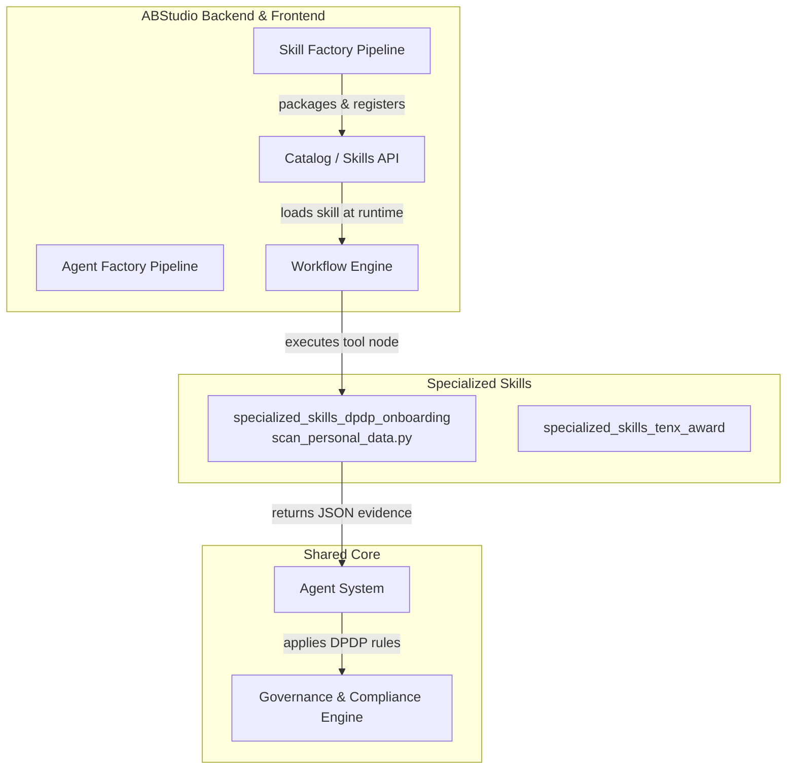
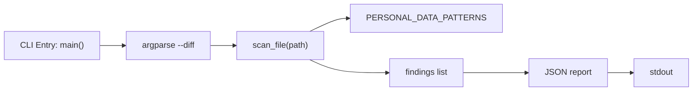
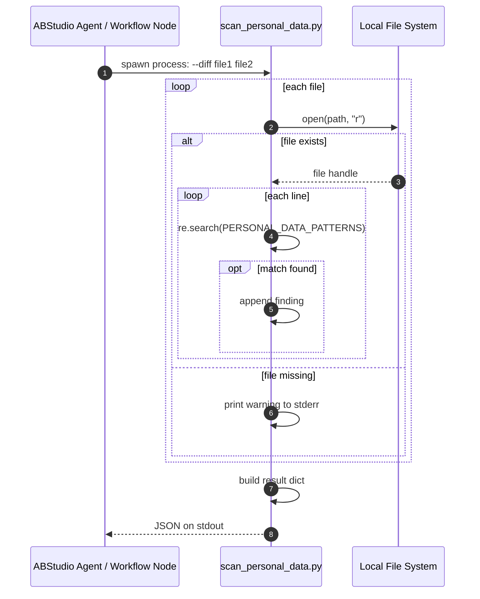
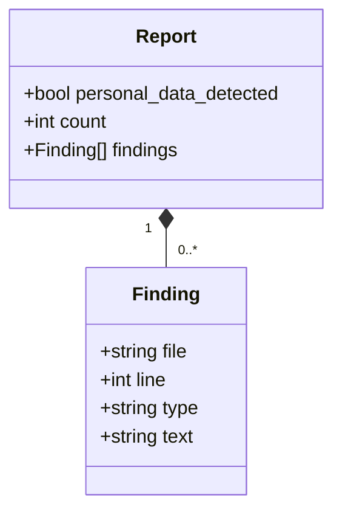
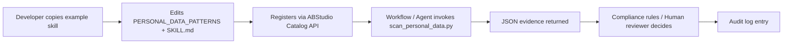
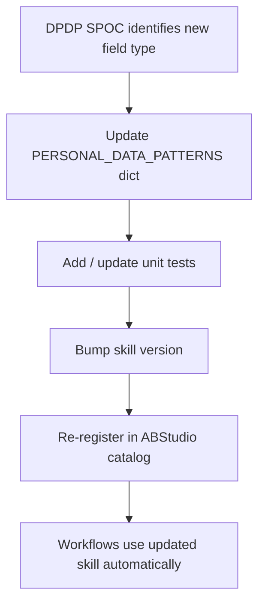
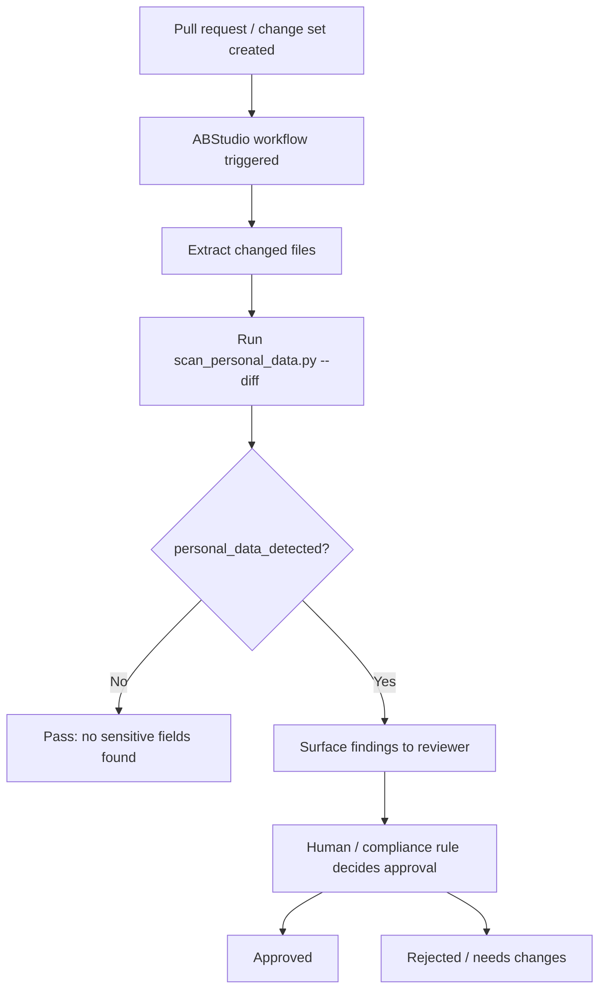

# specialized_skills_dpdp_onboarding

## Brief Introduction

`specialized_skills_dpdp_onboarding` is an example skill template that demonstrates how to build a lightweight, compliance-oriented tool for the ABStudio skills catalog. The module ships a single executable script, `scan_personal_data.py`, which performs a static, regex-based scan over changed source files and reports potential personal-data fields.

The script is intentionally narrow: it gathers evidence only and does not make pass/fail decisions. It is designed to be invoked by an ABStudio agent or workflow node during a DPDP (Digital Personal Data Protection) change review, with the actual judgement left to the skill's `SKILL.md` rules and a human reviewer. Because it is bundled under `skills-onboarding/`, it also serves as a reference implementation for teams onboarding new specialized skills.

---

## Module Purpose and Core Functionality

### What it does

1. Accepts a list of changed file paths via `--diff`.
2. Scans each file line-by-line for field-name patterns that commonly indicate personal data (name, mobile, email, address, account number, Aadhaar, PAN, date of birth, location).
3. Emits a JSON report containing:
   - `personal_data_detected`: boolean flag
   - `count`: total number of matches
   - `findings`: per-file, per-line evidence records

### What it does NOT do

- It does not classify sensitivity levels.
- It does not enforce DPDP rules or approve changes.
- It does not diff against a base revision; the caller is expected to supply the relevant changed files.

### Design philosophy

The script follows the "evidence first" pattern used across ABStudio skills: small, deterministic, side-effect-free utilities that produce structured output for downstream agents. This keeps skills auditable, testable, and easy to reason about.

---

## Architecture

### High-level placement

### Module-internal architecture

The module has no internal services, no persistent state, and no network dependencies. It is a pure function from file paths to a JSON report.

---

## Core Components

### `scan_personal_data.py::main`

| Aspect | Description |
|--------|-------------|
| **Responsibility** | Parse CLI arguments, drive the scan loop, and print the JSON result. |
| **Input** | `--diff path1 path2 ...` — one or more file paths to scan. |
| **Output** | A JSON object written to `stdout` with `personal_data_detected`, `count`, and `findings`. |
| **Failure mode** | Missing files are reported to `stderr` but do not abort the scan of remaining files. |

### `scan_file(path)`

| Aspect | Description |
|--------|-------------|
| **Responsibility** | Read a single file and collect every line that matches a personal-data pattern. |
| **Output** | List of finding dictionaries: `{file, line, type, text}`. |
| **Truncation** | Matching line text is truncated to 120 characters to keep reports readable. |

### `PERSONAL_DATA_PATTERNS`

A module-level dictionary mapping a human-readable label to a case-insensitive regular expression. The comment in the source explicitly notes that the DPDP SPOC (single point of contact) owns this list, making it the tunable policy surface of the script.

| Label | Example patterns matched |
|-------|--------------------------|
| `name` | `first_name`, `lastName`, `cust_name` |
| `mobile` | `mobile`, `phone`, `msisdn`, `contact_no` |
| `email` | `email`, `e_mail` |
| `address` | `address`, `addr`, `pincode`, `postal` |
| `account_number` | `acc_no`, `accountNumber` |
| `aadhaar` | `aadhaar`, `aadhar`, `uid` |
| `pan` | `pan`, `pan_no` |
| `dob` | `dob`, `date_of_birth`, `birthDate` |
| `location` | `lat`, `longitude`, `geo`, `location` |

---

## Data Flow

### Scan invocation flow

### Report schema

---

## Dependencies

### Runtime dependencies

- Python 3 standard library only:
  - `argparse`
  - `json`
  - `re`
  - `sys`

### System dependencies

- Read access to the files supplied via `--diff`.
- No database, network, or third-party package requirements.

### Module dependencies within the system

| Related module | Relationship |
|----------------|--------------|
| [abstudio_backend.md](abstudio_backend.md) | Hosts the skill factory, catalog API, and workflow engine that register and execute this skill. |
| [shared_core.md](shared_core.md) | Provides governance, compliance, and agent orchestration layers that consume the JSON evidence produced by this script. |
| [shared_skills.md](shared_skills.md) | Sibling skills ecosystem (docx, pptx, xlsx, pdf, DSLAR, tenx-award) that this module is grouped under. |

---

## How It Fits Into the Overall System

This module is a concrete example of ABStudio's "skill as a small tool" model:

1. **Skill authoring**: A developer copies `example-skill-dpdp-change-review` as a starting point for a new DPDP-related skill.
2. **Skill registration**: The skill factory or catalog API packages the script and its `SKILL.md` metadata into the catalog. See [abstudio_backend.md](abstudio_backend.md) for details on `api_catalog`, `skill_factory_pipeline`, and `core_workflow_repo`.
3. **Runtime execution**: A workflow node or agent action invokes `scan_personal_data.py` with the changed files.
4. **Evidence-based decision**: The agent reads the JSON report and applies rules from `SKILL.md` (or from the shared compliance engine) to decide whether the change requires human review. See [shared_core.md](shared_core.md) for the compliance and governance engines.
5. **Audit trail**: Because the output is deterministic JSON, it can be stored alongside the change request for audit purposes.

---

## Process Flows

### Adding a new personal-data pattern

### Typical DPDP change-review workflow

---

## Configuration and Customization

The only configuration surface in the script is the `PERSONAL_DATA_PATTERNS` dictionary. Teams onboarding a DPDP skill should:

1. Review the default patterns against their organization's data classification policy.
2. Add NPCI-specific field names (e.g., `vpa`, `upi_id`, `npci_token`) if they are considered personal data under the policy.
3. Remove patterns that produce false positives for their codebase.
4. Keep the regexes case-insensitive and word-bounded to reduce noise.

No environment variables, config files, or CLI flags are required.

---

## Error Handling and Observability

- **Missing files**: Logged to `stderr`; scanning continues for remaining files.
- **No findings**: Returns a valid JSON report with `personal_data_detected: false` and `count: 0`.
- **Encoding issues**: Files are opened with `errors="ignore"` so binary or malformed files do not crash the scan.
- **No logging framework**: The script intentionally avoids external loggers to remain dependency-free. Callers that need structured logs should capture stdout/stderr.

---

## Security and Compliance Notes

- The script reads files but does not write, execute, or transmit data.
- It performs local regex matching only; no data is sent to an LLM or external service.
- It is an **evidence-gathering** tool, not a **decision** tool. Approval logic must live in the skill rules or governance layer.
- For hard-block or approval workflows, see [shared_core.md](shared_core.md) (`agents/compliance_engine.py`, `agents/hardblock_engine.py`, and `core/governance.py`).

---

## References

- [abstudio_backend.md](abstudio_backend.md) — Skill factory, catalog API, workflow engine, and agent runtime.
- [shared_core.md](shared_core.md) — Compliance engine, governance, agent orchestration, and security guardrails.
- [shared_skills.md](shared_skills.md) — Broader skills ecosystem including docx, pptx, xlsx, pdf, DSLAR, and tenx-award skills.
