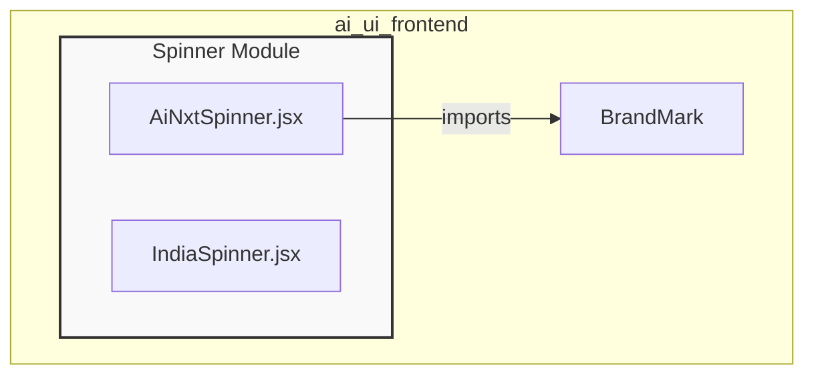
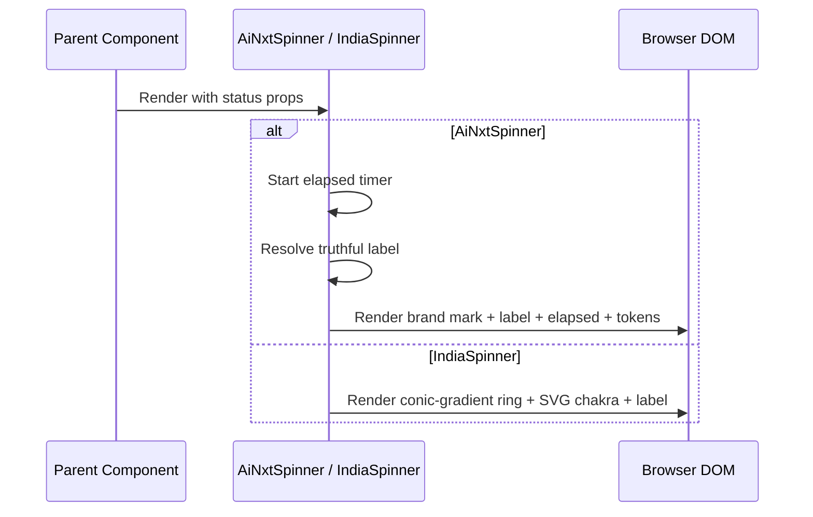

# Spinner Module

The **Spinner** module provides lightweight, reusable loading indicators for the `ai_ui_frontend` application. It contains two distinct React components that communicate asynchronous activity to users while maintaining brand identity and truthful status reporting.

## Purpose

- Display non-blocking progress indicators during backend operations.
- Keep users informed with live, backend-driven status text rather than fabricated progress steps.
- Provide a branded, animated spinner (`AiNxtSpinner`) and a culturally themed spinner (`IndiaSpinner`) for different UI contexts.

## Architecture Overview

The module is intentionally small and self-contained. Both components are pure presentational React components with no external state management dependencies. `AiNxtSpinner` depends on the shared `BrandMark` component for the AiNxt logo, while `IndiaSpinner` is fully self-contained and renders its own SVG Ashoka Chakra.

## Component Responsibilities

### `AiNxtSpinner`

Located in `ai-ui/src/components/AiNxtSpinner.jsx`.

Renders a Claude-code-style live status line branded with the AiNxt logo mark. It displays:

- A gently breathing AiNxt brand mark.
- A truthful status label derived from either a live backend string or an explicit caller-provided phase.
- A live-ticking elapsed timer that starts when the component mounts.
- An optional running output-token count (e.g., `out 188t`).

**Key design principle — truthfulness:** The component never invents progress. The displayed label is resolved in this priority order:

1. `label` prop — live backend status string.
2. `steps[stage]` — explicit real phase label provided by the caller.
3. `"Working"` — neutral fallback.

**Props:**

| Prop     | Type                | Description |
|----------|---------------------|-------------|
| `steps`  | `{id, label}[]`     | Optional explicit phase labels. |
| `stage`  | `number \| null`    | Index into `steps` representing a real backend stage. |
| `label`  | `string \| null`    | Live backend status string; takes highest precedence. |
| `outTok` | `number \| null`    | Running output-token count. |
| `startAt`| `number \| null`    | Optional epoch ms to anchor the timer. |

### `IndiaSpinner`

Located in `ai-ui/src/components/IndiaSpinner.jsx`.

Renders a spinning tricolor ring (saffron, white, green) with a static Ashoka Chakra at its center. It is implemented entirely with inline SVG and Tailwind CSS, requiring no external image assets.

**Props:**

| Prop    | Type     | Default   | Description |
|---------|----------|-----------|-------------|
| `size`  | `number` | `36`      | Diameter of the spinner in pixels. |
| `label` | `string` | `"Thinking…"` | Optional text label shown beside the spinner. |

**Internal `Chakra` component:**

- Renders the 24-spoke Ashoka Chakra inside the spinner.
- Calculates spoke geometry dynamically based on the provided `size`.

## Data Flow

## Dependencies

- `react` — Core React hooks (`useEffect`, `useRef`, `useState`).
- `BrandMark` — Shared component imported by `AiNxtSpinner` for the AiNxt logo mark.
- Tailwind CSS — Used by `IndiaSpinner` for the `animate-spin` utility.

## Related Modules

- [ai_ui_frontend_app_core](ai_ui_frontend_app_core.md) — Contains `App.jsx`, which orchestrates top-level UI rendering where spinners may be used.
- [brand_mark](brand_mark.md) — Provides the `BrandMark` component consumed by `AiNxtSpinner`.

## Notes for Maintainers

- Keep spinner components purely presentational; avoid adding business logic or data fetching.
- When extending `AiNxtSpinner`, preserve the truthfulness rule: never synthesize progress stages that the backend did not report.
- `IndiaSpinner` uses a conic gradient and Tailwind animation; verify compatibility when changing the design system or CSS framework.
