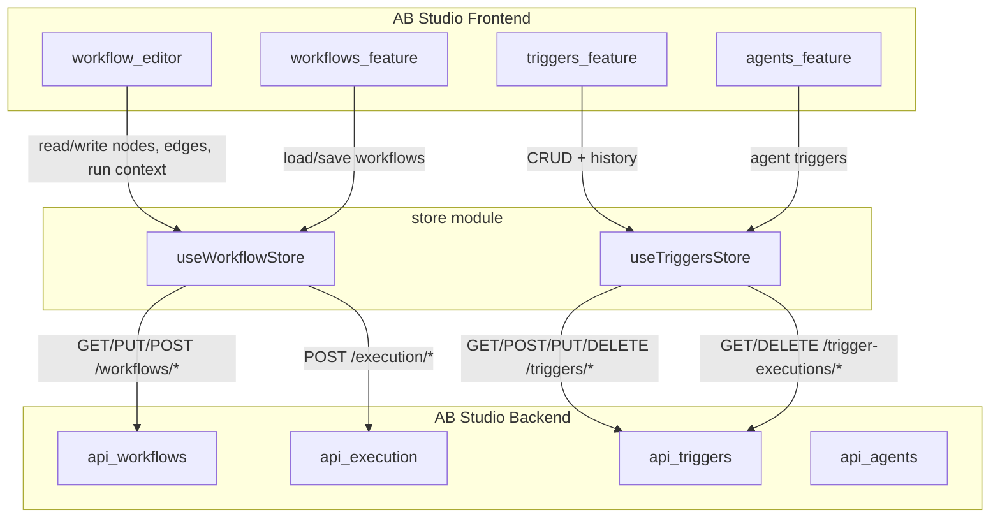
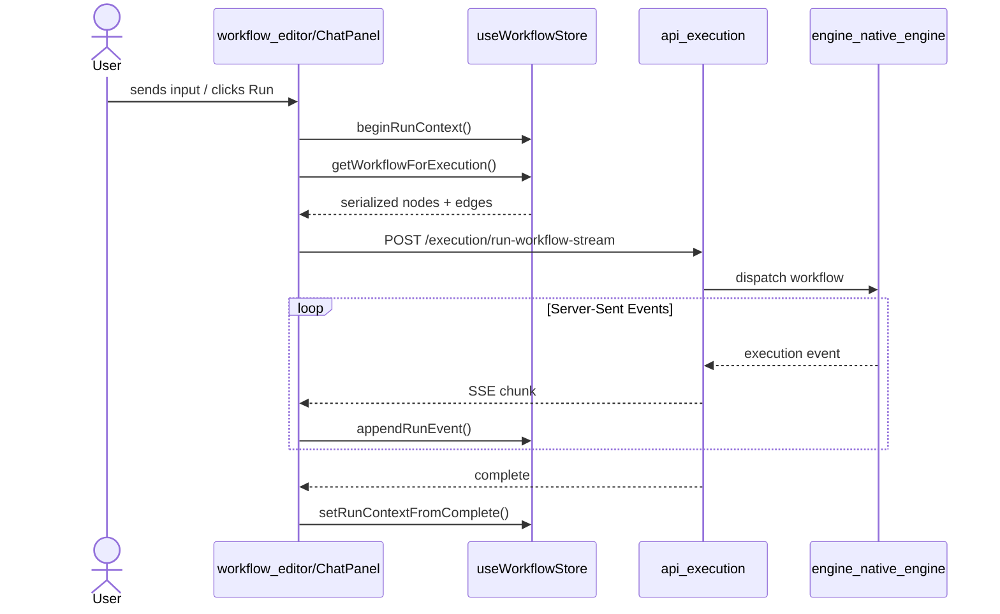
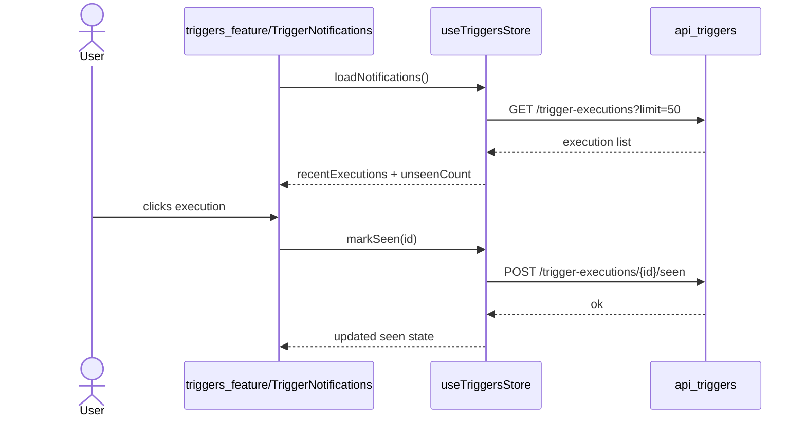

# Frontend State Store (`store`)

## Purpose

The `store` module owns the client-side state for the AB Studio workflow builder and trigger-management surfaces. It is implemented as a small set of [Zustand](https://github.com/pmndrs/zustand) stores that sit between the React UI components and the backend REST API. The module has two responsibilities:

1. **Workflow editor state** – keep the React Flow canvas (nodes, edges, selection), the preview-mode chat, and the execution/debug timeline in sync.
2. **Trigger management state** – cache scheduled/recurring triggers and their execution history for workflows and agents.

These stores are deliberately UI-facing: they do not contain business rules about how workflows or triggers are executed. Instead, they serialize editor state into the shapes expected by the backend ([api_execution](api_execution.md), [api_triggers](api_triggers.md), [api_workflows](api_workflows.md)) and cache server responses for fast re-renders.

---

## Architecture Overview

The module contains only two files:

| File | Store | Primary consumers |
|------|-------|-------------------|
| `store/workflowStore.js` | `useWorkflowStore` | [workflow_editor](workflow_editor.md), [workflows_feature](workflows_feature.md) |
| `store/triggersStore.js` | `useTriggersStore` | [triggers_feature](triggers_feature.md), [agents_feature](agents_feature.md) |

Both stores use Zustand. `useWorkflowStore` additionally wraps itself with [`zundo`](https://github.com/charkour/zundo) to provide undo/redo over the canvas graph.

---

## Workflow Store (`useWorkflowStore`)

`useWorkflowStore` is the single source of truth for the workflow canvas and its runtime preview. It can be divided into five logical slices:

### 1. Canvas Graph State

- **`nodes`** / **`edges`** – React Flow-compatible arrays. Default templates include a `start`, an `agent`, and an `end` node wired with `ai-edge` edges.
- **`addNode`**, **`insertNodeOnEdge`**, **`removeNode`**, **`updateNodeData`** – structural mutations.
- **`onNodesChange`** / **`onEdgesChange`** – wire React Flow drag/selection events into the store.
- **`pruneToConnectedSubgraph`** – strips orphan nodes before validation or execution so disconnected draft nodes do not fail backend validation.

### 2. Validation & Export

- **`isWorkflowValid`** – runs a comprehensive client-side check before a run or save:
  - Exactly one Start and one End node.
  - All edges point to existing nodes.
  - Agent nodes have names and instructions.
  - Subflow nodes reference a saved agent or workflow.
  - Condition nodes have complete cases, no duplicate IDs, and a wired `else` handle.
  - Loop nodes have both `body` and `exit` handles, and the body path closes back on the loop node.
  - No illegal directed cycles outside loop body back-edges.
- **`getWorkflowForExecution`** – serializes the connected subgraph into the payload shape consumed by the backend execution engine. Handles node-type-specific fields such as `llm_config`, `knowledge`, loop evaluator options, and subflow references.

### 3. Execution & Debug Log State

- **`runContext`** – the normalized timeline of the current run: rows, status, input/output, and `executionTrace`.
- **`beginRunContext`**, **`appendRunEvent`**, **`setRunStatus`**, **`setRunContextFromComplete`** – drive the debug log from server-sent execution events.
- **`pushCapped`** / **`capRunHistory`** – bound in-memory retention (`MAX_RUN_ENTRIES = 1000`, `MAX_ARCHIVED_ROWS = 5000`) so long-running loops cannot exhaust the browser heap.
- **`stopRunPreservingLog`** – resets transient execution UI while keeping the debug timeline for inspection.

### 4. Preview-Mode Chat State

Lifting chat state into the store lets the chat panel stay mounted while the user switches between canvas edit mode and preview mode:

- **`chatMessages`**, **`chatStreamingContent`**, **`chatStreamingAgent`**, **`chatThreadId`**
- **`chatHitlRequest`** / **`chatHitlRedirectText`** – human-in-the-loop approval cards.
- **`chatFailureSnapshot`** – captures error context for retry/regenerate flows.
- **`resetChatStateForWorkflow`** – prevents chat history from bleeding across different workflows.

### 5. Configuration & Metadata

- **`workflowId`** – stable per-session ID used for document isolation; replaced when a saved workflow is opened.
- **`workflowName`** / **`workflowKnowledge`** – workflow-level knowledge fallback.
- **`runSubagentsEnabled`** – run-level opt-in for subagent/swarm delegation.
- **`activeThreadId`** – lets loop configuration pick upstream node outputs.
- **`loopProgress`** – transient per-loop-node progress driven by SSE events.

### Key Helpers

| Helper | Responsibility |
|--------|----------------|
| `createWorkflowNodeId` / `createWorkflowEdgeId` | Stable UUID or timestamp-based IDs for canvas elements. |
| `buildAdjacency` / `reachableFrom` / `canReachEnd` | Graph traversal utilities for validation and pruning. |
| `hasIllegalCycle` | Allows cycles only when they close through a loop node's `body` handle. |
| `loopBodyClosesOnNode` | Verifies a loop body path returns to the loop node before reaching End. |
| `getDefaultNodeData` | Default configuration for every supported node type (`start`, `agent`, `condition`, `subflow`, `loop`, `evaluation_gate`, `end`). |

---

## Triggers Store (`useTriggersStore`)

`useTriggersStore` manages scheduled triggers and their execution notifications. It mirrors the pattern of other CRUD stores in the frontend: load, create, update, delete, plus a dedicated notification slice.

### Trigger CRUD

Triggers are keyed by `${targetKind}:${targetId}:${nodeId}` so different agent nodes inside the same workflow can each have their own trigger lists:

- **`loadTriggersFor`** – fetches triggers scoped to a target (workflow, agent, or specific node).
- **`createTrigger`** – schedules a new trigger with a cron-like `schedule`, optional `inputText`, and `enabled` flag.
- **`updateTrigger`** – patches an existing trigger and updates the local cache.
- **`deleteTrigger`** – removes the trigger locally and on the server.

### Notifications & Execution History

The notification bell shows the 50 most recent trigger executions and an unread badge:

- **`loadNotifications`** – fetches recent executions and computes `unseenCount`.
- **`markSeen`** / **`markAllSeen`** – flips the `seen` flag without removing rows, so past runs remain inspectable.
- **`deleteExecution`** – optimistically removes a row and rolls back on failure.
- **`clearAllExecutions`** – bulk deletes all execution records.
- **`loadHistory`** / **`loadExecution`** – per-trigger history and single-execution detail.

All trigger operations use a 10-second timeout because scheduling CRUD can be slower than ordinary fetches.

---

## Data Flow

### Workflow Execution Flow

### Trigger Notification Flow

---

## Integration with Other Modules

| Module | Relationship |
|--------|--------------|
| [workflow_editor](workflow_editor.md) | Primary consumer of `useWorkflowStore`; renders nodes/edges and writes run events. |
| [workflows_feature](workflows_feature.md) | Opens saved workflows into the store and persists store state back to the backend. |
| [triggers_feature](triggers_feature.md) | Primary consumer of `useTriggersStore`; renders trigger lists and the notification bell. |
| [agents_feature](agents_feature.md) | Uses `useTriggersStore` to schedule and list triggers attached to agents. |
| [api_execution](api_execution.md) | Receives the serialized workflow payload produced by `getWorkflowForExecution`. |
| [api_triggers](api_triggers.md) | Backend for all trigger CRUD and execution-history endpoints. |
| [api_workflows](api_workflows.md) | Backend for saving/loading workflow definitions. |
| [app_models](app_models.md) | Defines backend Pydantic models (e.g., `Workflow`, `TriggerCreate`) that the store payloads must match. |

---

## Design Notes

- **Undo/redo is graph-only.** `zundo` is configured with `partialize` to track only `nodes` and `edges`, so execution state, hover state, and chat state do not pollute the history stack.
- **Immutability with short-circuits.** Setters compare new values to existing values before updating to avoid re-renders during high-frequency SSE streams.
- **Client-side validation mirrors backend rules.** `isWorkflowValid` encodes the same constraints the backend enforces, giving users immediate feedback before a network round-trip.
- **Memory caps for long runs.** `pushCapped` and `capRunHistory` prevent unbounded growth of debug-log rows during loops or repeated runs.
- **No business logic.** The store does not decide how a workflow is executed; it only prepares payloads and caches responses. Execution semantics live in [engine_native_engine](engine_native_engine.md) and [loop_runner](loop_runner.md).
