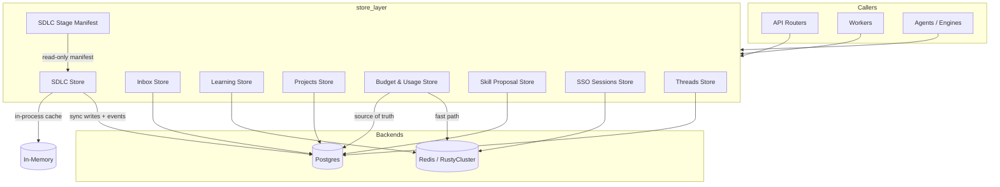
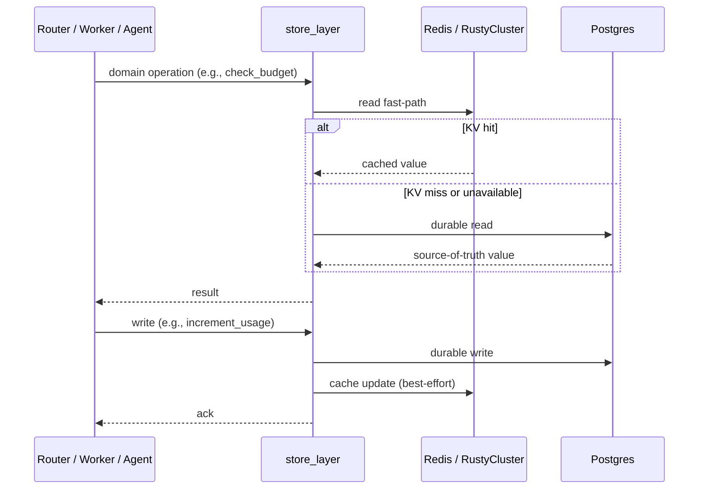

# Store Layer

The `store_layer` module is the durable persistence and caching facade for the platform. It sits between the API/routers, workers, and agents on one side and the underlying databases (Postgres, Redis/RustyCluster KV) on the other. Its responsibility is to encapsulate all read/write patterns for domain-specific state, enforce data-integrity invariants, and provide resilient fallback paths when a backend is temporarily unavailable.

## Purpose

- Provide a consistent, domain-oriented API for storing and retrieving platform state.
- Hide backend-specific details (SQLAlchemy, raw psycopg2, Redis/RustyCluster KV) from callers.
- Maintain fast-path caches in KV stores while keeping Postgres as the source of truth for durable data.
- Implement fail-open / fail-safe behavior for operational resilience (e.g., budget checks, inbox writes).
- Support cross-process consistency for long-running workflows such as SDLC pipeline runs.

## Architecture Overview

The store layer is intentionally not a generic ORM wrapper. Each store is specialized for its domain and chooses the appropriate backend mix:

- **Postgres** is used for durable, relational, or auditable data: budgets, inbox, projects, SDLC runs, skill proposals, threads.
- **KV (Redis/RustyCluster)** is used for fast-path reads, transient state, caching, and real-time notifications: budget usage counters, learning failure logs, SSO sessions.
- **In-memory caches** are used for cross-process latency-sensitive lookups (e.g., SDLC run state) with synchronous Postgres persistence as the backstop.

## Sub-modules

| Sub-module | Files | Responsibility | Documentation |
|------------|-------|----------------|---------------|
| Budget & Usage Store | `store/budget_store.py` | User budget limits, cumulative usage, daily usage history, budget-increase request workflow, and spend enforcement. | [store_layer_budget_usage.md](store_layer_budget_usage.md) |
| Inbox Store | `store/inbox_store.py` | User notification inbox, read/unread state, deletion, and SSE push to active streams. | [store_layer_inbox.md](store_layer_inbox.md) |
| Learning Store | `store/learning_store.py` | Tool failure and low-confidence answer recording for agent-loop learning and admin dashboards. | [store_layer_learning.md](store_layer_learning.md) |
| Projects Store | `store/projects_store.py` | CRUD for project records with department and ownership scoping. | [store_layer_projects.md](store_layer_projects.md) |
| SDLC Store | `store/sdlc_store.py`, `store/sdlc_stage_manifest.py` | SDLC pipeline run lifecycle, state transitions, events, multi-repo tracking, stale-run reaping, and canonical stage manifest. | [store_layer_sdlc.md](store_layer_sdlc.md) |
| Skill Proposal Store | `store/skill_proposal_store.py` | Durable audit of auto-synthesized skill proposals and their HITL resolution. | [store_layer_skill_proposals.md](store_layer_skill_proposals.md) |
| SSO Sessions Store | `store/sso_sessions.py` | KV-backed SSO token storage, refresh, and revocation. | [store_layer_sso_sessions.md](store_layer_sso_sessions.md) |
| Threads Store | `store/threads_store.py` | Thread and message CRUD with product/department visibility rules and transient agent status. | [store_layer_threads.md](store_layer_threads.md) |

## Data Flow

## Resilience Principles

1. **Postgres is the source of truth** for all durable stores. KV caches are rebuilt from Postgres on miss.
2. **KV failures are logged and ignored** where possible; callers continue using Postgres fallbacks.
3. **Budget checks fail-open**: if both Redis and Postgres are unavailable, the user is allowed through rather than blocking the platform.
4. **SDLC run state** is written synchronously to Postgres with row-level locks (`SELECT ... FOR UPDATE`) to survive cross-process gateway/worker handoffs.
5. **SSE notifications** are fire-and-forget; a subscriber failure does not break the write.

## Integration with Other Modules

- **[budget_router.md](budget_router.md)**: exposes budget limits, usage, and increase-request endpoints; delegates persistence to `BudgetStore`.
- **[inbox_router.md](inbox_router.md)**: serves inbox streams and mark-read operations backed by `InboxStore`.
- **[sdlc_router.md](sdlc_router.md)**: drives SDLC runs; `SDLCStore` persists run state and events.
- **[threads_router.md](threads_router.md)**: manages discussion threads; `ThreadsStore` handles persistence and visibility.
- **[auth_router.md](auth_router.md) / auth/sso.md**: uses `SSOSessionsStore` for token lifecycle.
- **[workers.md](workers.md)**: workers such as `skill_loop_worker` and `sdlc_worker` read and write through the store layer.
- **[shared_core.md](shared_core.md)**: provides `core.config`, `core.kv`, `core.logger`, `db.database`, and `db.models` used throughout the store layer.

## Common Dependencies

- `core.config` — database IDs, DSNs, and tunable defaults.
- `core.kv` — abstraction over Redis/RustyCluster KV clients.
- `core.logger` — structured logging.
- `db.database` / `db.models` — SQLAlchemy sessions and ORM models.
